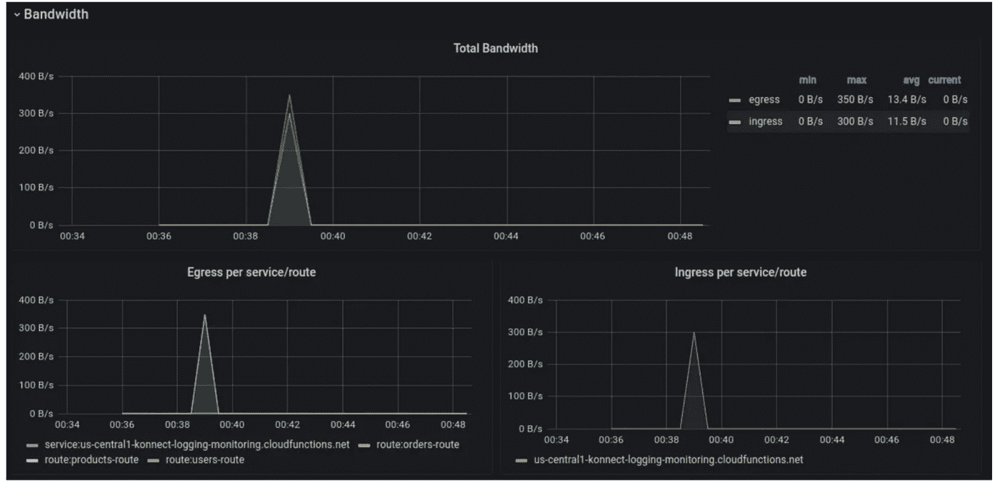

# 微服务监控和记录的两种方法

> 原文：<https://levelup.gitconnected.com/2-approaches-to-microservices-monitoring-and-logging-854052bb43b1>


由 [Ibrahim Boran](https://unsplash.com/@ibrahimboran?utm_source=unsplash&utm_medium=referral&utm_content=creditCopyText) 在 [Unsplash](https://unsplash.com/s/photos/monitoring?utm_source=unsplash&utm_medium=referral&utm_content=creditCopyText) 上拍摄的照片

## 不再需要为您的微服务手动设置监控和记录

我们看到公司构建软件的方式发生了巨大的转变。越来越多的公司正在将其应用构建或快速过渡到微服务架构。单片应用正在让位于微服务的兴起。

一个应用程序被分成几十个(或者几百个！)的微服务，监控和整合日志记录变得势在必行。在任何给定的时刻，您的一个微服务都可能失败或抛出错误，或者开始占用资源。你需要对此进行监控，这样你就可以做出快速而恰当的反应。此外，您排除错误和理解系统行为的能力在很大程度上取决于日志工具的存在和有效性。

遗憾的是，为所有微服务设置有效的监控和日志记录并不那么简单——尽管它可能很简单。本文将探讨为您的微服务手动设置监控和日志记录的挑战。然后，我们来看看通过服务连接平台 Kong Konnect 实现这一点有多简单。

# 我们的示例微服务应用程序

在开始监控和日志记录之前，让我们简要回顾一下我们的示例微服务应用程序。我们有三个 API 服务:用户、产品和订单。每个服务有两个 GET 端点和一个 POST 端点。这些用 Node.js 和 Express 构建的简单服务的代码在[公开发布](https://bit.ly/konnect-sample-app)。

我们已经将所有三项服务部署到 GCP 云功能中。下面是对我们的用户服务的样本 curl 请求的输出:

```
# GET ALL USERS
$ curl -X GET https://us-central1-konnect-logging-monitoring.cloudfunctions.net/users-service
{"49fd1cdc-861e-4780-9c7c-751ed9e80562":{"id":"49fd1cdc-861e-4780-9c7c-751ed9e80562","name":"Abigail Anderson"},"05983579-b74b-4045-827f-046dcf4fd4ce":{"id":"05983579-b74b-4045-827f-046dcf4fd4ce","name":"Barry Bledsoe"},"abd80c81-7a15-4d51-84c4-cde80c6a7f03":{"id":"abd80c81-7a15-4d51-84c4-cde80c6a7f03","name":"Charlie Chesterton"},"8c988844-8b49-425f-908c-085e7efb9905":{"id":"8c988844-8b49-425f-908c-085e7efb9905","name":"Daniel Donaldson"}}
```

```
# CREATE A NEW USER
$ curl -X POST \
-H "Content-type:application/json" \
-d "{\"name\":\"Elise Edwards\"}" \
https://us-central1-konnect-logging-monitoring.cloudfunctions.net/users-service
{"id":"733ac316-9b3d-47c7-a0c2-3229f4d2caa1","name":"Elise Edwards"}
```

```
# GET A USER BY ID
$ curl -X GET https://us-central1-konnect-logging-monitoring.cloudfunctions.net/users-service/733ac316-9b3d-47c7-a0c2-3229f4d2caa1
{"id":"733ac316-9b3d-47c7-a0c2-3229f4d2caa1","name":"Elise Edwards"}
```

产品和订单服务的工作方式类似。

我们希望对这些服务进行监控，以查看响应状态代码、响应时间和流量吞吐量。我们已经启动并运行了 [Prometheus](https://prometheus.io/) 和 [Grafana](https://grafana.com/) ，准备捕捉并显示指标。我们只需要将这种监控解决方案添加到我们的服务中。

我们还希望将所有服务的整合日志发送到一个位置。我们已经建立了一个 [Loggly](https://www.loggly.com/) 帐户，并准备接收日志。同样，我们只需要将这个日志工具添加到我们的服务中。

# 微服务监控和记录设置:手动艰难之路

让我们考虑一下将我们的服务手工连接到我们的监控和日志记录解决方案的工作量。

# 向我们的服务手动添加监控

由于我们正在运行 Prometheus，并且我们的服务恰好都是 Node.js Express 服务器，也许最直接的方法是使用 [express-prom-bundle](https://www.npmjs.com/package/express-prom-bundle) 包。这个包是一个 Prometheus metrics 中间件，它捕获指标并在服务器的`/metrics`端点公开它们。很简单。

当然，这意味着我们需要为三个服务中的每一个修改`package.json`和`server.js`文件。我们需要将包添加到我们的项目中，然后将代码行添加到`server.js`中以使用中间件。之后，我们需要重新部署新更新的服务。

我们的三个服务现在在/metrics 端点为它们各自的 URL 公开它们的度量。我们需要更新 Prometheus 服务的配置，确保 scrape 配置包括三个目标——每个服务一个。

# 手动将日志添加到我们的服务中

类似地，如果我们希望服务的日志消息被发送到一个集中的位置——比如 log Gly——那么我们可能会使用最简单的 Node.js 包来实现这个目的。这很可能是温斯顿-罗格里-巴克(winston-loggly-bulk)的包装。类似于集成 Prometheus 的包，我们需要将这个日志包添加到我们的三个项目中，并修改`server.js`来使用这个包。当然，我们还需要在更新服务后重新部署它们。

# 如果有三个以上的微服务呢？

一个全功能、健壮的业务应用可能有三个以上的微服务。一个应用可能有几十个或更多的微服务。它们也不会都是统一的 Node.js Express 服务器。

由于只有三个服务与监控和日志记录解决方案挂钩，手动方法已经够糟糕的了。如果我们有一打微服务会怎么样？如果我们将来要添加新的微服务，需要付出多大的努力？

手动方法涉及重复和机械的工作，这意味着有很大的空间进行不正确的代码更新，完全忘记微服务，或者进行正确的更新但忽略了重新部署的需要。除了容易出错之外，手动方法非常耗时。这种任务对任何开发人员来说都是令人沮丧的，尤其是因为它似乎并没有直接对核心产品开发做出贡献。

有更好的方法。

# 使用(简单按钮)Konnect 进行监控和记录设置

与其采用手动方法，不如使用 Kong Konnect 支持的基础设施。我们将概述设置 Kong Konnect 的步骤，但请记住，您只需要在开始时这样做。启动并运行 Kong Konnect 后，添加新服务或添加监控或日志记录解决方案就变得非常简单。

# 初始孔连接设置

首先，确保你有一个[账号](https://konnect.konghq.com/register)。

Kong Konnect 要求您部署一个 Kong 网关运行时。当 Kong Gateway 启动时，它会联系 Kong Konnect，建立一个更新连接。我们将在本地机器上安装我们的 Kong 网关运行时。我们使用的是版本的 Kong Gateway Enterprise(免费模式),我们已经[将其安装在本地的 Ubuntu 机器](https://docs.konghq.com/enterprise/2.4.x/deployment/installation/ubuntu/)上。

## 生成证书

我们需要用证书配置 Kong 网关，以便对 Kong Konnect 进行身份验证。登录到您的 Konnect 帐户后，单击 Runtimes 并找到您将部署 Kong 网关的环境。对于我们的 Linux 环境，我们单击 Generate Certificates 来获取我们需要的文件。


我们立即看到三个字符串，我们需要将它们复制到本地机器上的文件中。

“集群证书”应该复制到一个名为 tls.crt 的文件中，我们应该将“证书密钥”复制到一个名为`tls.key`的文件中。最后，应该将“根 CA 证书”复制到名为`ca.crt`的文件中。

## 配置孔网关

接下来，Konnect 显示我们需要添加到 Kong Gateway 启动配置文件(通常位于`/etc/kong/kong.conf`)中的配置参数列表:


对于这些参数的最后三行，您需要输入刚刚创建的三个证书相关文件的绝对路径。

除了上述参数之外，我们还想设置 status_listen 参数，这样 Kong 的 Status API 将为一个监视工具(如 Prometheus)公开，以接收度量。这个参数在我们的`kong.conf`文件的第 517 行左右，我们将其设置为 0.0.0.0:8001。

有了我们的参数，我们运行命令`kong start`。

## 在运行时管理器中验证连接

稍后，我们的本地 Kong 网关运行时将连接到 Kong Konnect，并且 Kong Konnect 上的运行时管理器将显示已建立的连接:


现在我们已经连接上了，我们可以开始添加服务。

# 向 Kong Konnect 添加服务

在 Konnect 的 ServiceHub 中，我们单击添加新服务。我们将从添加运行在 GCP 的用户服务开始。

我们为我们的服务设置名称、版本和描述:


创建服务后，我们导航到 1.0 版本来创建新的实现。


这是我们创建上游服务和相关路由的地方。我们为我们的上游服务添加了一个 URL，使用我们部署服务的 GCP 云函数 URL。


然后，我们单击 Next 为我们的服务配置路由。我们为路由设置一个名称，选择 HTTP 协议(因为我们在本地运行 Kong Gateway)，输入要监听的方法，并添加一个路径。


当我们单击 Create 时，我们的服务会根据这个新的实现进行更新。Kong Konnect 访问我们的 Kong Gateway 运行时(在本地运行),并使用我们的新服务实现对其进行更新。

现在，当我们向 [http://localhost:8000/users，](http://localhost:8000/users,)发送 curl 请求时，我们看到的是:

```
$ curl http://localhost:8000/users
{"49fd1cdc-861e-4780-9c7c-751ed9e80562":{"id":"49fd1cdc-861e-4780-9c7c-751ed9e80562","name":"Abigail Anderson"},"05983579-b74b-4045-827f-046dcf4fd4ce":{"id":"05983579-b74b-4045-827f-046dcf4fd4ce","name":"Barry Bledsoe"},"abd80c81-7a15-4d51-84c4-cde80c6a7f03":{"id":"abd80c81-7a15-4d51-84c4-cde80c6a7f03","name":"Charlie Chesterton"},"8c988844-8b49-425f-908c-085e7efb9905":{"id":"8c988844-8b49-425f-908c-085e7efb9905","name":"Daniel Donaldson"}}
```

太棒了。我们已经成功地将我们的用户服务添加到 Kong Konnect，这反过来更新了我们的 Kong Gateway 本地运行时。

添加订单和产品服务的步骤与我们上面所做的相同。在我们完成这些之后，发送到本地主机的 curl 请求由 Kong 代理，以访问我们的云函数:

```
$ curl http://localhost:8000/products
{"9ebbdebc-db30-4b2a-ab43-f40dae26d5ac":{"id":"9ebbdebc-db30-4b2a-ab43-f40dae26d5ac","title":"Widget X"},"b0182780-e978-404b-a13b-9c2ebb19b0d0":{"id":"b0182780-e978-404b-a13b-9c2ebb19b0d0","title":"Widget Y"},"c5e13920-3d8d-4c60-b8b4-e46a71d27a5b":{"id":"c5e13920-3d8d-4c60-b8b4-e46a71d27a5b","title":"Widget Z"}} 
```

```
$ curl http://localhost:8000/orders
{"9b0e5eb2-0d87-4cd6-812f-2d5c655d1dc5":{"id":"9b0e5eb2-0d87-4cd6-812f-2d5c655d1dc5","userId":"49fd1cdc-861e-4780-9c7c-751ed9e80562","productId":"9ebbdebc-db30-4b2a-ab43-f40dae26d5ac"},"31491ba5-f64d-476c-b563-8a16b3f7a080":{"id":"31491ba5-f64d-476c-b563-8a16b3f7a080","userId":"05983579-b74b-4045-827f-046dcf4fd4ce","productId":"9ebbdebc-db30-4b2a-ab43-f40dae26d5ac"},"f9c09a35-5cd0-452e-8354-4eaf79282366":{"id":"f9c09a35-5cd0-452e-8354-4eaf79282366","userId":"abd80c81-7a15-4d51-84c4-cde80c6a7f03","productId":"b0182780-e978-404b-a13b-9c2ebb19b0d0"},"9a35e538-fb01-44f8-9886-45054ab68cef":{"id":"9a35e538-fb01-44f8-9886-45054ab68cef","userId":"abd80c81-7a15-4d51-84c4-cde80c6a7f03","productId":"c5e13920-3d8d-4c60-b8b4-e46a71d27a5b"}}
```

现在，我们已经和孔·孔纳特建立了联系。这看起来可能需要很多步骤，但我们刚刚完成了整个微服务架构和连接解决方案的设置！如果我们需要修改服务——可能指向不同的云功能 URL 或监听不同的路径——在中心位置 Kong Konnect 进行这些更改非常简单。每当我们需要添加或删除服务时，我们也在这里这样做。

# 添加监控

现在，最大的问题是:为我的每项服务添加一个监控微服务解决方案需要付出多大的努力？努力的程度是“点击几下”让我们走一遍。别眨眼，否则你会错过的。

## 添加普罗米修斯插件

在 Kong Konnect 的用户 API 服务中，我们再次导航到 1.0 版本。在页面底部，我们点击新插件。我们搜索普罗米修斯插件。当我们找到它，我们点击启用。


我们输入一个标记，以便将与此服务相关的所有指标分组在一起。然后，我们单击“创建”。


然后…我们结束了。是的，就是它。

我们对订单 API 服务和产品 API 服务也是如此。

## 配置普罗米修斯

当回顾我们的手动方法时，您会记得我们需要重新配置 Prometheus 中的`scrape_configs`,为每个微服务公开指标添加一个目标。在这种 Kong Konnect 方法中，只有一个位置公开度量——我们的 Kong 网关，在端口 8001。无论您有一个、三个还是一百个服务，Kong Konnect 都是收集所有普罗米修斯指标的单一目标。我们的`prometheus.yml`文件看起来像这样:

```
...
scrape_configs:
  - job_name: "kong-services"
    scrape_interval: 5s
    static_configs:
      - targets: ["localhost:8001"]
```

使用我们的配置集，我们启动我们的 Prometheus 服务器和 Grafana 服务器。

## 配置 Grafana

Grafana 服务器启动并运行后，我们可以登录并添加我们的数据源:


我们添加 Prometheus 作为数据源，使用 Prometheus 服务器的 URL(http://localhost:9090)。


在我们将 Prometheus 添加为数据源之后，我们可以使用一个仪表板来实现一些可视化。幸运的是，孔有一个[Grafana](https://grafana.com/grafana/dashboards/7424)的官方仪表盘，专门用来显示孔的相关指标！

要导入 Kong 仪表板，请单击侧面导航栏中的“导入”:


在 Grafana 仪表板 ID 字段中，输入 7424:


配置 Kong 仪表板以使用 Prometheus 数据源，然后单击 Import。


现在，Grafana 开始从 Prometheus 获取数据，然后使用 Kong 的仪表盘显示可视化效果。

以下是我们三个服务的监控指标的一些漂亮的可视化效果，由 Kong Konnect 管理并通过 Kong Gateway 访问:



监控和指标—完成！然而，我们不要忘记，我们仍然需要将我们的三个服务连接到一个日志解决方案中。

# 添加日志记录

在 Kong Konnect 中，我们将 Loggly 插件添加到我们的服务中，就像我们为 Prometheus 所做的那样。首先，我们导航到我们的服务和版本，然后我们点击新插件。我们搜索 Loggly 插件并启用它。


为了更好地分组，我们可以在日志条目中添加一个标记。对于`Config.Key`，我们确保输入与我们的登录帐户相关的客户令牌。

添加插件后，我们就完成了！

在向我们的服务发出一些请求后，我们可以在 Loggly 查看日志浏览器，看看显示了什么。根据我们最近的请求，我们看到了一些新的、最近的条目:


# 结论

如果您的组织重视高速度和高质量的软件开发，这意味着远离容易出错和耗时的手动过程。对于基于微服务架构构建的软件应用程序，您不应该将监控和日志记录等简单的必备功能留给手动设置。开发团队没有时间或资源来更新每个服务中的代码，只是为了连接到监控和日志记录解决方案。

有了 Kong Konnect，添加这些关键组件既快速又简单。

【本文原载[此处](https://konghq.com/blog/microservices-monitoring-logging/)。]