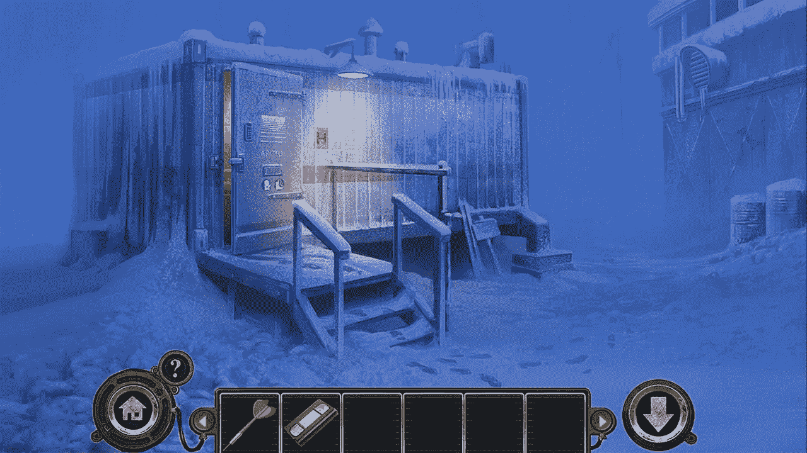
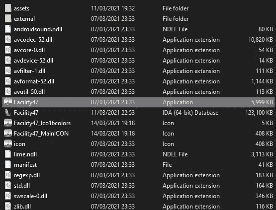
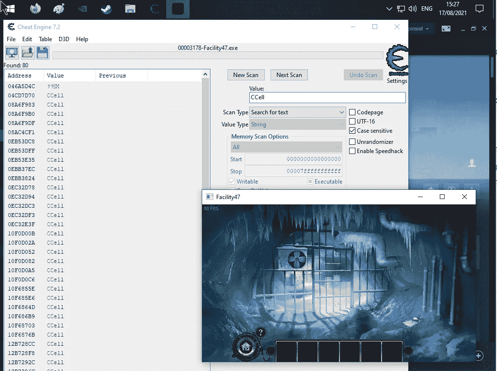
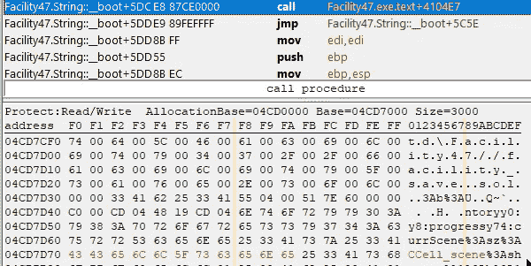

# 2 小时的乐趣完成游戏。20 多个小时的乐趣黑客游戏。

> 原文：<https://levelup.gitconnected.com/2-hours-of-fun-completing-the-game-20-hours-of-fun-hacking-the-game-dc795a36ebe6>

一点好奇心可以带来很多知识。



47 号设施游戏截图

这是一篇关于我如何享受一个叫做 47 号设施的小游戏的博文。最初玩它很有趣，但黑它更有趣。

我投入时间来破解这个游戏，因为我真的喜欢这样的挑战，我正在写一篇关于它的博客文章，鼓励你从事这样雄心勃勃的项目——因为你不知道它们可能会导致什么。

# 这是什么游戏？

设施 47 是一款简单的“点击”式冒险游戏，于 2014 年在 Steam 上发布。我买的时候大概是 5 美元，可能是在大减价的时候。如果你试图将它与你玩过的游戏进行比较，like it 中最知名的游戏可能是 Myst。

它也适用于 Android 和其他平台。

# 你为什么要黑它？

我第一次正常玩游戏，总共花了大概 2 个小时。我只是喜欢比赛的美感、气氛和风格。它的拼图设计得很好。然而，当你知道解谜游戏的答案时，你可以更快地完成游戏。在第二次尝试时，我想我设法在 25 分钟内完成了整个游戏——因为我在最近的记忆中已经有了答案。

作为一个极速奔跑游戏的粉丝，我很好奇一个有经验的玩家，知道所有谜题的答案，能多快完成这个游戏。稍微搜索了一下游戏 speedrun 的视频，结果为零。没有 speedrun.com 的消息。哇，以前没人做过这个游戏的速跑？哈，这是一个机会！如果我加速跑这场比赛，我将成为世界纪录保持者！

所以，在搜索了一下这些事情是怎么做的之后，我创建了一个关于 speedrun.com 的页面——[https://www.speedrun.com/facility_47](https://www.speedrun.com/facility_47)

我上传了我的第一次尝试，然后不久，第二次尝试；

如果你观看 speedrun 视频，你会在左下角看到一个小计时器。那是一个叫做 [LiveSplit](https://livesplit.org/) 的极速跑计时器。它测量计时和分割。现在，重要的一点是，在这段视频中，我使用数字小键盘手动控制 LiveSplit。Numpad 1 转到下一个分裂，一旦完成，它记录你的最后时间。

当然，这不可能是如何控制“专业”的超速行驶？它不是。

LiveSplit 支持一个名为 AutoSplitters 的概念——一个在后台运行的脚本，在游戏运行时直接从游戏内存中读取。基于每一个游戏编写的脚本告诉 LiveSplit 应该注意哪些指针和内存区域。编写这些脚本很简单。寻找需要观察的内存区域需要时间。我面前有一个挑战，现在我掉进了兔子洞…

# LiveSplit 怎么知道在内存中找哪里？

为了让你明白我们的目标是什么，让我们快速跳到最后。这是自动拆分器代码的复杂部分；

```
state("Facility47") 
{
	// currScene:sz:COutsideCell
	string50 scene : "Facility47.exe", 0x0051887c, 0x8, 0xc, 0x4, 0x38, 0x0, 0x8, 0xA
}
```

第一个地址——`0x0051887c`，是内存中的一个静态地址，每次游戏加载时，它总是具有相同的结构。下面的值，`0x8`，`0xc`是指针偏移量，进入那个结构，指向我们真正想要读取的值。

博客的下一部分**解释了我是如何找到这些值的**(花了 20 多个小时)…

# 从头开始，什么是`Facility47.exe`？

从技术上来说，它是一个 Win32 可执行文件(尽管有到 Android 和其他平台的移植)。然而，在浏览了一下游戏目录后，我发现最重要的是 Flash。是啊。



# 反编译 Flash

好吧，就我所知，从脚本的角度来看，Flash 非常简单。它使用 ActionScript(很像 JavaScript ),以及一堆媒体资源——JPEG、音频等。它也很容易被免费软件和共享软件反编译。很容易找到一个庞大的 35mb SWF 文件开始使用— `assets.swf`。

是时候使用 SWF (Flash)反编译器了。过了一会儿，我看到了一个`.as` (ActionScript)文件的目录转储。我不打算在这里提供任何例子，因为这是一个封闭源代码的商业游戏，我想尊重出版商的权利，不公开他们的作品，同时仍然在自己的计算机上进行逆向工程。

然而，纵观这些文件，有很多，一眼看去，它们似乎相当同质。因此，我对它们进行了一些基本的频率分析，并开始了解它们的内在本质。我过滤掉了很多常见的关键词，像`public`、`function`、`Movie`等。而且我找到了类似`CIceCave_scene`、`CIceLakePool_scene`、`CIceTunnel_scene`等东西。很好，这些都是关卡名称！我已经有了一个创建自动拆分脚本的起点。

# 寻找记忆的层次

现在，我无法将反编译的输出重新编译。这也不是正确的方法。相反，我需要给游戏附加一个调试器。一个非常受欢迎的游戏调试器，是**神奇的**cheat gene。我加载它，连接到正在运行的游戏，并开始搜索一个可能与我所在的级别匹配的级别名称。



好的，`CCell`是起始层，内存中有 80 个地址包含这个字符串。如果我要搜索所有这些，我需要更多的咖啡。

即使这个游戏非常小，要搜索的原始字节的数量也是令人难以置信的。缩小搜索空间至关重要。一个好的方法是点击到另一个“级别”，然后再返回，看看有什么值改变了。

令人欣慰的是，许多值发生了变化，这意味着它们可能只是当前级别的临时存储，而不是内存中的真正指针。再点击一下，缩小静态值的范围，就可以找到 2-4 个可能相关的地址。太棒了——2–4 个地址比我们开始时的 80 个要好得多。

# 找到正确的结构

在缩小搜索空间，并查看剩下的几个值后，我在内存中找到了一个看起来很有希望的结构；



在这一点上，我进入这个项目大约 3 个小时。也许更少——我不确定，那是很多个晚上以前的事了。我认为这很容易，如果不是因为一个简单的问题…

# 问题是指针四处移动

我在内存中存储当前级别的位置设置了一个手表，我点击了大约前 10 个级别。它是最新的，并且与我的脚本同步。太棒了。

我点击了大约 11 级，然后嘣，现在一切看起来像垃圾。哼。我再次开始搜索——我很容易地在内存中找到了这个结构，这次是搜索`currScene`(这个结构的开始)。那是在完全不同的记忆区域。

这可能是导致这种情况的几乎任何东西，也许它所依赖的结构之一被删除并重写，谁知道呢。恼人的是，它在我玩游戏的时候到处移动。

接下来的 17 个小时花在寻找内存中的固定地址，然后建立一个可靠的指针偏移量列表，每次玩游戏时都是相同的。

结果是一个开源的 autosplitter 脚本，在 GitHub 上可以找到。[https://github . com/James read/facility-47-speed run/blob/main/facility 47 . ASL](https://github.com/jamesread/facility-47-speedrun/blob/main/facility47.asl)。这也是 LiveSplit 项目的一个贡献，意味着其他人可以很容易地从这个脚本中受益:-)

# 摘要

我以前写过类似的项目，我称之为“奥德赛项目”——一点点好奇心能让我学到很多东西。我学到了更多关于记忆的知识，更新了一些逆向工程的技能，并且在这个过程中我得到了一份开源的贡献。同样，当我第一次拿起游戏开始玩的时候，我也没有想到会发生这些。

不仅如此，我还会鼓励你也有一点好奇心，考虑多读一点关于什么是[奥德赛项目](https://blog.jread.com/odyssey-projects-47138a44acda)的书。