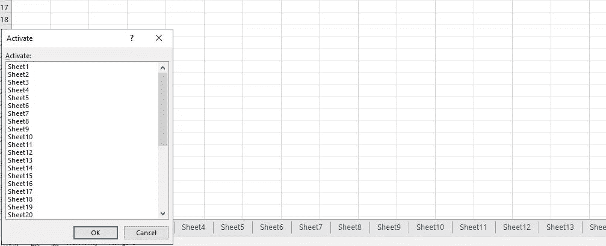
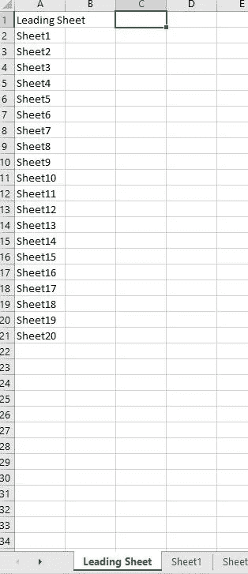

# VBA 宏的 2 个使用案例克服了 Base Excel 的某些局限性

> 原文：<https://levelup.gitconnected.com/2-use-cases-of-vba-macro-to-overcome-certain-limitations-of-base-excel-4a3e619f75eb>

## Excel 用户实用指南


由 [Unsplash](https://unsplash.com?utm_source=medium&utm_medium=referral) 上的[窗口](https://unsplash.com/@windows?utm_source=medium&utm_medium=referral)拍摄

# 背景

鉴于 Python、R 和 SQL 等数据科学工具以及 Pandas 和 dplyr 等综合库的兴起，人们一直在争论是否应该放弃 Excel 来完成一般的数据转换任务。

作为一名熟悉这些工具的从业者，我认为与“下一代”数据科学工具相比，使用 Excel 的主要缺点如下:

*   Excel 对数据有限制(即行和列的限制)。考虑到计算量的增加，甚至在达到此限制之前，在 Excel 工作簿或电子表格中导航通常会很慢且很困难。
*   Excel 不是一个可扩展的工具，因为通常很难有效地将一个工作簿中的数据集与另一个连接起来，更不用说执行计算了，尤其是当数据集很大时。

也就是说，Excel 的受欢迎程度不容忽视。根据 Google 搜索，全球大约有 8 亿 Excel 用户，而 Python 用户大约有 800 万。在我的工作中，精算师和分析师每天都在使用 VBA 宏或 Excel。我认为是这样，原因如下:

*   对于熟练的用户，Excel 提供了一个“无代码”的环境来检查和转换数据。例如，您可以通过与 Excel 前端交互(例如，单击某些按钮)来轻松过滤和绘制数据。
*   Excel 在 internet 上有一个强大的支持社区，这可能是因为用户数量相对较多。

本文提供了一个分步实践指南，介绍如何使用 VBA 宏克服基本 Excel 的两(2)个限制，这是一种用于在 Excel 后端生成用户定义函数的编程语言。本文提供的建议基于我在数据驱动行业工作 10 多年的经验。

# 用例 1:在 Excel 工作表之间切换

当使用包含多个工作表的 Excel 工作簿时(这在商业环境中并不少见)，工作表之间的切换在操作上变得很困难。特别是，在 Excel 的基本版本中，用户只能使用以下两种方法之一在(大多数情况下是相邻的)工作表之间切换/导航:

1.  用鼠标单击选择工作表，或使用 Ctrl + PageUp/PageDown 键盘快捷键

2.右键单击工作簿左下角的提示，如下图所示，然后选择工作表。



图 1:包含多个工作表的 Excel 工作簿。作者图片

这两种方法都是不可扩展的，并且证明是耗时的(希望大多数 Excel 用户能够理解这一点！).为了克服这个限制，我建议我们创建一个前导工作表，存储所有工作表的名称字符串，如果选择了具有特定工作表名称的单元格，键盘快捷键将触发直接“跳转”到该特定工作表。为了证明:

**VBA 宏 1:输出所有工作表名称**

这是输出工作簿中所有工作表名称的一次性运行(假设没有人想手动这样做)。除此之外，如前所述，增加了“前导页”。这可以通过在工作簿模块中运行下面的 VBA 宏来轻松实现:

```
Sub OutputSheetNames()Sheets.Add.Name = "Leading Sheet"
For i = 1 To Sheets.Count
Cells(i, 1) = Sheets(i).NameNext i
End Sub
```

输出类似于:



图 2:用于输出工作表名称的宏输出。作者图片

**VBA 宏 2:创建一个‘跳转’触发器**

为此，首先创建一个名为“ *SheetExists* 的函数，该函数确定所选单元格是否存在工作表(即更多的控制措施):

```
Function SheetExists(ByVal WorksheetName As String) As Boolean
Dim Sheet As WorksheetFor Each Sheet In ThisWorkbook.Worksheets
        If Application.Proper(Sheet.Name) =         Application.Proper(WorksheetName) Then
            SheetExists = True
            Exit Function
        End If
    Next SheetSheetExists = False
End Function
```

然后可以通过定义如下的" *jump_to_tab* "宏来触发跳转:

```
Sub jump_to_tab()
Dim temp_val As Stringtemp_val = ActiveCell.Value
If SheetExists(temp_val) = True Then Sheets(temp_val).SelectEnd Sub
```

为方便使用，建议为“ *jump_to_tab* ”宏指定一个键盘快捷键(如 Ctrl + Q)。要触发跳转，只需转到“前导工作表”，选择用您要导航到的工作表的名称填充的单元格，然后应用键盘快捷键。

最好在工作簿中所有其他工作表的一个单元格中填充名称字符串“Leading Sheet ”,您可以选择它并使用相同的键盘快捷键触发跳回到“Leading Sheet”。您可以通过分组选择所有工作表并在选择的单元格中键入字符串(例如 A1)来轻松完成此操作。

# 用例 2:遍历一个目录

Excel 用户通常一次只使用一个活动工作簿。让我们假设在一个工作簿中有一些已经由 VBA 宏自动完成的数据转换，我们希望将这些转换应用于同一目录中的所有其他工作簿。

为了实现这一点，假设单个工作簿中现有的 VBA 宏是以“ *single_operation* 的名称编写和调用的，那么在一个工作簿模块中运行下面的。

```
Sub Loop()Dim Filename, Pathname As String
Dim wb As WorkbookPathname = "*insert path to the directory"*Filename = Dir(Pathname)
Do While Filename <> ""
Set wb = Workbooks.Open(Pathname & Filename, UpdateLinks = False) ** Single_Operation** wbwb.Close SaveChanges:=False

        Filename = Dir()Loop End Sub
```

作为一个不错的选择，最好用下面的语句来包装上面的 VBA 宏，以提高运行时间:

```
Application.EnableEvents = False
Application.ScreenUpdating = False
Application.DisplayAlerts = False
Application.AskToUpdateLinks = False... VBA macro above ...Application.EnableEvents = True
Application.ScreenUpdating = True
Application.DisplayAlerts = True
Application.AskToUpdateLinks = True
```

# 摘要

在这篇文章中，两个 VBA 宏被提供给 Excel 用户，他们希望在大规模使用 Excel 时获得更高的效率。

如果你肯定是这些实用的带代码的分步指南的粉丝，你可能想跟随作者在[媒体](https://jin-cui.medium.com/)上了解更多！