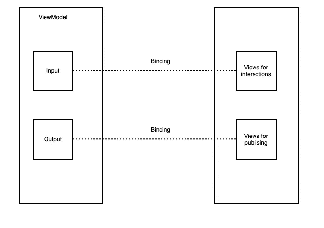
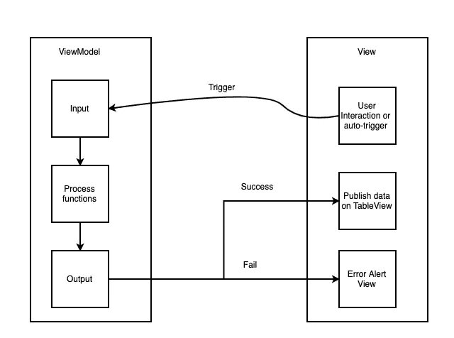

# 执行 MVVM iOS 的两种方法

> 原文：<https://levelup.gitconnected.com/2-ways-to-execute-mvvm-ios-5c47d60ebcd0>

## MVVM 不必与 RxSwift 绑定，但最好是这样。

照片由 [CoinView App](https://unsplash.com/@coinviewapp?utm_source=medium&utm_medium=referral) 在 [Unsplash](https://unsplash.com?utm_source=medium&utm_medium=referral) 上拍摄

对于移动应用程序开发，MVVM 是现代建筑。它执行了更好的关注点分离，使代码更加清晰。正如我们在上一篇文章中所讨论的，MVVM 通过将 ViewModel 中的变量绑定到 ViewController 元素来改进业务逻辑和视图之间的通信。本文将介绍两种实现 MVVM 的方法。

# MVVM 和斯威夫特

要执行没有依赖的双向绑定，我们需要创建自己的可观察对象。下面是代码:

`Observable<T>`是一个自定义类，可以保存类型为`T`的值。如果值改变了，那么我们触发`didSet`，它调用绑定函数，将值传递回调用者。举个具体的例子，让我们来看看下面的代码:

如果我们关注第 1 部分，我们将`cellViewModels`绑定到`reloadTableViewClosure` , `isLoading`绑定到`updateLoadingStatus`,`alertMessage`绑定到`showAlertClosure`。

在 ViewController 中，我们将闭包与 UI 元素绑定在一起，然后我们可以在 ViewModel 中触发任何异步请求。在上面的代码中，它是 3 号`initFetch()`。它请求 API，如果发生错误，它更新`alertMessage`变量，如果请求成功，它更新`cellViewModels`变量。这两个变量的更改都将更新 ViewController 中的 UI。

这里我们有双向绑定。

# MVVM 与 RxSwift

有了 RxSwift，双向绑定变得更加容易。代码如下:

在上面的代码中，我们可以很容易地识别出`Input`持有可观察变量以接受来自 ViewController 的事件，而`Output`持有可观察变量以绑定 ViewController 中的 UI 元素。init 函数初始化依赖关系，处理来自 API 的数据，初始化输入和输出。

下面是 ViewController 代码:

在`ViewDidLaod()`中，我们应用`setupBinding()` 和`setupErrorBinding()`将 UI 元素与 ViewModel 中的 observables 绑定。当所有的绑定都准备好了，我们有`self.articleViewModel.input.reload.accept(())`来拉动数据流触发器。然后，来自 Api 的异步数据可以自动反映在 ViewController 上。

# 最后的想法

下面的图表展示了双向绑定是如何工作的。

在请求数据之前，UI 元素必须首先在 ViewModel 中绑定输出和输入。就像隧道已经建成。

然后我们可以触发数据流，这是图表。ViewController 可以将多个 UI 元素绑定到多个输入和输出。有了这种数据流，代码将更易读、更简短。

配备 Rxswift 的 MVVM 并不完美，以下是使 Rxswift 无法成为最佳选择的缺点。

*   学习曲线:陡峭的学习曲线使得新开发人员加入项目变得困难(并且在项目接近尾声时，完全不切实际)。这是我们应该考虑避免 RxSwift 的首要原因:当关键时刻到来时，我们将无法向项目添加开发人员，除非他们已经是 Rx 老手了。
*   调试 Rx 数据转换是可怕的。当 Rx 按预期工作时，它是不可思议的。当它出现问题时，调试过程会困难得多。您在数据流中遇到的任何断点都将呈现一个 40 多个条目的回溯堆栈，其中有几十个难以理解的内部 Rx 方法，用于分隔和隐藏我们实际编写的代码。

RxSwift 可能不会大幅缩短总体开发时间。它只是把问题转化为一些新的问题。如果团队没有为 Rx 做好准备，并且市场上很难找到 RxSwift 开发人员，那么 Rx 可能不是最佳选择。就我个人而言，我总是用 MVP 混合 MVVM 和 Rxswift。我相信 Rxswift 可以顺利解决异步问题，但我们有很多没有异步请求的情况。在这种情况下，MVP 完全没问题。

希望这篇文章对你自己的应用程序架构有所启发。欢迎你对这篇文章留下任何意见。我感谢任何建议。