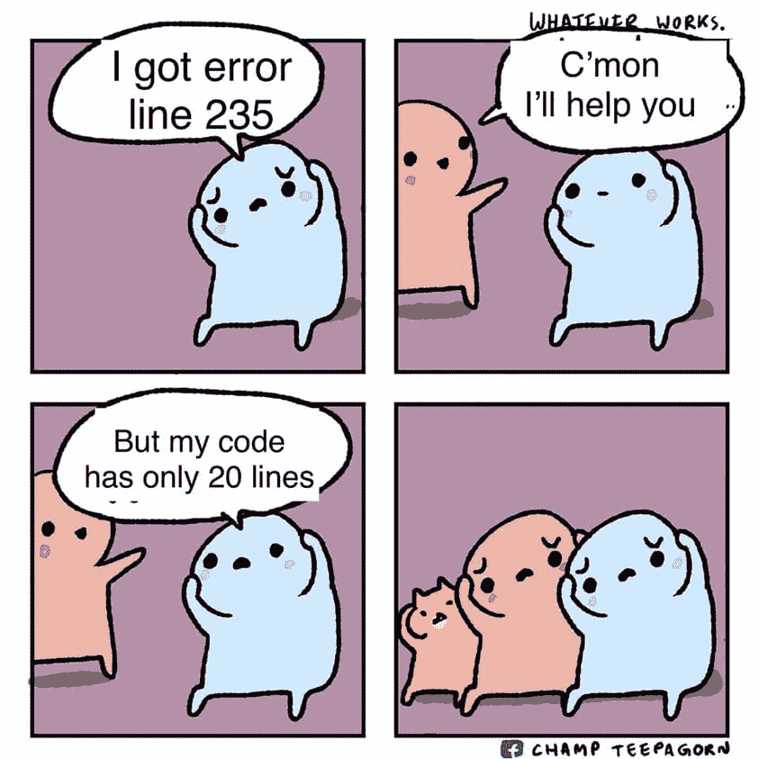

# 20 个会让你 LOL 的搞笑编程笑话

> 原文：<https://levelup.gitconnected.com/20-funny-jokes-that-only-a-programmer-can-understand-62d4723a8dca>

## 每个程序员和开发人员的小喜剧。

在 [Unsplash](https://unsplash.com/@hiteshchoudhary?utm_source=unsplash&utm_medium=referral&utm_content=creditCopyText) 上由 [Hitesh Choudhary](https://unsplash.com/@hiteshchoudhary?utm_source=unsplash&utm_medium=referral&utm_content=creditCopyText) 拍摄的照片

> 程序员(名词)。
> 
> “一台把咖啡变成代码的机器”

# 1.对于程序员来说

**功劳:** [**脸书**](https://web.facebook.com/charmingdesk/photos/a.111218177415125/337522461451361/?__cft__[0]=AZX8eh_aEEzTfaeVmbwVGmfZa3Owi0N25K88fux5fMN14BOUSdI3_AKCJYg-KgtXhHoL17h_CIzgMxDfQX4mGi3_C3xaRvaqwXLmTqvuyqG0RQLGvxdrqcaGd2NA2NiZ5TlmZE7nxT_o2lQ7dhCEzcsByG0LgGnTrhvyaSoxq8_Rpu5upiBfLKdaXd4XkyQDv_XSeCxXjQPvpdnZ4arxE2V2&__tn__=EH-y-R)

# 2.真的吗？

**信用:** [**脸书**](https://web.facebook.com/photo/?fbid=2023706537798311&set=gm.2863614010555907&__cft__[0]=AZW1wQVnfGz5jgpn6QBs-BH4xM5YvYgmN4cPYz220yH4DrsGrskt5Y3Y2UP7knwB9593zxaVBfYHhG06P2QCcM_8JPmGI1v_wwulSd5IIHNcw1Z54tkpu5kUuWF8hHpRqkIwZcHscDgE6ujqiNs_Oo8UScYC1ygTfwIkxbAzr7bp9Ow5evmaH7RxaGaV-jXUMDE&__tn__=EH-R)

# 3.你真的是程序员吗？

**功劳:** [**脸书**](https://web.facebook.com/photo/?fbid=554444305934069&set=gm.2864535243797117&__cft__[0]=AZW0xg5hfGMF14X-cmWSMHIHSRmIA_gmmr4S3od9OZhRwcv0wrsSSSEjDC7wPv_KGA8kSCRFrWWJZ8PV40-rFfDSTE_siIS6Z5WYYzX6wxnr-Ii-19OXyPfGsN4I4jBkps3HeznrB6LT8sTz7dUcmiFWmkwsu0vYQdpzz4JUMV5ZLFgb3Sq668b5K06JAaAeO_s&__tn__=EH-R)

# 4.音乐解说节目

**功劳:** [**脸书**](https://web.facebook.com/photo/?fbid=2068081689996469&set=gm.2864302200487088&__cft__[0]=AZV08OiDZUYZT7HKX7_Oo3HEDTj9klwnqoxl4cn559iSxKChtc2qVEPfvVGhCcECzSs1dOjHKE011_XYx5YtQMzz1XLiaPBO9Q3W4M2oKUE-zD9tzEPCRKlzAuBAvhFm4dTnxD4PBx7CeVLCxQTRMfpMwnb17kccUTT5QR_lr6TbTvZr4FbaNm28bIPlkqrq6KI&__tn__=EH-R)

# 5.请键入另一个名称

**功劳:**[脸书 ](https://web.facebook.com/photo/?fbid=4065644283557005&set=gm.2864177403832901&__cft__[0]=AZWGLhQccGvt5Xu1HSj2HiLagKxomV4oS42YDC9Kl8tUVM5Xib-0Yu0VCFy8seUfsJtvpBDKjsARCLN8V2ljrC-e7FEVcampHkL77avrKgAlPImTxIMKW1_3vkVaSr1JOOgqo7lFw_dRv1dbPSM_5NTtGNp_GJ3j5XakpQog323pg_QQnwAonmXFGrNc9hBerZo&__tn__=EH-R)

# 6.为什么只发生在我身上

**功劳:** [**脸书**](https://web.facebook.com/photo/?fbid=2725257491099267&set=gm.2864407143809927&__cft__[0]=AZWVWC1L2q8xyE2o6aE-tpd_hYzpMa7FKPwwPOY2QD-c4HVMgGOQ36Ivb-n-JEs_Zq73cGGCaYXs6ThtK20glbOm1kqNu2caVoHhhBwRwzL-ehgDEWSNE8rCIS7uQLEfUjYruJYXICGfXfL9zL7SNdAPtww_25m7h8SRfOWGFS3RkT8rlW0iB-CbZ4T67blOLjM&__tn__=EH-R)

# 7.我是一名网络工程师

**信用:** [**脸书**](https://web.facebook.com/photo/?fbid=1003956487015712&set=gm.2863192187264756&__cft__[0]=AZXdSkagpyWmPqtI_j5b7W4ItJRZdr2UJ_CBp_u3b5_-5Bz4f95yAVwlZpcUmNduhXPdgNkZ8Vy8kDWYa2Ime8m3b7IErQYhfa1Fg4MEXofNCiyBVzy9v7qAn4Uc6rzJOuaE9R3EDB8RgNFBVZzY9cCwU7kkNAmGVUZm4WJaSc9B9wcc9_mWWyqis3TGzjUTAbM&__tn__=EH-R)

# 8.程序员害怕

**功劳:** [**脸书**](https://web.facebook.com/photo/?fbid=10160920380697564&set=gm.2864258400491468&__cft__[0]=AZVGhjkNh5km_kDq5VZOZ315Vi6AhvgcT9AdDLQu-R7Q3FxqM2m3mliqbPUsLF16kbTg9f4iUVbCsXDz1hycYrRZH-y81R_CHJcjgOURKkEgeUsRmD_BgPlf3G81zu610VMtHhYEdjYKoB41O_3DF7BOixwYPVRs9Yyb8DNMpbNVfA5QtHZP9z_c1FDWtdsbLQg&__tn__=EH-R)

# 9.只有 JavaScript 开发人员才能理解

**鸣谢:**[**Codepedia**](https://www.thecoderpedia.com/blog/programming-jokes/)

# 10.如果你不在循环中使用 I，j，你就不是程序员

**功劳:** [**脸书**](https://web.facebook.com/gksoftwaresolutions/photos/a.103257488010145/330618805274011/?__cft__[0]=AZXduoAWi_TN5iI30q8lnzAf5zrYd-5v62rLjR6WbQbOaIhlOPFD7CLYj5-dAxW7VZdBGScaMfztMccecECyvZkXH1qvlcYthKxQvwTZxYKdoyrv-5yHHPaJzXSWg-lYOo_LZMIOmPkxdPWGVnsye5PD1xU25Emg8Pikiv8Q52yW7SDz8AqsZQL06cT5x-j_QloYHxjSd74cGA_KVzRhVree&__tn__=EH-y-R)

# 11.HTML 是一种编程语言吗

**功劳:**[脸书 ](https://web.facebook.com/photo/?fbid=2966903823632168&set=gm.807729113279679&__cft__[0]=AZWNpI1WftIr_s3wh4DC9fKY4h-7LH40BMkrJXNAFSQOIYoSKvhD4XYhLhxSJzVJs5OG6QIleI4cNX1AVcv8Ht2i6vsZQk7FBgBDL68PNQfyXJoQrXdghsOq3_ewtKcPEgrUK2nIH5ViW9G0HIMuWUHkZ296_g4GRV-3uwSZMg1EeSneIkmLLm_snRsIarza2pU&__tn__=EH-R)

# 12.仅面向前端开发人员

**功劳:** [**脸书**](https://web.facebook.com/photo/?fbid=183249327145720&set=a.169921398478513&__cft__[0]=AZWabaWo_pmSkIAkeLJQ_YRWrDi4J87YIN-_Vlrr0J8HTkQXp7eNxY7cNwYZLg2Gf32eX6X09lstS5Csvx8KMDQiwfBPUyiLF0LUV7TiqEFFMxvM9OZiRtDJ3OSp68clEbVEj6HGvXZ4pZIG8_4cDSCnZQW7V7kpZlYn-OFZmXl_X-yaZIfeyZElplSvBm7DqdggE8m9Y7us5dr0XjY4vbrq&__tn__=EH-y-R)

# 13.你是哪一个？

**信用:** [**脸书**](https://web.facebook.com/photo/?fbid=126692666272180&set=gm.826504151402175&__cft__[0]=AZUbVkpxp1SIO3rkAAt5gWRT_-kaJZxKWmLWlXHCmbvek8m2tZj7rDt3HehcAzZHky-04DYH3ZCZvyAJta39F-zf2OnyNF8m7Rk8TDRicIui3pbmHaIhq6QHQAvOdev8MXzfpt-DP6ZgXO-7geqfSWWNAdtwi0B8_ztTkbcQ-0gfI3wKlOq_wkM_CfERA7g8Rag&__tn__=EH-R)

# 14.Stackoverflow 是我的救星

**功劳:** [**脸书**](https://web.facebook.com/photo/?fbid=310573304142797&set=gm.331375318468533&__cft__[0]=AZWyeWBjYBW2csJPv1LMFKEyApY46NQnMaU-WUufK5gmvmZGZ-PM7oLEqMBVPrPWu80LKJYfYWFRUiOT2jgsk4wY8UttB_hvpKsv1G7Ka9VJv3bKBcMzzLBMP4PumQXpVPi54RNsKTnW9-DT0ODZcGJp40HeV1NZlrgbM84WNwzd1SEmAnnSC6sXBTk7cfWTiyn5jxwG7enmNWFXQn-lgH1_&__tn__=EH-y-R)

# 15.世界叫我程序员

**功劳:** [**脸书**](https://web.facebook.com/MemesByUneeb/photos/a.106619711322347/211053330878984/?__cft__[0]=AZV8eEvS_o6BtLSVenejCDyrktugv40uJfZhszloGGKFqB6I0SHew5-BOAMeAJ_XyWwbKP2GWw-jz0u8Vm_hBbOHSrV4xUYrgIIoLEhpPhGt5wxknX3eLPAjsG20Jt-q-akQOqZfjzlF5DW5uukMHo0pMyON73Wrl4glyiQE1MBmV3KhGLon9DYFKpM3cHkJFeG9Ka-Z6DY_AiWjYi01v4ZH&__tn__=EH-y-R)

# 16.世纪笑话

**功劳:** [**脸书**](https://web.facebook.com/105823518362688/photos/a.123025759975797/125867449691628/?__cft__[0]=AZUFDirXJ3GhP3aS6kZktDVm4NM8084SSTSwPOF_vw0Z0xI5EoKXf1DIZiyMqNRdo37zJ8wlSY0Qjjz8jI4d2BQ7NhkrHtGu1xM84lSJGr35qVyCSO-N9ki6w9LxVvsCkeY6NFSEeO7Z2Fnvae9BCiE0EhKwg-rId-XQ-uMiE6WeQ2-3b9Pn8b57Ys72DhSJ5gMAVnI5Fx_ou0R1jvbBvXMh&__tn__=EH-y-R)

# 17.我喜欢编程(直到没有错误出现)

**功劳:**[脸书 ](https://web.facebook.com/photo/?fbid=2965571483765402&set=gm.806802946705629&__cft__[0]=AZWYMtXWcVzHuZEDWq2NXW0HnQ-vf4PyEXDcuYTA0jGrbEKTwc9ZbLwGBQYN3c1Pk3_PYk60GNCaLzeuYzvLbeQkonjU_DynD2_W0XMvBFCCfs3uLq1sBJ3Z7SZHmqHmWaLj8j7T2Ry2sHG87EEhLCOhlNL16IPn8e4a6JAlPUWk2RVZnJOnVPPmHyvnWh6YV08&__tn__=EH-R)

# 18.只有 JavaScript 开发人员才能理解这一点。

**功劳:** [**脸书**](https://web.facebook.com/techwithcodex/photos/a.137007467972178/319408639732059/?__cft__[0]=AZWp0yXdEIYcwWig8jjhHxxcK2aVLAodXu_xYgPqkSaH8Rd0K1dRhzBY0wUh3TTi11l8OxIs3lmLPzs4kf7P-2OTkXXGaFqJWPNd6Hpz1uhrLEaLoH6cCUVJ3z8Ra2J93JEur1cf1k8tIoRTHHjX0L0xsrbtJCVf3eMYdBVxw_VWG1-RL9zAD9hhTIHCQZMsTJ14PWZku2iPHw3S5ZeS0GKD&__tn__=EH-y-R)

# 19.初级开发人员到高级开发人员

**信用:** [**脸书**](https://web.facebook.com/photo/?fbid=126692599605520&set=gm.826503971402193&__cft__[0]=AZVcKAbbJPskrS2qxbhjaUoikTQk-E5FIBrshfLJTW03nYSK9eYJWM0wqsNPbAMCSVzFYRK5Zv-idUr2VBHbMRXuDDXTDz_WqQuKEsMjnV9ai7NgHK5A8_mdByAfs9yBnwi3-zDtj8NxdvztWGmp-OSOu2P76fFRT2_bgr-bzguKGd7Qq-wL3Yhum18DV-Xp0s4&__tn__=EH-R)

# 20.谷歌是我的救星

**功劳:** [**脸书**](https://web.facebook.com/photo/?fbid=122858003333313&set=gm.826505108068746&__cft__[0]=AZXmunSlXcens0ZkjfiysOk03zstuQ4Qz6gIX6DKaqMMZtErYPvIbWWgh7SkFmekqxscD18eHZ7OtY2MmShhyfikNdJemQari7AZ5iJzvUnEyaCiMPD0NSciSh3QddxhVKCh0H4Olc-4HH6kwqC_Uwq7TtDTyHNfJodaqwW_VEXdRi11jKaioID8p17EdPdvcc4&__tn__=EH-R)

# 额外笑话

## *合适的 Java 开发人员

问:为什么 Java 程序员一定要戴眼镜？

答:因为他们看不到 C#(见夏普)

## *右侧

问:0 为假，1 为真，对吗？

答:1

## *最喜欢的地方

问:程序员最喜欢去哪里？

甲:Foo 酒吧

## * Java 程序员应该明白这一点

一个程序员遇到了一个问题。他决定用 Java。他现在有一个问题工厂。

## *有时我们会想

代码中的 99 个小错误。代码中 99 个 bug，修复了 1 个 bug…重新编译，代码中 100 个小 bug。

## *通过做循环

程序员被困在淋浴间，因为洗发水瓶子上的说明说… **起泡沫，冲洗，重复。**

## *嗯嗯

如果盒子上写着:“本软件要求 Windows XP 或更高版本”。这是否意味着它将在 Linux 上运行？

## 9.万岁！

[“臀”“臀”]——(臀臀阵！)

> 电脑中你可以踢的部分

# 最后的想法

希望你觉得这些笑话很有趣。我搜索了很多，从不同的平台收集了一些好的笑话，并给了他们好评。请随意分享一个笑话作为回应。

> 与你的程序员朋友分享这些笑话。

# 学习新的东西

查看我的编程文章。希望你觉得学习它们很有趣。

 [## 每个开发人员都应该使用的 17 个聪明的 JavaScript 技巧

### 每个开发人员都应该知道的 JavaScript 技巧

levelup.gitconnected.com](/17-clever-javascript-tricks-that-every-developer-should-use-e7f299e49896)  [## 您可能从未使用过的 12 个 JavaScript 特性

### 大多数人不知道 JavaScript 令人难以置信的特性

levelup.gitconnected.com](/12-javascript-features-youve-probably-never-used-db932c413cdd)  [## 学习编码的同时在线赚钱的 20 种方法

### 如果你是一名程序员，却没有在网上赚到钱，那你就错过了一个大好机会

levelup.gitconnected.com](/20-ways-to-make-money-online-while-learning-to-code-9aec753b742d)  [## 你可能从未用过的 15 个 Python 特性

### 大多数人不知道 Python 的这些不可思议的特性。

levelup.gitconnected.com](/15-python-hidden-features-youve-probably-never-used-bb59bb3138b6)  [## 使用 NLTK 的 Python 自然语言处理初学者指南

### 自然语言处理是人工智能的一个分支，它帮助计算机理解自然语言

levelup.gitconnected.com](/a-beginners-guide-to-natural-language-processing-in-python-using-nltk-6e4692b825d4)  [## 使用 Python 阅读和编辑 PDF 文档

### 在本文中，我们将了解如何使用 python pdf 模块来读写 pdf 文件。PyPDF2 是一个…

levelup.gitconnected.com](/how-to-work-with-a-pdf-in-python-a1e0c1d127a4)  [## 20 个必要的代码片段，让你在 JavaScript 中像专家一样工作

### 你可以在 30 秒或更短时间内学会 20 个 JavaScript 代码片段

levelup.gitconnected.com](/20-essential-snippets-to-code-like-a-pro-in-javascript-c7a6ef4dbddc)  [## 针对日常问题的 25 个有用的 Python 片段

### 以下是我为您的日常 Python 问题提供的 25 个有用且省时的片段

levelup.gitconnected.com](/25-useful-python-snippets-for-everyday-problems-4e1a74d1abae)  [## Python 熊猫教程:初学者完全入门

### 在本分步教程中，您将了解如何开始使用 Pandas 和 Python 探索数据集。

levelup.gitconnected.com](/python-pandas-tutorial-a-complete-introduction-for-beginners-add7013095c2)  [## PyQt5 教程:用 Python 和 PyQt5 学习 GUI 编程

### Pyqt5 是图形用户界面小部件工具包。它是最强大和最流行的 python 接口之一…

levelup.gitconnected.com](/pyqt5-tutorial-learn-gui-programming-with-python-and-pyqt5-df4225d2e3b8)