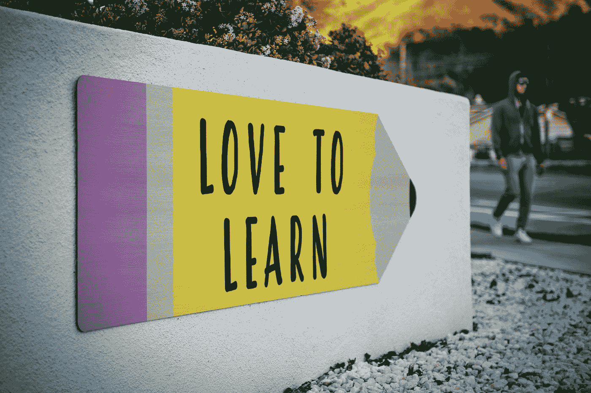
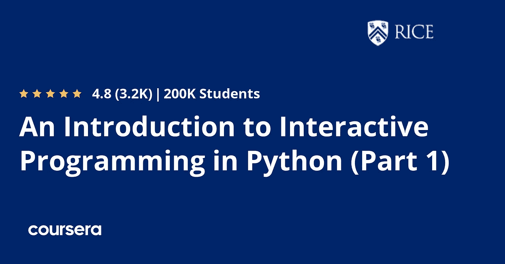
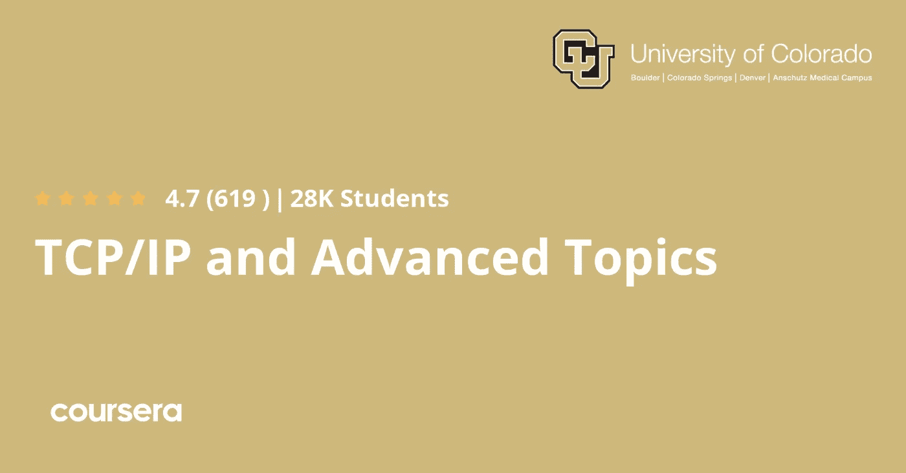

# 面向开发人员的 20 多门令人难以置信的课程

> 原文：<https://levelup.gitconnected.com/20-incredible-courses-for-developers-8b583fd10cf5>

蒂姆·莫斯霍尔德在 [Unsplash](https://unsplash.com?utm_source=medium&utm_medium=referral) 上的照片

在这篇文章中，你会发现 20 多种价值 10 万美元的关于 Linux、编程、Python、JavaScript、云、计算机科学、DevOps、MLOps、数据科学的不可思议的资源&以及更多完全免费的资源。

> 我用 ClickUp 为我的博客收集和管理想法——你应该去看看。太棒了，而且是免费的！
> 
> 【https://bit.ly/3hd3ksY 

## 学习编程:多伦多大学的基础

本课程介绍了编程的基本构件，并教你如何使用 Python 语言编写有趣而有用的程序。

 [## 学习编程:基础

### 在每一次鼠标点击和触摸屏点击的背后，都有一个电脑程序让事情发生。本课程…

www.coursera.org](https://www.coursera.org/learn/learn-to-program) 

## Google 介绍 Git 和 GitHub

在本课程中，您将学习如何使用一个流行的版本控制系统(VCS)Git 来跟踪不同版本的代码和配置文件。

 [## Git 和 GitHub 简介

### 在本课程中，您将学习如何使用跟踪工具跟踪不同版本的代码和配置文件

www.coursera.org](https://www.coursera.org/learn/introduction-git-github) 

## 哈佛大学 CS50 计算机科学导论

哈佛大学对计算机科学的智力企业和编程艺术的介绍，适用于专业和非专业人员，无论是否有编程经验。

 [## CS50 计算机科学导论

### 4115664 已经报名了！以您自己的速度前进可选升级可用有一个会话可用:此…

www.edx.org](https://www.edx.org/course/introduction-computer-science-harvardx-cs50x) 

## 斯坦福的计算机科学 101

CS101 是一门自定进度的课程，向没有任何经验的观众教授计算机科学的基本思想。

 [## 计算机科学

### 有一个会议可用:CS101 是一个自定进度的课程，教授计算机科学的基本思想，为一个…

www.edx.org](https://www.edx.org/course/computer-science-101) 

## 面向所有人的 CS:Harvey Mudd 学院的计算机科学和 Python 编程导论

这门计算机科学课程介绍了既有挑战性又有趣的计算机科学。

 [## 面向所有人的 CS:计算机科学和 Python 编程入门

### 想在学习 Python 编程的同时开始学习计算机科学吗？这门计算机科学课程提供…

www.edx.org](https://www.edx.org/course/cs-for-all-introduction-to-computer-science-and-py) 

## 麻省理工学院计算机科学和使用 Python 编程导论

本课程是两门课程系列的第一门:计算机科学和使用 Python 编程导论以及计算思维和数据科学导论。

 [## 计算机科学和使用 Python 编程简介

### 有一个会议可用:本课程是一个两个课程序列的第一个:计算机科学导论和…

www.edx.org](https://www.edx.org/course/introduction-to-computer-science-and-programming-7) 

## 约翰·霍普斯金大学为 Web 开发者开发的 HTML、CSS 和 Javascript

在本课程中，我们将学习每个网页编码者需要知道的基本工具。您将从头开始学习如何用 HTML 和 CSS 实现现代网页。

 [## 面向 Web 开发人员的 HTML、CSS 和 Javascript

### 您是否意识到用户直接与之交互的 web 应用程序的唯一功能是通过…

www.coursera.org](https://www.coursera.org/learn/html-css-javascript-for-web-developers) 

## Rice 大学的 Python 交互式编程介绍(第 1 部分)

本课程分为两部分，旨在帮助很少或没有计算机背景的学生学习构建简单交互式应用程序的基础知识。

 [## Python 交互式编程介绍(第 1 部分)

### 这两个部分的课程旨在帮助学生很少或没有计算机背景学习的基础…

www.coursera.org](https://www.coursera.org/learn/interactive-python-1) 

## Linux 基金会介绍 Linux

使用图形界面和命令行开发 Linux 的优秀工作知识，涵盖主要的 Linux 发行版家族。

 [## Linux 简介

### 已经有 795004 人报名了！以您自己的速度前进可选升级可用有一个会话可用:开发…

www.edx.org](https://www.edx.org/course/introduction-to-linux) 

## IBM devo PS 简介

您将学习新的思考、工作、组织和衡量方式，以充分获得 DevOps 的好处。

 [## DevOps 简介

### DevOps 技能很抢手！DevOps 技能有望成为劳动力中增长最快的技能之一。这个…

www.coursera.org](https://www.coursera.org/learn/intro-to-devops) 

## Linux 基金会的 DevOps 和站点可靠性工程简介

如果你渴望在 DevOps 和站点可靠性工程领域有所作为，本课程是你的起点。

 [## DevOps 和现场可靠性工程简介

### 有一个会议可用:随着敏捷实践开始革命性的软件开发，有一个…

www.edx.org](https://www.edx.org/course/introduction-to-devops-and-site-reliability-engineering) 

## 弗吉尼亚大学的连续交付和开发

本课程将为您提供跨学科的技能组合，以培养您组织中的持续部署能力。

 [## 持续交付和开发运营

### 众所周知，亚马逊每 11.6 秒发布一次新代码。就在几年前，这是不可思议的:许多“尖端”…

www.coursera.org](https://www.coursera.org/learn/uva-darden-continous-delivery-devops) 

## 杜克大学云计算基础

在本课程中，您将学习如何构建基础云计算基础设施，包括涉及无服务器技术和虚拟机的网站。

https://www . coursera . org/learn/cloud-computing-foundations-duke

## IBM 云计算简介

本课程向您介绍云计算的核心概念。您将获得从业务和从业者角度理解云计算所需的基础知识。

 [## 云计算简介

### 有一个会话可用:以您自己的速度前进可选升级可用有一个会话可用…

www.edx.org](https://www.edx.org/course/introduction-to-cloud-computing-6) 

## Linux 基金会的云基础设施技术简介

刚接触云，不知道从哪里开始？这门入门课程将帮助您掌握云计算的基础知识。

 [## 云基础设施技术简介

### 有一个会话是可用的:刚接触云，不知道从哪里开始？本入门课程由云教授…

www.edx.org](https://www.edx.org/course/introduction-to-cloud-infrastructure-technologies) 

## 杜克大学的云虚拟化、容器和 API

在本课程中，您将学习使用云计算的基本构建模块设计云原生系统。

 [## 云虚拟化、容器和 API

### 随着越来越多的公司利用运行在云上的软件，寻找和雇佣个人的需求越来越大…

www.coursera.org](https://www.coursera.org/learn/cloud-virtualization-containers-api-duke) 

## 开放大学介绍网络安全

在这个为期八周的课程中，您将学习如何识别可能对您造成伤害的在线安全威胁，并探索您可以采取哪些措施来最大限度地降低风险。

[futurelearn.com/courses/introd…](https://www.futurelearn.com/courses/introduction-to-cyber-security)

## 华盛顿大学的网络安全导论

在本课程中，您将了解网络安全的概况，以及国家(美国)和国际对该领域的看法。

 [## 网络安全介绍

### 有一节课是可用的:这门课是对令人兴奋的网络安全领域的介绍。作为我们的…

www.edx.org](https://www.edx.org/course/introduction-to-cybersecurity) 

## 科罗拉多大学博尔德分校数据科学的网络安全

本课程旨在帮助任何对数据科学感兴趣的人了解网络安全风险以及可用于降低这些风险的工具/技术。

 [## 数据科学的网络安全

### 本课程旨在帮助任何对数据科学感兴趣的人了解网络安全风险和工具/技术…

www.coursera.org](https://www.coursera.org/learn/cybersecurity-for-data-science) 

## NYU 的《网络导论》

课程主题包括:

计算机网络概述
应用层
传输层
网络层
链路层
网络安全概述

 [## 网络简介

### 有一个课程可供选择:这是一个自定进度的课程，介绍网络课程主题…

www.edx.org](https://www.edx.org/course/introduction-to-networking) 

## 科罗拉多大学系统的 TCP/IP 和高级主题

本课程将让你深入学习 TCP/IP 协议。您将研究 IP 如何支持一组网络之间的通信。

 [## TCP/IP 和高级主题

### 在本课程中，我们将深入研究 TCP/IP 协议。我们详细研究了 IP 如何实现…

www.coursera.org](https://www.coursera.org/learn/tcp-ip-advanced) 

## AWS 机器学习入门

本课程将教你如何入门 AWS 机器学习。关键主题包括 AWS 上的机器学习、计算机视觉和自然语言处理(NLP)。

 [## AWS 机器学习入门

### 机器学习(ML)是技术中发展最快的领域之一，也是当今社会非常需要的技能

www.coursera.org](https://www.coursera.org/learn/aws-machine-learning) 

## 加州大学的数据科学 SQL

本课程旨在为您提供 SQL 和数据处理基础的入门知识，以便您可以开始出于数据科学的目的对其进行分析。

 [## 用于数据科学的 SQL

### 随着数据收集呈指数级增长，对熟练使用数据和与数据交互的人员的需求也在增长…

www.coursera.org](https://www.coursera.org/learn/sql-for-data-science) 

我希望你和我一样觉得它们很有帮助，这些课程将有助于加速你的职业生涯！