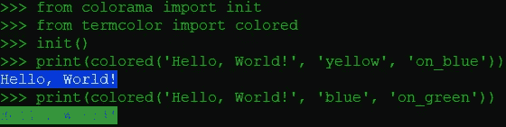
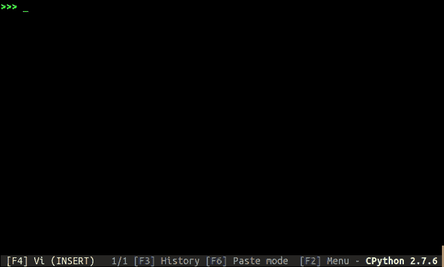
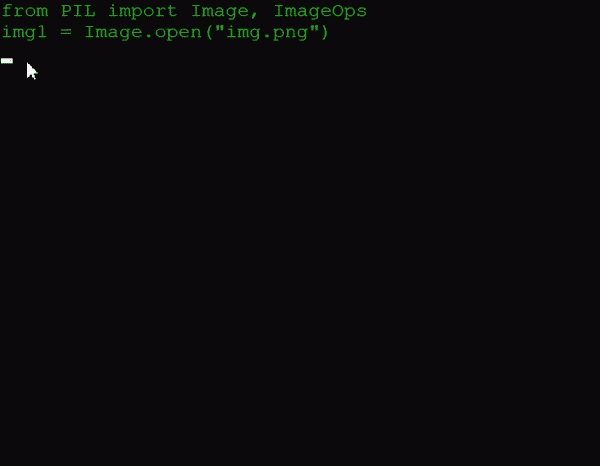
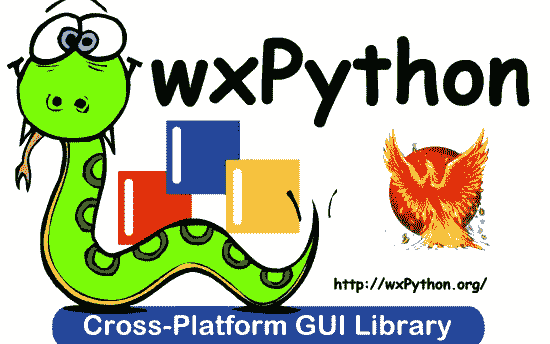
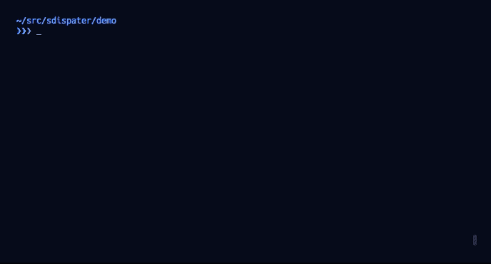
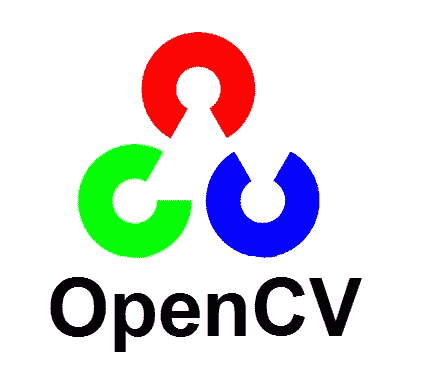
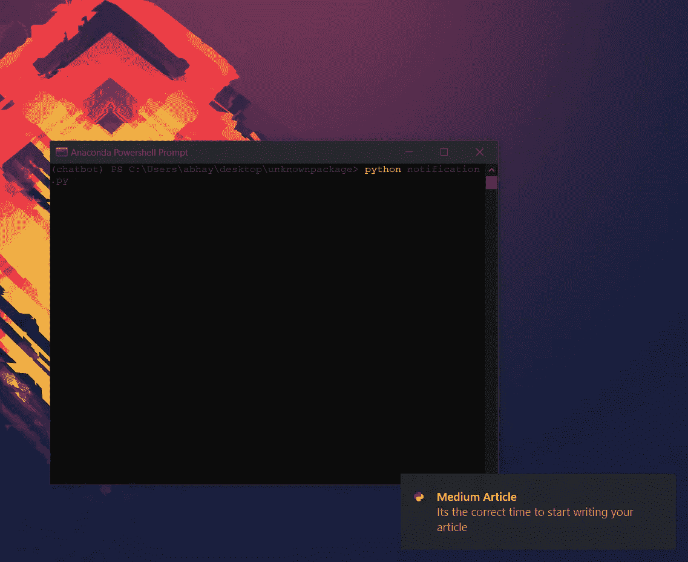
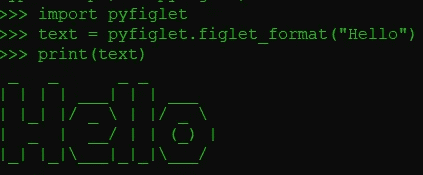

# 你必须尝试的 20 个 Python 包

> 原文：<https://levelup.gitconnected.com/20-python-packages-that-you-must-try-a81862c913f6>

## 这让你的生活更轻松


Python 是编程世界中使用最多的编程语言。这是初学者的最佳选择之一。吸引人们使用 python 的是简单性和容易的语法。Python 是一种解释型语言，所以在代码中发现 bug 变得更加容易。它由吉多·范·罗苏姆创建，并于 1991 年首次发布，从那以后，python 开发者社区日益壮大，人数众多。根据一些资源，python 有一个超过 1000 万人的社区。它被许多价值数十亿美元的公司使用，如谷歌、亚马逊、脸书等等。

我使用 python 已经有一年半的时间了，我最喜欢 python 的一点是它的[](/25-useful-python-one-liners-that-you-should-ec613df18260)****和包，**，这也是我选择 python 而不是其他语言的原因。**

**在这篇博客中，我将向你介绍 20 个非常有用的 python 包，你一定要试试。*开始吧。***

# **1.彩色光**

**[Colorama](https://pypi.org/project/colorama/) 是一个 python 包，用来让你的终端看起来更好看。它可以用来给终端添加颜色。**

****安装** : `pip install colorama`**

****

**Colorama 示例**

# **2.Pynput**

**这个库用于控制鼠标和键盘等外部设备的时刻。使用一些简单的代码行，我们可以使用库来控制键盘和鼠标。这个库最好的应用是用它来创建一个键盘记录器。下面的代码解释了如何使用这个库实现键盘记录器。**

****安装** : `pip install Pynput`**

# **3.进度条:进度和 tqdm**

**[**进度**](https://pypi.org/project/progress/) **:** 使用这个库我们可以更轻松地创建一个进度条。**

****安装** : `pip install progress`**

```
from progress.bar import Bar
bar = Bar('Loading', max=20)
for i in range(20):
    # Any Task
    bar.next()
bar.finish()
```

**下面的动画显示了不同的酒吧，我们可以使用进展。**

****

**Giorgos Verigakis 的动画来自 [progress](https://pypi.org/project/progress/)**

**tqdm :它也做同样的工作，但看起来更有效率，并且与现代编程保持同步。**

****安装** : `pip install tqdm`**

****

**来源:[https://github.com/tqdm/tqdm](https://github.com/tqdm/tqdm)**

# **4.谷歌翻译**

**Googletrans 库是一个免费且无限制的 python 库，是 Google 翻译 API 的一个实现。使用这个库，您只需几行代码就可以创建一个语言翻译器。**

****安装** : `pip install googletrans`**

**你还可以更进一步，创建一个将一种语言翻译成另一种语言的 GUI。**

# **5.谷歌**

**`google`包允许您搜索一个查询，找到与之相关的链接并返回所有链接。我们还可以自定义返回的链接数量。**

****安装** : `pip install google`**

# **6.枕头**

**[Pillow](https://pypi.org/project/Pillow/) 是一个用于图像操作的 python 库。它可用于创建缩略图、在文件格式之间转换、旋转、应用滤镜、显示图像等。如果你想批量执行任务，这是一个理想的库。**

****安装** : `pip install pillow`**

**为了快速了解这个库，这里有一些代码，你可以显示一个图像并把它变成灰度。**

****

**原始图像到灰度的转换**

**阅读完整的 [***文档***](https://pillow.readthedocs.io/en/stable/index.html) 获取完整的特性。**

# **7.维基百科（开放式百科全书）**

**`wikipedia`包允许我们通过 python 脚本与维基百科互动。使用这个，我们可以从终端搜索任何东西。**

****安装** : `pip install wikipedia`**

# **8.语音识别**

**Speech 是一个 python 库，用于识别语音并将其转换为文本。它在几个引擎和 API 的支持下识别语音。它甚至可以在离线模式下工作。**

****安装** : `pip install SpeechRecognition`**

**下面的代码识别你的声音，将其转换成文本，然后在终端上打印出来。**

# **9.Ipython**

****

**来源: [python 截图页面](https://ipython.org/screenshots/index.html)**

**这个库为我们提供了通过 HTML 笔记本在终端、Qt 控制台和 web 浏览器中使用 Ipython shell 的特性。它是 Jupyter 笔记本的核心。在这里找到完整的文档。下面我列出了 Ipython 的一些特性。**

*   **全面的对象自省。**
*   **输入历史，跨会话持续。**
*   **使用自动生成的引用在会话期间缓存输出结果。**
*   **可扩展的制表符补全，默认支持 python 变量和关键字、文件名和函数关键字的补全。**
*   **“神奇”命令的可扩展系统，用于控制环境和执行许多与 IPython 或操作系统相关的任务。**
*   **会话记录和重新加载。**
*   **特殊情况下的可扩展语法处理。**
*   **使用用户可扩展的别名系统访问系统外壳。**
*   **很容易嵌入到其他 Python 程序和 GUI 中。**
*   **集成了对 pdb 调试器和 Python profiler 的访问。**

# **10.wxpython**

****

**[**wxPython**](https://pypi.org/project/wxPython/) 是一个 Python 的 GUI 工具包。它是许多可以在各种不同平台上实现的计算机软件的强大包装器。它是一个跨平台的库。许多开发人员发现 wxPython 非常有效，是 Tkinter 的最佳替代方案。**

# **11.诗意**

**这是一个用 python 编写的简单易用的包。它允许您管理项目的 python 打包和版本控制。虽然您的项目依赖于许多库，但诗歌允许您轻松控制它们。**

****安装** : `pip install poetry`**

****

**来源:[https://github.com/python-poetry/poetry](https://github.com/python-poetry/poetry)**

# **12.Pygame**

**pygame 是很多 python 开发者的最爱。它用于使用 python 创建游戏。它是一个跨平台的库，几乎可以在每个平台上工作。虽然它是一个成熟的游戏引擎，但是您也可以使用这个库直接从 Python 脚本中播放 MP3 文件。它由计算机图形和声音库组成。**

**在 PyGame 上编写的游戏和应用程序兼容所有 SDL 支持的操作系统。他们也可以在机器人和平板电脑上运行。**

****安装** : `pip install pygame`**

**PyGame 有自己的网站，[pygame.org](https://www.pygame.org/)，里面有[教程](https://www.pygame.org/wiki/tutorials)和[安装说明](https://www.pygame.org/wiki/GettingStarted)。**

# **13.文本斑点**

**TextBlob 是一个用于处理文本数据的 Python 库。它提供了一个简单的 API，用于处理常见的自然语言处理(NLP)任务，如词性标注、名词短语提取、情感分析、分类、翻译等。**

****安装** : `pip install textblob`**

**官方[快速入门](https://textblob.readthedocs.io/en/dev/quickstart.html)。**

# **14.OpenCV**

****

**OpenCV 是计算机视觉中最流行的库。最初是用 C 和 C++写的。现在 python 中也有了。它最初是由英特尔开发的。该库是一个跨平台的开源库。它是免费使用的。OpenCV 是一个高度优化的库，主要关注实时应用。**

****安装** : `pip install opencv-python`**

**你可以参考这篇文章来获得从阅读图像到检测图像上的人脸的完整教程。**

# **15.win10 toast**

**这是一个易于使用的 Python 库，用于显示 Windows 10 Toast 通知，对于 Windows GUI 开发非常有用。**

****安装** : `pip install win10toast`**

****应用程序**:创建提醒应用程序**

****

**" win10toast 的 Toast 通知屏幕截图-作者提供的图片"**

# **16.播放声音**

**顾名思义，这个库是用来在 python 中播放音频文件的。**

****安装** : `pip install playsound`**

****应用**:使用 Python 创建音乐播放器**

# **17.网络浏览器**

**这个 Python 包用于与一个`webbrowser`交互。它用于在浏览器中打开用户从命令行给出的不同链接。**

****安装** : `pip install webbrowser`**

****应用**:自动化您的日常工作应用**

# **18.Python-dateutil**

**这个 Python 包是 python `datetime`模块的扩展。它提供了大量的特性和功能。**

****安装** : `pip install python-dateutil`**

# **19.Setuptools**

**这个 Python 包是 Python 中所有包的父亲。它用于在 python 中创建包。**

****安装** : `pip install setuptools`**

# **20.皮菲莱**

**pyfiglet python 包用于在终端中编写时髦的文本。这是我创建 CLI 应用程序时最喜欢使用的软件包之一。**

****安装** : `pip install pyfiglet`**

****

> *****感谢阅读😀，跟随***[***python eers***](https://medium.com/pythoneers)***与我取得联系*****

# **一些你可能会喜欢的精选文章**

**[](https://medium.com/pythoneers/15-python-packages-you-probably-dont-know-exits-aef0525a965f) [## 15 个你可能不知道的 Python 包出口

### 对你非常有用的东西

medium.com](https://medium.com/pythoneers/15-python-packages-you-probably-dont-know-exits-aef0525a965f) [](/21-python-mini-projects-with-codes-c4126e4131e4) [## 21 个带代码的 Python 迷你项目

### 学习编程语言的最好方法是用它来构建项目

levelup.gitconnected.com](/21-python-mini-projects-with-codes-c4126e4131e4) [](/50-python-interview-question-and-answers-404e08bc054c) [## 回答了 50 个 Python 基本问题

### 一些检查你的 Python 知识的问题🤔

levelup.gitconnected.com](/50-python-interview-question-and-answers-404e08bc054c) [](/25-useful-python-one-liners-that-you-should-ec613df18260) [## 您应该知道的 25 个有用的 Python 命令行程序

### 这使得 python 不朽

levelup.gitconnected.com](/25-useful-python-one-liners-that-you-should-ec613df18260) [](/9-different-ways-to-embedded-code-in-medium-9213cb4c0a2e) [## 在媒体中嵌入代码的 9 种不同方式

### 学会以一种漂亮的方式嵌入代码

levelup.gitconnected.com](/9-different-ways-to-embedded-code-in-medium-9213cb4c0a2e) [](/10-python-tips-for-better-code-1bbffde3b44d) [## 提高代码质量的 10 个 Python 技巧

### 你应该开始养成这种习惯

levelup.gitconnected.com](/10-python-tips-for-better-code-1bbffde3b44d) 

# 分级编码

感谢您成为我们社区的一员！ [**订阅我们的 YouTube 频道**](https://www.youtube.com/channel/UC3v9kBR_ab4UHXXdknz8Fbg?sub_confirmation=1) 或者加入 [**Skilled.dev 编码面试课程**](https://skilled.dev/) 。

[](https://skilled.dev) [## 编写面试问题+获得开发工作

### 掌握编码面试的过程

技术开发](https://skilled.dev)**