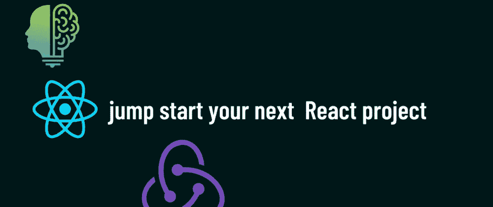

# 20 多个 React 库帮助您快速启动下一个项目

> 原文：<https://levelup.gitconnected.com/20-react-libraries-to-jumpstart-your-next-project-21e1982cdf12>

在 npm 的世界中，有大量的包可供选择，所以知道选择哪一个是非常困难的。在这篇文章中，我们将首先查看服务器端渲染、动画、状态管理和通用工具等类别的库，然后我们将查看这些类别下的包。

## 1.通用设施

此类别中的 npm 包只是对一些特定任务有帮助的包，您可能最终会需要它们。其中的产品包包括:

1.  moment . js——非常适合处理日期
2.  axios——适合处理异步任务
3.  React-hot-toast，React-toastify —处理小通知和敬酒
4.  react-icons，“@ mui”/icons-material-图标
5.  react-paginate —用于分页
6.  反应-分享——在社交上分享事物
7.  React-slick、react-response-Carousel—用于旋转木马
8.  clsx —用于条件类
9.  反应-交叉点-观察点-用于交叉点
10.  react-dropzone —用于文件上传和拖放

## 2.动画

在你的网站上引入动画只会让你的浏览者更加开心和愉快。也就是说，动画下的软件包包括:

1.  GSAP
2.  框架运动
3.  反作用弹簧
4.  Anime.js

## 3.状态管理

有时 React.js 应用程序中的数据可能很难有效管理，React 内容 API 不够好。也就是说，国家管理下的软件包包括:

1.  Redux
2.  Redux 工具包——我个人的最爱
3.  报应
4.  Mobx
5.  反应上下文—不建议用于大型项目

## 4.服务器端渲染

如果您正在构建一个高度优化的健壮网站，您将需要一个 SSR 框架，因为它们使路由更容易，它们在服务器上获取数据并返回到组件，它们优化图像以避免性能瓶颈，等等。也就是说，服务器端渲染下的包包括:

1.  Next.js
2.  Gatsby.js —仅适用于 SSG(静态站点生成)
3.  再搅拌

## 结论

如果你喜欢，请不要忘记留下关注和反馈，然后跟我来。