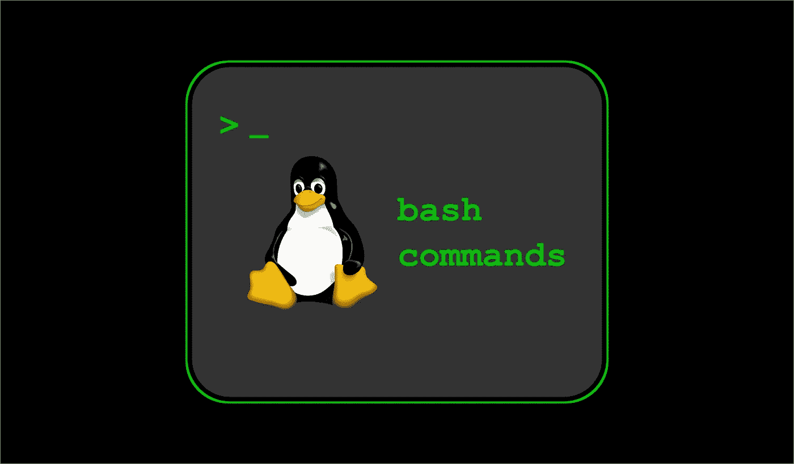
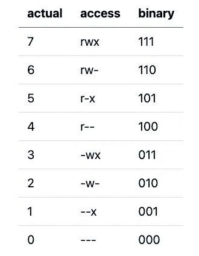

# 每个开发人员都应该知道的 20 个终端命令

> 原文：<https://levelup.gitconnected.com/20-terminal-commands-that-every-developer-should-know-f0d35e60f44d>

## 终端命令了解您更好的工作流程和效率



作者创造的形象

如果您是一名开发人员，那么您很有可能在运行基于 Linux 的操作系统的服务器上工作。您需要将使用命令作为日常工作的一部分。在这里，您将浏览不同终端命令的列表，这些命令对您的开发工作非常有帮助。

# 1.显示当前工作目录

**pwd** (当前工作目录)返回您在文件系统上的当前位置。

```
/Users/Shared/bash$ pwd
/Users/Shared/bash
```

# 2.限位开关（Limit Switch）

**ls** 让你列出当前目录的内容

```
/Users/Shared/bash$ ls
hello.txt sample
```

许多标志可以和 ls 一起使用，但是最常用的是`-l`，它给你一个更长更有信息的列表版本。

# 3.激光唱片

**cd** (更改目录)允许您从当前位置导航。

如果您知道当前位置目录的名称或路径，您可以导航到如下所示的位置。

```
/Users/Shared/bash$ cd sample
/Users/Shared/bash/sample$
```

如果你想向后导航，那么你可以使用`..`，你也可以使用多个双点返回多个级别，每个级别用一个`/`隔开。

```
/Users/Shared/bash/sample$ cd ..
/Users/Shared/bash$
```

您可以通过在路径的开头包含一个`/`从文件系统的根级别给出它的位置来直接转到一个目录，如下所示。

```
/Users/Shared/bash$ cd /Users
/Users$
```

# 4.chmod

**chmod** (更改模式和可访问性)允许您修改所提供文件和目录的权限。

有两种模式可以修改绝对和符号权限。

绝对模式由每个所有者、组和其他用户的八进制数字表示。下表将告诉您可以使用哪个实际数字来提供什么权限。



作者创造的形象

```
chmod 744 sample
```

您可以使用`ls -l`命令查看对`sample`目录的权限更改。最初是`drwxr-xr-x`现在改成了`drwxr-r—`。第一个占位符 d 代表一个目录，如果是一个文件，它将是`—`。
还有一个你可以使用的符号模式，你可以在这里阅读更多关于它的[。](https://docs.oracle.com/cd/E19683-01/816-4883/6mb2joat8/index.html)

# 5.mkdir

**mkdir** (创建目录)允许你创建目录，一次创建一个或多个目录，以及你想要分配给它们的权限。

```
/Users/Shared/bash$ mkdir sample2
/Users/Shared/bash$ ls
hello.txt sample  sample2
```

您还可以使用 mode `-m`标志为您创建的目录赋予不同的权限，如下所示。

```
/Users/Shared/bash$ mkdir -m 744 sample3
```

# 6.回声

**echo** 将提供的参数/字符串打印到标准输出。

```
/Users/Shared/bash$ echo hello $PS1
hello %d$
```

这里，hello 是一个普通的字符串，`PS1`是一个变量，您注意到需要在变量(系统或用户定义的)之前提供`$`来打印它们。

# 7.触控

**触摸**更改所提供文件的文件访问和修改时间。如果提供的文件不存在，那么它创建一个新文件，将当前时间作为访问和修改时间。大多数情况下，touch 命令用于创建新文件。

```
/Users/Shared/bash$ touch hello2.txt
/Users/Shared/bash$ ls
hello.txt hello2.txt sample
```

# 8.精力

vim 命令让你用 vim 编辑器打开指定的文件。

```
/Users/Shared/bash$ vim hello.txt hello there
~
~
~
~
~
~
~"hello.txt" 1L, 12C
```

vim 有不同的选项和命令，要熟练使用它们需要一点学习过程。

# 9.毫微；纤（10 的负九次方）

**nano** 命令让你用 nano 编辑器打开指定的文件，nano 编辑器是 Pico 编辑器的增强版本。

```
/Users/Shared/bash$ nano hello.txt **GNU nano 2.0.6                     File: hello.txt**hello there
 **[ Read 1 line ]****^G** Get Help     **^O** WriteOut     **^R** Read File    **^Y** Prev Page    **^K** Cut Text     **^C** Cur Pos**^X** Exit         **^J** Justify     ** ^W** Where Is     **^V** Next Page    **^U** UnCut Text   **^T** To Spell
```

nano 也有一些不同的选项，但相对来说更容易使用。

# 10.猫

**cat** 用于将文件内容连接并打印到标准输出。

```
/Users/Shared/bash$ cat hello.txt hello2.txt
hello there
how are you?
```

`cat`通常用于查看单个文件的内容。

```
/Users/Shared/bash$ cat hello2.txt
how are you?
```

# 11.可做文件内的字符串查找

**grep** 用于在指定文件中搜索模式，并返回所有匹配给定模式的行。您可以指定整个单词或使用占位符为您的搜索创建正则表达式。

```
/Users/Shared/bash$ grep ho hello2.txt
how are you?## strings ending with a '?' 
/Users/Shared/bash$ grep '?$' hello2.txt
how are you?## strings starting with a 'how'
/Users/Shared/bash$ grep '^how' hello2.txt
how are you?
```

# 12.差速器

**diff** 用于逐行比较给定的文件，并打印出每个文件中不同的行。

```
/Users/Shared/bash$ diff hello.txt hello2.txt
1c1,2
< hello there
---
> how are you?
>
```

# 13.头

**head** 按照给定的标志，从文件的开头打印出文件的内容。

```
## displaying for number of lines
/Users/Shared/bash$ head -n 1 hello2.txt
how are you? ## displaying for number of bytes
/Users/Shared/bash$ head -c 2 hello2.txt
ho**%**
```

# 14.尾巴

**tail** 按照给定的标志从文件的末尾打印出文件的内容。

```
## displaying for number of lines
/Users/Shared/bash$ tail -n 2 hello2.txt
how are you? ## displaying for number of bytes
/Users/Shared/bash$ tail -c 5 hello2.txt
ou?
```

# 15.空间

**rm** (删除目录条目)删除给定文件名/路径的文件。这也可以用来根据您提供的标志删除目录。

```
/Users/Shared/bash$ rm hello2.txt
/Users/Shared/bash$ ls
hello.txt sample ## removes directory sample with all the files/directories inside it
/Users/Shared/bash$ rm -r sample
/Users/Shared/bash$ ls
hello.txt
```

# 16.清楚的

**清除**命令清除当前终端窗口，并将提示带回到终端窗口的顶部位置。

# 17.重定向运算符(> & > >)

`**>**`用于将命令的输出重定向到另一个文件。这将覆盖文件的内容。

```
/Users/Shared/bash$ cat hello.txt > hello2.txt
/Users/Shared/bash$ cat hello2.txt
hello there /Users/Shared/bash$ echo sample > hello2.txt
/Users/Shared/bash$ cat hello2.txt
sample
```

`**>>**` 用于将一个命令的输出重定向到另一个文件。这将追加到文件的内容中。

```
/Users/Shared/bash$ cat hello.txt >> hello2.txt
/Users/Shared/bash$ cat hello2.txt
sample
hello there /Users/Shared/bash$ echo sample >> hello2.txt
/Users/Shared/bash$ cat hello2.txt
sample
hello there
sample
```

# 18.丙酸纤维素

cp 用于将文件从一个目录复制到另一个目录。

```
/Users/Shared/bash$ cp hello.txt sample/hello.txt
/Users/Shared/bash$ cd sample
/Users/Shared/bash/sample$ ls
hello.txt
```

如果您希望目标中的文件名与源文件名相同，那么您可以忽略在目标中给出文件名。

```
/Users/Shared/bash$ cp hello2.txt sample
/Users/Shared/bash$ cd sample
/Users/Shared/bash/sample$ ls
hello.txt hello2.txt
```

# 19.单细胞蛋白质

**scp** 与`cp`相同，但是用于在远程服务器之间复制文件。

```
## copy from your current location to remote directory
/Users/Shared/bash$ scp file.txt username@host:/remote/directory/ ## copy from remote directory to your current location
/Users/Shared/bash$ scp username@host:file.txt /local/directory/
```

# 20.平均变化

**mv** 用于将文件从一个目录移动到另一个目录。

```
/Users/Shared/bash$ mv hello.txt sample2/hello.txt
/Users/Shared/bash$ cd sample2
/Users/Shared/bash/sample2$ ls
hello.txt
```

如果你在同一个目录中移动文件，它将被重命名。

```
/Users/Shared/bash$ ls
hello2.txt sample  sample2
/Users/Shared/bash$ mv hello2.txt renamed.txt
/Users/Shared/bash$ ls
renamed.txt sample  sample2
```

## 结论

我希望这些命令对您有用。

如果你想知道更多的选项和标志用于任何命令，你可以使用`man <command>`，它会给你每个命令更多的细节。

感谢阅读，祝学习愉快！

如果你喜欢阅读这样的故事，并想支持我成为一名作家，可以考虑[注册成为一名媒体会员](https://nehalk.medium.com/membership)。一个月 5 美元，你可以无限制地阅读 Medium 上的所有故事。如果你用我的链接注册，我会赚一点佣金。

[](https://nehalk.medium.com/membership) [## 通过我的推荐链接加入 Medium-Nehal Khan

### 作为一个媒体会员，你的会员费的一部分会给你阅读的作家，你可以完全接触到每一个故事…

nehalk.medium.com](https://nehalk.medium.com/membership)