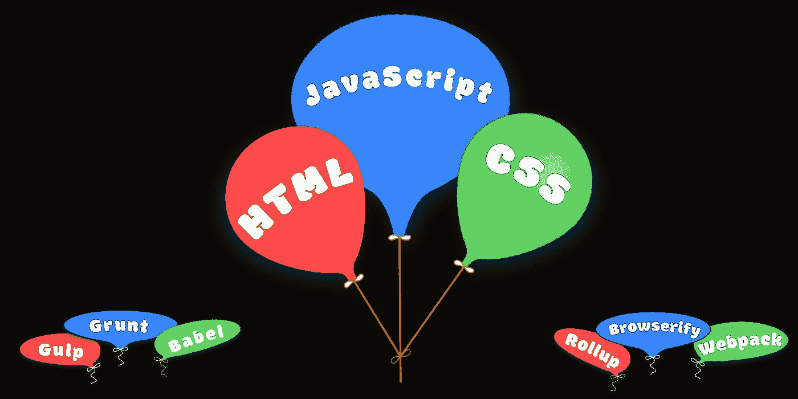
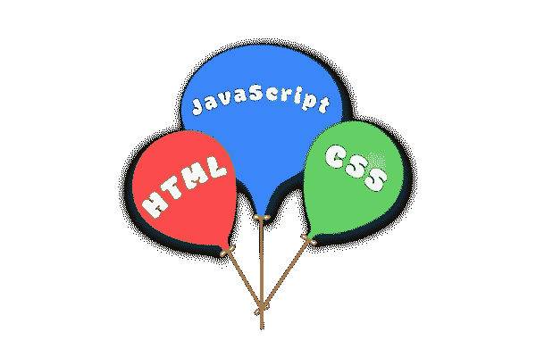

# 让 Web 开发再次充满乐趣

> 原文：<https://levelup.gitconnected.com/2020-018-make-web-development-fun-again-5d226b77482d>

## 我们如何积累了如此多的垃圾，以及我们如何简化我们的工作流程以获得更干净、更高效的结果

如果你是一名前端 web 开发人员，你可能在过去的一年中不止一次地更新了工具。HTML、CSS 和 JavaScript 的新进展意味着改进旧的做事方式的新机会。这很好。我们欢迎这些变化。

但是这些变化要求我们重新思考如何开展工作。我们通过反复试验，艰难地学到的教训，必须从头再来。

同时，开源项目和工具供应商不断发布他们软件的新版本。整个生态系统疯狂地工作，以跟上底层技术的进步。因此，对于我们这些从事代码工作的人来说，保持与前端堆栈及其工作流工具的同步不仅仅是一项兼职工作。

但是等等。还记得没这么复杂的时候吗？当时没有预处理器、传输器和打包器将我们新奇的代码转换成最小公分母的输出。当我们不需要任务运行器和流水线工作流来保持理智的时候。当我们不需要为了使用调试器而生成源地图，而不需要破坏代码的时候。当我们使用的框架没有以多语言的方式将所有东西混合在一起时。回到事情还很简单的时候。

还记得那时候多有趣吗？

最近，我对网络开发很感兴趣。那是因为我学会了简化我的工作流程。

这都是关于切断 cruft。现在我花更少的时间在开销上，更多的时间在创意上。请允许我分享一下我是如何走到这一步的。

# 黄金时代

我们都知道在短时间内发生了很多事情。因此，我们如何走到今天这一步的历史在我们的集体记忆中记忆犹新。尽管如此，这仍然是我关于简化和去除赘肉的核心论点。所以回顾一下会有助于讲述这个故事。

这一切都始于 HTML——没有 CSS，没有 JavaScript——只是一个简短的标签列表，用于结构化布局、强调单词和文档之间的超链接。

然后，CSS 和 JavaScript 相继出现。他们为我们提供了解决问题不同部分的方法。*分离顾虑*成了我们的宣言:

*   语义和内容的 HTML
*   布局和装饰的 CSS
*   用于动态交互的 JavaScript

但这不是一个完美的世界。我们不得不努力解决浏览器不兼容的问题。有一段时间，我们忽略了这些差异，只是在每一页的底部贴上“用 Internet Explorer 浏览效果最佳”,让访问者自己去解决。

如今，这三项技术构成了我们所做一切的基础，每个前端开发人员都必须掌握它们。但是我们了解到，有时供应商在规范遵循方面落后了，需要一点帮助。

# 图书馆时代

当我们开始认真使用 JavaScript 时，事情开始变得混乱。浏览器不兼容给我们带来了无尽的麻烦。在自学如何进行 AJAX 调用时，我们在异步和同步的学习曲线中跌跌撞撞。我们不得不在一无所有的情况下完成这一切。然后我们发现了 JQuery，再也没有回头。

当 JQuery 到来时，它把我们从浏览器不兼容的战争中拯救了出来。它给了我们一个统一的界面，掩盖了主要的浏览器差异。第一次，我们可以部署我们的代码，并合理地期望访问者会喜欢我们为他们设计的体验。

今天，我们一想到使用 JQuery 就不寒而栗，但在那个时候，它是必要的。值得注意的是，JQuery 的崛起并不是必然的。只有在与 MooTools、Dojo 和 YUI 等开源库激烈竞争后，它才能进入名人堂。

这三个库每个都打包了通用助手功能和用户界面设计决策的混合物——在一个一体化库中包含了您需要的一切。相比之下，JQuery 保持专注。

JQuery 以一个引人注目的特性开始:扩展由`document.getElementById()`提供的非常有限的能力。然后，它将其利用到一组包装器函数中，消除浏览器 DOM 的不一致性。最重要的是，它使得`XMLHttpRequest`易于使用，让无数开发者接触到异步编程的新世界。

突然，简单的`onclick`回调不再足够好。交互性成了热门的新事物。用户蜂拥至提供动态内容的网站。因此，新生的`<noscript>`运动未能获得牵引力，标语*不引人注目的 JavaScript* 和*优雅的退化*很快就失宠了。使用 HTML 的 DOM 不再是可选的。它成了我们工作中越来越重要的一部分。

JQuery 现在被认为是传统的，原因很简单:它最初的“引人注目的特性”已经以 T5 的形式直接集成到 DOM 中。此外，它的第二个最受欢迎的特性`$.ajax()`函数已经被基于标准的 Fetch API 完全取代。在 JQuery 中可以完成的任何事情，现在都可以用相同数量的普通 JavaScript 来完成。

今天我们不再需要 JQuery，任何新项目都不应该考虑使用它。尽管如此，从这次经历中，我们学会了接受第三方库作为我们工作的必要部分。

# 预处理器时代

在 HTML 和 DOM 成熟的同时，我们的客户对复杂样式的需求也在增长。有一段时间，我们满足这种欲望所需要的只是一种互动的感觉。Adobe Flash 帮助我们满足了这一需求，为我们提供了一种在客户主页上添加亮点的方法。

但是很快 CSS 标准化了两个最好的 Flash 特性:过渡和动画。然后，随着 HTML5 中新的`<canvas>`、`<audio>`和`<video>`标签的出现，专有 Flash 功能集的其余部分似乎是多余的，其不安全的核心迫使其消亡。

当我们玩渐变背景、圆角和阴影时，CSS 成了我们最好的朋友。我们开始写越来越多的 CSS——为了布局，为了装饰，为了排版——直到它失去控制，我们需要帮助。

随着时间的推移，我们发现在 CSS 中需要变量声明。例如，我们需要一种方法来在一个地方调整主题的颜色和尺寸，并将这些调整反映到所有的样式表中。所以我们开始使用 Less 和 Sass 这样的预处理器来实现这一点。

随着样式表变得越来越复杂，我们学会了将规则组织到自包含文件中，以隔离上下文并减少命名冲突。我们开始依赖预处理器`@import`语句将它们集合在一起。当我们这样做时，我们学会了接受预处理程序作为我们工作的必要部分。

这个看似无害的预处理步骤让我们走上了这条路。我们再也不能简单地将浏览器指向一个 URL，然后点击刷新按钮。现在，我们第一次不得不*建立*我们的网站。

但是 W3C 标准已经发展，现在已经超越了 Less 和 Sass 提供的大部分内容:

*   CSS 允许我们声明和使用变量，比如`--width:40rem`。
*   CSS 允许我们计算维度，比如`calc(var(--width)+2rem)`。
*   CSS 允许我们用`:host`和`::slotted`选择器隔离上下文并防止组件内的命名冲突。
*   CSS 允许我们用`@import`组织规则。

所有这些都不需要预处理程序。一切都基于标准，经得起未来考验。

今天，新项目应该仔细评估 Less 和 Sass 是否值得麻烦。将它们从我们的工具链中去除，允许我们以最纯粹的形式声明我们需要的确切的规则集——而不需要任何额外的工具。

# 标准时代

在这一切当中，我们开始以不同的方式看待网站。网站不再是提供信息的静态网页集合，而是变成了基于云的应用程序，可以访问用户特定的数据。

在此期间，苹果、Mozilla 和 Opera 认为在竞争泡沫中继续创新是徒劳的。相反，他们开始在新的网络超文本应用技术工作组(WHATWG)下合作开发标准。不久之后，微软和谷歌也加入了这项共同努力。他们一起工作产生了 HTML5 规范。

到目前为止，标准的发展进展缓慢。CSS2 花了很长时间才问世，并且只为该技术提供了适度的进步。HTML4 花了更长的时间，带来了严格、过渡和框架集变体的大杂烩。

浏览器制造商明智地知道，任何解决他们分歧的成功努力都必须与他们的集体创新保持同步。拖延同意前进的道路将会破坏一切。

WHATWG 以一种全新的方式拥抱创新和标准。他们把他们的工作称为生活标准。这意味着不再是一个涵盖所有内容的单一规范，而是涵盖特定领域的独立文档。所以我们随便提到的 HTML5 标准，实际上是标准的集合。 *HTML5 & Friends* 包含了 HTML 的核心以及调试、DOM、fetch、流、存储、web sockets、web workers 等等。

生活标准方法是成功的。以至于它后来被万维网联盟(W3C)及其 CSS 标准工作所采用。这导致了大量的 CSS3“模块”,包括:颜色、字体、选择器、背景和边框、多栏布局、媒体查询、分页媒体等。每个人都设定了自己的标准流程进度。

最后，ECMA International 在 ECMA-262(JavaScript 背后的标准)的工作中采用了同样的方法。其雄心勃勃的语言升级计划被用“和谐”的方法重新制定。这意味着随着时间的推移，新的功能会不断增加。因此，自 2015 年以来，我们每年都享受到源源不断的新语言能力。

在所有这些过程中，新方法没有落后于创新，仅仅记录已经存在的东西，而是将标准制定过程本身确立为创新的先锋。这消除了我们以前不得不忍受的许多混乱，并给了我们一条有序的前进道路。

所有这些重要的标准工作都发生在公众的视野之内。结果，我们前往的*方向*众所周知。

此时，每个月都会发布 HTML、CSS 和 JavaScript 的新特性。它刺激了我们食欲。我们喜欢我们所听到的，我们希望它尽快。事实上，我们希望它比浏览器制造商实现它的速度更快。这就是事情开始变得复杂的地方。

为了走在曲线的前面，我们开始在代码库中使用特征检测和聚合填充。使用这种技术，我们可以确定哪些特性是浏览器支持的，哪些需要通过提供一个虚假的解决方案来模仿。这就是所谓的*渐进增强*理念:调整复杂程度以匹配浏览器的限制。但是这种方法只适用于有限的几件事情。

相反，现实世界的项目开始使用 transpilers，Babel 成了我们新的最好的朋友。它允许我们使用 nextgen 语法的便利来编写我们的应用程序，而不用担心浏览器版本。所以我们在构建过程中添加了 transpilers。

现在，经过这么多年的动荡，JavaScript 新特性的全盛时期终于要结束了。我们所见证的新“必备”功能的稳步发展正接近尾声。我们现在有了一个现代的多范例语言，包括模块、类、迭代器、生成器、箭头函数、二进制数据、映射和集合、承诺、模板文字、析构、异步/等待、rest/spread 等等。

对我们许多人来说，最大的生产率提高是超越了深度嵌套的闭包。有了原生承诺和 async/await 语法，JavaScript 现在完全支持异步编程。它的程序式流程看起来很简单。

如今，对 transpilers 的需求已经基本消失。我们需要编写干净代码的每一个语言特性都是本地可用的。我们可以使用多种范例进行编写:函数式编程、面向对象编程和命令式编程都是可能的，而无需求助于编译器。

(在继续之前，关于 transpilers 还有最后一点需要注意。当我们首选的语言是 TypeScript 时，我们仍然可以从我们的管道中删除 Babel，但是我们需要保留`tsc`以便将我们的源代码转换成浏览器兼容的 JavaScript。)

# 模块时代

所有这一切的最后一个坚持是模块。随着我们的静态网站成长为基于云的应用程序，我们创建的大量功能给我们带来了麻烦。简单地说，我们有一个范围问题。给事物命名使它们不冲突变得越来越困难。

众所周知，解决方案以`require`和`module.exports`的形式出现。以 RequireJS 和 Browserify 为首的几个开源解决方案是可用的，但不幸的是它们并不兼容。因此，库开发人员必须选择为他们的代码库使用哪种语法(AMD 或 CommonJS)，应用程序开发人员必须遵循他们的领导，或者使用 UMD(通用模块定义)来解决差异。

当 ECMA 技术委员会(TC39)介入时，这种令人遗憾的状况似乎终于有所好转。TC39 详细研究了这个问题，并为 JavaScript 语言提出了新的关键字。他们的模块加载器将使用新定义的`import`和`export`语法，这最终被称为 ESNext。

事实证明，加载模块并不容易。正确管理依赖关系、处理循环依赖关系以及处理异步加载都是不小的问题。让它在 Node.js 中工作是一回事，但让它在浏览器中工作要困难得多。

前端开发者不能等待浏览器制造商解决所有这些问题。我们急需模块。幸运的是，有一个现成的解决方案——让开发人员使用新的 ESNext 语法编写代码，并使用 Babel 将其转换回 CommonJS 语法。这种方法效果很好。

然而今天，这已经没有必要了。对 ESNext 标准的浏览器支持现已普遍可用。对于许多项目来说，不需要 transpilers。

# 邦德勒时代

对于许多前端项目来说，我们为自己构建的工具链已经变得越来越复杂。所以为了简化我们的工作流程，我们使用了*任务运行器*如 Gulp 和 Grunt，以及*捆绑器*如 Browserify、Rollup 和 Webpack。正确配置后，它们会监控我们文件的变化，并触发必要的转换过程:

*   Sass 及以下预处理成 CSS。
*   现代 JavaScript 语法向下转换到了 ES5。
*   ESNext 模块被重新打包为 CommonJS 模块。
*   运行 Linters 是为了检查我们代码中的常见错误。
*   注释和空白用缩小器删除。
*   生成调试源映射是为了将损坏的代码链接到源代码。
*   所有东西都被连接成一个包，以实现高效的 HTTP/1.1 传输。
*   捆绑包被分成粒度捆绑包，以实现最佳网络缓存。

这种方法已经成为我们工作流程中不可或缺的一部分，以至于我们大多数人都无法想象不这样做。但是请仔细检查这个列表，并将其与我们已经了解的内容进行比较。

*   当我们使用最新的 CSS 特性时，可以去掉预处理程序。
*   浏览器支持现代 JavaScript，无需传输文件。
*   ESNext 模块可以本机使用，无需模块加载器。
*   标准的 HTTP 缓存使得捆绑包分割变得没有必要。 *****
*   通过 HTTP/2 持久连接传输文件比捆绑器更快。 *****

*(不幸的是，当我们的服务器使用 HTTP/1.1 时，捆绑包仍然比多个小文件快。因此，为了获得最大的好处，切换到具有持久连接和缓存的新服务器，如[读写工具 HTTP/2 服务器](https://rwserve.readwritetools.com/?utm_term=MakeWebDevelopmentFunAgain)，对于非捆绑场景的执行是非常重要的。)

我们最初的清单上只剩下棉绒和迷你棉绒。由于我们不需要在每次测试小的变化时调用它们，我们可以将它们的使用委托给我们的最终部署脚本。当这种快乐的情况出现时，我们可以摆脱我们一直使用的捆绑器。

瞧啊。我们已经将整个工作流程简化到只有一个编辑器和一个浏览器。进行更改，按下刷新按钮，这就是您的新代码。这下有趣了。

# 框架时代

这种前端编码的新方法实际上是回归我们的根本——HTML、CSS、Javascript 和*关注点分离*哲学。但是它经得起真实网站的考验吗？

目前，答案取决于您项目的架构。

当前对框架的迷恋使得这种新方法对于许多项目来说遥不可及。基于云的应用程序开发的最新趋势受到了一些知名框架的严重影响。Angular、React、Vue 和 Svelte 等软件包已经成为许多新前端项目事实上的起点。

React 框架使用*虚拟 DOM* 试图使编程成为一种声明性的练习。事件处理、属性操作和 DOM 交互不由开发人员直接处理，而是由后台转换例程处理。为了以声明方式使用 React，大多数开发人员使用 JSX 语言编写语句，这是 JavaScript 和 XML 的混合体。由于浏览器对 JSX 一无所知，所以必须使用 Babel 将它转换成 JavaScript。

另一方面，Angular 框架不像 JSX 那样使用任何东西，但是它*使用模板文字。这些模板是使用 HTML 加上特定于库的属性和嵌入式花括号表达式编写的。在发送到浏览器之前，角度模板需要用`ng build` CLI 编译成*增量 DOM* 语句。*

Vue 框架也使用模板文字来编写内嵌花括号表达式的 HTML。同样，这些需要被编译成可供浏览器使用的东西。大多数项目要么使用`vue-template-compiler`要么使用它的 Webpack 包装器`vue-loader`。

并且 Svelte 框架使用的模板文字看起来与 Vue 模板非常相似。它还将编译步骤从运行时转移到构建时。大多数项目要么使用`svelte.compile`要么使用其 Webpack 包装器`svelte-loader`。

因此，使用 React、Angular、Vue 或 Svelte 的项目将无法将他们的工作流程一直简化到上面概述的极简主义视图。

# 组件时代

另一方面，WHATWG *引发的组件革命*可以充分利用以上所涵盖的一切。当我们使用基于 W3C 标准的方法开发组件时，我们获得了前面列举的所有好处。

对于那些对这种新的 web 开发方法感兴趣的人来说，需要学习的关键技术是:

*   自定义元素
*   阴影 DOM
*   HTML 模板

所有这些都有标准支持。此外，好消息是，使用这些标准的组件可以被其他人编写、测试和使用，而不会有任何我们努力消除的额外缺陷。简单，干净，有趣！

为了证明这种方法有效，看看[蓝色小提琴](https://fiddle.blue/?utm_term=MakeWebDevelopmentFunAgain)网站是如何处理这一切的。这是一个访问后端服务器 API 的专业应用程序，只用 IDE、 [BLUEPHRASE](https://bluephrase.com/?utm_term=MakeWebDevelopmentFunAgain) 模板语言和 Chrome DevTools 创建。

当你在那里的时候，一定要仔细检查——你会看到清晰的代码，读起来简单，写起来有趣。

