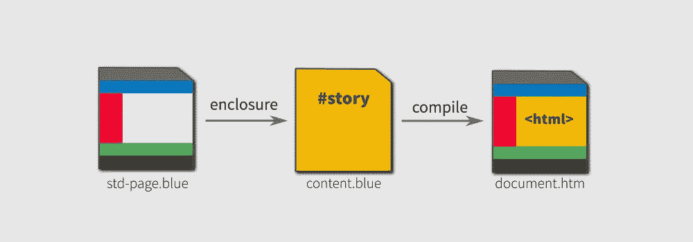
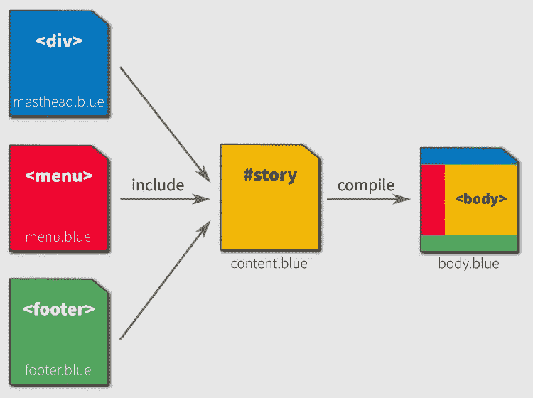
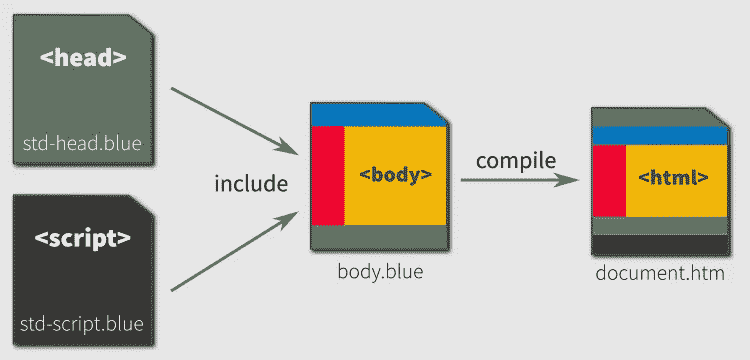
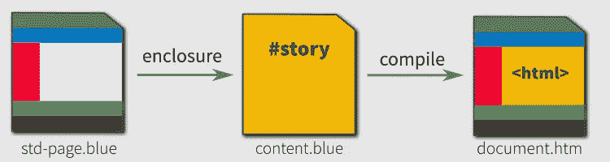
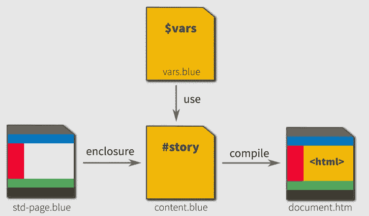

# 蓝色短语模板

> 原文：<https://levelup.gitconnected.com/2020-031-bluephrase-templating-13f65c561edb>

## 使用附件创建网页模板



使用模板创建 web 文档是一种久经考验的策略。模板为作者提供了将一组文档整合成一个有凝聚力的网站所需的一致性和可变性。 [**蓝色**短语](https://bluephrase.com/index.blue?utm_term=BluephraseTemplating)语言具有非常适合这项工作的声明性模板特性。

我们认为**蓝色的**短语是*声明性的*，因为它没有函数或过程语法。但是这种语言不是静态的:它有变量，可以用来将通用模板转换成特定的文档。

让我们研究三种语言语句，它们允许我们将文本内容转换成服务器就绪的 HTML。

*   `!include`pragma——用于将二级文件的内容注入到正在编译的文档中。
*   `!enclosure`pragma——用模板文件的外部内容包装已编译文档的内容。
*   `!use`pragma——它解析外部文件的内容，但不是注入其内容，而是将所有声明的变量保存在内存中供编译后的文档使用。

这三个编译指令的源文件和二级文件遵循**蓝色**短语语法规则。编译后，结果是一个准备好通过 HTTP 提供的 HTML 文件。这种语言编译有时被称为*服务器端渲染*。

## 一个经典的网页支付

任何熟悉 WordPress 及其山寨版的人都会认出熟悉的`include`机制。它获取被引用文件的内部文本，并在此时将其插入到调用文档中。

考虑一个经典的夫妻店网站，只有几个静态页面。它的标准页面布局可能由报头、菜单和页脚组成。这些将包含在页面的主要内容中，形成完整的文档主体。



为了简单起见，我们可以让我们想象这三个包含的文件的内部文本可能是什么。重要的一课是`include`语法看起来像什么，以及如何在文档体中使用它。

我们来看一下`content.blue`文件，它包含作者的故事，用刊头、菜单和页脚包装。它可以用蓝色短语符号写成，如下所示:

```
body {
    div {
        **!include** `masthead.blue`
    }
    menu {
        **!include** `menu.blue`
    }
    div #story {
        h1 Our Story
        p Tangled Web Services is a professional design firm for ...
    }
    footer {
        **!include** `footer.blue`
    }
}
```

## 一个完整的网页

现在，我们的夫妻店页面的编译输出还不能通过 HTTP 发送到浏览器。它缺少了所有重要的文档标签`<title>, <meta>`和`<link>`的规范`<head>`。

此外，许多开发人员会选择将任何需要执行的动态脚本放在文档的底部。因此，在第一个示例的基础上，一个更完整的 web 页面将遵循以下示意图:



通过在文档的`<body>`上方和下方添加这些内容，页面就可以供浏览器使用了。为了便于说明，`std-head.blue`文件的基本示例可能如下所示:

```
head {
    title $TITLE
    meta *charset=UTF-8
    meta *name=description         *content='$DESCRIPTION'
    meta *name=keywords            *content='$KEYWORDS'
    script `/js/our-story.js`      *type=text/javascript
    link   `/css/our-story.css`    *type=text/css *rel=stylesheet 
    link   `/fonts/our-sans.woff2` *as=font *crossorigin
}
```

## 圈地方法

对于初学者来说，使用`include` pragmas 是解决问题的简单方法。但是对于不只有几个页面的网站来说，这种方法很快就变得站不住脚了，因为每个页面都需要复制相同的结构模式。除了重复之外，它还阻止了开发人员使用不同的标题、菜单和页脚安排来寻求未来的结构化解决方案。

这就是外壳的用武之地。想法是将`include`机械装置翻转过来。实际上，作者的内容是由模板文档的*括起来的*。



语义上，我们认为外壳是*触发的*而不是包含的。规则很简单:

1.  模板文件包含自由格式文本，使用**蓝色**短语符号。
2.  在模板文件中的某个地方，它的创建者为被封装的文档指定插入点。这是通过在所需点放置一个`!target-matter`杂注来完成的。
3.  包含作者故事的文档使用`!enclosure` pragma 指定模板的文件名。
4.  作者选择一个选择器作为触发机制。选择器可以是元素 id、CSS 类名或 HTML 元素标记名。

从概念上讲，上面的示意图看起来类似于我们的工作示例，但是在代码方面，差别是显著的。这份文件简化为:

```
**!enclosure** #story `std-page.blue`div #story {
    h1 Our Story
    p Tangled Web Services is a professional design firm for ...
}
```

其他所有内容都被转移到`std-page.blue`文件中，该文件成为所有网站文档的模板。对布局的未来更改现已集中。

```
html {    
    !include `std-head.blue`
    body {
        !include `masthead.blue`
        !include `menu.blue` **!target-matter**

        !include `footer.blue`
        !include `std-script.blue`
    }
}
```

## 使用变量

细心的读者会注意到,`std-page.blue`文件有三个变量:标题、描述和关键字。这些是模板创建者任意选择的名称。这样做的目的是，作者将为他们创建的每个页面声明值，以便编译器在模板被触发时可以使用它们。

对于工作示例，我们将这些声明放在靠近`content.blue`文件的开头:

```
$TITLE="Our Story"    
$DESCRIPTION="Tangled Web Services, a professional design firm ..."    
$KEYWORDS="web services, professional design"
```

以这种方式在文档中声明变量，对于许多类型的网站来说是可以接受的。另一种方法是为每个文档创建一个单独的仅包含变量的文件。这种方法在构建目录、标签列表或逐月博客文章等页面时非常有用。



当一个文件只包含变量声明时，可以调用`use`杂注而不是`include`杂注。这将指示编译器不要将任何文本注入到文档中，而是将遇到的任何变量声明保留在内存中，供文档随后使用。`content.blue`的作者会将此语句添加到文档中:

```
**!use** `vars.blue`
```

## 回顾

*   蓝色的短语语言非常适合使用模板和变量创建网页。
*   三个 pragmas 为模板提供了基础:`include, enclosure`和`use`。
*   变量提供了将任何**蓝色**短语文件转换成模板的方法。

我已经把这些和其他的模板例子放在了蓝色的网站上，你可以在网上的沙盒中进行实验。