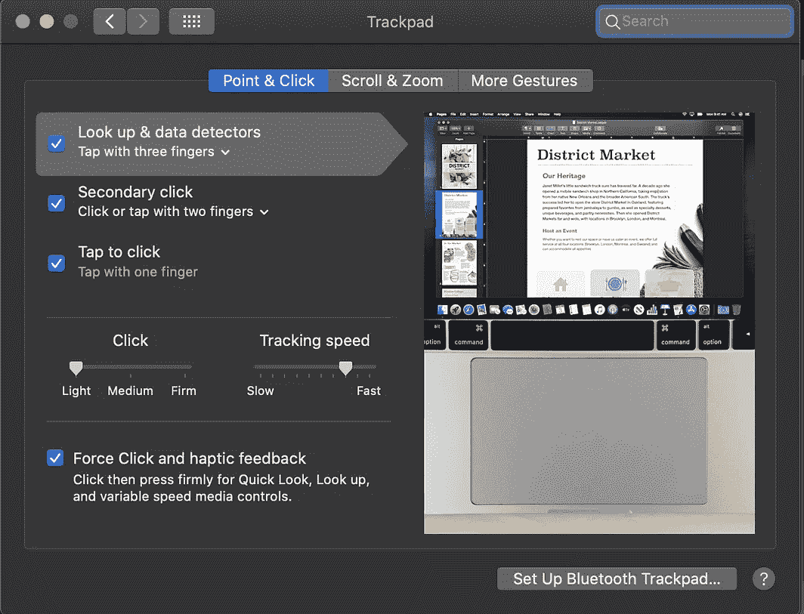
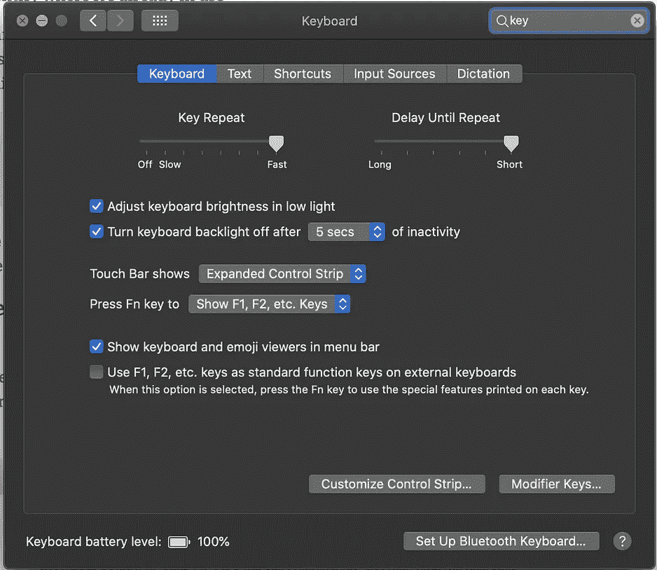
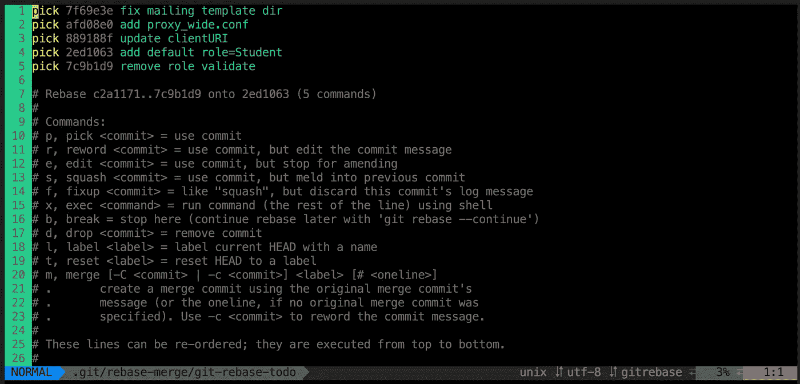

# 让您的生活更轻松的 2020 Mac 设置

> 原文：<https://levelup.gitconnected.com/2020-mac-setup-that-makes-your-life-easier-f94d176f388>

## Vim/Zsh/Tmux，macOS 应用程序，用于高效开发的扩展

## 设置您的 Mac 并将您的编程体验提高到另一个水平的指南


来源于[鞠波·史密斯](https://unsplash.com/@jessysmith)

# 灵感

每当我买了一台新的笔记本电脑，通常要花两个小时来重新设置，我开始感到疲惫和烦恼。

每次我重新安装我的 Mac 电脑时，我都会学到一些新的很酷的东西，这些东西可以更好地改善我的编程体验。

所以，我收集了一些设置和应用程序，来和你分享我个人关于设置新 Mac 来进行软件开发的指导。

# 1.系统偏好设置



*   系统首选项>**触控板/键盘** >设置如上图
*   iCloud >登录您的帐户
*   Filevault:打开
*   停用询问 Siri
*   定位服务:开启(有限)
*   检查软件更新
*   “信息”应用程序>添加您的号码+电子邮件
*   App Store >安装以前安装的应用程序

# 2.末端的

## [阿尔弗雷德](https://www.alfredapp.com/)

它是 Spotlight 的替代品，因为它在搜索任何文件时都要快得多:`brew cask install alfred`

## [**酿**](https://brew.sh/)

安装 Xcode: `$ xcode-select --install`

安装自制软件:`$ /bin/bash -e "$(curl -fsSL https://raw.githubusercontent.com/Homebrew/install/master/install)"`

`brew cask install`安装应用程序

## [iTerm2](https://www.iterm2.com/)

终端的替代品

克洛维斯写了一篇关于如何更深入地设置

一个[比较](https://www.slant.co/versus/1713/1715/~iterm2_vs_terminal-app) : iTerm2 与端子

安装:`brew cask install iterm2`

## [**ZSH/Tmux/Vim**](https://github.com/skwp/dotfiles)



我用这个[牛逼的家伙的回购](https://github.com/skwp/dotfiles)作为模板

按照他的自述文件中的说明操作后，请执行以下步骤以确保您的 Vim 有一个好的外观:

```
$ cd ~
$ sh -c "`curl -fsSL https://raw.githubusercontent.com/skwp/dotfiles/master/install.sh`"# Setup vim for pretty look. Create 2 files and insert each line below to each individual file$ vim ~/.vimrc.before
let g:yadr_using_unsolarized_terminal = 1 $ vim ~/.vimrc.after
let g:yadr_disable_solarized_enhancements = 1
colorscheme base16-twilight
```

# 3.饭桶

Git 已经成为每个开发者都应该知道如何使用它的主要工具之一。新款 Mac 通常预装了 Git。

**安装 git:** `brew install git`

**配置 git:**

```
$ git config --global user.name "Your Name"
$ git config --global user.email "you@your-domain.com"
```

您将每天不断地使用 git，SSH 将允许您拉和推 Git，而无需每次都重新输入电子邮件和密码。

*   Git 已经有一篇文章介绍了如何[将 SSH 添加到 Mac 上](https://docs.github.com/en/github/authenticating-to-github/generating-a-new-ssh-key-and-adding-it-to-the-ssh-agent)

# 4.使用命令行安装 Mac 应用程序

如果你喜欢命令行，并且不想在 Chrome 上一个一个地安装应用程序。那你应该试试`**mas**`

安装 mas 进行快速设置:`$ brew install mas`

搜索你的 app: `$ mas search XCode`。您会发现每个应用的应用 ID

将应用 ID 复制到一个命令行:`$ mas install <app_id1> <app_id1> <app_id3>`

> **注意:**如果下面这些应用没有应用 ID，那么你必须从浏览器安装。(包括链接)

## 工作

1.  XCode: 497799835
2.  [解压器:](https://theunarchiver.com/) 425424353
3.  微软 Word: 462054704
4.  Excel: 462058435
5.  幻灯片:462062816
6.  [虚拟代码](https://code.visualstudio.com/)
7.  [邮递员](https://www.postman.com/)
8.  [码头工人](https://www.docker.com/)

## 沟通

1.  [懈怠:](https://slack.com/) 803453959
2.  观念:974929595
3.  [缩放:](https://zoom.us/) 884018914

## 娱乐

1.  信使 : 1480068668
2.  [微信](https://www.wechat.com/en/) : 836500024
3.  [行:](https://line.me/en/) 539883307
4.  [铬合金](https://www.google.com/chrome/?brand=CHBD&gclid=Cj0KCQjwo6D4BRDgARIsAA6uN1_SszdlH-F-7Lu13jLzZIj8BAfWsSBL5M0zhXeS677r88nwsF0uHrwaAt5GEALw_wcB&gclsrc=aw.ds)
5.  [振动仪](https://www.viber.com/en/)
6.  [Spotify](https://www.spotify.com/us/download/other/)
7.  [打开 Spotify:](https://open.spotify.com/) 这个网站让你听 Spotify 音乐，而**没有广告**

# 5.铬延伸

你不想安装很多 Chrome 扩展，除非你想让它*“吃掉】你的大量内存，或者除非你有一台功能强大的电脑。*

***以下是我日常使用的前 6 个:***

1.  *[广告拦截加](https://adblockplus.org/):拦截所有广告*
2.  *[语法](https://www.grammarly.com/):用来在我写散文、博客等的时候检查我的语法。*
3.  *亲爱的:给我找最划算的东西*
4.  *乐天:当我在网上购物时给我返现*
5.  *[Redux 开发工具](https://chrome.google.com/webstore/detail/redux-devtools/lmhkpmbekcpmknklioeibfkpmmfibljd?hl=en):与 React 一起调试*
6.  *[JSON 查看](https://chrome.google.com/webstore/detail/jsonview/chklaanhfefbnpoihckbnefhakgolnmc?hl=en):在网络浏览器上查看 JSON 更漂亮*

# *6。虚拟代码扩展*

1.  *[更漂亮](https://prettier.io/)*
2.  *[自动关闭标签](https://marketplace.visualstudio.com/items?itemName=formulahendry.auto-close-tag)*
3.  *[自动重命名标签](https://marketplace.visualstudio.com/items?itemName=formulahendry.auto-rename-tag)*
4.  *[括号对颜色](https://marketplace.visualstudio.com/items?itemName=CoenraadS.bracket-pair-colorizer)*
5.  *[Chrome 调试器](https://marketplace.visualstudio.com/items?itemName=msjsdiag.debugger-for-chrome)*
6.  *[诚信通](https://marketplace.visualstudio.com/items?itemName=dbaeumer.vscode-eslint)*
7.  *[Gittens](https://marketplace.visualstudio.com/items?itemName=eamodio.gitlens)*
8.  *[走](https://code.visualstudio.com/docs/languages/go)*
9.  *[HTML 片段](https://marketplace.visualstudio.com/items?itemName=abusaidm.html-snippets)*
10.  *[Javascript (ES6)代码片段](https://marketplace.visualstudio.com/items?itemName=xabikos.JavaScriptSnippets)*
11.  *[巨蟒](https://code.visualstudio.com/docs/languages/python)*
12.  *[待办事项高亮显示](https://marketplace.visualstudio.com/items?itemName=wayou.vscode-todo-highlight)*
13.  *[Turbo Console.log](https://marketplace.visualstudio.com/items?itemName=ChakrounAnas.turbo-console-log)*
14.  *[dotENV](https://marketplace.visualstudio.com/items?itemName=mikestead.dotenv)*
15.  *[npm 智能感知](https://marketplace.visualstudio.com/items?itemName=christian-kohler.npm-intellisense)*
16.  *[路径智能感知](https://marketplace.visualstudio.com/items?itemName=christian-kohler.path-intellisense)*
17.  *[直播服务器](https://marketplace.visualstudio.com/items?itemName=ritwickdey.LiveServer)*
18.  *[颜色高亮](https://marketplace.visualstudio.com/items?itemName=naumovs.color-highlight)*