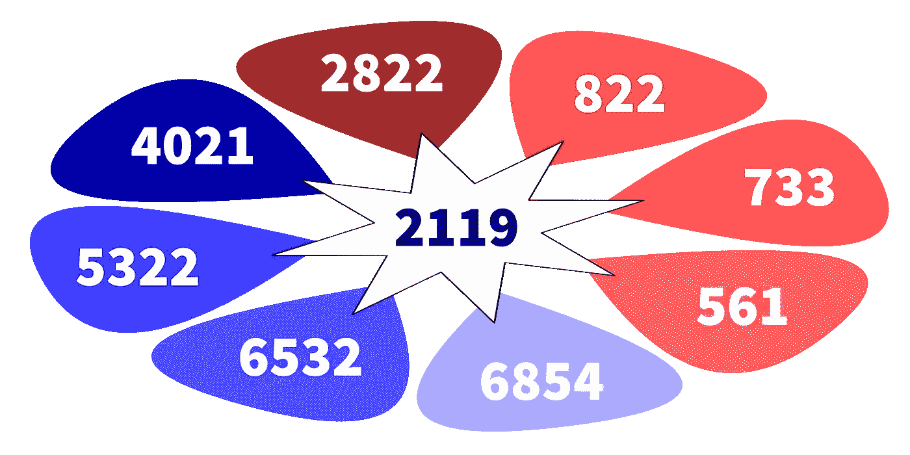

# 一份简单的 500 字备忘录如何改变了我们谈论互联网的方式

> 原文：<https://levelup.gitconnected.com/2021-043-how-a-simple-500-word-memo-changed-the-way-we-talk-about-the-internet-c625cbadff86>

## 互联网标准中不太可能的三人组必须、应该和可能

1997 年 3 月，Scott Bradner 写了一份简短的备忘录，题为“RFC 中表示需求级别的关键词”。它通常简称为 RFC 2119。整个文件可以很舒服地放在两页纸上。

这份备忘录后来成为互联网工程任务组(IETF)最常引用的文件。

# IETF 标准流程

每天，构建和维护构成互联网的计算机的软件工程师都会参考技术标准来解决出现的问题，并设计创新的软件来迎接新的挑战。这些标准中有许多是由 IETF 发布的，发布在被称为“征求意见稿”的文档中，或者用极客的行话来说是 RFC。

当计算机科学家或工程师遇到一个需要解决的问题，并提出一个解决方案时，这些文档就成形了，用所有有利于睡前阅读的华丽词藻写下来。草稿由编辑审阅，编辑帮助作者在合适的历史背景下构思问题。然后手稿被众包，任何人都可以建议修改，或挑剔细节，或提出完全不同的解决方案。

所有这一切都是完全透明的。一切自愿；不涉及任何经济激励。只是好人，站在巨人的肩膀上，向前付出而已。通过这种方式，IETF 和 RFC 过程的文化为互联网注入了合作的美好。这是开放治理最成功的故事之一。没有人管，任何人都可以参与，人人受益。

值得注意的是，IETF 在修订其标准以应对新挑战时以一种独特的方式行事。RFC 不是通过在原位添加和删除句子来修改原始标准，而是通过编写新的 RFC 来更新，这些 RFC 引用原始标准，描述以前没有考虑到的新问题是如何出现的。然后，新的 RFC 会针对这些问题提出新的解决方案，同时保持原有解决方案的完整性。

每一个通过测试的 RFC 都可以很容易地在网上找到，并从中挖掘历史洞察力。一些被简单地标记为“过时”并存档，而另一些被“更新”并形成上下文和规范的菊花链线程。

有了这种方法，旧的和新的可以并肩作战。从来没有灾难性的“停止互联网，我们正在升级到新版本”的危机。

# 电子邮件

这里有一个 IETF 流程的例子，我们都可以参考。它是描述电子邮件如何从发件人传递到收件人的标准。

很久以前，在万维网出现之前——在我们现在称之为互联网的网络出现之前——有一个实验性的通信系统，由美国高级研究计划局建立，称为 ARPANET。这是一个大约 50 台计算机的松散集合，大多数位于大学和研究机构，它们使用现在支撑互联网的传输控制协议的第一版联网在一起。

每台与阿帕网相连的计算机都由每个机构的所有教授和研究人员共享。当时，“个人电脑”的想法还非常遥远，因此将文件从一个地方发送到另一个地方伴随着一个挑战:如何向另一台计算机上的收件人发送一封信，告知他们正在发送或接收的数据内容。解决方法很简单:在信的正文前加上标题行，以“日期”、“发件人”、“主题”和“时间”开头。

这个约定足够好，可以把东西放在它们需要的地方，但也足够宽松，以至于来自麻省理工学院、BBN 和 SRI-ARC 的四名研究人员——阿沛·布尚、肯·波格兰、雷·汤姆林森和吉姆·怀特——决定它需要形式化。1973 年 9 月，他们在名为“标准化网络邮件头”(RFC 561)的文章中详细阐述了这一点。

很快，改进变得显而易见，到 1977 年 11 月，最初的四个邮件标题被我们所有人现在(五十年后)都能轻松识别的内容所取代:“发件人”、“发件人”、“日期”、“收件人”、“抄送”、“密件抄送”、“主题”、“评论”、“邮件 ID”、“回复”、“参考”和“关键字”。这被编入“ARPA 网络文本信息格式标准”(RFC 733)。

但是到了 1982 年 8 月，ARPA 不再仅仅是一个共享计算机网络。它已经成为一个网络的网络，邮件协议现在需要处理网络间的转发问题。

曾帮助合著 RFC 733 的 David Crocker 接受了这一挑战，撰写了“ARPA 互联网文本信息格式标准”(RFC 822)。新文件标题的微妙变化，从*网络*到*互联网*，可能是这个词最终成为我们日常用语的第一次出现。更进一步，克罗克还创造了历史，他尝试性地放弃了短语“文本消息”，引入了短语“电子邮件”。

电子邮件成为头号“杀手级应用”，如此受欢迎以至于每个人都必须拥有它。在接下来的四十年里，随着新挑战的出现和新解决方案的实施，这一成功不断发展。菊花链继续增长:

*   RFC 2822“Internet Message Format”(2001 年 4 月)将电子邮件的上下文重新定义为具有信封和内容，而不是以前的具有标题和正文的信件。
*   RFC 4021“邮件和 MIME 头字段的注册”(2005 年 3 月)添加了头来描述邮件在主机间移动的路径。它还定义了描述电子邮件内容的标题:其语言、压缩、编码、处理和类型(如文本、图像、文档)。
*   RFC 5322“互联网消息格式”(2008 年 10 月)使用更简单的符号和更容易理解的例子修改了它的前身。
*   RFC 6532“国际化电子邮件标题”(2012 年 2 月)允许在标题中使用 Unicode。
*   RFC 6854“更新互联网消息格式，允许在“发件人:”和“发件人:”标题字段中使用组语法”(2013 年 3 月)。

# 容纳新老

随着与电子邮件相关的 RFC 谱系的增长，一直需要允许旧服务器正常运行，而不会被电子邮件规范的新扩展绊倒。

有些事情可能被允许，有些事情可能不被允许。有些东西应该适应，有些东西不应该。有些东西是必需的，而且必须以某种形式存在，有些东西绝对不能存在。

所以现在我们可以重新介绍斯科特·布拉德纳和他的 500 字备忘录(RFC 2119)。Bradner 给了我们一个简洁明了的方法，通过定义这五个必要条件(这里引用，正如他在 1997 年 3 月写的一样):

1.  **必须** ⠀这个词，或术语“要求的”或“应当”，意味着定义是说明书的绝对要求。
2.  **不得** ⠀这个短语，或短语“不得”，意味着该定义是对规范的绝对禁止。
3.  ⠀这个词，或者形容词“建议的”，是否意味着在特定的情况下可能有正当的理由忽略某个特定的项目，但是在选择不同的路线之前必须理解和仔细权衡全部的含义。
4.  **不应该** ⠀这个短语或短语“不推荐”是指在特定情况下，当特定行为是可接受的甚至是有用的时，可能存在有效的理由，但在实施本标签所描述的任何行为之前，应理解其全部含义并仔细权衡该情况。
5.  ⠀这个词，或者形容词“可选的”，意思是某个项目确实是可选的。一个供应商可能选择包括该项目，因为特定的市场需要它，或者因为供应商认为它增强了产品，而另一个供应商可能省略了相同的项目。不包含特定选项的实现必须准备好与包含该选项的另一个实现进行互操作，尽管功能可能会减少。同样，包含特定选项的实现必须准备好与不包含该选项的另一个实现互操作(当然，除了该选项提供的功能之外)。)

在过去的 25 年中，几乎每一个 RFC 都引用了 RFC 2119，并使用这些规则来明确什么是强制性的，什么是可取的，什么是允许的但不是必需的。

有趣的是，RFC 2119 本身只更新过一次，以澄清当这些命令不大写时，它们有其正常的英语含义。

# 世界标准日

10 月 14 日是世界标准日。在这一天，我们可以停下来感谢许多志愿者的努力，他们为事情的有效进行做出了贡献。

关于互联网，有许多组织帮助建立有助于其成功的标准。从事软件开发的人对它们的缩写都很熟悉:

*   电气和电子工程师协会标准协会
*   ISO/IEC —国际标准化组织和国际电工委员会
*   ANSI —美国国家标准协会
*   W3C —万维网联盟
*   互联网工程任务组

还有其他的，每一个都填补了一个技术空白:计算机语言、数据存储、压缩、缓存等等。

每个领域都有自己的标准集，以及建立这些标准的原因。对于我们这些写软件的人来说，标准使你我和我们从未谋面的人有可能创建最先进的软件，它与多年前编写的遗留软件以及多年后可能编写的新颖软件和谐地工作。

Scott Bradner 后来成为 IETF 的中坚分子之一，参与了该过程的各个层面。我们欠他很多。回报他的一种方式是在标准制定过程中做志愿者。

让我们感谢所有的科学家、发明家、工程师和作家，他们为标准的建立贡献了自己的时间和专业知识。