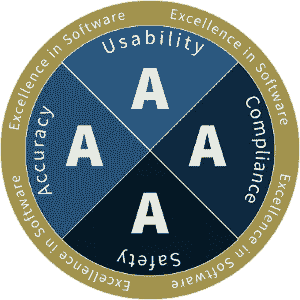

# 卓越的软件

> 原文：<https://levelup.gitconnected.com/2021-045-excellence-in-software-665e491bbafe>

## 准确性可用性安全合规性

只有最优秀的人才被冠以“优秀”

我们偶尔会遇到一个真正令人愉快的软件:它让我们完成一些重要的事情，直观地清晰操作，安全地私下处理我们的需求，并符合行业标准和法律要求。

我们可以很容易地认识到这种软件的优秀品质。它内在运作的每一个方面都是为了满足特定的目标而有意创造的；每一个功能都有其用途并能正常工作；没有什么能分散你对手头工作的注意力。简而言之，这种类型的软件*就是工作*。

曾几何时,“易于使用”是卓越的显著标志。它将新的图形化设计的界面与旧的难以理解的格式布局和难以破译的代码分开。曾经有一段时间，在网页底部贴一个通知，比如“这个网站最好用 _____”就足以说明“我们完成了”。曾经有一段时间，简单地生产*无 bug*软件是我们为自己设定的高标准目标。

但是我们已经长大了，这些说法已经不能被接受了。我们需要达到更高的目标。我们需要对我们创建的软件进行严格的评估。

首先，我们不应该等到项目的末尾才定义我们的质量目标。相反，产品团队——包括经理、设计师、图形艺术家、程序员和测试人员——应该从项目一开始就设定这些目标。在今天的世界中，这些目标应该是可度量的，并且应该涵盖比软件的外向方面更多的内容。

作为一名业内人士，我目睹了软件质量标准在过去四十年中的起起落落。可悲的是，我们已经不再是我们游戏中的佼佼者了。

今天的许多软件可能在外表上看起来不错，但这种外表可能掩盖了严重的问题。我们还能如何解释如此普遍的大规模数据泄露事件？我们如何证明清除 bug 列表而不是修复 bug 的常见做法是正确的？我们如何解释老年人和身体有缺陷的人很难使用的全新软件？当软件收集如此多的个人信息时，我们如何协调我们对隐私的需求？如果我们认真对待质量，并希望获得回报，我们需要考虑这些类型的失败。

因此，这里有一种思考的方式——一种使用明确的目标，并对实现目标的过程进行评估的方式。姑且称之为“软件上的卓越”。

它通过自我检查来工作，参与软件设计和开发的每个人都应该参与其中。为了使其最有效，在项目开始时制定了一系列的验收标准，并随着项目的发展不断完善。所有答案都是通过/失败。定期地，正在开发的软件根据这些验收标准被评估，并且答案被记录。

考试评分类似于课堂作业评分，其中四个部分的分数分别为 A、B、C 或 d。每个部分都以完美的 A 开始，但只有满足该部分的所有标准*才能保持 A。对于完全或部分未达到的标准，每个部分的分数会降低一个等级，降至 B 或 C 或 D。*

所有软件都应该争取的“软件卓越”分数是“AAAA”。这很难。只有最优秀的人才能实现它。

要使用的验收标准取决于正在开发的软件的类型。对于许多应用程序和网站来说，标准将接近以下内容，项目分为四个部分:**准确性、可用性、安全性**和**合规性**。考虑这些是一个很好的起点。

**准确度。** *这些都是无 bug 软件的经典措施。*

1.  软件是否始终产生正确的结果？
2.  软件是否优雅地处理丢失、无效或极端输入数据的情况？
3.  软件是否忠实地保存和恢复用户数据？
4.  排序例程能正确处理外语数据吗？
5.  搜索程序是否以用户期望的方式找到并过滤结果？
6.  简要记录总是反映细节的真实总和吗？

**可用性。这些是软件适应不同复杂程度的用户的程度的度量；拥有旧硬件的用户；以及健康低于 20/20 的用户。**

1.  这款软件能在 98%的用户使用的所有设备和浏览器上运行吗？
2.  用户界面是否有现成的提示和提示来帮助新用户理解和操作软件的各个方面？
3.  表单验证信息是否以一种明显的方式和地点呈现给用户？
4.  背景颜色和文本颜色是否有足够的对比度以便于阅读？
5.  信息反馈对患有*红绿色盲*的人仍然有效吗？
6.  web 组件和通用 HTML 标记是否分配了适当的 WAI-ARIA 角色？
7.  软件是否通过从最重要到最不重要的顺序对 HTML `tabindex`属性进行编号来适应屏幕阅读器？

**安全。** *这些是衡量用户数据在意外丢失、不良行为者和灾难性故障中保护程度的指标。*

1.  数据备份计划是否以每小时、每天和每周的时间间隔提供所有内容的稳定快照？
2.  数据恢复过程能否在两小时内完成？
3.  灾难性数据存储设施是否位于与在线数据不同的位置？
4.  在存储和网络传输过程中，用户凭据是否得到了适当的加密？
5.  从新位置请求访问时，是否会触发多因素身份认证？
6.  web 服务器是否配置为使用最新的 TLS 协议？
7.  是否正确设置了网站的内容安全策略(CSP)、功能策略和推荐策略来检测和报告违规行为？
8.  顺序记录是否受到保护，免受暴力和重放攻击？
9.  正确使用`frame-ancestors` CSP header 指令是否可以防止用户界面补救攻击？
10.  在将数据保存到数据库时，是否对用户输入进行清理以捕捉跨站点脚本注入？
11.  是否使用基于 HMAC 的跨站点请求伪造令牌来保护金融交易？
12.  部署前是否对所有文件进行了病毒扫描？
13.  DevOps 的服务器凭证是否单独存储在项目存储库之外？
14.  项目的测试协议是否包括对常见数据违规的明确检查？
15.  是否定期监控 web 服务器访问日志以发现异常情况？

**合规。** *这些都是软件遵守行业标准和民法的措施。*

1.  网站的文档使用 HTML 和 CSS 的方式是否通过了 W3C 验证器？
2.  浏览器会评估网站的 JavaScript 而不产生控制台警告或错误吗？
3.  网站是否有符合一般数据保护法规(GDPR)和加州消费者隐私法案(CCPA)的数据隐私政策？
4.  该软件的电子商务流程是否符合支付卡行业数据安全标准(PCI DSS)？
5.  该软件是否符合政府网站的信息和通信技术(ICT)第 508 节标准？
6.  软件是否遵守其使用的每个第三方软件许可证的条款和条件？
7.  在 GNU 或 MIT 许可下发布的第三方软件库是否在面向公众的文档中得到适当的认可？
8.  DevOps 是否有针对所有有限期限许可证的到期和续订日期的书面计划？
9.  公司是否制定了漏洞披露政策，以便外部安全研究人员和赏金猎人私下提供问题通知？

这些和其他可能是适用的。将它们视为您项目的起点。记住，每个软件项目都应该开发自己的一套自我评估标准。

优秀的软件只能通过有意识的努力和对细节的仔细关注来实现。