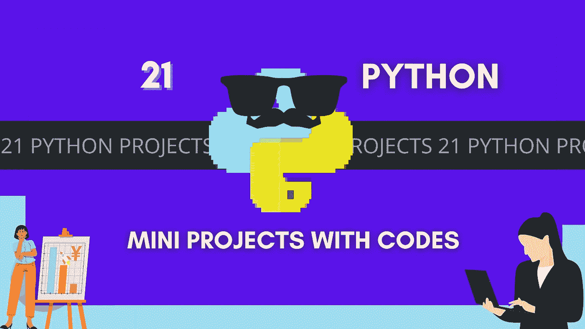
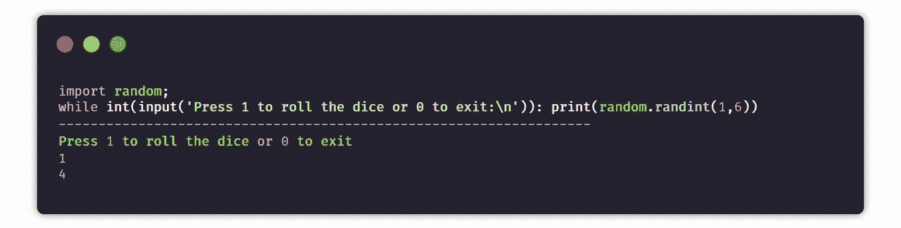
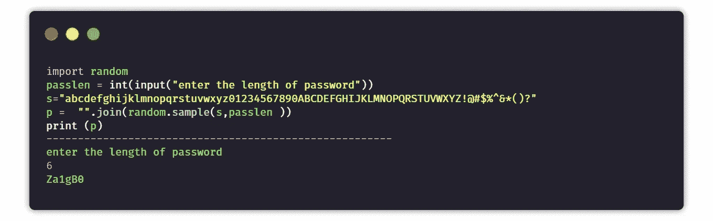
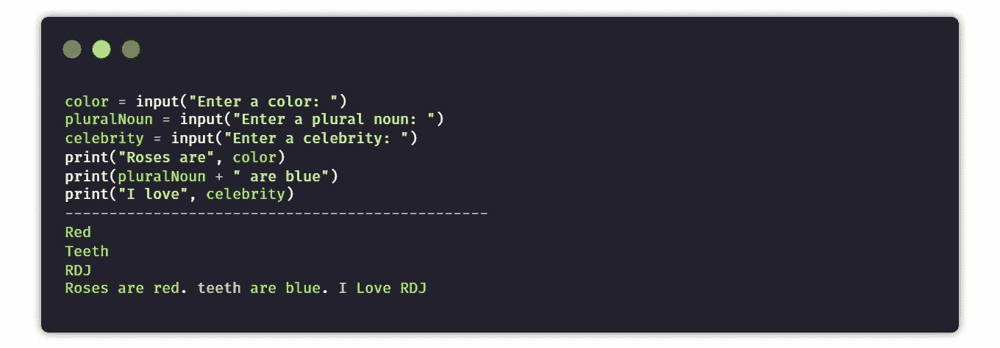
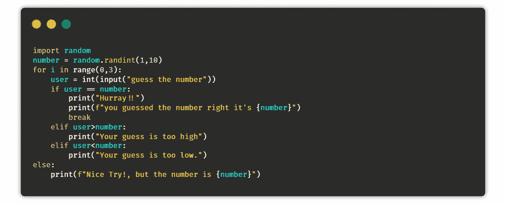
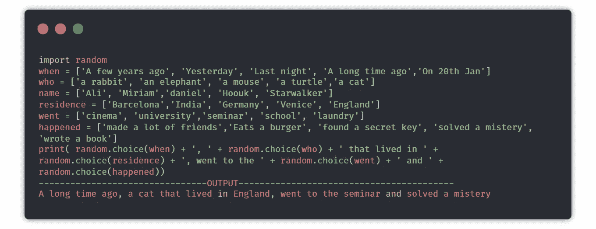
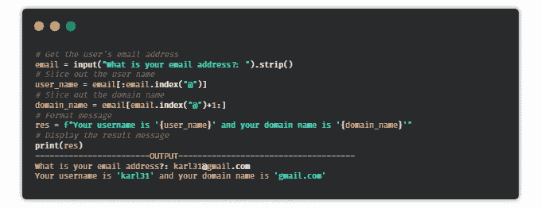
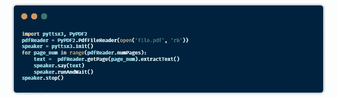
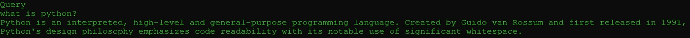
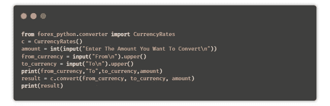

# 21 个带代码的 Python 迷你项目

> 原文：<https://levelup.gitconnected.com/21-python-mini-projects-with-codes-c4126e4131e4>

## 通过构建这些令人惊叹的项目，加快您的 Python 之旅的速度

我已经使用 python 一年半了，我最喜欢 python 的是它的[一行程序](/25-useful-python-one-liners-that-you-should-ec613df18260)和[包](/20-python-packages-that-you-must-try-a81862c913f6)。我意识到的一件事是**学习编程语言的最好方法是用它来构建项目**。

在这篇博客中，我们将看到 21 个 python 项目的代码。我建议你先试着自己构建解决方案，然后看看我的解决方案，因为你可能会构建出比我更好的解决方案。如果你是 python 的专业人士，那么你也可以尝试这些项目来刷新你的技能。我们开始吧。

> **“在寻求任何解决方案之前，先自己尝试一下”——作者**

# 1.掷骰模拟器

> 目标是创建一个模拟掷骰子的程序。

**提示**:当用户询问时，使用随机模块生成一个 1 到 6 之间的数字。

# 2.石头、剪刀和布游戏

> **目标是创建一个命令行游戏，其中用户有机会在石头、布、剪刀之间进行选择，如果用户赢了，分数就会增加，在用户结束游戏时，分数会显示给用户。**

**提示:**取用户选择，然后与计算机选择进行比较，计算机选择是使用随机模块从选择列表中选取的，如果用户获胜，则将分数增加 1。

# 3.随机密码生成器

> **创建一个程序，取密码的长度，生成一个相同长度的随机密码。**

**提示**:创建一串数字+大写字母+小写字母+特殊字符。从用户给定长度的字符串中随机抽取样本。

# 4.Mad Libs 生成器

> **任务是通过添加用户给出的输入来生成一个随机且唯一的故事。**

**提示**:取名词、代词、形容词等。作为用户的输入，然后将所有数据添加到故事中，并将其组合和返回。

# 5.猜数字游戏

> **在这个游戏中，任务是创建一个脚本，生成一个范围内的随机数，如果用户在三次机会中猜中该数字，则用户赢，否则用户输。**

**提示**:生成一个用户随机数，使用一个循环只给用户三次猜测的机会，并根据用户的猜测打印出满意的输出。

# 6.故事生成器

> 任务是在用户每次运行程序时生成一个随机的故事。

**提示** : Random 模块可以用来选择存储在不同列表中的故事的随机部分。

# 7.电子邮件切片程序

> **你的任务是编写一个 python 脚本，可以从电子邮件中获取用户名和域名。**

**提示**:使用`@`作为分隔符将邮件分成两个字符串

# 8.自动化电子邮件

> 任务是编写一个 python 脚本，使用它你可以发送电子邮件。

**提示** : `email`库可以用来发邮件。

> **“学习编程语言的最好方法是用它来构建项目”——某位伟人**

# 9.首字母缩略词

> **你需要编写一个 python 脚本，从给定的句子中生成一个缩写词。**

**提示**:你可以用拆分和索引的方式取第一个单词，然后再组合。

# 10.基于文本的冒险

> 编写一个有趣的 Python 脚本，通过选择不同的路径选项来带领用户进行有趣的冒险。

# 11.绞刑吏

> 你的任务是创建一个简单的命令行游戏)****。****

****提示**:创建一个密语列表，随机挑选一个单词。现在将每个单词表示为`_`，给用户猜单词的机会，如果用户猜对了，那么用单词替换`_`。**

# **12.闹钟**

> **我们的任务是编写一个创建闹钟的 python 脚本。**

****提示**:您可以使用日期时间模块创建一个闹钟和播放声音库，用于播放[闹钟声音](https://www.soundsnap.com/tags/alarm)。**

# **13.有声书**

> ****编写一个 python 脚本，可以用来将 pdf 转换成有声读物****

****提示**:借助`pyttsx3`库将文本转换成语音。**

****安装** : pyttsx3，PyPDF2**

****

# **14.天气应用**

> ****编写一个 python 脚本，该脚本使用 web 抓取获取城市名称并返回该城市的天气信息。****

****提示**:可以使用`Beautifulsoup`和`requests`库直接从 Google 主页抓取数据。**

****安装**:要求，美观大方**

# **15.人脸检测**

> ****编写一个 python 脚本，可以检测图像中的人脸，并将所有人脸保存在一个文件夹中****

****提示** : [haar 级联分类器](https://raw.githubusercontent.com/opencv/opencv/master/data/haarcascades/haarcascade_frontalface_default.xml)可以用来检测人脸。它返回面的坐标，使用这些面可以保存为一个文件。**

**安装:OpenCV
下载:[*haarcascade _ frontal face _ default . XML*](https://raw.githubusercontent.com/opencv/opencv/master/data/haarcascades/haarcascade_frontalface_default.xml)**

# **16.提醒应用程序**

> ****创建一个提醒应用程序，在某个时间后提醒你做某事，作为桌面通知。****

****提示**:时间模块可用于跟踪提醒时间，toast 通知程序库可用于显示桌面通知。**

****安装** : win10toast**

# **17.维基百科文章摘要**

> ****我们的任务是使用一种简单的方法从用户给出的文章链接中生成一个摘要。****

****提示**:您可以使用抽取的方式生成摘要和网页抓取，用于从文章页面获取数据。**

# **18.抓取谷歌结果**

> **我们的任务是创建一个脚本，可以根据一些查询从谷歌抓取结果。**

****

**输出**

# **19.货币转换器**

> **编写一个 python 脚本，将一种货币转换成用户选择的其他货币。**

****提示**:利用 python 中的 [API](https://api.exchangerate-api.com/v4/latest/USD) 或`forex-python`模块获取货币的实时汇率。**

****安装** : [外汇 python](https://pypi.org/project/forex-python/)**

****

# **20.键盘记录器**

> **我们的任务是编写一个 python 脚本，将用户按下的所有键保存在一个文本文件中。**

**提示:pynput 是 python 中的一个库，用来控制键盘和鼠标的移动，也可以用来制作键盘记录器。简单地读取用户按下的键，并在一定数量的键之后将它们保存在文本文件中。**

# **21.文章阅读器**

> **我们的任务是编写一个 python 脚本，从提供的链接中自动读取文章。**

**这里有一篇给[你](https://medium.com/pythoneers/python-script-that-reads-articles-on-your-behalf-70591fa9ed16)的完整解释文章。**

## **奖金项目**

# **22.URL 缩写**

> **编写一个 python 脚本，使用 API 缩短给定的 URL。**

# **分级编码**

**感谢您成为我们社区的一员！ [**订阅我们的 YouTube 频道**](https://www.youtube.com/channel/UC3v9kBR_ab4UHXXdknz8Fbg?sub_confirmation=1) 或者加入 [**Skilled.dev 编码面试课程**](https://skilled.dev/) 。**

** [## 编写面试问题+获得开发工作

### 掌握编码面试的过程

技术开发](https://skilled.dev)** 

# **给你一些精选的文章**

** [## 15 个你可能不知道的 Python 包出口

### 对你非常有用的东西

levelup.gitconnected.com](/15-python-packages-you-probably-dont-know-exits-aef0525a965f)  [## 每个人都应该构建的 6 个 Python 中级项目

### 今天你能在互联网上找到的最好的 Python 项目

medium.com](https://medium.com/pythoneers/5-python-intermediate-project-that-everyone-should-build-with-codes-5039f13feadb)  [## 您应该知道的 25 个有用的 Python 命令行程序

### 这使得 python 不朽

levelup.gitconnected.com](/25-useful-python-one-liners-that-you-should-ec613df18260)  [## 你必须尝试的 20 个 Python 包

### 这让你的生活更轻松

levelup.gitconnected.com](/20-python-packages-that-you-must-try-a81862c913f6)  [## 50 Python 面试问答

### 一些检查你的 Python 知识的问题🤔

levelup.gitconnected.com](/50-python-interview-question-and-answers-404e08bc054c)  [## 你必须知道的 20 个终端命令

### 如果你想称自己为开发者，那就开始使用这些吧

medium.com](https://medium.com/pythoneers/20-terminal-commands-that-you-must-know-f24ebb54c638) 

# 学习新的东西

 [## 网络抓取大师从零到英雄🕸

### 用美汤和请求库同一个项目

medium.com](https://medium.com/pythoneers/master-web-scraping-completly-from-zero-to-hero-38051423256b)  [## 你必须知道的 20 个终端命令

### 如果你想称自己为开发者，那就开始使用这些吧

medium.com](https://medium.com/pythoneers/20-terminal-commands-that-you-must-know-f24ebb54c638)**