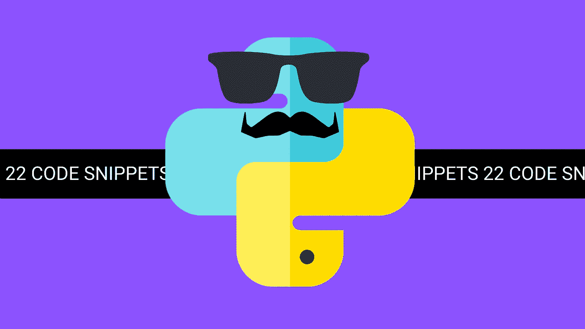
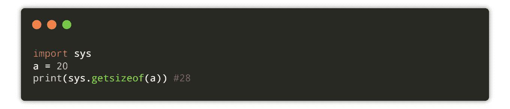
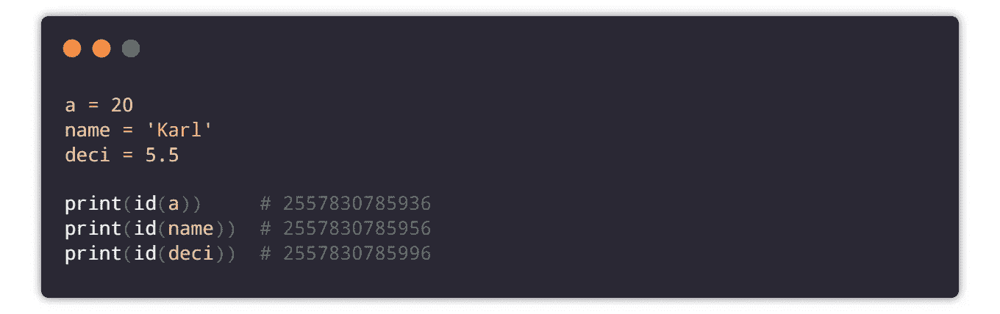
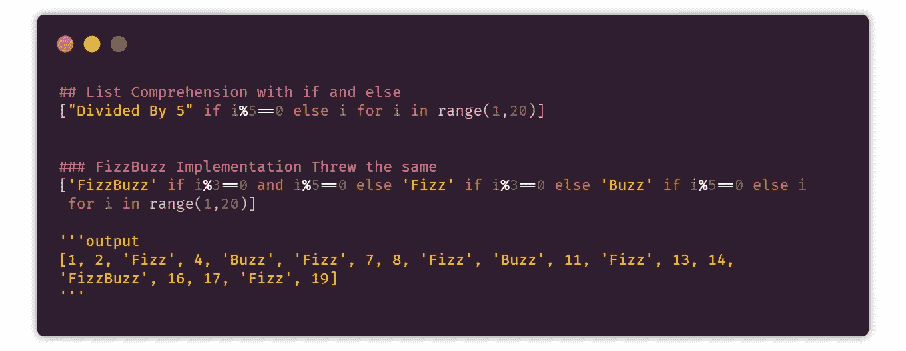
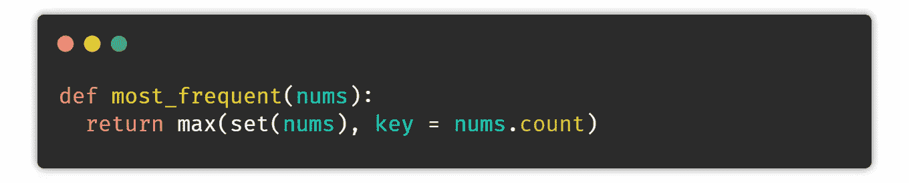
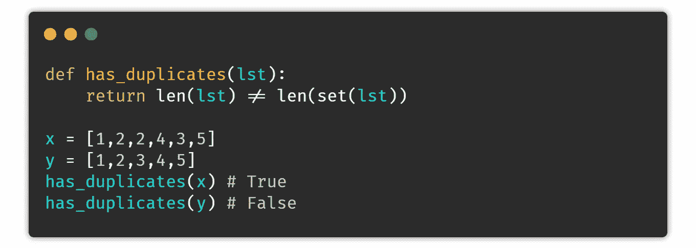

# 针对日常问题的 22 个 Python 代码片段

> 原文：<https://levelup.gitconnected.com/22-python-code-snippets-for-everyday-problems-4c6a216c33ae>

## 为了提高你的编码技能

“作者提供的图像”

在这篇博客中，我想和你分享 22 个 python 代码片段，它们可以帮助你解决日常问题。

## 1.用空格分隔多个输入

这个代码片段允许您一次输入多个空格。每当您在解决一个编程竞赛问题时，这个片段都会派上用场。

## 2.同时访问索引和值

内置函数允许你在 or 循环中同时访问索引和值。

## 3.检查内存使用情况

这个代码片段将用于检查一个对象的内存使用情况。

## 4.打印变量的唯一 ID

`id()`方法允许你找到一个变量的唯一 id。您只需要在方法中传递变量名。

## 5.检查变位词

变位词是通过重新排列不同单词的字母形成的单词，所有原始字母只使用一次。

## 6.合并两本词典

当您处理数据库和 JSON 文件，并且需要将不同文件或表中的多个数据合并到一个公共文件中时，这将非常方便。合并两个字典有一些风险，比如如果我们有重复的键怎么办？幸运的是，我们也有解决方案。

## 7.检查文件是否存在

了解我们在代码出口中使用的文件是很重要的。Python 让管理文件变得如此简单。Python 有读写文件的内置语法。

## 8.给定范围内所有数字的平方

在这段代码中，我们借助内置函数 **itertools** 来计算给定范围内每个整数的平方。

## 9.将两个列表转换成字典

下面的方法可以用来将两个列表转换成一个字典。

## 10.对字符串列表进行排序

当您有一个包含学生姓名的列表，并且想要对所有姓名进行排序时，这将非常有用。

## 11.用 if 和 Else 列出理解

当您想要根据某些条件过滤数据结构时，这个代码片段非常有用。

## 12.添加两个列表的元素

假设您有两个列表，您想通过添加它们的元素将它们合并成一个列表。它在某些情况下很有用，例如

## 13.对词典列表进行排序

当您有一个字典列表时，您可能希望借助一个关键字按排序顺序组织它们。

## 14.计算壳的时间

有时了解 shell 或代码块的执行时间变得很重要，以便用最少的时间获得更好的算法。

## 15.检查列表字符串中的子字符串

我平时每天都会碰到的一件事就是检查一个字符串是否包含子串。与其他编程语言不同，python 为此提供了一个很好的关键字。

## 16.格式化字符串

代码最重要的部分是输入、逻辑和输出。这三个部分在编写代码时都需要某种格式，以获得更好、更易读的输出。python 提供了多种格式化字符串的方法。

## 17 .错误处理

像 Java 和 C++一样，python 也提供了一种使用 try、except 和 finally block 处理异常的方法。

## 18.列表中最常见的

下面的方法返回列表中出现最频繁的元素。

## 19.不带 if-else 的计算器

这段代码片段展示了如何简单地编写一个计算器，而不使用任何 if-else 条件。

## 20.链式函数调用

在 python 中，可以在一行中调用多个函数。

## 21.交换值

一种快速交换两个变量而不需要额外变量的方法。

## 22.查找重复项

这些代码片段将让您检查列表中是否有任何重复的值。

## 🐱‍🏍一些精选的文章供你接下来阅读👇

 [## 您应该知道的 25 个有用的 Python 命令行程序

### 这使得 python 不朽

levelup.gitconnected.com](/25-useful-python-one-liners-that-you-should-ec613df18260)  [## 15 个你可能不知道的 Python 包出口

### 对你非常有用的东西

medium.com](https://medium.com/pythoneers/15-python-packages-you-probably-dont-know-exits-aef0525a965f) 

## 对机器学习感兴趣，看看这个👇

 [## 回答了 30 个基本的机器学习问题

### 检查并增加您的 ML 知识🤔

medium.com](https://medium.com/pythoneers/30-basic-machine-learning-questions-answered-692acd10841f) 

# 分级编码

感谢您成为我们社区的一员！ [**订阅我们的 YouTube 频道**](https://www.youtube.com/channel/UC3v9kBR_ab4UHXXdknz8Fbg?sub_confirmation=1) 或者加入 [**Skilled.dev 编码面试课程**](https://skilled.dev/) 。

 [## 编写面试问题+获得开发工作

### 掌握编码面试的过程

技术开发](https://skilled.dev)