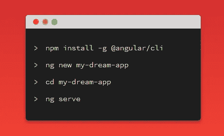
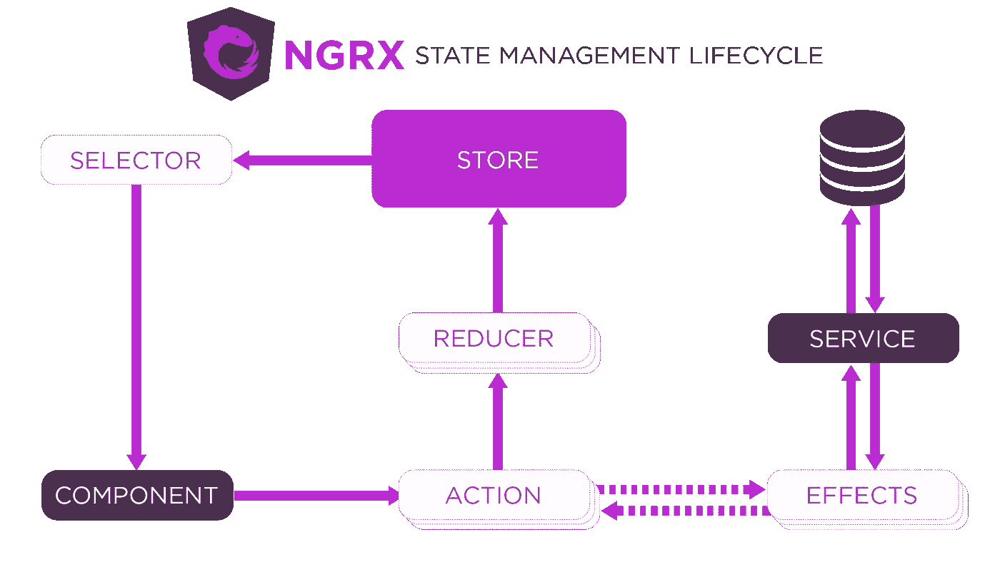

# 掌握角度:一个干净，有组织的项目的提示”

> 原文：<https://levelup.gitconnected.com/23-best-practices-with-angular-development-7433eaa8a72b>


# 简介:

和我一起分享我关于如何为 Angular 项目编写干净、优化的代码的专业知识和见解。根据我自己的经验，以及来自社区的提示和技巧，我们将深入研究项目结构的最佳实践，利用 TypeScript，并利用 Angular 的特性来提高性能和可伸缩性。让我们一起提升我们的角度开发，为成功的软件项目铺平道路。"

快乐阅读:)

# 让我们开始:


# **项目结构:**📓 📕

在开始一个新的 Angular 项目之前，你应该始终注意你的文件夹结构，并遵循应该建立的**社区建议**:

```
|-- app
     |-- modules
       |-- home
           |-- [+] components
           |-- [+] pages
           |-- home-routing.module.ts
           |-- home.module.ts
     |-- core
       |-- [+] authentication
       |-- [+] footer
       |-- [+] guards
       |-- [+] http
       |-- [+] interceptors
       |-- [+] mocks
       |-- [+] services
       |-- [+] header
       |-- core.module.ts
       |-- ensureModuleLoadedOnceGuard.ts
       |-- logger.service.ts
     |
     |-- shared
          |-- [+] components
          |-- [+] directives
          |-- [+] pipes
          |-- [+] models
     |
     |-- [+] configs
|-- assets
     |-- scss
          |-- [+] partials
          |-- _base.scss
          |-- styles.scss
```

**共享模块:**

```
|-- shared
          |-- [+] components
          |-- [+] directives
          |-- [+] pipes
          |-- [+] models
```

这个 ***共享模块*** 应该包含整个项目的公共模型、管道和指令，以及公共组件。

*   **组件:**组件文件夹包含所有“共享组件”，可用于不同的模块，如模态、按钮、加载器、标题等。

可重复使用按钮示例:

**按钮.组件. ts:**

```
import { Component, OnInit, Input } from '@angular/core';

    @Component({
      selector: 'app-button',
      templateUrl: './button.component.html',
      styleUrls: ['./button.component.css']
    })
    export class ButtonComponent implements OnInit {
      @Input() label:string;
      @Input() functionCall:string;

      constructor() { }

     @Input() label: string;
@Output() onClick = new EventEmitter<any>();

onClickButton(event) {
    this.onClick.emit(event);
  }
    }
```

**button.component.html:**

```
<div id = "button">
  <button type="button" class= "btn" (click)="onClickbutton($event)" >{{label}}</button>
</div>
```

*   **指令:**包含定制指令的文件夹(改变 DOM 元素的外观，对用户输入做出反应以及如何传递输入等)
*   **模型:**应用程序中所有可以划分为子文件夹的模型

```
|-- models
          |-- [+] crud
          |-- [+] common
          |-- [+] filter
          |-- [+] helpers
```

**核心模块:**🎯

```
|-- core
       |-- [+] guards
       |-- [+] http
       |-- [+] interceptors
       |-- [+] mocks
       |-- [+] services
       |-- core.module.ts
       |-- ensureModuleLoadedOnceGuard.ts
       |-- logger.service.ts
```

核心模块承担根应用模块的角色，它将包含(API 交互和业务逻辑)的服务文件夹，

**拦截器**用于向 HTTP 请求添加授权，缓存 API 请求

**守卫:**自定义根据条件控制路线的可访问性

# 具有路径 Aliases:➰ ✔️的短路径


您应该避免长相对路径导入，如

```
../../../../../../../../../app/config/config.ts
Or 
*import* { User} *from* '../../../models/crud/User';
```

利用 **Typescript** aliases，它允许我们为应用程序表单中的绝对路径指定一个**单词/别名**，您可以从中解析绝对路径。

*   示例路径-您的**角度投影**的配置:

```
"paths": {"@core/*": ["src/app/core/*"],"@modules/common/*": ["src/app/common/*"],"@shared/*": ["src/app/shared/*"],"@configs/*": ["src/configs/*"],
"@angular/core/src/metadata/*": ["./node_modules/@angular/core"]
```

您的导入将是这样的:

```
*import* {  Model1 , Model2 , Model3 } *from* '@shared/models';*import* { Service1 , Service2 , Service3 } *from* '@core/service';
```


# **惰性加载:**📓 📕


正如我们在关于项目结构的第一篇技巧文章中提到的，如果我们计划拥有一个可伸缩的应用程序，你应该把它组织成模块(授权模块、仪表板模块等)..)但是要关心应用性能！

因此，让我们的应用程序快速加载的技术之一是

**延迟加载代码示例**📕 **:**

```
import { NotFoundComponent } from './modules/general/not-found/not-found.component';

const routes: Routes = [
  { path: '', component: HomeComponent, },
  {
    path: 'contact',
    loadChildren: () => import('./modules/general/contact/contact.module')
      .then(mod => mod.ContactModule)
  },
  {
    path: 'about',
    loadChildren: () => import('./modules/general/about/about.module')
      .then(mod => mod.AboutModule)
  },
  {
    path: 'signin',
    loadChildren: () => import('./modules/general/signin/signin.module')
      .then(mod => mod.SigninModule)
  },
  { path: '**', component: NotFoundComponent }
];
```

# 使用 Angular CLI 生成文件🔧 🔨：



角度 CLI

> Angular CLI 是一个命令行界面工具，用于初始化、开发、搭建、维护，甚至测试和调试 Angular 应用程序。

因此，不用手动创建文件和文件夹，而是使用 **Angular CLI** 来生成新的组件、指令、模块、服务和管道。

```
# Install Angular CLI

npm install -g @angular/cli

# Check Angular CLI version

ng new [project-name]ng generate component [name] (generate component)
ng g s everything-service (generate service)
ng g pipe my-pipe (generate pipe)
ng g directive my-directive (Generate a directive)
ng g enum some-enum
ng g module fancy-module
ng g cl my-class (Generate a class)
ng g interface my-interface (Generate an interface:) 
```

您可以查看([https://cheatography.com/wakers01/cheat-sheets/angular-cli/](https://cheatography.com/wakers01/cheat-sheets/angular-cli/))**角度 CLI** **备忘单**了解可用命令的更多详细信息

# 干净的打字稿代码🍦 🍰：


Typescript 是 web 开发中一种革命性的编程语言，它提供了许多功能和 API，因此使用 typescript 编写 angular 代码时，我们应该注意干净的代码提示，如:

–定义**小函数**和**将其限制在不超过 75 行**

```
*ngOnInit*()*:* void {*this*.function1);*this*.function2();}
```

–所有**符号**的名称一致。推荐模式为 **feature.type.ts、user.mode.ts 等..**

–如果变量的值是完整的，那么用**‘const’声明它。**

```
***const*** *canvas = chartInstance.chart*;
```

–使用破折号分隔描述性名称中的单词，使用点分隔描述性名称和类型。

–属性和方法的名称应始终使用**小写字母。**

```
 *//Example 
public* *isConnected* *=*false;
```

总是在导入和模块之间留一个空行；比如第三方和**应用导入和第三方模块和自定义模块。**

```
*import* { *Component*, *OnInit* } *from* '@angular/core';
*import* { *FormBuilder*, *FormControl*, *FormGroup* } *from* '@angular/forms';
*import* { *ActivatedRoute*, *Router* } *from* '@angular/router';*import* { *Subject*, *Subscription* } *from* 'rxjs';
*import* { *takeUntil* } *from* 'rxjs/operators';
*import* { *TranslateService* } *from* '@ngx-translate/core';*import* { *JiraService*, *MetricsService*, *NavigationDataService*, *SubTaskService* } *from* '@core/service';*import* { *Constants* } *from* '@core/utils/Constants';
*import* { *StringUtils* } *from* '@core/utils/string-utils';
*import* {  *Responsible*, *StatusFilterDTO*, *SubTaskFilter*, *SubTask*, *ModelMetricType*, *NavigationElement* } *from* '@shared/models'
*import* { *SharedData* } *from* '@shared/sharedData';
```

# **使用接口代替类进行类型检查**🚩🏳 **:**


当你只需要类型检查时，接口是很好的选择，而当你不仅需要类型检查，还需要一些方法或其他逻辑时，类**是很好的选择。**

**接口**是**契约**。接口定义了对象内部的内容(同样…不是类的实例)。当您定义接口时

```
interface MyInterface{
  a: number;
  b: string;
}
```

使用**接口的优点:**

示例用例，您有一个具有两个属性(a，b)的对象

```
interface MyObject{
a: string;
b: number;}
```

如果你不遵守这个契约(**接口**定义)，typescript with 抛出一个错误(例如将参数传递给一个带有 MyObject 实例的函数)

```
interface MyObject{a: string;b: number;}let obj :MyObject;
const  test = (obj: MyObject) =>{obj.a=100;
//Error "Type 'number' is not assignable to type 'string'."}
```

使用**类型脚本**进行**数据建模**而不是**类**的另一个优点是，编译器在运行时⭕️不会为**接口**生成任何**对应的 JavaScript 代码**💢

# 不要再用“任何”了，有一种类型是这样的


**任意类型**用于表示任意 JavaScript 值。

但是编写没有类型的类型脚本代码，你将增加额外的代码来检查参数和变量，以确保你的程序正确运行❌，

所以通过使用 **type: any** ❌，您无法控制空值和未定义的值，这些值可能会出现异常和错误


```
let a: any;
let b: Object;

a.nomethod(); // Transpiles just fine
b.nomethod(); // Error: Property 'nomethod' does not exist on type 'Object'.
```

# **安全操作员** ✅ **:**


**安全航行操作员**(？。)是角度模板表达式运算符，用于避免属性路径中出现空值和未定义值的异常。

```
<b>1\. </b>
<p>{{personone?.name}} </p>
<p>{{personone?.email}} </p>
```

# 使用*ngFor 不带 trackBy🔧 🔨：


**问题** ⛔️ **:**

当将对象数组传递给' *ngFor '时，angular 指令会将这些元素绘制到 [DOM](https://www.w3schools.com/js/js_htmldom.asp) 中，因此如果数据集合中有任何变化，API 调用 **Angular** 无法跟踪集合中的项目，也不知道哪些项目已经被**移除**或**添加了**。

( **DOM 操作代价昂贵**)


**解决方案:** ✔️出于性能原因， **trackBy 特性**允许您在添加或删除元素时进行跟踪

```
@Component({
  selector: 'app-movies-list',
  template: `
    <ul>
      <li *ngFor="let movie of moviesArr; trackBy: *trackByElement*">

      </li>
    </ul>
    `
})// in your typescript code*trackByElement* *=* (index, item) *=>* {*return* *item*.*id*;}
```

# 使用隐藏在 ngIf 之上来显示/隐藏元素🔑：

避开这个❌:

```
<div  **ngIf*="isEpic">
<span> To be defined</span>
</div>
```

试试这个✅:

```
<div *class*="col" *[hidden]*="!isEpic">
<span> To be defined</span>
</div>
```

# 避开 console.log()✂️📐：


在你的产品代码中使用 console.log()语句可能是一个坏主意，因为它会降低应用程序的性能,还会用 **console.log()** 记录对象

**隐藏所有控制台(生产模式)**

```
if (env === 'production') {
    console.log = function () {};
}
```

# 在模板中使用管道而不是方法:

不要这样❌:

```
<h1>    Current time is {{ currentTime.substr(0, 2).toUpperCase() }}!  </h1>
```

做这个✅:

```
<h1>    Current time is {{ currentTime | SubtPipe | uppercase}}!  </h1>
```

# 避免模板中的复杂计算:

```
<span  **ngIf*="object.name" *class*="badgeAvatar badge-primary"> {{functionFilter(object.name)?.toUpperCase()}}</span>`[https://gist.github.com/akhilanandbv003/fd4f3898bb7b9c36f7b9a8c198e01548](https://gist.github.com/akhilanandbv003/fd4f3898bb7b9c36f7b9a8c198e01548)```
```

# 智能和非智能组件🌚 🌝：


你应该始终关心代码的可重用性，并利用 web 框架，因为一切都是组件

将所有代码放在一个组件中会导致问题**和**📛：

*   开始变得很大。
*   **代码可读性**📕

**解决方案** ✅ **:**

*   将组件分为**智能和非智能。**
*   尽可能保持组件不动。
*   决定什么时候一个组件应该是智能的而不是愚蠢的。

因此，我们可以将它们分开，而不是将所有的逻辑代码放在一个组件 t 中，但在此之前，我们应该学习两种类型的组件:

*   **容器组件(智能组件)** ♻️ **:**

关心它的内部操作如何工作，API 调用，从服务中获取数据

*   **表象成分** s📥(哑组件):

不依赖于应用程序的其他部分，

不会改变数据

包含@Input 属性作为数据提供者

```
import{ Component, Input, OnInit } from ‘[@angular/core](http://twitter.com/angular/core)’;
[@Component](http://twitter.com/Component)({
selector: ‘app-book-list’,
templateUrl: ‘./book-list.component.html’,
styleUrls: [‘./book-list.component.css’]
})
export class BookItemComponent implements OnInit {
[@Input](http://twitter.com/Input)(‘book’) book: Book;
constructor() { }
ngOnInit() {
}
```

**但是！**


*   组件应该只处理显示逻辑
*   业务逻辑应该从服务方法中提取出来，并从视图中分离出来
*   当提取到服务中时，业务逻辑通常更容易进行单元测试，并且可以被任何其他需要应用相同业务逻辑的组件重用。

# 检测优化(Onpush)🔔 🔕：

正如我们在上一部分中所讨论的，如果我们没有为组件选择正确的变更检测策略，依赖于@Input 数据的**表示组件会导致性能问题！**


**问题**🚫:默认情况下，Angular 使用`ChangeDetectionStrategy.Default`变化检测策略！因此，每当发生变化(事件、计时器、用户交互等)时..)更改检测将在所有组件上运行。

**解决方案** ✅:我们可以将组件的`ChangeDetectionStrategy`设置为`ChangeDetectionStrategy.OnPush`。

这告诉 Angular 组件只依赖于它的`@inputs()`，并且只在下列情况下需要检查:

它通过最大限度地减少变更检测周期来提高性能。

# 通用服务 Api 交互(DRY):

当在我们的 Angular 项目中定义我们的服务时，我们看到有许多重复的代码

**问题**🚫 **:** 代码重复

## 服务 1 代码:

```
*@Injectable*({providedIn: 'root'})*export* *class* **Object1Service** {*constructor*(*private* httpClient*:* HttpClient) { }*public* *getUsers*(page*:* number, size*:* number, filter*:* string)*:* Observable<PageUser> {*const url = filter != null ? `${config.serviceBaseUrl}/users/all?&page=${page}&size=${size}&search=${filter}` : `${config.serviceBaseUrl}/users/all?&page=${page}&size=${size}`*;*return* *this*.*httpClient*.*get*<PageUser>(*url*)}
```

## 服务 2 代码:

```
*@Injectable*({providedIn: 'root'})*export* *class* **Object2Service** {*constructor*(*private* httpClient*:* HttpClient) {  }*public* *getUseCase*(epicId*:* string*|*number, page*:* string, size*:* string, searchFilter*:* UseCaseSearchFilter)*:* Observable<PageUseCase> {*const url = `${config.serviceBaseUrl}/v3/use-cases/by-epic/${epicId}?&page=${page}&size=${size}`*;*return* *this*.*httpClient*.*post*<any>(*url*, *searchFilter*);}
```


**解决方案** ✅:通用服务

```
export class SubResourceService<T extends Resource> {
  constructor(
    private httpClient: HttpClient,
    private url: string,
    private parentEndpoint: string,
    private endpoint: string,
    private serializer: Serializer) {  }public create(item: T): Observable<T> {
  return this.httpClient
    .post<T>(`${this.url}/${this.parentEndpoint}/${item.parentId}/${this.endpoint}`,
      this.serializer.fromJson(item))
    .pipe(map((data: any) => this.serializer.fromJson(data) as T));
  }
```

# **清除您的订阅**🚫❌**:t29**


将 Rxjs 与 Angular 一起使用的最大挑战之一是，我们需要释放 observables 使用的资源，以避免内存泄漏


**问题** ❌ **:**

订阅每个可观察对象就像创建一个永不关闭的开放连接！

**解决方案** ✅:

清除您的订阅！！！💥 💥 💥

**致电退订()** ⚡️ **:**

**使用 RxJs** 中的 takeUntil()运算符🔥 **:**

“这个`takeUntil()`操作符一直使用一个源可观测值，直到我们传递给`takeUntil()`操作符的通知可观测值告诉它停止。”

**使用异步管道**💥 **:**

异步管道用于自动取消订阅观察

# 使用适当的 RXJS 操作员✅✅:

> RxJS 代表*R*eactive E*x*tensions 代表* J * ava * S * cript，它是一个为 JavaScript 提供 Observables 实现的库。


Rxjs 是一个很酷的库，它提供了许多有用的 API 和操作符来与复杂的场景进行交互，

所以让我们来谈谈最常用的 Rxjs 运算符:

***switch map****:*当新的输入到达时，你不再关心先前请求的响应

```
import { Component } from '@angular/core';import { FormControl,FormGroup,FormBuilder } from '@angular/forms';import { SearchService } from './services/search.service';import 'rxjs/Rx';@Component({selector: 'app-root',template: `<form [formGroup]="coolForm"><input formControlName="search" placeholder="Search Spotify artist"></form><div *ngFor="let artist of result">{{artist.name}}</div>`})export class AppComponent {searchField: FormControl;coolForm: FormGroup;constructor(private searchService:SearchService, private fb:FormBuilder) {this.searchField = new FormControl();this.coolForm = fb.group({search: this.searchField});this.searchField.**valueChanges**.debounceTime(400).**switchMap**(term => this.searchService.search(term)).subscribe((result) => {this.result = result.artists.items});}}
```

***merge map****:*当您希望展平内部可观察对象，但希望手动控制内部订阅的数量时，最好使用该运算符。

```
*this*.*userService*.***getCurrentUser*()** .*pipe*(*tap*((currentUser) *=>* (*this*.*userId* *=* *currentUser*.*_id*)),*mergeMap*((currentUser) *=>**this*.blogsService.*getBlogsByUser*(*currentUser*.*_id*)));
```

**forkjoin:** 当我们希望等待多个 HTTP API 调用并等到得到响应时，会有一些使用场景，因此**‘fork join’**是最简单的方法:

```
import { HttpClient } from '[@angular/common](http://twitter.com/angular/common)/http';
import { Injectable } from '[@angular/core](http://twitter.com/angular/core)';
import { Observable } from 'rxjs/Observable';
import { forkJoin } from 'rxjs';  // RxJS 6 syntax[@Injectable](http://twitter.com/Injectable)()
export class DataService {constructor(private http: HttpClient) { }public requestDataFromMultipleSources(): Observable<any[]> {
    let response1 = this.http.get(requestUrl1);
    let response2 = this.http.get(requestUrl2);
    let response3 = this.http.get(requestUrl3);
    // Observable.forkJoin (RxJS 5) changes to just forkJoin() in RxJS 6
    return forkJoin([response1, response2, response3]);
  }
}
```

# 缓存 API 调用⚠️🚸：


在一些用例中，当进行 API 调用时，数据不会频繁更改，因此我们可以为这些 API 调用添加一个缓存机制，

这将帮助我们避免不必要的 API 调用，从而提高应用程序的速度💰。

对于 Angular 项目，这种缓存机制有很多技术实现

**方案一** ✔分享重播️Rxjs 操作员 **:**

它将总是返回数据流中最后发出的值！

# 使用 CDK 虚拟卷轴📜 📃：

**问题**🚫现代网络应用是复杂的。他们有很多可移动的部件，非常复杂，而且经常要处理大量的数据。

因此，如果我们正在处理一个非常常见的用例:显示用户列表

随着列表中项目数量的增加， **DOM** 中的元素数量也会增加，从而导致更多的**内存**和 **CPU 使用率**。


**解**✅**:**[@ angular/CDK](http://twitter.com/angular/cdk)

*"<CDK-virtual-scroll-viewport>通过仅呈现适合屏幕的项目来有效地显示大型元素列表。"*


将`@angular/cdk`包添加到我们的项目中:

```
$ npm install [@angular/cdk](http://twitter.com/angular/cdk)// in your app.module.tsimport { ScrollingModule} from '@angular/cdk/scrolling';
imports: [
  ScrollingModule
] // Component
export class CdkVirtualScroll {
items = [];
constructor() {
this.users = Array.from({length: 100000}).map((_, i) => `scroll list ${i}`);
}
}
```

**compoennt.html:**

```
//Template

<ul>
  <cdk-virtual-scroll-viewport itemSize="100">
    <ng-container *cdkVirtualFor="let user of users">

 	<li> {{user}}</li>

    </ng-container>
  </cdk-virtual-scroll-viewport>
</ul>
```

# **用 Ngrx 进行状态管理**🎴 **:**



如今，我们正在处理复杂的应用程序和复杂的业务需求，像脸书、Twitter 等丰富复杂的项目需要状态管理和前端项目的架构

对于 Angular 开发人员来说，他们的好库使得为我们的应用添加状态管理变得容易，比如 [**NGRX**](https://ngrx.io/)

使用状态管理有什么好处:


*   它支持不同组件之间的数据共享
*   它为状态转换提供集中控制
*   代码将更加清晰，可读性更强
*   出错时很容易调试
*   开发工具可用于跟踪和调试状态管理库

**用于小型应用**🏍**、**我们可以使用 [@input](http://twitter.com/input) 、 [@Output](http://twitter.com/Output) 和 EventEmitter 进行组件通信。

**适用于中小型应用**🚜使用 RxJS 共享服务进行功能模块通信。使用 RxJS BehaviourSubject 和 ReplaySubject 保存数据，并在组件和模块之间共享数据。

**适用于大型复杂应用**🚎需要维持状态。建一个商店是好的。Redux 或 NGRX 为角度应用程序提供了一个存储。

# 结论❤️💛：

总之，我对使用任何技术的初级软件开发人员的建议是，始终关注如何编写干净的代码，并为其寻找最佳实践，不仅要使其具有功能性，而且要能正常工作，因为这将使你在职业生涯中快速进步

**参考文献:**

*   [https://johnpapa.net/typescriptpost3/](https://johnpapa.net/typescriptpost3/)
*   [https://www . digital ocean . com/community/tutorials/angular-infinite-scroll](https://www.digitalocean.com/community/tutorials/angular-infinite-scroll)
*   [https://angular-2-training-book . rangle . io/http/search _ with _ switch map](https://angular-2-training-book.rangle.io/http/search_with_switchmap)
*   [https://better programming . pub/how-to-create-a-caching-service-for-angular-bfad 6 CBE 82 b 0](https://betterprogramming.pub/how-to-create-a-caching-service-for-angular-bfad6cbe82b0)
*   [https://it next . io/how-to-cache-http-requests-in-angular-with-rxjs-9aa 9d 59 ed 044](https://itnext.io/how-to-cache-http-requests-in-angular-with-rxjs-9aa9d59ed044)

