# 您网站的 24 个简讯注册表单代码

> 原文：<https://levelup.gitconnected.com/24-newsletter-signup-forms-for-website-15736e597b7d>

*在今天的文章中，我们来深入了解一下网站设计中常用的 HTML、CSS、Javascript 构建的订阅表单。*

# 什么是电子邮件注册表格？

电子邮件注册表单是一个获取用户电子邮件信息的表单。与主要任务是，客户将收到一封电子邮件，每次我们推出新产品或文章。当你运行一个网站时，创建这个表格是非常重要的，因为它将帮助你为你的网站创造更多的商机。因此，为了吸引客户的注意以及号召用户输入电子邮件，我们需要创建引人注目的、奇特的表单，并将其显示在用户可以轻松看到的地方。

# 按反应订阅表单

按反应订阅表单

你可以在下面看到结果。

[链接](https://codepen.io/Thomascullen/pen/GvPbYm)

# 电子邮件时事通讯 Javascript

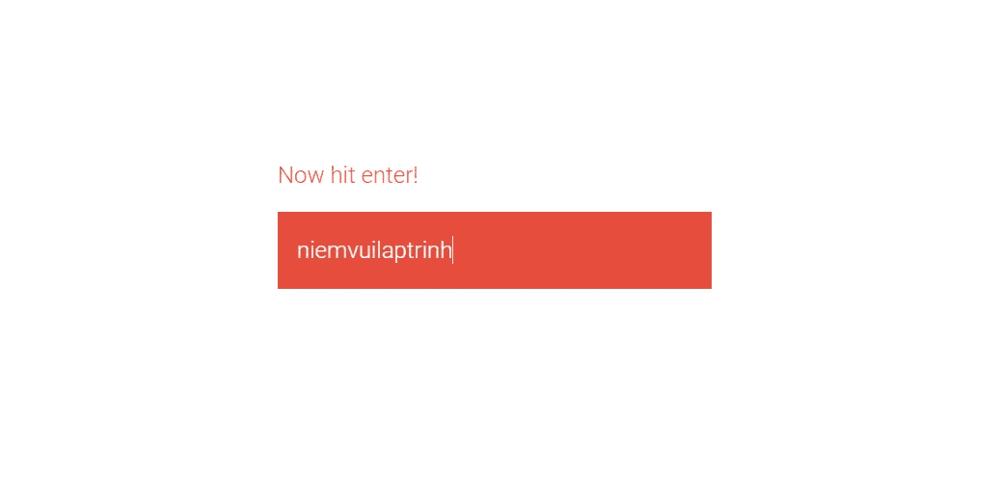

电子邮件时事通讯 Javascript

你可以在下面看到结果。

[链接](https://codepen.io/balapa/pen/ZYPBjZ)

# 订阅时事通讯 HTML CSS

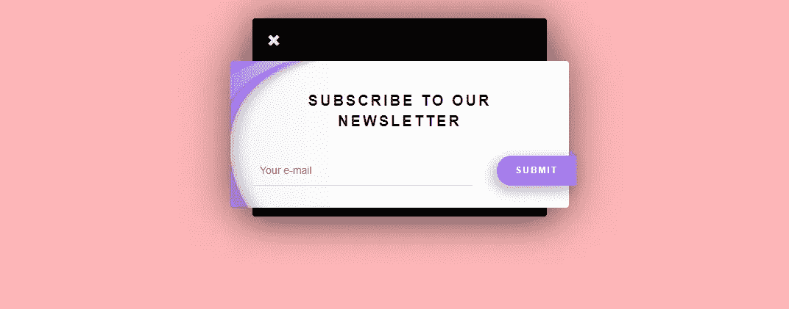

订阅时事通讯 HTML CSS

你可以在下面看到结果。

[链接](https://codepen.io/hugguh/pen/LZRRRX)

# 订阅表单 HTML5 CSS3

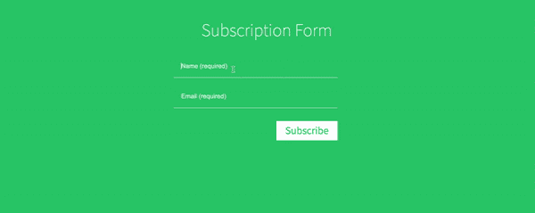

你可以在下面看到结果。

[链接](https://codepen.io/jeyakarthika/pen/plzqy)

# 电子邮件表单响应

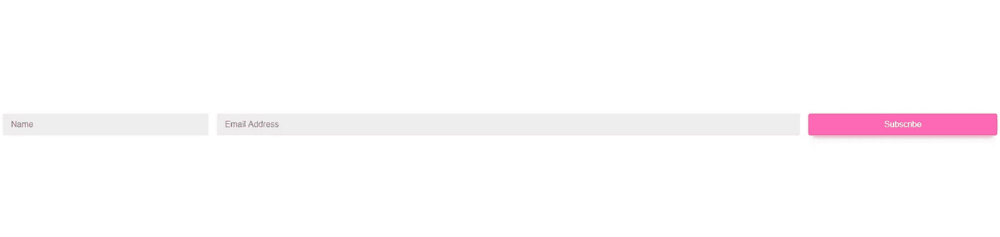

电子邮件表单响应

你可以在下面看到结果。

[链接](https://codepen.io/argyleink/pen/LYEegOO)

# 注册时事通讯 HTML5

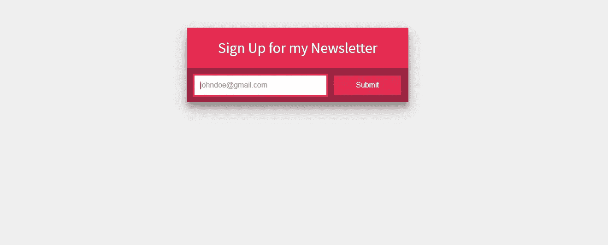

注册时事通讯 HTML5

你可以在下面看到结果。

[链接](https://codepen.io/adamrasheed/pen/QjJYMr)

# 时事通讯订阅表格

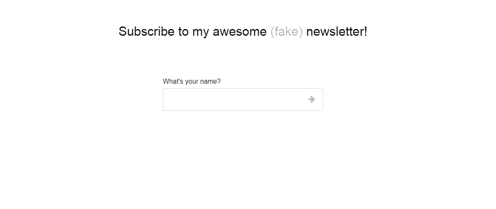

时事通讯订阅表格

你可以在下面看到结果。

[链接](https://codepen.io/designcouch/pen/rVRBee)

# 订阅电子邮件表单

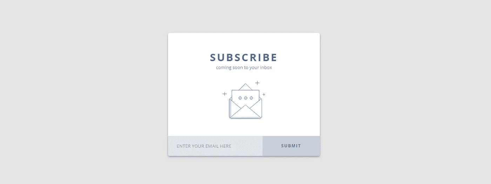

订阅电子邮件表单

你可以在下面看到结果。

[链接](https://codepen.io/iamevg/pen/NrdOLv)

# 时事通讯订阅表单引导

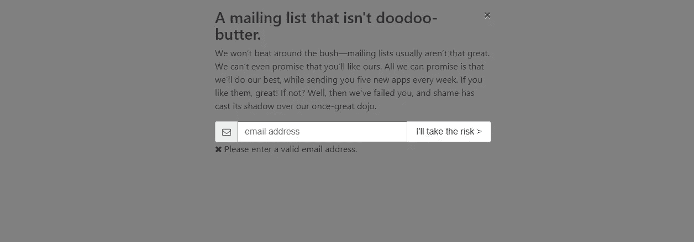

时事通讯订阅表单引导

你可以在下面看到结果。

[链接](https://codepen.io/Jacob-Vogelbacher/pen/NvvbvX)

# 电子邮件简讯 CSS3 Javascript

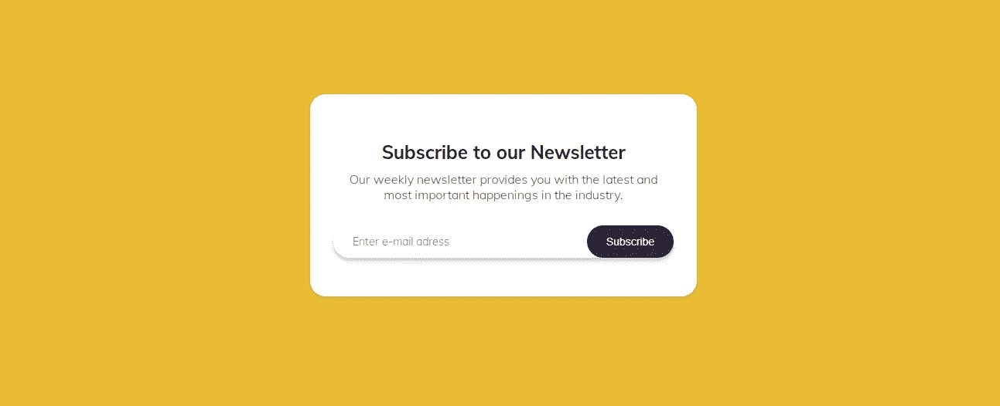

电子邮件简讯 CSS3 Javascript

你可以在下面看到结果。

[链接](https://codepen.io/FlorinPop17/pen/XWWQLxv)

# 表单订阅 CSS3

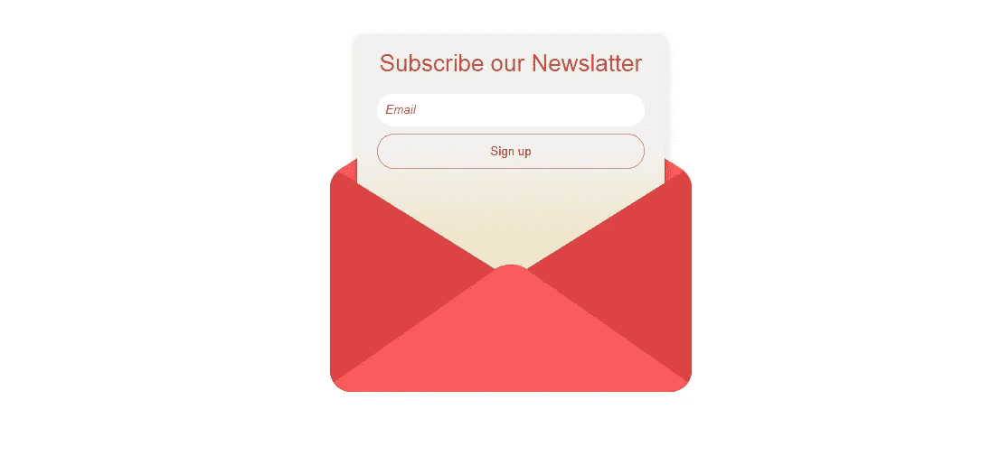

表单订阅 CSS3

你可以在下面看到结果。

[链接](https://codepen.io/satyajit11/pen/bpyRZw)

# 电子邮件简讯

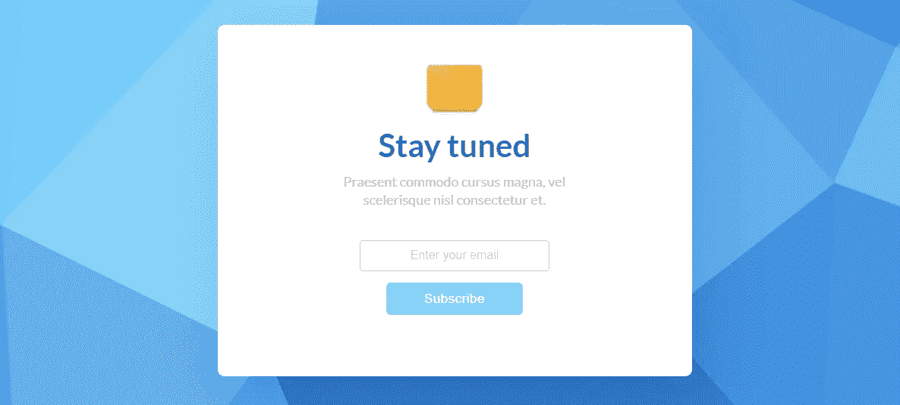

电子邮件简讯

你可以在下面看到结果。

[链接](https://codepen.io/yastrebov/pen/ZPLzxa)

# HTML5 电子邮件表单

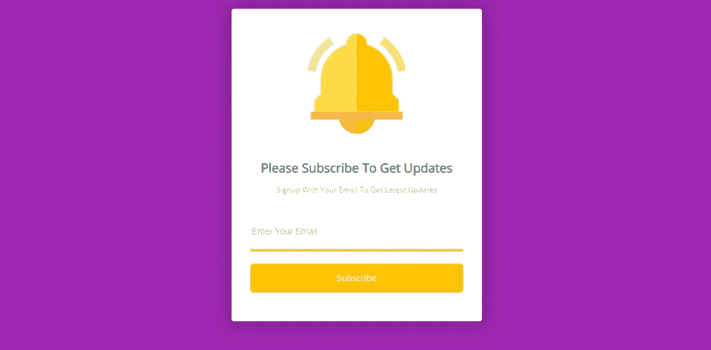

HTML5 电子邮件表单

你可以在下面看到结果。

[链接](https://codepen.io/chouaibblgn45/pen/LjYvpP)

# 订阅表单 HTML CSS

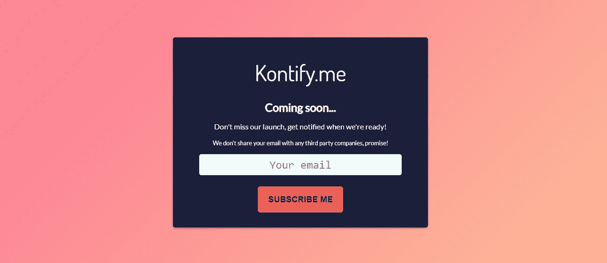

订阅表单 HTML CSS

你可以在下面看到结果。

[链接](https://codepen.io/partisan1991/pen/mjgppO)

# 订阅时事通讯表格

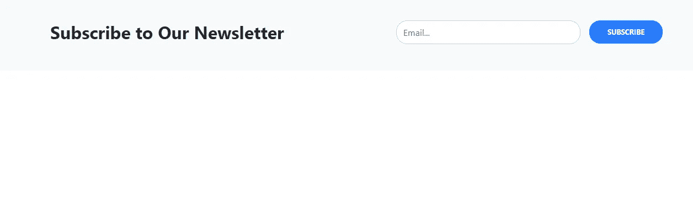

订阅时事通讯表格

你可以在下面看到结果。

[链接](https://codepen.io/WebOut/pen/agvOeq)

# 美丽的网站简讯模板

美丽的网站简讯模板

你可以在下面看到结果。

[链接](https://codepen.io/anupkumar92/pen/OrEjQa)

# 订阅表单弹出窗口

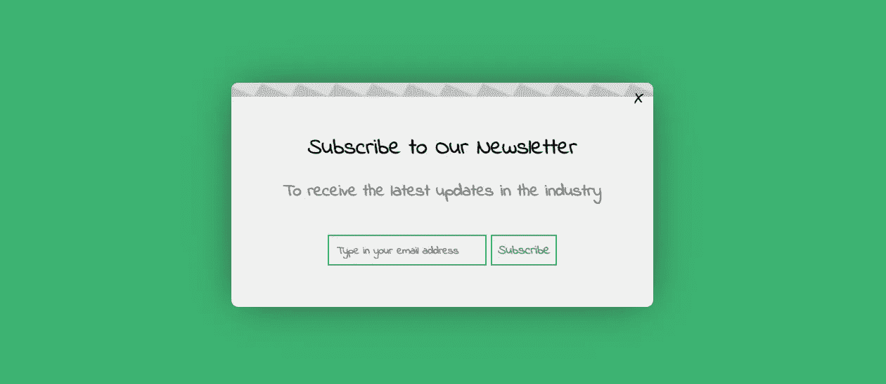

订阅表单弹出窗口

你可以在下面看到结果。

[链接](https://codepen.io/leenalavanya/pen/oxBYdy)

# 订阅表单模板

订阅表单模板

你可以在下面看到结果。

[链接](https://codepen.io/shadeed/pen/wayNJZ)

# 模板新闻稿表单

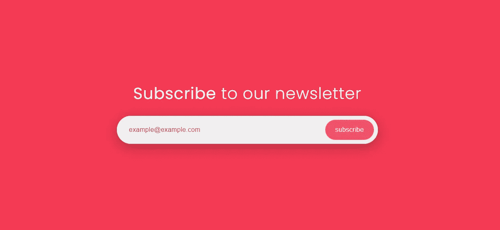

模板新闻稿表单

你可以在下面看到结果。

[链接](https://codepen.io/sazzad/pen/mqwXjP)

# 动画订阅表单

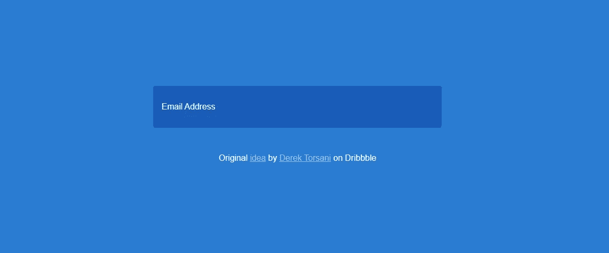

动画订阅表单

你可以在下面看到结果。

[链接](https://codepen.io/shadeed/pen/ojOzEG)

# 表单电子邮件 Javascript

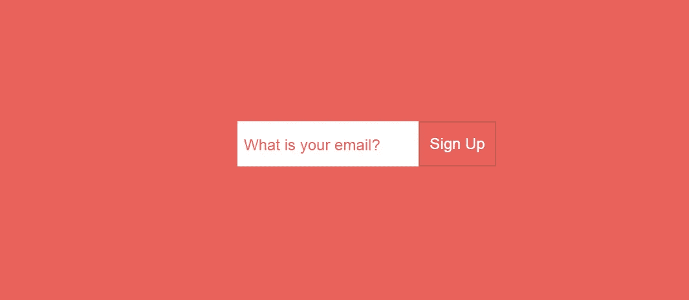

表单电子邮件 Javascript

你可以在下面看到结果。

[链接](https://codepen.io/shadeed/pen/GJQrMo)

# 新闻稿表单 CSS Javascript

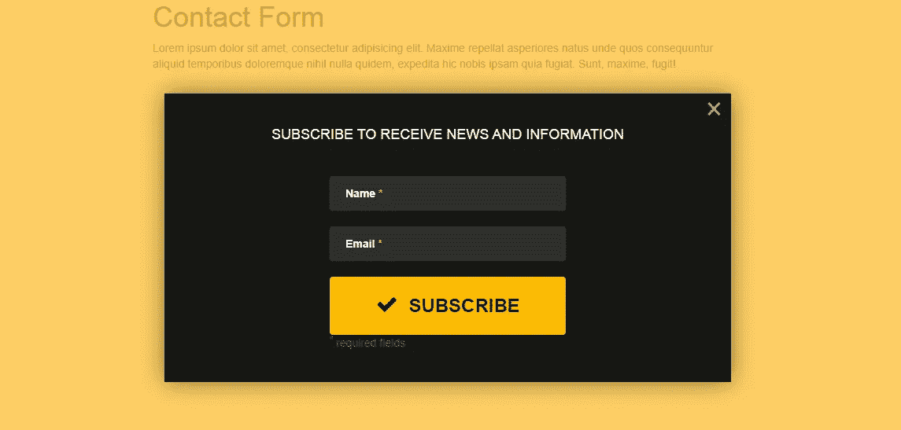

新闻稿表单 CSS Javascript

你可以在下面看到结果。

[链接](https://codepen.io/deniscreative/pen/pwyxWg)

# 电子邮件订阅表单

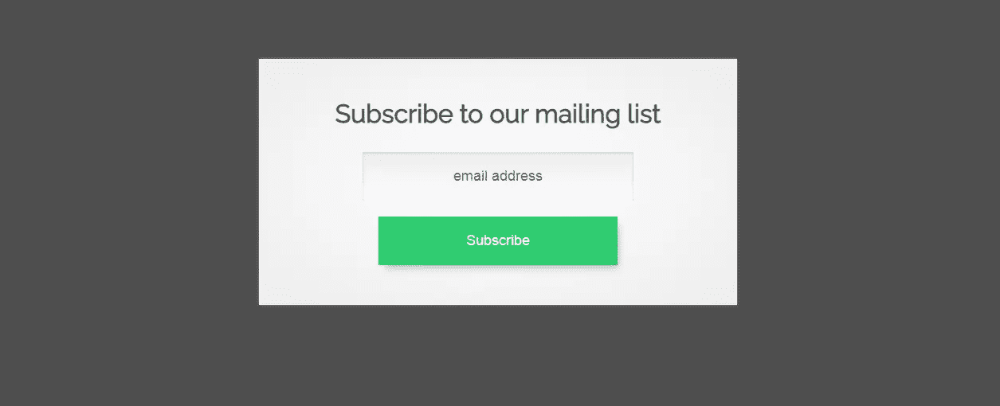

电子邮件订阅表单

你可以在下面看到结果。

[链接](https://codepen.io/udayponarkar/pen/rOBogG)

# 电子邮件订阅表单

电子邮件订阅表单

你可以在下面看到结果。

[链接](https://codepen.io/BeanBaag/pen/mMJqma)

# 总结:

我希望这篇文章能为您提供有用的 web 开发订阅表单，如果您有任何问题，请发邮件给我，我会尽快回复。希望大家继续支持网站，让我能写出更多好文章。祝您愉快！

相关文章:

*   [网站联系人表单 HTML](https://us.niemvuilaptrinh.com/article/32-contact-us-forms-for-website)
*   [用于网页设计的自举表单模板](https://us.niemvuilaptrinh.com/article/10-bootstrap-form-for-web-design)
*   [为网站弹出表单 Html】](https://us.niemvuilaptrinh.com/article/33-pop-up-form-html-for-website)