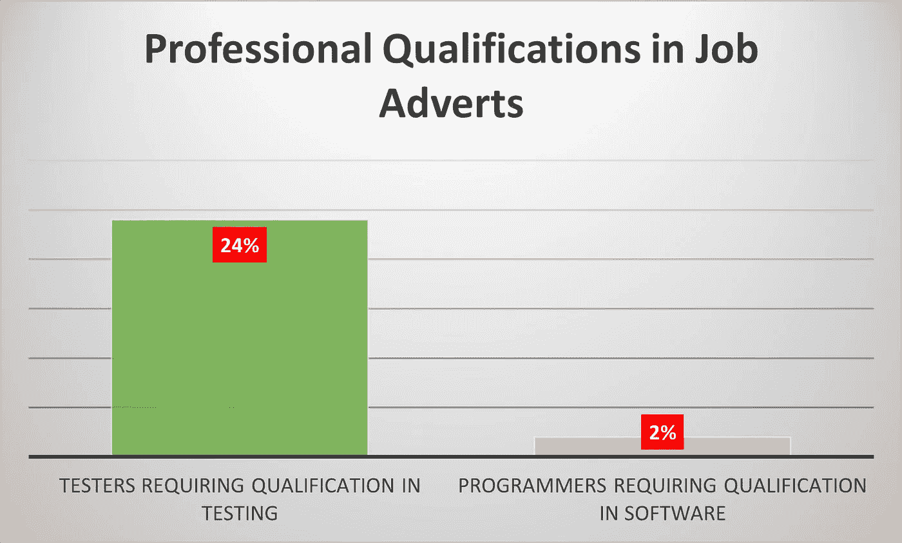
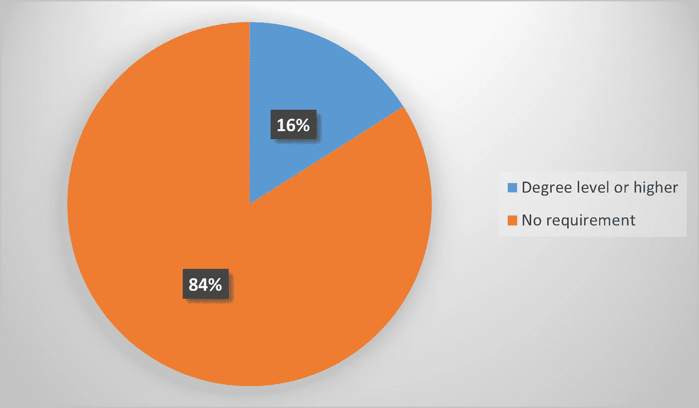
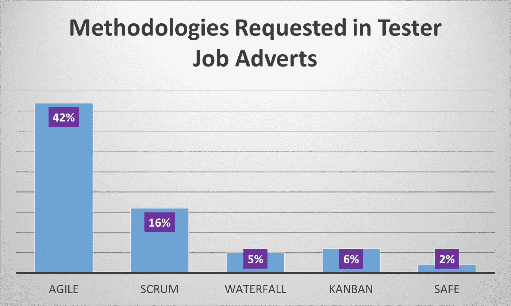
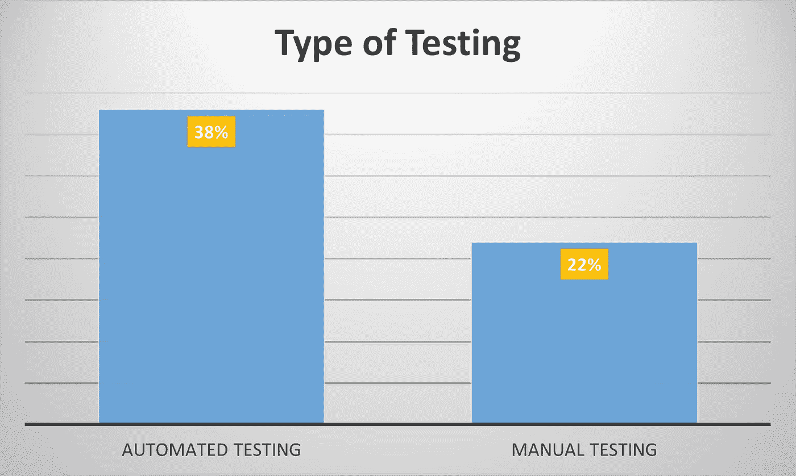
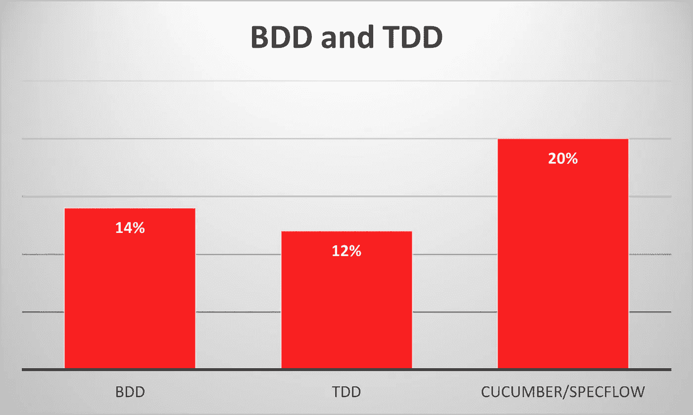
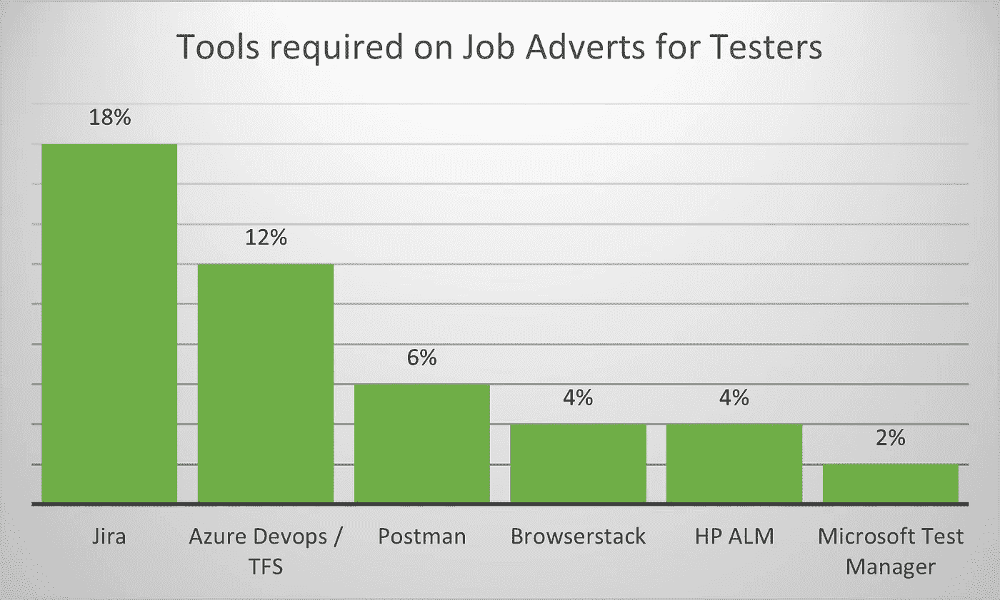
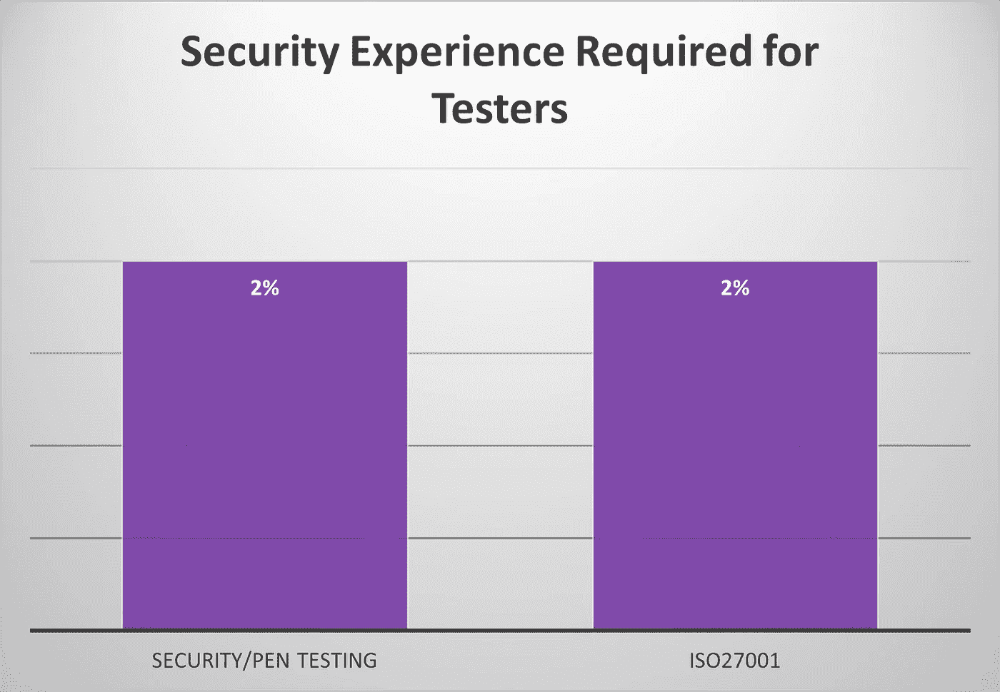
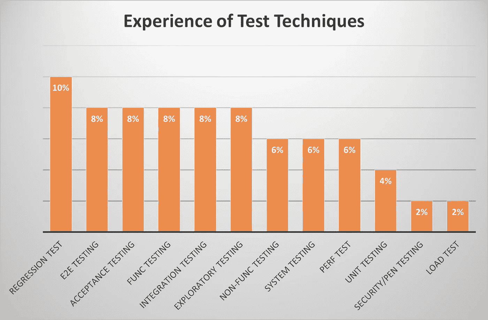

# 24%的测试人员招聘广告需要正式资格，而程序员只有 2%

> 原文：<https://levelup.gitconnected.com/24-of-job-adverts-for-testers-need-formal-qualifications-vs-2-for-programmers-3941917e3a86>

## ISEB/ISTQB 资格证书为专业测试人员树立了标杆

在 [Unsplash](https://unsplash.com?utm_source=medium&utm_medium=referral) 上由[费利佩·格里察](https://unsplash.com/@felipegregate?utm_source=medium&utm_medium=referral)拍摄的照片

6 月份，我对程序员的招聘广告做了一个快速调查，发现只有 2%的广告要求正式资格。这个月我想看看对测试人员来说会不会有什么不同。**哇**，是的，这是一个很大的不同，24%的测试员广告要求 ISEB 或 ISTQB 资格。

ISTQB 专注于美国，而 BCS(前身为 [ISEB)](https://www.bcs.org/media/3225/iseb-itil-presentation-160407.pdf) 专注于英国。英国 BCS 有三个等级(基础、专业、高等),以前叫做 ISEB。然而，BCS 基础级别已经按照 ISTQB 基础进行了标准化，BCS 高级级别按照 ISTQB 高级级别进行标准化。

作为普通教育的一个层次，16%的招聘测试人员的广告要求的教育水平是学位或更高。

当涉及到软件方法时，招聘广告会包含更多关于 SDLC 类型和模型的细节。敏捷是**最受欢迎的**，安全是需求最少的。

不出所料，**自动化测试**是一个很高的要求，38% 的广告要求有经验。人工测试紧随其后，有 22%的广告提到了它。

[**行为驱动开发**](https://blog.testlodge.com/what-is-bdd/) (BDD)和 [**测试驱动开发**](https://medium.com/javascript-scene/testing-software-what-is-tdd-459b2145405c) (TDD)特色鲜明，还有 [**黄瓜**](https://medium.com/@prathore28647/building-cucumber-bdd-api-testing-framework-from-scratch-part-1-add657f9c290)**/小黄瓜/specflow** 作为工具。

测试人员招聘广告中最受欢迎的工具是**吉拉****18%**其次是**微软 Azure devo PS**【TFS】12%。招聘广告通常会要求特定的技能，并给出一个工具的例子

*   *经验问题跟踪工具* ***如*** *吉拉*
*   *体验基于云的浏览器兼容性测试工具* ***示例*** *浏览器堆栈*

这种方法表明，雇主重视基本经验，并欣赏特定工具可以学习。工具通常执行已知的功能，因此学习菜单选项和命令是一件很容易掌握的事情。

安全技能方面的经验要低得多，只有 2%的人需要了解 ISO27001 信息安全管理标准，2%的人需要一些渗透测试的经验。这可能证实了公司倾向于将安全测试分包给专业公司的理论，当他们想要进行渗透测试时，通常是 CREST 认证的。

一些广告包括对精确测试技术的要求，**回归测试**是最常见的标准。

大多数测试自动化的广告也要求特定的软件编程技能，例如 C#、java，然而这些是在更通用的测试技能之上的。

# 摘要

测试人员的招聘广告似乎比程序员的更有条理，因为他们建立在以下要求的基础上:

*   普通教育。
*   专业资格/认证。
*   开发方法的经验。
*   自动和手动测试。
*   特定测试技术的精确经验。
*   再加上自动化程度更高的工作所需的软件语言技能。
*   应用程序编程接口(API)和数据库(SQL)的知识。

与程序员相比，测试部门在检查一般原则和实践方面似乎比精确的语言技能更先进。

# 调查说明

这项调查是通过在英国的一个求职网站上搜索“软件测试员”来完成的，该网站在 2021 年 8 月 9 日发布了过去 7 天的职位。共返回 315 个结果，前 50 个作为样本进行了详细分析。

# 进一步阅读

 [## 96%的雇主不要求扎实的软件技能！

### 他们想要特定语言的编码员，而不是工程师

levelup.gitconnected.com](/96-of-employers-dont-require-solid-software-skills-7ca782375908)  [## 如何准备 ISTQB 基础级和敏捷扩展

### 对于那些不熟悉 sigla ISTQB 的人来说，它代表国际软件测试资格委员会…

blog.devgenius.io](https://blog.devgenius.io/how-to-prepare-for-istqb-foundation-level-and-agile-extension-e1f33501c740)  [## 测试软件:什么是 TDD？

### 问答式实用介绍

medium.com](https://medium.com/javascript-scene/testing-software-what-is-tdd-459b2145405c)  [## 理解行为驱动开发(BDD):

### 什么是 BDD？

revathykrishna-nair.medium.com](https://revathykrishna-nair.medium.com/understanding-behavior-driven-development-bdd-fe7f886e907b) 

# 关于作者的更多信息

**Greg** 是一名经验丰富的软件专业人士，也是[**outsource . dev**](https://outsource.dev/)**，**的首席技术官，他曾在多家公司工作过，现在热衷于帮助他人在软件开发、管理和外包方面取得成功。

如果你喜欢这篇文章，请鼓掌👏和**跟着**我。