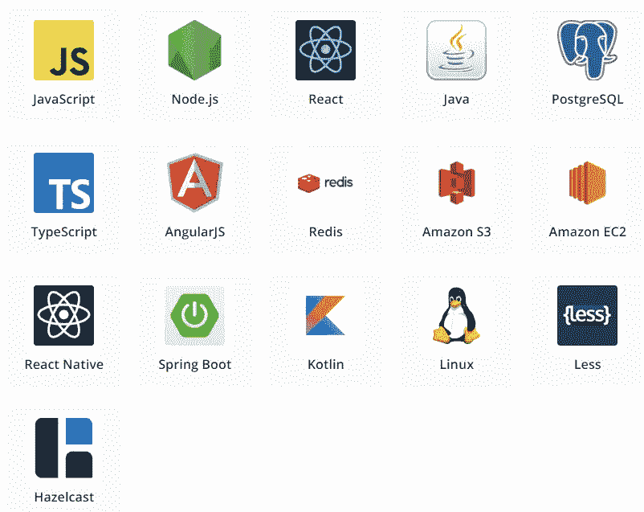
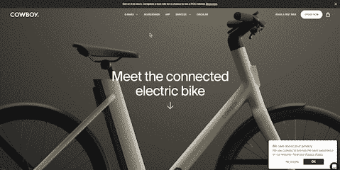

# 如果你热爱设计，你应该看看 25 个漂亮的网站

> 原文：<https://levelup.gitconnected.com/25-beautiful-websites-you-should-look-at-if-you-love-design-c61b3b0c0878>

## 你有没有看过一个网站、产品或设计，然后说“哇！我希望我做到了！”？我们都这样做。

互联网的美妙之处在于，你可以从世界各地的其他人那里得到启发和学习，看看他们的产品和工作。

所以，为了节省你的时间，我整理了一些最漂亮的网站——在别人之前看看吧！


亚历山大·帕萨里克在 Pexels.com 拍摄的照片

如今，有很多网站。试图找出哪些是值得你花时间去做的，这可能会让人不知所措。

如果你正在寻找美丽的网站来获取灵感，看看这个列表就知道了。从简洁简约的设计到更加复杂细致的设计，每个人都能找到自己想要的。

所以，暂时放下手头的工作，去看看这些美丽的网站吧！

# 革命报


Revolut 技术栈

[](https://www.revolut.com) [## 一个应用程序，所有的钱

### 从简单的资金管理，到旅行津贴和投资。在一瞬间打开您的帐户新闻日常必需品制作…

www.revolut.com](https://www.revolut.com) 

# 链接树


Linktree 技术堆栈

[](https://linktr.ee) [## 链接树:链接你的一切

### Linktree 为你们所有人腾出空间。获取您创建、策划和共享的所有内容，无论它们分散在网上的什么地方，并且…

linktr.ee](https://linktr.ee) 

# 弥洛松



米罗技术栈

[](https://miro.com) [## 每个团队的可视化协作平台| Miro

### 面向分布式团队的可扩展、安全、跨设备且企业就绪的团队协作白板。加入 35M+…

miro.com](https://miro.com) 

# 阿罗

[](https://www.goaro.com) [## 更少的屏幕时间。更真实的生活。

### Aro 智能盒子通过 Aro 应用程序自动连接到您的手机，跟踪您的外出时间，并为您的充电…

www.goaro.com](https://www.goaro.com) 

# 格拉扎


Graza 技术堆栈

[](https://www.graza.co) [## 格拉扎

### 现在商店里有很多“特级初榨”油，是由旧的低质量油混合而成的。高品质橄榄油…

www.graza.co](https://www.graza.co) 

# 组成者

[](https://www.framer.com) [## 框架者:用风格装运站点

### 使用专为创意专业人士设计的 web builder Framer，轻松从设计转变为世界级网站。

www.framer.com](https://www.framer.com) 

# 素描


草图技术堆栈

[](https://www.sketch.com) [## 素描

### 有了草图工作空间，你就有了一个存放文件、分享想法、获取反馈、管理团队的家…

www.sketch.com](https://www.sketch.com) 

# 大约


Circa 技术堆栈

[](https://circa.so) [## 大约无代码网站建设者

### 为您的企业提供免费的网站建设工具。开始使用一个可定制的设计模板并填写它…

大约如此](https://circa.so) 

# 格式


格式化技术堆栈

[](https://www.format.com/) [## 创建自己的专业摄影网站

### 展示您的最佳作品与在线投资组合网站和运行您的业务像一个专业的工作流程。加入…

www.format.com](https://www.format.com/) 

# 概念


概念技术栈

[](https://notion.so) [## 概念—一个工作空间。每个队。

### 我们不仅仅是医生。或者一张桌子。定制观念，以您的方式工作。

想法.所以](https://notion.so) 

# 吻合


燕尾技术栈

[](https://dovetailapp.com/) [## 客户知识平台—燕尾榫

### 借助回放功能，您的团队可以在一个位置策划见解，并将一系列零散的报告…

dovetailapp.com](https://dovetailapp.com/) 

# Gumroad


Gumroad tech stack(注意:它是基于 webflow 构建的！)

[](https://gumroad.com) [## gum road——出售你所知道的，看看什么能坚持下去

### 通过简单的帖子、电子邮件简讯和自动化的工作流程建立忠实的追随者。另外，让您的客户支付…

gumroad.com](https://gumroad.com) 

# 顺风


顺风科技栈

[](https://tailwindcss.com/) [## 顺风 CSS——无需离开你的 HTML 就能快速建立现代网站。

### 顺风 CSS 框架的文档。

tailwindcss.com](https://tailwindcss.com/) 

# 二二


TWOTWO tech stack (Shopify 始终在电子商务领域占据主导地位)

[](https://twotwo-official.com/) [## two two——一家社会体育公司

### 欧盟境内免费送货— 90 天无风险球拍试用 90 天无风险球拍试用通过 Klarna 或 Paypal 支付“用于…

twotwo-official.com](https://twotwo-official.com/) 

# 管

[](https://pipe.com) [## 按您的方式发展| Pipe

### 对于有经常性收入的公司，Pipe 将经常性收入转化为增长的前期资本，而无需…

pipe.com](https://pipe.com) 

# 要点


点技术栈

[](https://www.point.app) [## 点卡

### 旨在跟上您的步伐—配置您的奖励并兑换您的方式。你说了算。

www.point.app](https://www.point.app) 

# 种类


条纹技术堆栈

[](https://stripe.com/en-gb-pl) [## Stripe |互联网支付处理平台

### 对于世界各地雄心勃勃的公司来说，Stripe 让资金转移变得像其他公司一样简单、无边界和可编程…

stripe.com](https://stripe.com/en-gb-pl) 

# Auth0


Auth0 技术栈(注意:Contentful 似乎是一个非常常见的 CMS)

[](https://auth0.com) [## Auth0:每个人的安全访问。但不是任何人。

### 阅读客户案例→从通过无缝登录改善客户体验到让 MFA 变得只需点击一下…

auth0.com](https://auth0.com) 

# 牛仔



牛仔技术栈

[](https://cowboy.com) [## 牛仔——城市骑行者的电动自行车

### 我们很高兴你的朋友送你过来。我们的推荐计划暂时暂停，我们正在开发激动人心的更新…

cowboy.com](https://cowboy.com) 

# 滑音


Glide 技术堆栈

[](https://www.glideapps.com) [## glide——无需代码即可创建应用和网站。

### “我们惊讶于在不知道如何编码的情况下，在几个小时内制作我们的应用程序是多么容易，以及该应用程序如何…

www.glideapps.com](https://www.glideapps.com) 

# 氧化物


氧化物技术堆栈

[](https://oxide.computer) [## 氧化物

### 安全源于设计现代化的内部部署，企业环境面临着各种各样的威胁。氧化物产品是专为…

氧化物.计算机](https://oxide.computer) 

# 跳舞


舞蹈技术栈

[](https://dance.co) [## 跳舞

### 跳转到内容使用我们灵活的订阅 1 获得您自己的电子自行车或表情。选择你的城市 2。选择您的骑行 3…

dance.co](https://dance.co) 

# 光线投射


Raycast 技术堆栈

[](https://www.raycast.com) [## Raycast —超高生产力

### 解答简单的数学表达式，转换单位，检查时区，计算日、月、年之间的差异…

www.raycast.com](https://www.raycast.com) 

# 菲格玛


Figma 技术堆栈

[](https://figma.com) [## Figma:协作界面设计工具。

### Figma 将设计过程中的每个人联系起来，这样团队就可以更快地交付更好的产品。开始加入其他…

figma.com](https://figma.com) 

# 蔓延


Ramp 技术堆栈

[](https://ramp.com/) [## Ramp —与您一起扩展的公司卡和财务自动化

### 加入数千家使用 Ramp 控制支出、节省时间和自动化繁忙工作的前瞻性企业。

ramp.com](https://ramp.com/) 

# 结论

有这么多漂亮的网站，很难知道从哪里开始。但是这个列表是一个很好的开始。

这些网站都有一些独特的东西可以提供，无论是令人惊叹的视觉效果，创新的设计还是灵感的一般感觉。

所以看一看，哪些最能引起你的共鸣。谁知道呢——也许你会受到启发，自己创造一些美丽的东西，✌️

```
**📩 I have a newsletter.** Every week I’ll send you a brief findings of articles, links, tutorials, and cool things that caught my attention. If this sounds cool to you subscribe. *That means* ***a lot*** *for me.*
```

[](https://weeklynocode.nocodeletters.com) [## 🧰无代码每周发现

### 一份每周精选的最酷的无代码工具清单，让你的企业自动驾驶🕹

weeklynocode.nocodeletters.com](https://weeklynocode.nocodeletters.com)