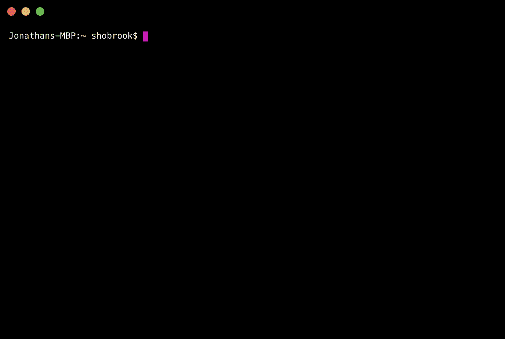

# 每个 Python 开发者都应该知道的 25 个 Github 库

> 原文：<https://levelup.gitconnected.com/25-github-repositories-every-python-developer-should-know-ac848f6aa1fe>

## 帮助您提高数据科学技能的存储库


照片由[海拉戈斯蒂奇](https://unsplash.com/@heylagostechie?utm_source=medium&utm_medium=referral)在 [Unsplash](https://unsplash.com?utm_source=medium&utm_medium=referral) 拍摄

你有没有遇到过这样的问题

1.  FAANG 公司写的代码是什么样的？
2.  我怎么能像他们一样写代码呢？
3.  我现在明白了什么？

你所有问题的答案是 [Github](http://github.com) 。

# 什么是 Github？

学习如何编码是容易的，但是学习如何写更好的代码是困难的。Github 可以准确地向您展示您需要了解的内容。对于开发者来说，这就像一座金矿，金子就是其他开发者写的代码。在 GitHub 的帮助下，你可以学习如何编写更好的代码，代码看起来有多好，以及成为更好的开发人员需要遵循的步骤。

# 你知道吗？

> 根据 Stackoverflow 的说法，Python 是最受欢迎的语言。大多数开发人员使用 python。
> 
> 它是 GitHub 第二受欢迎的语言。
> 
> Python 的包库中有超过 147，000 个包。
> 
> 据报道，它是数据科学中最常用和最好的工具之一。

# 仓库

本文中包含的大多数存储库都是基于数据科学和机器学习的。让我们将存储库列表分成五个部分。

```
1\. Learning
2\. Books
3\. Projects
4\. Interview Preparation
5\. Frameworks, Modules and Tools
```

# 学问

## 1.[算法— Python](https://github.com/TheAlgorithms/Python) By [算法](https://github.com/TheAlgorithms)

正如库名本身所解释的，这个 repo 包含了几乎所有你需要的算法。你甚至可以使用`pip install algorithms`将回购作为一个包安装

使用 repo 包的合并排序示例。

这个图书馆不限于算法。它还包含矩阵、图形等的不同运算。

**统计数据:(109k+ ⭐) (30.1k+分叉)**

## 2. [vinta/awesome-python](https://github.com/vinta/awesome-python)

令人惊叹的 Python 框架、库、软件和资源的精选列表。

这个库是不言自明的，但是如果你觉得很难理解，他们有自己的[网站](https://awesome-python.com/)和很棒的 GUI。

**统计数据:(99k+ ⭐) (19k+分叉)**

## 3.[偷工减料](https://github.com/jerry-git) / [学习-python3](https://github.com/jerry-git/learn-python3)

这个资源库是学习 python 的 Jupyter 笔记本的集合。这对于希望通过解决问题来弄脏双手的 python 新手来说是最好的。

每个笔记本都包含一些理论、代码和编码练习。

**统计:(3.9k+ ⭐) (1k+分叉)**

## 4.[trekhleb](https://github.com/trekhleb)/[learn-python](https://github.com/trekhleb/learn-python)

📚学习 Python 的操场和备忘单。Python 脚本的集合，按主题划分，包含代码示例和解释。

这是按主题学习 python 的另一个很好的资源库。

**统计:(7.5k+ ⭐) (1.4k+分叉)**

## 5. [Avik-Jain](https://github.com/Avik-Jain) / [百日代码](https://github.com/Avik-Jain/100-Days-Of-ML-Code)

这个存储库最适合所有数据科学学习者。它总共有 100 天的代码，包含不同的主题和算法。

回购中可用的笔记本简单易懂，一目了然。

**统计数据:(32.2k+ ⭐) (8.1k+分叉)**

# 书

## 6.[Python 的搭便车指南](https://github.com/realpython/python-guide):

每日安装、配置和使用 Python 的最佳实践手册。

它包括 Pip、Numpy、scipy、statpy、pyplot、matplotlib、用于各种 web 框架的服务器配置和工具、Virtualenv 以及更多主题。

**统计数据:(23k+ ⭐) (5.6k+分叉)**

## 7。宇宙巨蟒:

一本关于管理复杂性的 Pythonic 应用程序架构模式的书。

**统计数据:(1.9k+ ⭐) (290+分叉)**

## 8。Python 的字节:

“Python 的一个字节”是一本关于使用 Python 语言编程的免费书籍。它为编程初学者提供教程。如果你只知道如何保存文本文件，那么这本书正适合你。

**统计数据:(1.5k+ ⭐) (894+分叉)**

## [9。Python 机器学习](https://github.com/rasbt/python-machine-learning-book-3rd-edition):

它是经典 Python 机器学习书籍的代码库。它包含每章的代码。

**统计数据:(2.2k+ ⭐) (967+分叉)**

[](/35-most-valuable-github-repositories-for-developers-45ab9df1af81) [## 35 个对开发者最有价值的 GitHub 库

### 必须立即检查要添加书签的存储库

levelup.gitconnected.com](/35-most-valuable-github-repositories-for-developers-45ab9df1af81) 

# 开源项目

## 10.[肖布鲁克](https://github.com/shobrook) / [反弹](https://github.com/shobrook/rebound)

一个命令行工具，当抛出异常时，它可以立即获取堆栈溢出结果。在运行程序时使用反弹即可。



[https://github.com/shobrook/rebound](https://github.com/shobrook/rebound)

**统计数据:(3.6k+ ⭐) (336+分叉)**

## 11. [openai](https://github.com/openai) / [健身房](https://github.com/openai/gym)

它是一个用于开发和比较强化学习算法的开源工具包。它兼容任何数值计算库，如 TensorFlow 或 Theano。

以下是他们网站上的[文档](https://gym.openai.com/docs)也可参见[常见问题解答](https://github.com/openai/gym/wiki/FAQ)获取信息。

**统计数据:(24.3k+ ⭐) (7k+分叉)**

## 12.[Facebook research](https://github.com/facebookresearch)/[Detectron](https://github.com/facebookresearch/Detectron)

Dectectron 是脸书人工智能研究小组的一款用于物体检测的软件。它可以轻松实现最先进的对象检测算法，包括 [Mask R-CNN](https://arxiv.org/abs/1703.06870) 。

它是用 Python 编写的，由 caffe2 深度学习框架提供支持。


[https://github.com/facebookresearch/Detectron](https://github.com/facebookresearch/Detectron)

**统计数据:(24.4 公里+⭐)(5.3 公里+分叉)**

## 13.[伊佩罗夫](https://github.com/iperov) / [DeepFaceLab](https://github.com/iperov/DeepFaceLab)

DeepFaceLab 是创建 deepfakes 的领先软件。网上 95%以上的深度假货视频都是用 deep face lab 创作的。

在深度假动作的帮助下，你可以改变脸型，对脸部进行去衰老，替换头部，操纵嘴唇等等。

**统计数据:(26.5k+ ⭐) (6k+分叉)**

## 14. [ageitgey](https://github.com/ageitgey) / [人脸识别](https://github.com/ageitgey/face_recognition)

构建人脸识别应用程序的最佳库。它是 Python 和命令行中最简单的面部识别 API 之一。

人脸识别库为它检测到的每张人脸生成总共 128 个数字指纹。随后，这些指纹被编码成一些矢量编码，这些矢量编码可用于随后对指纹进行解码，并将它们进行比较，以获取该人的标签(姓名)。

**统计数据:(40.1k+ ⭐) (11.2k+分叉)**

## 15.[你得到](https://github.com/soimort/you-get)由[莫特姚](https://github.com/soimort)

这是一个很小的命令行工具，用于从网络上下载媒体内容(视频、音频、图像)。

```
pip install you-get
```

**统计数据:(40.5 公里+⭐)(8.4 公里+分叉)**

# 面试准备

## 16.[唐纳马丁](https://github.com/donnemartin) / [互动-编码-挑战](https://github.com/donnemartin/interactive-coding-challenges)

120+互动 Python 编码面试挑战(算法和数据结构)。包括 Anki 抽认卡。

它有与数组、链表、图形、递归等相关的编程问题。

**统计数据:(22.7k+ ⭐) (3.6k+分叉)**

## 17.[学习区](https://github.com/learning-zone)/[python-面试-提问](https://github.com/learning-zone/python-interview-questions)

300 个 Python 面试问题及解答列表。它还包含许多编程问题的解决方案，如哈希映射。

**统计数据:(313+ ⭐) (85+分叉)**

## 18.[知乎](https://github.com/zhiwehu)/[Python-编程-练习](https://github.com/zhiwehu/Python-programming-exercises)

100+不同级别的 Python 挑战性编程练习。

**统计数据:(15.7k+ ⭐) (5.8k+分叉)**

## 19. [MTrajK](https://github.com/MTrajK) / [编码问题](https://github.com/MTrajK/coding-problems)

这个库包含各种编码/算法问题的解决方案和许多学习算法和数据结构的有用资源。

它包含数组、链表、树、散列 DS、动态编程、字符串、数学等问题和解决方案。

**统计数据:(1.9k+ ⭐) (348+分叉)**

# 框架、模块和工具

下面提到的包可以帮助你理解由大公司开发的大项目中的代码是如何编写的。通过看一看 repos 中可用的代码，你可以很容易地提高你的编码技能。

## 20.[张量流](https://github.com/tensorflow) / [张量流](https://github.com/tensorflow/tensorflow)

Tensorflow 是 Google 官方开源的端到端机器学习平台。它有一个全面、灵活的工具和库生态系统，使开发者能够轻松地构建和部署 ML 应用。

它提供了 python 中的稳定版本。使用 pip 可以很容易地安装它。

**统计数据:(156k+ ⭐) (84.8+分叉)**

## 21.[用](https://github.com/plotly/dash)[点划](https://github.com/plotly)

用于 Python、R、Julia 和 Jupyter 的分析 Web 应用程序的 Python 框架。不需要 JavaScript。

它是构建 ML 和数据科学应用程序最受信任和下载量最大的 python 包。

它构建在 plotly.js 之上，这也是一个很好的数据可视化包。

**统计数据:(14.6k+ ⭐) (1.5k+分叉)**

## 22.[细流](https://github.com/streamlit) / [细流](https://github.com/streamlit/streamlit)

Streamlit 提供了用 Python 构建数据应用程序的最快方法。Streamlit 让您可以在几分钟内将数据脚本转换为可共享的 web 应用程序，而不是几周。

全是 Python，开源，免费！一旦你创建了一个应用程序，你就可以使用他们的免费共享平台来部署、管理和分享你的应用程序。

**统计数据:(14.7k+ ⭐) (1.3k+分叉)**

## 23.[scikit-learn](https://github.com/scikit-learn)/[scikit-learn](https://github.com/scikit-learn/scikit-learn)

scikit-learn 是一个基于 SciPy 构建的用于机器学习的 Python 模块，在 3 条款 BSD 许可下发布。

它是用于执行机器学习任务的最常用和最著名的模块之一。它有各种算法和数据分析概念预构建。

**统计数据:(45.8k+ ⭐) (21.5k+分叉)**

## 24.[姆瓦斯科姆](https://github.com/mwaskom) / [海博恩](https://github.com/mwaskom/seaborn)

Seaborn 是一个用于统计数据可视化的 python 库，构建于 matplotlib 库之上。Seaborn 提供了多种可视化模式和图形。它使用简单的语法和好看的可视化，如盒图、计数图、小提琴图、直方图等。

**统计数据:(8.5k+ ⭐) (1.4k+分叉)**

## 25. [numpy](https://github.com/numpy) / [numpy](https://github.com/numpy/numpy)

NumPy 是使用 Python 进行科学计算所需的基础包。

它代表数值 python，是一个用于各种科学计算的 Python 库。它由许多多维数组和一组处理它们的例程组成。

它通过添加大量高级数学函数，增加了对矩阵和大型多维数组的支持。

**统计数据:(17.3k+ ⭐) (5.6k+分叉)**

# 奖金库

## [**1。基于项目的学习/tuvtran**](https://github.com/tuvtran/project-based-learning#python)

这个库包含了不同编程语言的不同教程，比如 python、go、PHP、Java 等等，总共有 20 种编程语言。回购的主要目的是关注基于项目的学习。他们的 Python 部分包括大量用于构建大量项目的教程，从 web 抓取器、机器人和 web 应用程序到构建数据科学、机器学习和深度学习解决方案。

**统计:(50.6k+ ⭐) (7.9k+分叉)**

## 2.[公共 API](https://github.com/public-apis)/[公共 API](https://github.com/public-apis/public-apis)

用于软件和 web 开发的免费 API 集合列表。

**统计数据:(126k+ ⭐) (15.4k+分叉)**

## 3.[电子书基金会](https://github.com/EbookFoundation) / [免费编程书籍](https://github.com/EbookFoundation/free-programming-books)

它包含了一个免费编程书籍的学习列表。它有超过 1.5 个贡献者和超过 10，000 本免费书籍 pdf。它支持许多不同的语言，如中文，荷兰语，俄语，意大利语，等等。

**统计数据:(190k+ ⭐) (42.4k+分叉)**

## 作者✍的一些精选文章

```
[**A Quick Look At The Object Oriented Programming In Python**](https://medium.com/pythoneers/a-quick-look-at-object-oriented-programming-oop-in-python-975fc3cb9618)[**10 Advance Python Concepts To Level Up Your Python Skills**](/10-advance-python-concepts-to-level-up-your-python-skills-da3d6284ad53)[**10 Facts You didn't Know About Python**](https://medium.com/pythoneers/10-facts-you-didnt-know-about-python-b18d87529c23)[**10 Python Tricks For Speed Up Your Code**](/10-python-tricks-for-speed-up-your-code-8c189d8c99b6)[**10 Must Known Build In Functions In Python**](https://medium.com/pythoneers/10-must-known-built-in-functions-in-python-2f196b9c0359)[**15 Python Packages You Probably didn't know Existed**](https://medium.com/pythoneers/15-python-packages-you-probably-dont-know-exits-aef0525a965f)[**The 7 Stages For Preparing Data For Machine Learning**](https://pub.towardsai.net/the-7-stages-of-preparing-data-for-machine-learning-dfe454da960b)
```

# 分级编码

感谢您成为我们社区的一员！[订阅我们的 YouTube 频道](https://www.youtube.com/channel/UC3v9kBR_ab4UHXXdknz8Fbg?sub_confirmation=1)或者加入 [**Skilled.dev 编码面试课程**](https://skilled.dev/) 。

[](https://skilled.dev) [## 编写面试问题+获得开发工作

### 掌握编码面试的过程

技术开发](https://skilled.dev)