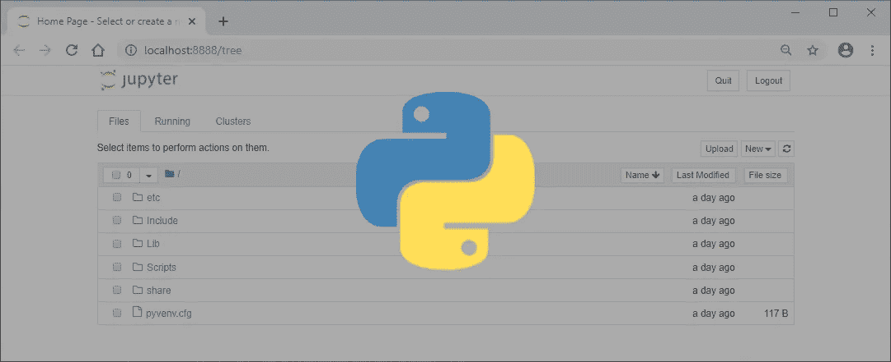
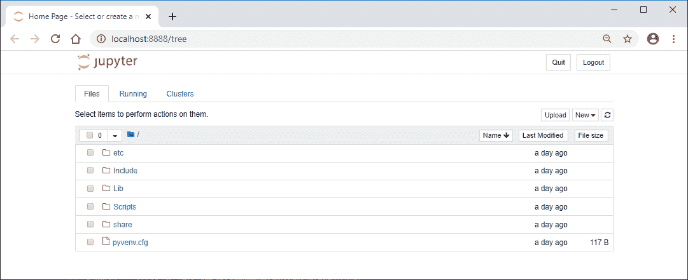
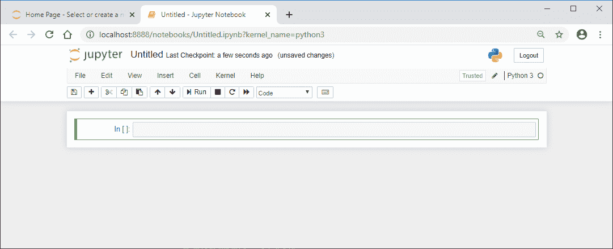

# Jupyter 笔记本的 25+有用命令

> 原文：<https://levelup.gitconnected.com/25-useful-commands-for-jupyter-notebook-3ec48bf0542c>



Jupyter Notebook 是一个有用的开源 web 应用程序，用于所有类型的数据转换、建模和可视化。

下面是安装 Jupyter Notebook 和使用命令在应用程序中处理数据集的快速复习。

让我们直接跳进来吧！

***注意:*** *对于本教程，您需要在您的计算机上安装* [*Python 编程语言*](https://www.python.org/) *。*

**创建并激活虚拟环境**

*macOS 终端*

```
User-Macbook:~ user$ cd desktopUser-Macbook:desktop user$ python3 -m venv jupUser-Macbook:desktop user$ cd jupUser-Macbook:jup user$ source bin/activate
```

*Windows 命令提示符*

```
C:\Users\Owner> cd desktopC:\Users\Owner\desktop> py -m venv jupC:\Users\Owner\desktop> cd jupC:\Users\Owner\desktop\jup> Scripts\activate
```

首先，在 Mac 上键入`python3 -m venv env`或者在 Windows 上键入`py -m venv env`来[创建一个名为`jup`的虚拟环境](https://www.ordinarycoders.com/blog/article/python-virtual-environment)。

然后`cd`进入新目录并激活虚拟环境，以便在下一步中正确安装 JupyterLab 桌面应用程序。

**安装 JupyterLab 桌面应用**

*如何在 macOS 终端上安装 JupyterLab*

```
(jup)User-Macbook:jup user$ pip install jupyterlab
```

*如何在 Windows 命令行安装 JupyterLab*

```
(jup)C:\Users\Owner\desktop\jup> pip install jupyterlab
```

用命令`pip install juypterlab`安装 JupyterLab，笔记本的交互式开发环境。这可能需要几分钟时间。

**在浏览器中打开 JupyterLab**

*在 macOS 终端上打开 JupyterLab*

```
(jup)User-Macbook:jup user$ jupyter notebook
```

*在 Windows 命令提示符下打开 JupyterLab*

```
(jup)C:\Users\Owner\desktop\jup> jupyter notebook
```

安装完成后，用简单的命令`juypter notebook`在浏览器中打开 JupyterLab 桌面应用程序。

你把*而不是*的光盘放进 Jupyter 的笔记本里。



然后，您的虚拟环境文件夹将出现在浏览器窗口中。

**如何创建新的 Jupyter 笔记本**

点击屏幕右侧的“新建”按钮，然后选择“Python3”。

一个无标题的 Jupyter 笔记本将在一个新的标签中创建。



**在 Jupyter 笔记本中安装 numpy pandas nltk**

```
import sys
!{sys.executable} -m pip install numpy pandas nltk
```

在第一个单元格中输入命令`pip install numpy pandas nltk`。单击 Shift + Enter 运行单元格的代码。一个星号将出现在括号中，表示它正在运行代码。

完成后，下面会出现一个新的单元格。现在，您可以使用 Python 命令加载和清理数据了。

**如何导入熊猫并载入你的文件**

*将熊猫导入 Jupyter 笔记本，然后载入 JSON 文件*

```
import pandas as pd
df = pd.read_json(r'C:\Users\Owner\Desktop\data.json')
```

*将熊猫导入 Jupyter 笔记本，然后载入 CSV 文件*

```
import pandas as pd
df = pd.read_csv(r'C:\Users\Owner\Desktop\data.csv')
```

*将熊猫导入 Jupyter 笔记本，然后载入 excel 文件*

```
import pandas as pd
df = pd.read_excel(r'C:\Users\Owner\Desktop\data.xls')
```

在新的牢房`import pandas as pd`。然后设置一个变量，在本例中是 dataframe 的`df`，作为`pd.read_doctype(r'full_path_to_file')`。

运行手机。

**如何在笔记本中显示数据框**

*显示 Jupyter 笔记本中的数据帧*

```
df
```

运行`df`显示 Jupyter 笔记本中的数据帧。

**使用列**

*显示 Jupyter 笔记本中的所有栏目*

```
df.columns
```

列出数据框中所有列的名称。

*显示 Jupyter 笔记本中的特定列*

```
df['column_name']df['column_name1', 'column_name2', 'column_name3']
```

通过调用一个特定列或多个列的名称来显示它们。

*在 Jupyter 笔记本中按字母顺序排列栏目*

```
df.sort_values('column_name')df.sort_values('column_name', ascending=False)
```

按指定列的字母顺序显示数据框。添加`ascending=False`按字母降序排序。

*删除 Jupyter 笔记本中的栏目*

```
df = df.drop(columns = ['column_name']))
```

从数据集中删除指定的列。

*从 Jupyter 笔记本中的现有栏创建新栏*

```
df['new_column'] = df['column_name1'] + df['column_name2']
```

创建一个新列，该列等于第 1 列和第 2 列数据之和。

**使用行**

*显示 Jupyter 笔记本的第一行*

```
df.head()df.head(10)
```

显示数据框的前 5 行。在括号中添加一个数字，将显示该行数。

*显示 Jupyter 笔记本的最后几行*

```
df.tail()df.tail(10)
```

显示数据框的最后 5 行。在括号中添加一个数字，将显示该行数。

*在 Jupyter 笔记本中显示一系列行*

```
df.iloc[0:5]
```

显示数据框的第 0–4 行。请注意，数据框从 0 而不是 1 开始计算行/列数。

**使用列和行**

*在 Jupyter 笔记本中按行和列定位特定值*

```
df.iloc[2,1]
```

在指定位置显示特定值。上面的示例定位第 2 行第 1 列中的值。

*在 Jupyter 笔记本中按列定位特定行*

```
df.loc[df['column_name'] == 'column_value']
```

显示符合指定列值的所有行。

*在 Jupyter 笔记本*中找到符合所有列值的特定行

```
df.loc[(df['column_1'] == 'column_value') & df.loc(df['column_2'] == 'column_value')]
```

显示具有第 1 列的特定列值*和第 2 列的特定列值*的所有行。

*在 Jupyter 记事本*中定位符合其中一个列值的特定行

```
df.loc[(df['column_1'] == 'column_value') | df.loc(df['column_2'] == 'column_value')]
```

显示第 1 列的特定列值为*或第 2 列的特定列值为*的所有行。

*在 Jupyter 笔记本*中定位包含某个单词的列中的特定行

```
df.loc[df['column_1'].str.contains('word')]
```

列出第 1 列中包含指定单词的所有行。

*在 Jupyter 笔记本中删除包含某个单词的列中的特定行*

```
df.loc[~df['column_1'].str.contains('word')]
```

删除第 1 列中包含指定单词的所有行。

**改变数据类型**

*查看 Jupyter 笔记本中的数据类型*

```
df.dtypes
```

输出每列的数据类型(即 object，int32，datetime64…)。

*将 Jupyter 记事本中的数据类型改为整数*

```
df.column_name.astype(int)
```

将指定列的数据类型从字符串更改为整数。

*将数据更改为日期时间字段*

```
pd.to_datatime(df.column_name)
```

**将指定列的数据类型从字符串更改为日期/时间整数。**

**整体处理数据集**

*重置 Jupyter 笔记本中的索引*

```
df.reset_index(drop=True, inplace=True)
```

如果删除或更改行的顺序，请重置数据框的索引。

*在 Jupyter 笔记本中列出重复项*

```
df.drop_duplicates()
```

识别数据集中的重复项。

*删除 Jupyter 笔记本中的副本*

```
df.drop_duplicates()
```

从数据集中删除任何重复的行。

*在 Jupyter 笔记本中组合数据帧*

```
data = pd.concat([df1, df2, df3])
```

将每个数据框中的所有数据组合成一个新的数据集。

**将更新的数据帧保存为文件**

*在 Jupyter 笔记本中创建并保存 JSON 文件*

```
df.to_json('name_of_new_file.json')
```

将现有数据框另存为新的 CSV 文件。

*在 Jupyter 笔记本中创建并保存 CSV 文件*

```
df.to_csv('name_of_new_file.csv')
```

将现有数据框另存为新的 CSV 文件。

*在笔记本上创建并保存索引的 excel 文件*

```
df.to_excel('name_of_new_file.xlsx', index=False)
```

将现有数据框另存为不带索引号的新 excel 文件。注意，`index=False`可以添加到其他。

*原载于*[*https://www.ordinarycoders.com*](https://www.ordinarycoders.com/blog/article/25-python-commands-jupyter-notebook)*。*