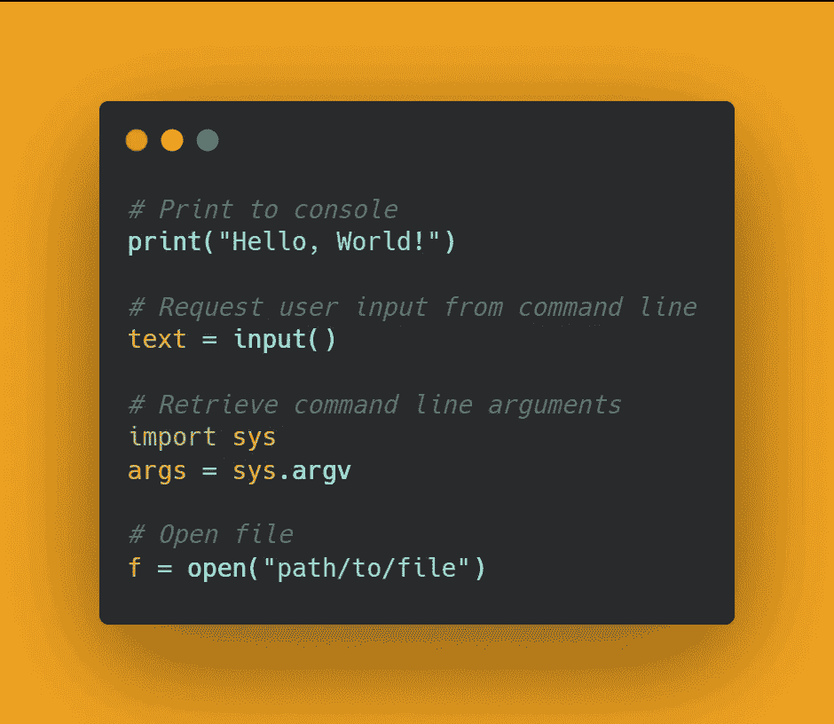

# 针对日常问题的 25 个有用的 Python 片段

> 原文：<https://levelup.gitconnected.com/25-useful-python-snippets-for-everyday-problems-4e1a74d1abae>

## 以下是我为您的日常 Python 问题提供的 25 个有用且省时的片段



毫无疑问，Python 是 web 开发、应用开发、安全和数据科学的顶级编程语言之一。为了让你的 Python 编码**省时**和**简单**，我为你收集了一些片段。

在这篇文章中，我将向你展示对你的日常问题最有用的片段。这些片段很容易理解和掌握。

# 👉1# —对列表进行排序

这个片段我主要用来快速排序列表。这是 python 中的一个内置方法，可以用来对大列表或小列表进行排序。

```
lst= ["Mango", "PineApple", "Orange", "Apple"]#method 1 
lst.sort()
print(lst) # ['Apple', 'Mango', 'Orange', 'PineApple']#method 2 generic sorting
new_lst = sorted(lst)
print(new_lst) # ['Apple', 'Mango', 'Orange', 'PineApple']#reverse sorting
new_lst = sorted(lst, reverse=True)
print(new_lst)# ['PineApple', 'Orange', 'Mango', 'Apple']
```

# 👉2# —对字典进行排序

这个代码片段对 python 中的字典排序很有用。我们将使用在列表排序片段中学到的类似方法。

```
d = {1: 2, 3: 4, 4: 3, 2: 1, 0: 0}#method 1
new_dict = {k: v for k, v in sorted(d.items(), key=lambda item: item[1])}
print(new_dict) # {0: 0, 2: 1, 1: 2, 4: 3, 3: 4}#method 2
new_dict = dict(sorted(d.items(), key=lambda item: item[1]))
print(new_dict) # {0: 0, 2: 1, 1: 2, 4: 3, 3: 4}
```

# 👉3# —在同一行打印

无论何时调用 Python `print`函数，默认情况下它都会在每一个新行中输出数据。这段代码将展示如何在同一行中输出数据。

```
#method 1
print("I'm a Python", end=" ")
print("Programmer")#method 2
import sys
sys.stdout.write("I'm a Python")
sys.stdout.write(" Programmer")
```

# 👉4# —合并两个字典

这个片段的名字将向你展示如何将两个字典合并成一个。我们将用一种通用且简单的方法来检查下面的代码示例。

```
def merge_two_dict(x, y):
    z = x.copy()
    z.update(y)
    return zx = {"A" : 1, "B" : 2}
y = {"C" : 3, "D" : 4}merge_two_dict(x, y) # {'A': 1, 'B': 2, 'C': 3, 'D': 4}
```

# 👉5# —反向

这个代码片段将向您展示如何反转整数和字符串数据。

```
def reverse(data):
    return data[::-1]reverse("Python") #nohtyP
reverse("23354") #45332
```

# 👉6# —检查重复项

当您要检查一个列表是否包含重复项时，这个代码片段将会派上用场。

```
def check_duplicates(lst):
    return len(lst) != len(set(lst))lst1 = [1, 2, 3, 3]
lst2 = [1, 2, 3]
print(check_duplicates(lst1)) # True
print(check_duplicates(lst2)) # False
```

# 👉7# —唯一过滤器

这段代码片段将向您展示如何从列表中筛选出唯一的值。简而言之，你现在可以快速简单地删除重复的内容。

```
mylist = [1, 2, 3, 2, 5, 6, 6, 5, 7]unique = list(set(mylist))
print(unique) #[1, 2, 3, 5, 6, 7]
```

# 👉8# —数字化

数字化意味着将任何数字转换成数组或列表形式。这段代码片段将向您展示如何使用一些内置方法来实现这一点。

```
def Digitize(num):
  return list(map(int,str(num)))print(Digitize(321)) # [3, 2, 1]
print(Digitize(900)) # [9, 0, 0]
```

# 👉9# —字节大小

使用`len`和`encode`方法，我们可以找到任何字符串的字节大小。

```
def byte_size(string):
  return len(string.encode('utf-8'))byte_size("hello") # 5
byte_size("Python Programming") #18
```

# 👉10 #—相似性

这段代码将告诉你如何从两个不同的列表中找到相似的元素。当你在处理两个大的列表时，这将非常有用。

```
def similarity(x, y):
    return [item for item in x if item in y]x = [1, 2, 3, 4, 5]
y = [1, 2, 3]similarity(x,y) #[1, 2, 3]
```

# 👉11# —内存使用

这段代码片段将向您展示如何检查变量占用了多少内存。变量可以是任何类型的数据字符串、整数布尔值等。

```
import sysvar1 = 500
var2 = "Python"print(sys.getsizeof(var1)) # 28
print(sys.getsizeof(var2)) # 55
```

# 👉12# —获取元音

这是检查字符串中元音的简单方法。下面的代码片段使用列表理解，并返回字符串中的元音列表。

```
def GetVowels(string):
    return [item for item in string if item in 'aeiou']print(GetVowels("asert")) # ['a', 'e']
print(GetVowels("football")) # ['o', 'o', 'a']
```

# 👉13 #—检查回文

下面的代码片段用于检查一个字符串是否是回文。

```
def palindrome(string):
    return string == string[::-1]print(palindrome('mom')) # True
print(palindrome('bob')) # True
print(palindrome('desk')) # False
```

# 👉14 #—快速交换方式

这段代码片段将向您展示交换这两个值的最快和最简单的方法。我在下面提到新旧方法来做到这一点。

```
#old method
a = 5
b = 6
temp = a
a = b
b = temp 
print(a, b) # 6 5#new and fast method
a = 5
b = 6
a, b = b, a
print(a, b) # 6 5
```

# 👉15# —随机播放

通过使用一个随机的内置库，我们可以以一种简单的方式打乱列表。查看下面的代码片段示例。

```
import randomlst = [1, 2, 3, 4, 5]
random.shuffle(lst)
print(lst) # [1, 2, 3, 5, 4]random.shuffle(lst)
print(lst) # [4, 2, 5, 3, 1]
```

# 👉16 #—错误处理

这个代码片段对你很有用，因为它会教你如何在不终止程序的情况下处理运行时的错误。

```
try:
    print(a) # a not defined error occur
except:
    print(b) # b not defined again error
else: 
    print("Program is still running, Error is handled")
```

# 👉17# —放大首字母

这段代码将使字符串中每个字符的第一个字母大写。

```
string1 = "python programming language"
print(string1.title()) # Python Programming Languagestring2 = "learn python"
print(string2.title()) # Learn Python
```

# 👉18 #—获取列表的头部和尾部

这段代码片段将向您展示如何以一种简单的方式获得列表的头部和尾部索引。

```
def head(lst):
    return lst[0]def tail(lst):
    return lst[len(lst) - 1]lst = [1, 2, 3, 4, 5]
print(head(lst)) # 1
print(tail(lst)) # 5
```

# 👉19# —主要检查

检查质数有时会让初学者感到困惑，为了节省您的时间，这段代码对您很有用。

```
import mathdef is_prime(n):
    if n % 2 == 0 and n > 2: 
        return False
    return all(n % i for i in range(3, int(math.sqrt(n)) + 1, 2))print(is_prime(11)) # True
print(is_prime(4)) # False
```

# 👉20# —用一个范围初始化整数列表

这个代码片段将初始化给定范围内的整数列表。

```
def initialize_list(end, start = 0, steps = 1):
    return list(range(start, end + 1, steps))print(initialize_list(5)) # [0, 1, 2, 3, 4, 5]
print(initialize_list(7, 1)) # [1, 2, 3, 4, 5, 6, 7]
print(initialize_list(8, 1, 2)) # [1, 3, 5, 7] - > with step 2
```

# 👉21# —转换为二进制

这段代码将简单地向您展示如何将整数转换成二进制格式。

```
def convertToBinary(num):
    return bin(num)print(convertToBinary(900)) # 0b1110000100
print(convertToBinary(300)) # 0b100101100
```

# 👉22 #—将单词转换为列表

我用这个片段将一句话转换成一串字符串。使用这个代码片段的好处是它很简单，并且不包括列表中的非字符。

```
import redef WordToList(string, pattern = '[a-zA-Z-]+'):
  return re.findall(pattern, string)print(WordToList("Python")) #['Python']
print(WordToList("Are you a Programmer?")) # ['Are', 'you', 'a', 'Programmer']
```

# 👉23 #—分割方法

split 方法是 Python 中的内置函数，用于拆分列表格式的字符串。看看下面的代码片段就知道它是如何工作的。

```
#example 1
string = "I'm a Programmer"
string = string.split()print(string) # ["I'm", 'a', 'Programmer']#example 2
string = "I'm a Programmer"
string = string.split("a") # ["I'm ", ' Progr', 'mmer']print(string)#example 3
string = "I'm\na\nProgrammer"
string = string.split("\n") # ["I'm", 'a', 'Programmer']print(string)
```

# 👉24# —N 次字符串

这个代码片段将把字符串`n`相乘。当你想在不使用循环的情况下加倍时，这就很方便了。

```
# example 1
s = "Data"N = s * 5
print(N) # DataDataDataDataData#example 2
s = "Python"N = s * 2 
print(N) # PythonPython
```

# 👉25# —展平列表

这段代码将向你展示如何将二维列表或无序的二维列表转换成一个单一的列表。

```
def flattenList(lst):
    return [a for b in lst for a in b]flattenList([[1,2,3], [4,5], [7,8]]) # [1, 2, 3, 4, 5, 7, 8]
flattenList([[1,2,3], [8,9]]) # [1, 2, 3, 8, 9]
```

# 👉最后的想法

我希望这些片段对学习有所帮助和乐趣。我大部分时间都花在发现有用和快速的方法来做 Python 的事情上。请随意分享您的回答或您认为对 **Python 程序员**有用的片段。

如果你觉得这篇文章很有帮助，请点击下面的❤️按钮，在 Facebook 或 Twitter 或你的任何社交媒体上分享这篇文章，这样你的朋友也可以从中受益。

# 了解更多信息

如果你喜欢这篇文章，那么你应该看看我关于编程的其他有趣的文章。

[](/20-essential-snippets-to-code-like-a-pro-in-javascript-c7a6ef4dbddc) [## 20 个必要的代码片段，让你在 JavaScript 中像专家一样工作

### 你可以在 30 秒或更短时间内学会 20 个 JavaScript 代码片段

levelup.gitconnected.com](/20-essential-snippets-to-code-like-a-pro-in-javascript-c7a6ef4dbddc) [](/20-ways-to-make-money-online-while-learning-to-code-9aec753b742d) [## 学习编码的同时在线赚钱的 20 种方法

### 如果你是一名程序员，却没有在网上赚到钱，那你就错过了一个大好机会

levelup.gitconnected.com](/20-ways-to-make-money-online-while-learning-to-code-9aec753b742d) [](/how-to-make-your-python-code-run-10x-times-faster-5690f5d4d7aa) [## 如何让你的 python 代码运行速度提高 10 倍

### 让您的 python 代码运行速度提高 10 倍的简单提示和指南

levelup.gitconnected.com](/how-to-make-your-python-code-run-10x-times-faster-5690f5d4d7aa) [](/a-beginners-guide-to-tesseract-ocr-using-pytesseract-23036f5b2211) [## 使用 Pytesseract 的 Tesseract OCR 初学者指南

### 光学字符识别或光学字符阅读器(OCR)是电子或机械转换的图像…

levelup.gitconnected.com](/a-beginners-guide-to-tesseract-ocr-using-pytesseract-23036f5b2211) [](/build-a-desktop-app-with-python-4a847e3b596c) [## 用 Tkinter 和 Python 构建桌面应用程序

### 在本文中，我们将学习如何使用 python 和 Tkinter 模块开发现代桌面应用程序。一个…

levelup.gitconnected.com](/build-a-desktop-app-with-python-4a847e3b596c) [](/how-to-work-with-a-pdf-in-python-a1e0c1d127a4) [## 使用 Python 阅读和编辑 PDF 文档

### 在本文中，我们将了解如何使用 python pdf 模块来读写 pdf 文件。PyPDF2 是一个…

levelup.gitconnected.com](/how-to-work-with-a-pdf-in-python-a1e0c1d127a4) [](/master-object-oriented-programming-oop-in-python-3-c69a1e8a6d3d) [## 掌握 Python 的面向对象编程(OOP)

### 通过掌握面向对象编程(OOP ),学习用 Python 编写更简洁、更模块化的代码。

levelup.gitconnected.com](/master-object-oriented-programming-oop-in-python-3-c69a1e8a6d3d) [](/a-beginners-guide-to-natural-language-processing-in-python-using-nltk-6e4692b825d4) [## 使用 NLTK 的 Python 自然语言处理初学者指南

### 自然语言处理是人工智能的一个分支，它帮助计算机理解自然语言

levelup.gitconnected.com](/a-beginners-guide-to-natural-language-processing-in-python-using-nltk-6e4692b825d4)