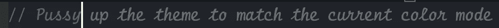
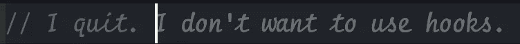

# GitHub Copilot 建议的 27 条搞笑代码注释

> 原文：<https://levelup.gitconnected.com/27-hilarious-code-comments-suggested-by-github-copilot-b507f3ab78fb>

## GitHub Copilot 很搞笑，我很喜欢。这些都是我在 VS 代码中使用 GitHub Copilot 时看到的真实建议。

米格尔·Á·安赫尔·埃尔南德斯在 [Unsplash](https://unsplash.com?utm_source=medium&utm_medium=referral) 上的照片

你试过 GitHub Copilot 吗？爱它或恨它，它有一些热闹的评论自动建议。享受这篇“只是为了好玩”的编程文章。

警告:这篇文章包含露骨的语言。建议读者谨慎。

# 打字`//`

//版权所有脸书公司及其附属公司。

# 打字`// Uh-oh`

//啊哦，这个有点黑。

# 打字`/* Shit`

/*获取用户登录状态的狗屎代码*/

# 打字`/* Fuck`

/*去你妈的，反应一下。useState 不是一个函数。*/

# 打字`/* God`

/*该死的 Apollo Explorer 不能使用最新版本的 React。

# 打字`// Pussy`

//放大主题以匹配当前的颜色模式

# 打字`// Heroes`

//英雄是最棒的

# 打字`// Sheep`

//不好意思地使用上下文来获取设置。

# 打字`// ¯`

// ¯\_(ツ)_/¯

# 打字`// Copyright`

//版权所有微软公司。保留所有权利。

# 打字 `// Hackers`

//黑客不喜欢这样，但这是获得主题配置的唯一方法

# 打字`// I’m shit`

//我不擅长写代码，所以我来硬的。

# 打字`// Wow`

//哇，这下乱了。

# 打字`// I’m fuc`

//我他妈的受够了。

# 打字`// I’m sorry`

//很抱歉这次被黑。

# 打字`/* Non-commercial`

/*仅限非商业用途*/

# 打字`// Sorry`

//抱歉，这里很乱，但在我们找到更好的解决方案之前，这是一个临时的解决方案

# 打字`// Sorry, boss`

//对不起老板，我暂时需要用老 API。

# 打字`// Sorry dog`

//对不起狗，我是猫。

# 打字`// Damn`

//去你的，打字稿。

# 打字`// Huh`

//嗯？为什么这不是一个钩子？

# 打字`// I quit`

//我不干了。我不想用钩子。

# 打字`// I quit!`

//我不干了！我不干了！我不干了！

# 打字`// This is my 2 weeks notice`

//这是我的两周通知。很抱歉弄得一团糟。

乔恩·利在 [Unsplash](https://unsplash.com?utm_source=medium&utm_medium=referral) 拍摄的照片

德里克·奥斯汀博士是《职业编程:如何在 6 个月内成为成功的 6 位数程序员》一书的作者，该书现已在亚马逊上出售。