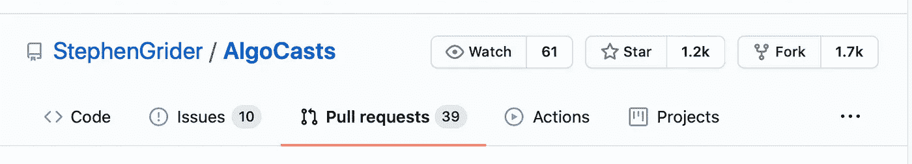

# Dart 的 28 个编码练习

> 原文：<https://levelup.gitconnected.com/28-coding-exercises-for-dart-69eb104ae291>

## 用练习，练习，练习来准备编码面试。


在 [Unsplash](https://unsplash.com?utm_source=medium&utm_medium=referral) 上拍摄的 [ThisisEngineering RAEng](https://unsplash.com/@thisisengineering?utm_source=medium&utm_medium=referral)

你是在为编码面试做准备，还是只想复习一些计算机科学的基础知识？那么这篇文章就送给你了。

阅读这篇文章你会得到什么:

*   使用 TDD 学习新的 Dart 概念
*   将 Javascript 单元测试翻译成 Dart 单元测试
*   一个不错的 Javascript 和 Dart 编码练习集
*   Dart 中的字符串操作、LinkedList、堆栈、队列、BinaryTree、BubbleSort、MergeSort 等示例
*   有益的心理训练

你需要安装 Flutter 或 Dart 以及你的首选 IDE，我推荐 VS-Code。如需说明，请前往 [https://dart.dev](https://dart.dev) 或 [https://flutter.dev](https://flutter.dev) 。

前几天我在 Udemy 上发现了一个有趣的课程，题目是*“编码面试训练营:算法+数据结构”*。我知道另一门由斯蒂芬·格里德开设的课程，我喜欢他解释复杂事物的方式。所以我看了介绍，当我听说所有代码都在 GitHub 上时，我真的很兴奋。下一步是在 GitHub 上找到他的回购。这很简单:他所有的回购都在 https://github.com/stephengrider 名下，我要找的回购是这样的:

[](https://github.com/StephenGrider/AlgoCasts) [## StephenGrider/AlgoCasts

### 通过在 GitHub 上创建帐户，为 StephenGrider/AlgoCasts 开发做出贡献。

github.com](https://github.com/StephenGrider/AlgoCasts) 

有了 1.2k 星和 1.7k 叉就相当成功了。



此回购有三个文件夹:

*diagrams 文件夹*包含可在 draw.io.app 中打开的 xml 文件。Stephen 在他的许多课程中都使用了这种图表。我认为，如果你遵循他的课程，这些(只有)是有用的。从 https://github.com/jgraph/drawio-desktop/releases[下载 draw.io.app 或使用浏览器版本。](https://github.com/jgraph/drawio-desktop/releases.)

*练习文件夹*包含 28 个子文件夹。每个文件夹至少有两个 Javascript 文件: **index.js** 和 **test.js** 。有时也有一个文件包含一个必要的必要条件，如 LinkedList 或类似的。js 包含练习的方向，test.js 提供单元测试来检查解决方案的正确性。问题是所有这些代码都是 Javascript——我一点也不喜欢 Javascript。尽管如此，我还是在第一次练习中看了看。在 Udemy 上它被称为“字符串反转”，在 repos 中它在文件夹 *reversestring* 中。

例如 *reversestring* 包含这个 index.js:

```
// --- Directions
// Given a string, return a new string with the reversed
// order of characters
// --- Examples
//   reverse('apple') === 'leppa'
//   reverse('hello') === 'olleh'
//   reverse('Greetings!') === '!sgniteerG'
function reverse(str) {}

module.exports = reverse;
```

相应的单元测试如下:

```
const reverse = require('./index');

test('Reverse function exists', () => {
  expect(reverse).toBeDefined();
});

test('Reverse reverses a string', () => {
  expect(reverse('abcd')).toEqual('dcba');
});

test('Reverse reverses a string', () => {
  expect(reverse('  abcd')).toEqual('dcba  ');
});
```

*completed_exercises* 文件夹为所有练习提供了一个 Javascript 解决方案，同样位于 28 个单独的文件夹中。

> 我立刻发现单元测试的反馈是一个好主意。

这是一种 TDL 或“考试驱动学习”。因为不喜欢 Javascript，我把所有的 test.js 文件都翻译成了对应的 exercise_test.dart，所有这些 dart 版本都可以在我的 Stephen 的资源库的 fork 中找到:

[](https://github.com/schilken/AlgoCasts) [## schilken/AlgoCasts

### 在 GitHub 上创建一个帐户，为 schilken/AlgoCasts 的发展做出贡献。

github.com](https://github.com/schilken/AlgoCasts) 

在我的 repo 中有两个新文件夹:*练习 _ 镖*和*完成 _ 练习 _ 镖*。每个文件夹都包含练习的子文件夹。例如:文件夹 *01 reversestring* 包含文件 **exercise.dart** 、 **exercise_test.dart** 和 **pubspec.yaml** 。

```
Import 'package:test/test.dart';
import 'exercise.dart';

void main() {
  test('Reverse reverses a string', () {
    expect(reverse('abcd'), equals('dcba'));
  });

  test('Reverse reverses a string', () {
    expect(reverse('  abcd'), equals('dcba  '));
  });
}
```

我忽略了第一个 Javascript 测试“反向函数存在”，因为其他测试会发现它是否不存在。

为了进行编译，我必须提供**包:test** ，它需要每个文件夹中的文件 **pubspec.yaml** 。这仅包含三行:

```
Name: reversestring
dev_dependencies:
  test: ^1.15.0
```

> 警告:不要忘记加载包！否则单元测试甚至无法编译。

我必须对所有 test.js 文件进行如下更改:

1.  删除= >的所有匹配项
2.  调整 expect 语句的语法:

```
JS      expect(reverse('abcd')).toEqual('dcba');

Dart    expect(reverse('abcd'), 'dcba');
```

1.  调整测试功能的分组:

```
JS      describe('Node', () => {

Dart    group('Node', () {
```

1.  允许检查控制台输出。几个 Javascript 测试使用 jest 框架的一个特殊特性来检查练习的控制台输出。例如，金字塔示例有这样一个测试:

```
beforeEach(() => {
  jest.spyOn(console, 'log');
});
test('prints a pryamid for n = 2', () => {
  pyramid(2);
  expect(console.log.mock.calls[0][0]).toEqual(' # ');
  expect(console.log.mock.calls[1][0]).toEqual('###');
  expect(console.log.mock.calls.length).toEqual(2);
});
```

我不得不添加一个额外的参数 *printForUnitTest* 类型*函数*到被测试的函数中。这个帮助函数只是将给定的字符串附加到 *printLog* 列表中，以后可以在那里检查它。对我来说，这是最简单的方法。Dart 中相应的测试如下所示:

```
setUp(() {
    printLog = [];
  });

  test('prints a pryamid for n = 2', () {
    pyramid(2, printForUnitTest: printForUnitTest);
    expect(printLog.length, 2);
    expect(printLog[0], ' # ');
    expect(printLog[1], '###');
  });
```

顺便说一句:VS 代码中的多光标快捷键 cmd-D 对所有这些循环变化帮助很大。

很明显，单元测试需要你在一个名为*锻炼. dart* 的文件中编写锻炼的解决方案。我从原始的*索引. js* 中复制了说明，并将 Javascript 存根翻译成了 Dart 存根。

```
// --- Directions
// Given a string, return a new string with the reversed
// order of characters
// --- Examples
//   reverse('apple') === 'leppa'
//   reverse('hello') === 'olleh'
//   reverse('Greetings!') === '!sgniteerG'

String reverse(String input) {
  return '?';
}
```

我对 Javascript 的担心之一是缺少类型安全性。达特在这里好多了。在 index.js 文件中缺少类型的地方，dart 存根已经使用了正确的类型。例如，组块练习的存根翻译如下:

```
//JS
function chunk(array, size) {}

// Dart
List<List<int>> chunk(List<int> array, int size) {
  return null;
}
```

> 思考-编码-测试-享受！

要测试您的解决方案，请在文件*练习. dart* 中对算法进行编码，并执行单元测试。如果您正在使用 VS 代码，您可以在终端中执行该命令:

```
pub run test exercise_test.dart
```

如果您在存根不变的情况下运行测试，您将得到以下响应:

```
00:02 +0 -1: Reverse reverses a string [E]                                                                                                  
    Expected: 'dcba'
    Actual: '?'
     Which: is different.
            Expected: dcba
              Actual: ?
                      ^
             Differ at offset 0

  package:test_api        expect
  exercise_test.dart 6:5  main.<fn>
...
```

在*练习中对正确答案编码后，您将获得如下奖励:*

```
00:02 +2: All tests passed!
```

就像这个例子一样，我把所有 28 个 Javascript 练习都翻译成了 Dart。因为他们中的一些人使用了上一个练习的解决方案，所以我将文件夹编号从 1 到 27(有 19 和 19a)。

以下是斯蒂芬提供的所有原始名字的列表:

*   01 反转
*   02 回文
*   03 反转
*   04 maxchar
*   嘶嘶声
*   06 块
*   07 字谜
*   08 资本化
*   09 步
*   10 金字塔
*   11 个元音
*   12 矩阵
*   13 纤维
*   14 队列
*   15 编织
*   16 堆叠
*   17 qfroms
*   18 链接列表
*   19 中点
*   19a fromlast
*   20 圆形
*   21 棵树
*   22 级宽度
*   23 bst
*   24 验证
*   25 项活动
*   26 分类

你得到了一套关于算法和数据结构的不错的练习。有使用链表、二叉树(bst)、队列和堆栈的例子。为了准备第一个练习，使用字符串操作和众所周知的嘶嘶声例子，这似乎是一个在编码面试中经常使用的问题。

大部分功劳都属于斯蒂芬·格里德，他收集了所有这些练习，提供了一个 Javascript 解决方案，并在 GitHub 上公开了它。如果您需要进一步的帮助来找到或理解一些解决方案，您可以购买他的 Udemy 课程。(不——我没有得到乌代米或斯蒂芬的鼓励)。

最后一点评论:我发现矩阵运算是最复杂的。我的解决方案有点受我目前正在看的一门关于 Tensorflow 的课程的启发，所以它太复杂了。您最好直接将您的解决方案与 Javascript 解决方案进行比较。

我发现这些练习是很好的精神训练。也许你也是。