# 2D 碰撞检测

> 原文：<https://levelup.gitconnected.com/2d-collision-detection-8e50b6b8b5c0>

我想用 JavaScript 制作一个操作起来和感觉上像超级马里奥世界的游戏。这些游戏中屏幕上的角色的物理和运动简单而优雅。处理这种 2d 碰撞检测的最基本的方法是利用一个被称为**轴对齐边界框**的概念。

**轴对齐边界框**，或 **AABB** ，检测两个非旋转多边形是否相互重叠。典型的 **AABB** 算法是这样运行的:

我们有两个多边形，每个都有一个 X(左)和一个 Y(上)位置，以及宽度和高度属性。

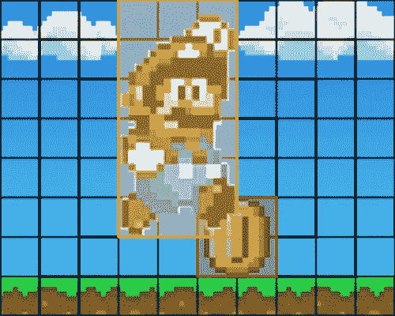

然后，我们比较 X 和 Y 位置以及宽度和高度，看它们是否重叠。

我们测试四个条件语句，如果都为真，那么我们知道我们是重叠的。让我们打破各自的条件。

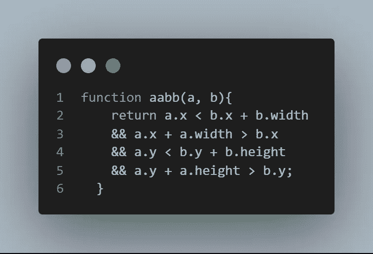

线 2 — A 的左边在 B 的右边的左边。

第 3 行——A 的右边在 B 的左边的右边。

第 4 行——A 的顶部在 B 的底部之上。

第 5 行— A 的底部比 B 的顶部低。

让我们插入马里奥和他的硬币的真实值，用黄色和红色多边形表示。每个多边形的 X 和 Y 位置来自距视口左边缘和上边缘的像素距离。

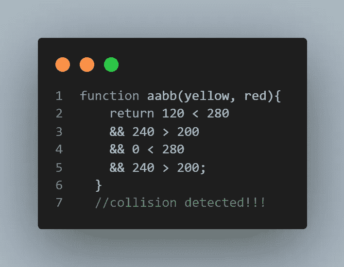

这种算法有一个强大的应用范围。它可以用来检测你的玩家是否在一个可收集的物品上，触摸一个坏人，在游戏结束时在门口或者只是站在一个固体物体上。

# 游戏组件

我的项目是一个简单的基于图块的 2d 平台游戏，由玩家对象、名为“Cubio”的 32×32 像素红色正方形、三种类型的“坏人”和游戏世界的图块地图组成。

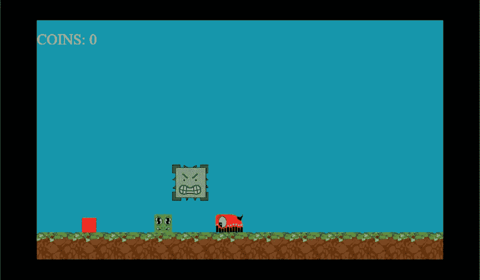

# 瓷砖

整个地图仅由四种类型的图块组成。尺寸为 80 乘 80 像素，每个都有自己的数值和特定的规则集，这些规则集决定了玩家在碰撞时如何与它们进行交互。

## 0:天空


玩家可以自由地通过这个方块。

## 1:地球


如果玩家落在瓷砖的顶部，玩家的垂直移动停止，它停留在瓷砖的顶部，否则它可以从每个其他方向穿过这个瓷砖。

## 2:板条箱

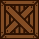

如果玩家与该牌的任何一面发生碰撞，其位置将位于该牌之外。

## 3:天空岛

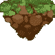

如果玩家落在瓷砖的顶部，玩家的垂直移动停止，它停留在瓷砖的顶部，否则它可以从每个其他方向穿过这个瓷砖。

# 地图

此处不涉及太多细节，图块映射由图块类型在它们被分配的列和行中的数组来表示，因此该数组:

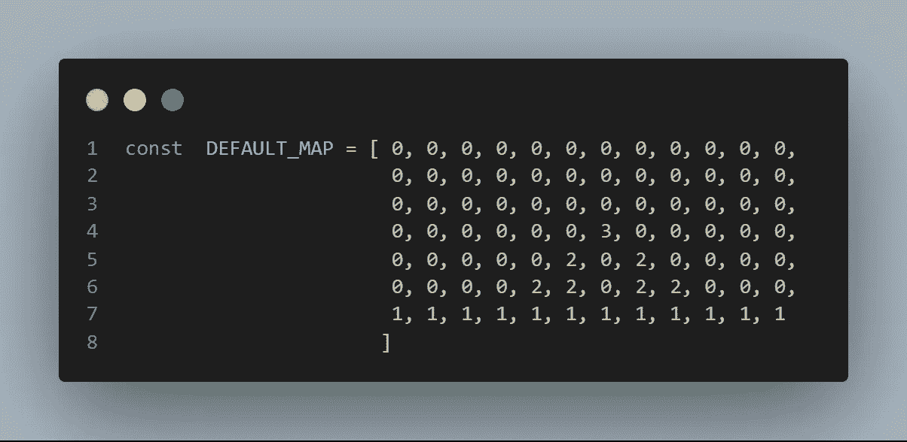

…显示为:

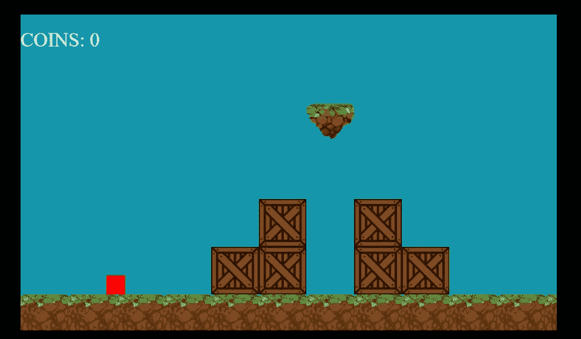

# 互动和行为

无论是天空还是地球，我的玩家总是在每一帧中与至少一个瓷砖发生碰撞，所以没有必要运行 aabb()函数。我的 collision_detection()函数首先定位玩家每个角的位置。然后，它检索角落碰撞的瓷砖类型。然后，它将瓷砖的类型和角的 x 和 y 位置传递给 collide()函数。

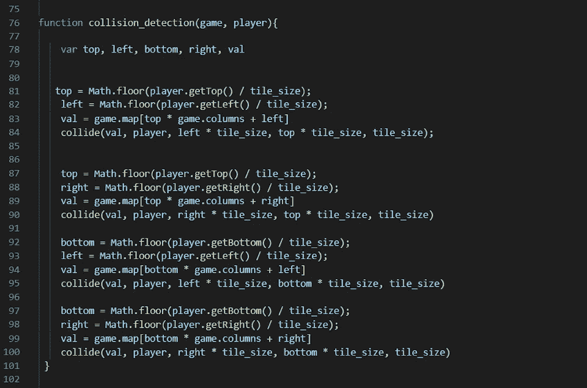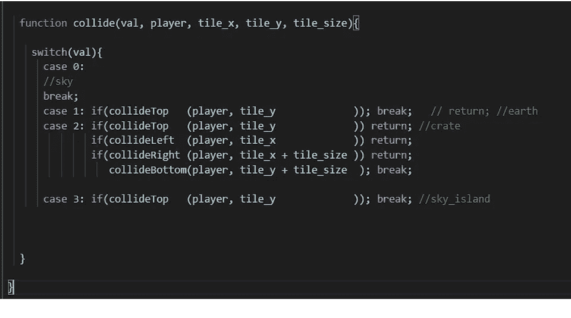

collide()函数使用一个 switch 语句来根据图块类型选择要运行的适当代码块。正如你所看到的，类型“0”(天空)没有效果，类型“2”(箱子)与所有四个边碰撞。如果你想知道为什么我在 collision_detection()中定义了这些点两次，那是因为每次我调用 collide()时，它都有可能移动玩家。所以每次调用 collide()后，每个点都要重新定义。

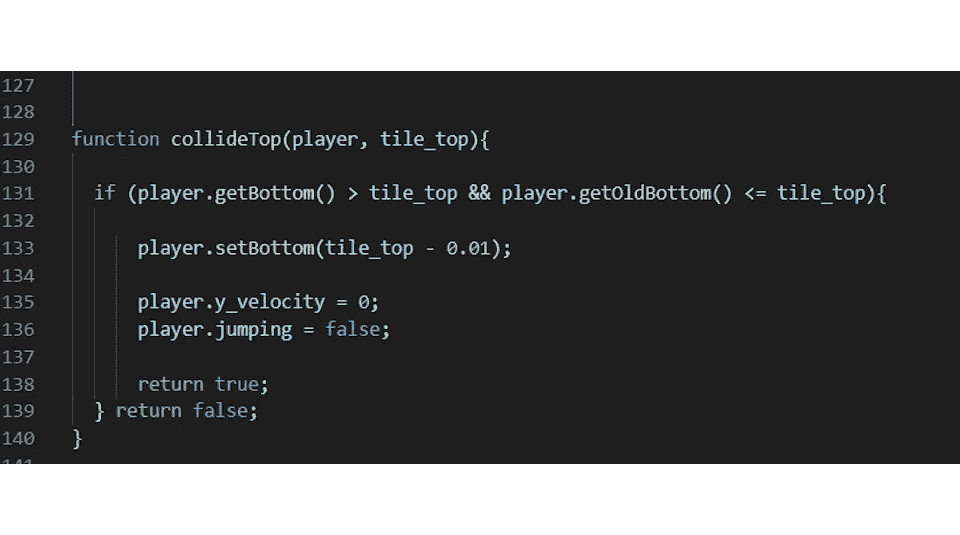

在这些不同的瓷砖碰撞功能，你可以看到球员的旧位置进行比较，以及瓷砖。这允许你确定玩家前进的方向。

该函数需要知道玩家要去的方向，以获得正确的响应。否则，如果玩家与板条箱瓷砖的底部碰撞，它的顶部现在在板条箱底部之上。然后，当我们运行 **collide()** 时， **collide_top()** 首先启动，并将玩家放置在磁贴的顶部。对用户来说，玩家似乎直接穿过板条箱的底部，落在顶部。这种负面效应被称为“隧道效应”。因此，建立玩家方向给了我们一个更好的表现正在发生的事情。

你可以看到，当编写一个**坏人 _ 碰撞 _ 检测()**函数时，它与此非常相似，只是我们可以修改**碰撞 _ 顶()**来杀死坏人，所有其他碰撞杀死接触的玩家。

```
function baddyCollideTopMortal(player, bad){ if (player.getBottom() > bad.getTop() && player.getOldBottom() <= bad.getTop()){

        player.setBottom(bad.getTop() - 0.01);

        player.y_velocity = -27;
        player.jumping = false;
        let dead_index = currentGame.alive_baddies.indexOf(bad);
        currentGame.alive_baddies.splice(dead_index, 1);
        return true;
    } return false;
  }

  function baddyCollideLeft(player, bad){

    if (player.getRight() > bad.getLeft() && player.getOldRight() <= bad.getLeft()){
        player.setRight(bad.getLeft() - 1);
        player.x_velocity = 0;
        player_dead = true;
        return true;
    } return false;

  }
```

# AABB、硬币和坏人的效率

一旦你所有的牌、硬币和坏人都与你的玩家正确互动，你会注意到在引擎循环的每个周期对每个硬币和坏人进行碰撞测试是非常昂贵和不必要的。

这是将碰撞测试分为两个阶段的地方，广义和狭义。

# 辽阔的

在广义阶段，创建一个附近的实体(硬币，坏人)阵列。遍历实体的完整列表，检查对象的 x 位置以查看它是否靠近玩家，然后将该实体推入附近列表。这比在每个实体上运行整个碰撞测试的成本要低得多。

# 狭窄的

一旦创建了一个小得多的邻近对象列表，我们就用 **aabb()** 函数和/或运行适当的代码块来迭代每个碰撞测试。

碰撞检测是让你的游戏栩栩如生的机制。每一步都很容易理解，可以用许多不同的方式重新想象，但一旦实施，就会变得强大。编码快乐！