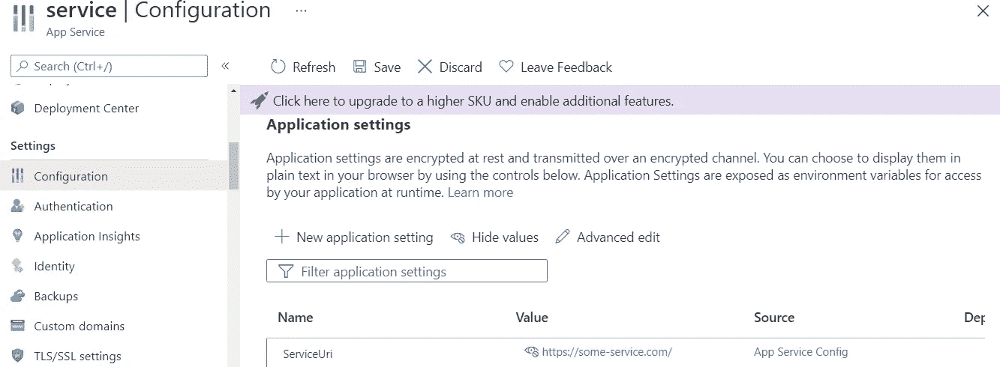
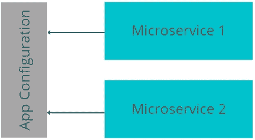
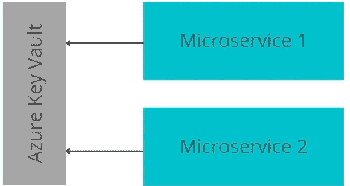

# 存储微服务配置的 3.5 种方法。网

> 原文：<https://levelup.gitconnected.com/3-and-a-half-ways-to-store-configuration-for-microservices-in-net-539eb37bd462>

## 对利弊进行分析。


照片由[西格蒙德](https://unsplash.com/@sigmund?utm_source=medium&utm_medium=referral)在 [Unsplash](https://unsplash.com?utm_source=medium&utm_medium=referral) 上拍摄

开发人员可以采用几种方法来存储和管理 microservices .NET 的配置变量。每种方法都有其优点和缺点，应该对其进行评估，以选择最适合应用程序需求的方法。

# 1.源代码作为配置存储？

当执行不同复杂程度的相同任务有几个选项时，通常最好先评估最简单选项的利弊。

对于开发人员来说，最简单的选择是在微服务的源代码中存储一个配置值，如 URI，以直接连接到另一个服务。

```
var uri = "https://some-service.com/";var httpClient = new HttpClient();var data = await httpClient.GetAsync(uri);
```

简单吧？

## 优点:

*   这个解决方案实施起来非常简单。
*   阅读源代码的开发人员可以**立即**了解正在使用哪个配置值。

## 缺点:

*   在将微服务代码部署到不同的环境(如测试、试运行或生产)时，**无法更改**URI 值。
*   每次需要更改和应用新的配置值时，都需要重新部署微服务。
*   在代码中存储配置值打破了**粒度访问控制**模型。任何有权访问源代码的人都可以看到配置值，窃取它们，并滥用它们。
*   对配置进行硬编码违反了[十二因素应用](https://12factor.net/)的[第三原则](https://12factor.net/config)。

# 2.环境变量

将配置从源代码中分离出来可以消除前面方法的几个缺点。

英寸 NET 中，开发人员可以将微服务项目配置作为键值对存储在`appsettings.json`文件中，并使用`IConfiguration`来读取这些值。

```
**//appsettings.json file:** {
  "ServiceUri": ""
}**//source code:**
public class Service
{
    private IConfiguration _configuration; public Service(IConfiguration configuration) 
        => _configuration = configuration;

    public async Data GetData()
    {
        var uri = _configuration["ServiceUri"]; var httpClient = new HttpClient(); var data = await httpClient.GetAsync(uri); //...
    }
}
```

这里需要注意的一点是，使用这种方法，不需要在存储库中提交 URI。对于本地开发，开发者可以把 URI 放在`appsettings.json`或者更好地使用`secret.json`文件。然而，当微服务作为应用服务部署到 Azure 基础设施时，开发人员或 DevOps 可以创建`ServiceUri`属性并在那里设置值。



在 Azure App Service 中，`ServiceUri`和其他设置作为环境变量传递给应用程序代码。

## 优点:

*   配置是从源代码中解耦的**，这允许开发者根据代码部署的环境来设置配置值。也不需要将值存储在存储库中。**
*   **可以以**粒度**的方式配置访问控制。例如，开发人员可能只被授权访问源代码，而 DevOps 可以读取和更改配置。**

## **缺点:**

*   **没有办法动态改变配置**。配置部分的任何更改都需要重新启动微服务。****
*   ****如果配置值需要在微服务之间**共享**，那么维护就很复杂。如果少数微服务需要具有相同的配置键值对，则需要为每个微服务复制和粘贴多次。****

# ****3.Azure 应用配置****

****本质上，前一种方法的两个缺点都可以通过在系统中使用 Azure App 配置服务来解决。****

********

****应用程序配置充当配置值的集中存储，并提供许多附加功能来简化配置管理。****

## ****优点:****

*   ****所有配置都存储在**一个地方**，项目的很多微服务都可以访问。这可以大大简化具有许多微服务的项目的配置管理。****
*   ****微服务可以通过实现[轮询或推送模型](https://docs.microsoft.com/en-us/azure/azure-app-configuration/enable-dynamic-configuration-dotnet-core-push-refresh?tabs=windowscommandprompt)动态**接收来自 App 配置的配置更改，而无需重启。******
*   ****Azure 应用配置服务提供了许多**有用的功能**，例如静态加密、时间点快照、功能标志等等。****

## ****缺点:****

*   ****由于引入了必须维护和保护的额外组件(应用配置),系统**复杂性**增加。****

****还有一点需要记住的是，Azure 应用配置不建议用于存储机密或其他类型的敏感数据。****

# ****4.蓝色钥匙保险库****

****Azure Key Vault 是开发人员可以用来集中存储微服务配置的另一项服务。虽然 Azure Key Vault 看起来像是 Azure 应用配置的替代品，但它实际上是对它的补充。****

********

****虽然 Azure 应用配置应该存储非敏感的配置数据，但 Azure Key Vault 的目的是存储所有类型的敏感数据，如机密、证书等。，因为它有许多安全功能，如密钥轮换、恢复管理、清除检测等。****

****使用两种不同的 Azure 服务来存储配置数据看起来让人不知所措。然而，开发人员能够将 Azure 应用配置服务连接到 Azure Key Vault。在这种情况下，Azure 应用配置(就像一个门面)可以从 Azure Key Vault 读取值，这大大简化了对这两种服务的管理。****

# ****摘要****

****配置值不应硬编码，尤其是敏感配置。****

****配置可以存储在环境变量中，但是这不允许跨多个微服务重用同一个配置变量。****

****Azure App 配置和 Azure Key Vault 都允许开发者集中管理配置。但是，Azure App 配置用于非敏感数据，Azure Key Vault 用于敏感数据。****

****感谢阅读。如果你喜欢你所读到的，看看下面这个故事:****

****[](/5-asp-net-core-open-source-projects-to-gain-practical-knowledge-24fbf9164230) [## 5 个 ASP.NET 核心开源项目，获取实用知识

### 在实践中学习。

levelup.gitconnected.com](/5-asp-net-core-open-source-projects-to-gain-practical-knowledge-24fbf9164230)****