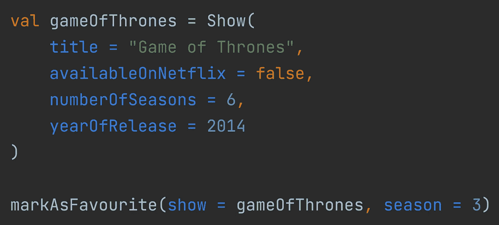

# 在 Kotlin 中使用命名参数的 3 个最佳实践

> 原文：<https://levelup.gitconnected.com/3-best-practices-for-using-named-arguments-in-kotlin-e6cd08336bd3>

## 一系列固执己见的科特林编码实践

## 为什么以及何时使用命名参数

作者图片

命名参数可以提高代码的可读性和安全性。但这是为什么呢？什么时候应该使用命名参数？

本文回答了这些问题以及更多问题。第一部分描述了位置参数的问题，以及命名参数如何解决这些问题。第二部分包含三个关于何时使用命名参数的自以为是的最佳实践。

# 位置论证问题

为了理解什么时候使用命名参数是有帮助的，让我们看一下位置参数的三个问题以及命名参数是如何有帮助的。

## 争论的意思并不总是很清楚

当看一个函数时，并不总是清楚一个参数是什么意思。让我们以 Kotlin 标准库的`[windowed](https://kotlinlang.org/api/latest/jvm/stdlib/kotlin.collections/windowed.html)`为例。

这两个整数参数是模糊的。除非你以前用过这个功能，否则你不会知道它们是什么意思，即使那样也很难读懂。

命名参数通过明确每个参数的含义来提高可读性。

## 很容易混淆相同类型的参数

前面的例子使用了命名参数来清楚地说明每个参数代表什么。我们可以通过使用命名变量来获得相同的结果:

与命名参数相比，这种方法最大的缺点是很容易意外地交换`size`和`step`参数。这正是我在上面的例子中所做的。你注意到了吗？

由于这些参数属于同一类型，编译器不会抱怨，但是可以肯定这会导致意外的运行时行为。

使用命名参数，您不太可能意外地交换相同类型的参数。

## 如果参数顺序改变，事情就会变糟

假设您的代码库中有下面的`data class`:

在整个代码库中，有很多不使用命名参数实例化`Show`对象的地方。

如果有人改变了`Show`参数的顺序，我们必须重构实例化这些对象的所有位置。如果我们使用命名参数来实例化对象，这种重构就没有必要了。

公平地说，这个例子中的风险很低。由于参数的类型不同，编译时会出现错误。然而，如果我们交换相同类型的参数，就很难确定什么需要重构，这就使得使用命名参数的情况更加明显。

# 使用命名参数的最佳实践

考虑到上一节中的问题，我们可以定义三种最佳实践:

*   当不清楚参数的含义时，使用命名参数
*   在构造函数调用中总是使用命名参数
*   不要混合命名参数和位置参数

> 这些做法只是我坚持己见的建议，绝不应被视为绝对真理。如果你不同意他们的观点，请随时回复。

## 当不清楚参数的含义时，使用命名参数

上一节中的示例展示了当不清楚参数的含义时，命名参数如何提高可读性。这就是为什么我建议使用命名参数，如果参数是模糊的。

为像`findById`这样的方法使用一个命名的参数，它只接受一个`Long`作为参数，没有任何好处。从方法的名称可以清楚地看出参数的含义。

当处理一个从同一类型中取出多个参数的函数时，参数根据定义是模糊的。在这种情况下，请始终使用命名参数。

这些例子是两个极端。确定论点是否足够清楚并不总是容易的。对你来说可能很清楚的东西对你的同事来说可能很模糊，反之亦然。它还取决于对某些功能的体验以及该功能的使用范围。

作为一个经验法则:如果您不确定是否应该使用命名参数，您可能应该这样做。

## 在构造函数调用中总是使用命名参数

构造函数的参数通常不清楚。可能有很多参数，相同类型的多个参数，默认参数或所有参数的组合。在大多数情况下，在构造函数调用中使用命名参数可以提高可读性。

由于大多数构造函数调用受益于命名参数，我的建议是保持一致性，在构造函数调用中总是使用命名参数。

## 不要混合命名参数和位置参数

Kotlin 允许您混合命名参数和位置参数:

此示例对第一个和最后一个参数使用命名参数，对中间的参数使用位置参数。

我喜欢一致性。对我来说，混合命名参数和可选参数会降低可读性。这就是为什么我建议不要在一个函数调用中混合命名参数和位置参数。

# 天下没有免费的午餐

没有免费的好东西。命名参数也不例外，因为可读性和安全性的提高是有代价的。

## 命名参数使代码更加冗长

不可否认，命名参数会使您的代码更加冗长。这就是为什么只有当命名参数可以提高代码的可读性或安全性时，才应该使用它们。一直使用命名参数会降低代码的信噪比。

函数需要的参数越多，命名参数就越多。具有讽刺意味的是，需要大量参数的函数从使用命名参数中获益最多。

## 改变参数名成为一个突破性的改变

假设您的代码调用了第三方库中的一些函数，并且是通过命名参数来调用的。如果库的作者决定在未来的版本中更改参数名，这意味着您的代码将不再编译。有了位置论点，你就不会有这个问题了。

因为这些错误总是在编译时出现，所以风险很低，但是因为参数名的改变而不得不重构可能会很烦人。这是你为额外的可读性和安全性付出的代价。对我来说，这是非常值得付出的代价。

感谢您的阅读。我希望这有所帮助。如果您有任何问题或反馈，请随时回复。