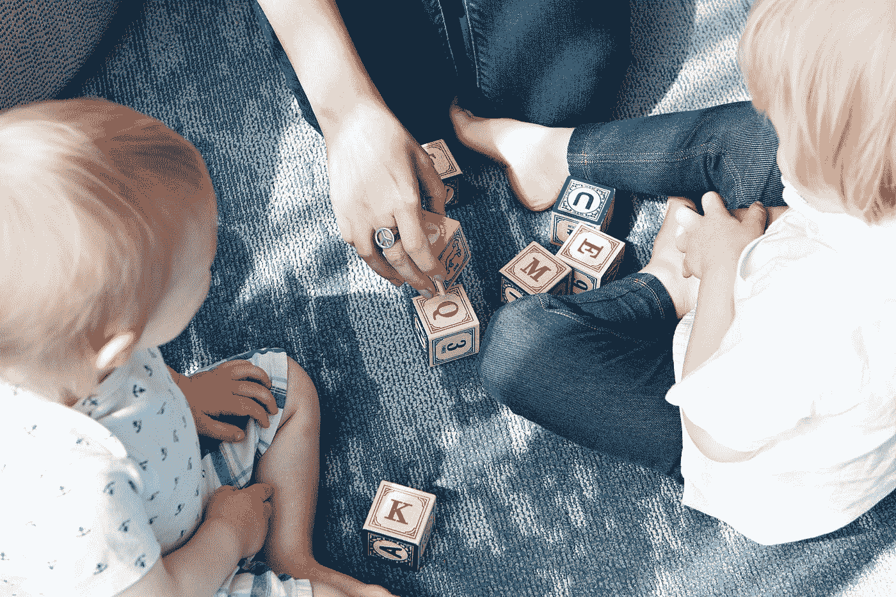

# 儿童及以上人群的 3 大代码学习工具

> 原文：<https://levelup.gitconnected.com/3-code-learning-tools-for-children-and-beyond-b61413143bcb>

玛丽莎·豪文斯汀在 [Unsplash](https://unsplash.com?utm_source=medium&utm_medium=referral) 上拍摄的照片

在这里，我将为您提供一份免费资源列表，让您和您的孩子学习起来更加轻松。

程序员或想成为程序员的人好，我是 StackZero，一个计算机安全爱好者，也是[这个博客](https://www.stackzero.net)的所有者。

如果你有孩子，并且想向他们介绍计算机编程的世界，不要担心！

在这篇文章中，我将与您分享几个资源和网站，您可以使用它们来帮助您的孩子开始编码。

**作为免责声明，我还想指出，我将提供的列表不仅符合儿童的需求，也是一个成年人开始学习编程的好方法。**

所以让我们开始吧！

# #1 刮刮乐

cratch 是为麻省理工学院(MIT)媒体实验室开发的一款面向儿童和成人的免费计算机编程工具。

今天，它由非营利组织 Scratch Foundation 维护。

由于它有 70 多种语言的版本，数百万人在 150 多个国家使用它。

它允许用户通过创建故事、游戏和动画来学习编码。

特别是，它提高的技能有:

*   问题解决
*   计算思维
*   创造力
*   团队合作

大多数使用 Scratch 的人年龄在 8 到 16 岁之间，但是年纪大的人也可以使用。

正如你一进入它的网站就可以看到的，Scratch 也可以用来制作自己的动画、游戏和故事等东西。

随着 2019 年 1 月 Scratch 3.0 的到来，我们有可能在更多的设备上使用它。也会让动画和游戏流畅运行。

 [## 如何将你的故事转换成 mp3 文件，这样你就可以和你的孩子一起听了！

### 这是一个非常基础和有用的 TTS 项目，适合初学者！

medium.com](https://medium.com/codex/how-to-turn-your-tales-into-mp3-files-so-you-can-listen-to-them-with-your-kids-297b5fa61519) 

# 第二名 Code.org

ode.org 是一个非盈利组织，比如 Scratch 基金会。
如果你去他们的网站，那里有很多让代码学习变得更容易的工具。

这些工具可以使学生能够在短时间内独立完成他们的项目。

这个平台可以被 5 岁以上的孩子使用，和这个列表中的所有平台一样，甚至可以被成年人使用。

你可能从一个名为“代码小时”的项目中了解到它们。

该活动的目标是扩大计算机科学的参与范围，并提高公众对计算机科学如何影响每个行业以及代码在我们日常生活中所起的创新和重要作用的认识。

 [## 如何为你的孩子建造一个人工智能故事发生器

### 这是一个非常简单的教程，讲述了如何使用预先训练好的模型通过 python 生成文本。

levelup.gitconnected.com](/how-to-build-an-ai-tale-generator-for-your-kids-34b8db153054) 

# #3 终身代码

C

它主要关注两个有趣的游戏:

*   快速路由器
*   黑野

它还为教师提供其他资源，如教案。
我在英国被小学老师设计测试成功。

它的目标是给学生基本的编码原则。

他们的资源在 COVID 2020 疫情期间公开，对远程教育有很大帮助。

 [## 如何在 7 分钟内创建 Chuck Norris 笑话应用程序！

### 查克·诺里斯将不会出现在《敢死队 3》中，因为史泰龙再也不想感受那种恐惧了。

medium.com](https://medium.com/codex/create-chuck-norris-jokes-application-in-7-minutes-712887cb0956) 

# 结论

我希望你喜欢我的资源列表，如果你发现了新的东西，请告诉我。如果你欣赏我的文章，如果你关注我的个人资料，会对我有很大帮助。当然，如果你对网络安全感兴趣，你可以看看我的博客。

回头见！

*你可以通过下面的链接注册，每月只需 5 美元就可以获得所有的媒体报道:*

 [## 用我的推荐链接加入媒体- StackZero

### 我们的最新报道(以及数以千计的其他报道)一经发布，您就可以立即获得。成为会员后，您将获得所有权限…

medium.com](https://medium.com/membership/@stackzero)