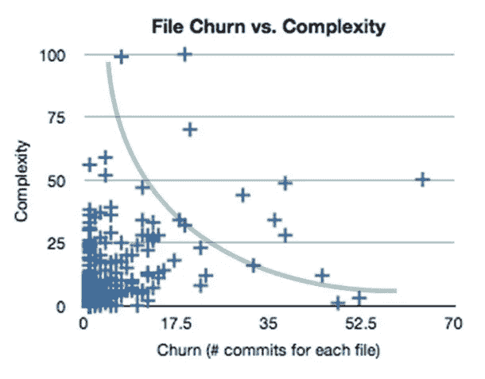
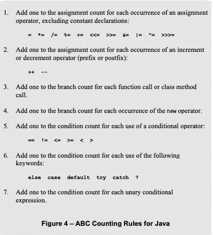

# 每个开发人员都应该知道的 3 个代码标准

> 原文：<https://levelup.gitconnected.com/3-code-metrics-every-great-developer-must-measure-499b0b2b31ad>

## 这里有 3 个高质量的代码指标。


来自 [Pexels](https://www.pexels.com/photo/female-engineer-with-equipment-3862631/?utm_content=attributionCopyText&utm_medium=referral&utm_source=pexels) 的 [ThisIsEngineering](https://www.pexels.com/@thisisengineering?utm_content=attributionCopyText&utm_medium=referral&utm_source=pexels) 摄影

我们需要代码度量，来指出有异味的代码。当我们看到不好的代码时，我们都知道。即便如此，有时还是会漏过。

糟糕的代码存在于开发人员来来去去的大型代码库中。

离职的开发者不管，做的不好，就走了。你加入了团队，遇到了代码混乱。

你需要有价值的代码度量来对抗糟糕的代码。

即使当你看到团队成员写了糟糕的代码，你也需要指出来。它迟早会出现在你的盘子里。

# 1.什么是代码搅动？

> 变动是衡量文件更改频率的指标。更改越多的文件变动越大。—桑迪·梅茨



[https://sandimetz . com/blog/2017/9/13/打破庞然大物](https://sandimetz.com/blog/2017/9/13/breaking-up-the-behemoth)

变化最多的复杂代码位于右上角。这是你的`Util`课。这是你的`Manager`班。这是你的核心逻辑所在，所以没人想碰它。

无论哪种方式，你都会做出改变，导致错误和技术债务。

Michael Feathers [谈到了这个代码度量](https://www.stickyminds.com/article/getting-empirical-about-refactoring)。他甚至开发了[软件](http://www.campwoodsw.com/sourcemonitor.html)来寻找这些被搅动的文件。这些是重构的最佳候选者。

我们什么时候可以使用这个指标？在你的技术培训中使用它。找出最混乱的阶级，评估技术债务，开始重构。

大多数软件质量度量是静态的。Sonarqube、代码行数和其他代码质量指标。代码变动度量增加了版本控制的另一个维度。

代码搅动是在大类中完成的。正如桑迪所说，我们被卷入其中，它有自己的引力。

当您在一个 500 行的类中添加逻辑时，为什么还要添加一个小的助手类呢？我们都对这种行为感到内疚。对更快迭代的需求导致了更多的代码变动。

在下面的文章中有更多关于代码搅动实现的内容。

[](https://betterprogramming.pub/why-i-made-my-own-code-quality-tool-c44b40ceaafd) [## 为什么我做了自己的代码质量工具，吸引器

### 有时候，为了得到你想要的，你必须自己去创造

better 编程. pub](https://betterprogramming.pub/why-i-made-my-own-code-quality-tool-c44b40ceaafd) 

# 2.什么是 ABC 指标？

Jerry Fitzpatrick 的一篇文章首次提到了这一指标。这是圈复杂度的扩展。

不仅 **C** 条件构成了这个度量，而且 **A** 分配和 **B** 分支也构成了这个度量。因此得名**分配、分支、条件**度量。

> ABC 是衡量复杂性的标准。—桑迪·梅茨

ABC metric 提供了更多关于代码复杂性的信息。如果分数很高，说明你的代码很复杂。

为了这篇文章，我把公式贴出来。对于那些数学书呆子来说，读到这里就是公式了。很少有工具可以计算这个指标，您可以在野外找到它们。

```
|ABC| = sqrt((A*A)+(B*B)+(C*C)) - calculating ABC score
```

> 我是一名 Java 开发人员。Java 里的 a，b，c 怎么算？



[https://www . win . tue . nl/~ wstomv/edu/2ip 30/references/ABC metric . pdf](https://www.win.tue.nl/~wstomv/edu/2ip30/references/ABCmetric.pdf)—[Pg。8 在 PDF 中](https://www.win.tue.nl/~wstomv/edu/2ip30/references/ABCmetric.pdf)

我们为什么要关心这个指标？它有什么好处？

人类会犯错，度量标准不会。*你无法管理你无法衡量的东西。*使用指标进行改进。度量不会说谎。

# 3.什么是圈复杂度

> 一种算法，用于计算源代码体中唯一执行路径的数量。托马斯·j·麦凯布

您已经看到了带有许多 if-else 块的代码。不好的圈复杂度的例子，或者圈复杂度的高分。

编写面向对象程序可以降低圈复杂度。将条件逻辑提取到单独的类中。然后注入你的班级。

我在这里写了更多关于如何减少这个指标的文章[。坚持 OO 原则极大地减少了这个度量。](/3-object-oriented-tips-sandi-metz-uses-for-better-software-design-1c5393c7698d)

当你面对圈复杂度分数为 10 的代码时，你应该重构。

McCabe 指出，了解结构化编程的开发人员写出了最佳代码。甚至在他发明公制之前。我在这里写过关于开发结构化程序的文章。

圈复杂度高的代码很难测试。根据定义，测试应该覆盖所有的执行路径。想想圈复杂度为 50 的代码，你需要 50 个测试用例。

Sandi Metz 指出了使用这一指标的相反方式。用它来知道你是否写了足够多的测试。例如，您有一个复杂度为 40 的代码，但是只有 20 个测试。您需要更多的测试来覆盖所有路径。

# 结论

代码度量用于指导我们完成项目。它们会告诉我们代码的发臭部分在哪里。我们需要清理的地方。

没人说你需要他们。对于你的爱好项目、当地健身房或 MVP 来说，它们可能没有什么好处。

如果项目成功，事情就变得有趣了。代码库变得越来越大，然后它们对你的项目的生命是必不可少的。

我使用度量标准，至少是圈复杂度，来分解我的代码。这导致了可测试的代码和合理的代码块。

你应该至少拿走一个指标，并在今天实施它。

# 复活节彩蛋:眼镜蛇效应

不要在代码度量之外创建工作。不要提供[不正当的激励](https://en.wikipedia.org/wiki/Perverse_incentive#The_original_cobra_effect)这样做。

这很符合**的眼镜蛇效应。*人们繁殖眼镜蛇，杀死它们，并从英国殖民者那里收取报酬。杀死眼镜蛇的目的是减少眼镜蛇的数量。人们只看到了回报，而没有看到背后的问题。*

*这个故事能告诉我什么？不要使用指标来产生更多的工作。主动使用它们来做更好的工作。被动地使用指标会导致*“眼镜蛇效应”。*产生业务不需要的工作，但是可以增加你在项目上的时间。*

# **今天加入 Medium！**

****你为什么要*** [***订阅***](https://zivce.medium.com/membership?source=responses-----f49b64432202---------------------respond_sidebar-----------) ***？*** 率先抛弃微服镀铬模式。其次，你会接触到很多精彩的故事。你可以从实用主义程序员的书架上读到大约 [100 本书。你可以从 Pinterest 团队那里看到障碍、非常有用的提示和很好的建议。你可以阅读](https://medium.com/pragmatic-programmers/directory-of-pragmatic-programmer-books-on-medium-6a5cbadbd4b4?source=responses-----f49b64432202---------------------respond_sidebar-----------)[谷歌云的最新进展](https://medium.com/google-cloud?source=responses-----f49b64432202---------------------respond_sidebar-----------)。*

***这就是你每月**[**【5 美元(两杯咖啡)**](https://zivce.medium.com/membership?source=responses-----f49b64432202---------------------respond_sidebar-----------) **得到的东西。**你可以花 [$5](https://zivce.medium.com/membership?source=responses-----f49b64432202---------------------respond_sidebar-----------) 阅读整个实用程序员库。*

*免责声明:$2 出 [$5](https://zivce.medium.com/membership?source=responses-----f49b64432202---------------------respond_sidebar-----------) 将直接支持我，为你传递精彩话题。*

# *资源*

*[](https://sandimetz.com/99bottles-sample-php) [## 99 瓶样品 PHP - Sandi Metz

### 当你是编程新手时，你编写简单的代码。虽然你当时可能没有意识到，但这是…

sandimetz.com](https://sandimetz.com/99bottles-sample-php) [](https://www.stickyminds.com/article/getting-empirical-about-refactoring) [## 获得关于重构的经验

### 重构已经存在很久了，大多数程序员至少在口头上支持它。根据我的经验，人们…

www.stickyminds.com](https://www.stickyminds.com/article/getting-empirical-about-refactoring) [](https://sandimetz.com/blog/2017/9/13/breaking-up-the-behemoth) [## 打破庞然大物-桑迪·梅斯

### 我一直在思考应用程序如何发展，以及如果我们对结果不满意，我们会怎么做。三…

sandimetz.com](https://sandimetz.com/blog/2017/9/13/breaking-up-the-behemoth) [](https://dzone.com/articles/code-churn-a-magical-metric-for-software-quality) [## 代码流失——软件质量的神奇指标——DZone 性能

### 有许多保护软件质量的方法和设计各种技术来确保正确的测试…

dzone.com](https://dzone.com/articles/code-churn-a-magical-metric-for-software-quality)*