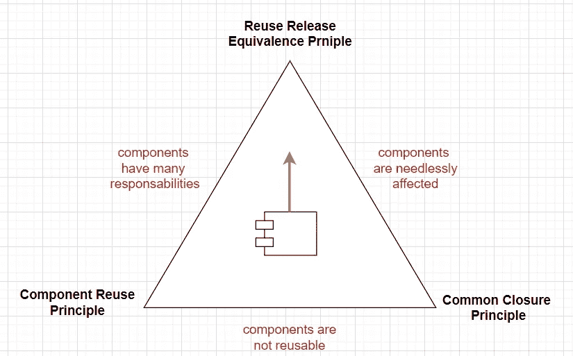

# 为初级开发人员解释的 3 个组件内聚原则

> 原文：<https://levelup.gitconnected.com/3-component-cohesion-principles-explained-for-a-junior-developer-53576d1032b3>

我对鲍勃大叔老[干净代码](https://cleancoders.com/)系列的简明扼要的总结。即，关于公共闭包、公共重用和发布-重用等价原则的那一集。

遵循这些原则以避免系统像这样耦合

## 概观

这三个原则向我们展示了如何构建我们系统中的组件。我们会发现每个原则都将组件拖向不同的方向，因此我们需要在它们之间找到正确的平衡。

我们会发现，组件内聚性原则类似于实体原则，但是在更高的层次上。如果 SOLID 教会我们如何构建函数和类，那么在本文中，我们将学习如何将这些类组织成组件或模块。

为了简要回顾这些坚实的原则，我建议通读这篇关于[的文章，在不到 20 秒的时间内解释每一条坚实的原则](/each-of-the-solid-principles-explained-in-less-than-20-seconds-b73057625dfc)。

## 术语

*   一个**系统**由**层**(例如 UI 层、逻辑层、数据层)组成，这些层由**组件**组成。
*   组件**是系统的一部分，它将自己的实现隐藏在接口之后。组件主要由**功能**组成，数据被封装。**
*   **内聚**是将这些功能保持在一起的*【力】*。例如，**类**是内聚的第一层。

## 1.发布-重用等价原则

每个组件都由不同的文件组成。例如，它可以包含一个带有源代码的包、一套测试、文档等等。

此外，每个组件都意味着版本控制、维护和发布周期。

**发布-重用原则声明一个组件应该足够大以证明发布周期的合理性。**这可以用类的数量或代码的行数来衡量。

一个系统的组件越多，花费在维护和发布上的时间就越多。

因此，我们应该管理一些战略性的组件，而不是许多小组件。

## 2.普通闭合原理

根据通用闭包原理，由于相同原因而改变的类属于同一个组件。

这让人想起了单一责任原则，即 SOLID 中的“S”。但是，不同之处在于，现在我们正在学习将类分组到组件/模块中，而坚实的原则教我们如何构造这些类。

因此，如果需求发生变化，我们应该尽可能更新最少数量的组件。理想情况下，每层不超过一个组件。

## 3.公共重用原则

让我们假设我们有一个组件“*A”*，*依赖于组件“*B”*——换句话说，*“A”*的类依赖于*“B”*的类。*

如果*“A”*没有使用*“B”*的所有公共类，这将违反通用重用原则。

**这又让我们想起了固体原理，即界面分离原理。**

因此，这个原则鼓励我们创建更小、更细粒度的组件。

## 找到正确的平衡

正如我们所看到的，每个原则都有自己的优势，但是它将组件拖向不同的方向。例如，如果我们严格遵循公共闭包原则，我们将违反发布-重用等价原则。

因此，我们必须为我们设计的每个模块找到正确的平衡。

在下图中，我们可以看到我们已经讨论过的三个原则。如果我们的组件太靠近某个边缘，我们可能需要处理相应的问题。

此外，我们倾向于在项目开始时优先考虑公共重用和公共闭包。这些原则将保持组件的解耦，并将促进更快的开发。

但是，当项目成熟时，我们将遵循绿色箭头，优先考虑重用-发布原则。换句话说，我们将关注可维护性和可扩展性，而不是重用性。

# 分级编码

感谢您成为我们社区的一员！在你离开之前:

*   👏为故事鼓掌，跟着作者走👉
*   📰查看[升级编码出版物](https://levelup.gitconnected.com/?utm_source=pub&utm_medium=post)中的更多内容
*   🔔关注我们:[Twitter](https://twitter.com/gitconnected)|[LinkedIn](https://www.linkedin.com/company/gitconnected)|[时事通讯](https://newsletter.levelup.dev)

🚀👉 [**加入升级人才集体，找到一份惊艳的工作**](https://jobs.levelup.dev/talent/welcome?referral=true)