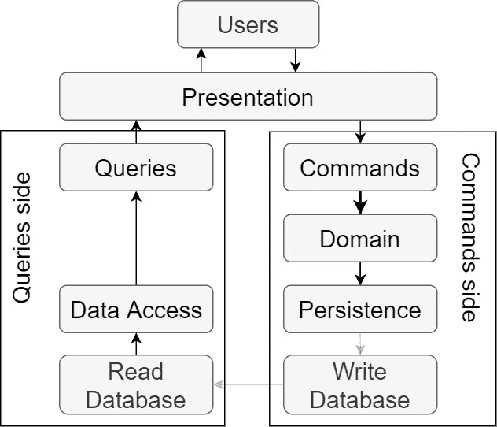

# 每个软件架构师都应该知道的 3 个 CQRS 架构

> 原文：<https://levelup.gitconnected.com/3-cqrs-architectures-that-every-software-architect-should-know-a7f69aae8b6c>

## 软件架构和重构

## 关注点分离是一种有效整理一个人思想的技术。你应该把注意力集中在一个方面。埃德格·w·迪杰斯特拉

# 命令-查询分离(CQS)

1988 年 [Bertrand Meyer](https://en.wikipedia.org/wiki/Bertrand_Meyer) 在《面向对象软件构造一书中为面向对象语言设计了 CQS 原则。简而言之，原则是软件要么修改系统(命令)，要么返回值(查询)，你应该在你的软件中保持命令-查询分离。

[马丁·福勒](https://martinfowler.com/)在他 2005 年的[博客文章](https://martinfowler.com/bliki/CommandQuerySeparation.html)中说，实现这种分离并不总是可能的，他是对的。一个很好的例子是返回刚刚插入的记录的 id。首先，将记录保存到持久性中(命令)，其次，获取新分配的 id(查询)。

# CQRS 建筑

命令查询责任分离(CQRS)架构在架构级别扩展了命令查询划分的概念。但是这些架构并不是整个软件系统的架构。它只是软件一部分的设计，这部分被称为应用层。

如果您正在寻找整个软件系统的架构，请点击下面我的关于以领域为中心的架构的文章的链接。

 [## 每个软件开发人员都应该知道的 3 个以领域为中心的架构

### 建筑师首先关心的是确保房子是可用的，而不是确保房子是…

levelup.gitconnected.com](/3-domain-centric-architectures-every-software-developer-should-know-a15727ada79f) 

CQRS 建议将应用层分成两部分，命令端**，**和查询端**。**

****查询端**应该负责并优化读取数据。查询是从持久化中读取数据，然后将它们映射成表示层所需的形式。这种表格通常被称为[数据传输对象(dto)](https://en.wikipedia.org/wiki/Data_transfer_object)。**

****命令端**负责并优化数据写入。命令是执行用例，改变实体的状态，并将它们保存到持久性中。**

**通过分离读写操作，我们提高了性能，并在系统中支持[关注点分离原则](https://en.wikipedia.org/wiki/Separation_of_concerns)。**

**您可以实现三种主要类型的 CQRS 体系结构。**

# **单一数据库 CQRS**

**单一数据库 CQRS 设计没有一个正式的名字，所以[马修·伦茨在他的 Pluralsight 课程清洁架构](https://pluralsight.com/courses/clean-architecture-patterns-practices-principles/)中称之为单一数据库 CQRS 和我也会。**

****

**单一数据库 CQRS**

**顾名思义，双方都在和一个数据库对话。命令在修改实体状态的域中执行用例。然后通过实体框架核心或 Hibernate 等 ORM 将实体保存到数据库中。**

**查询是通过数据访问层直接执行的，数据访问层要么是使用 Linq to SQL 之类的投影的 ORM，要么是存储过程。**

# **双数据库 CQRS**

**在双数据库方法中，我们有两个专用数据库，一个用于写操作，一个用于读操作。命令端有**写数据库**为写操作优化。查询端的**读取数据库**针对读取操作进行了优化。**

****

**双数据库 CQRS**

**随着每个状态被命令改变，修改后的数据必须从写数据库被推入读数据库，或者作为跨两个数据库的单个协调事务，或者使用[最终一致性模式](https://theacetechnologist.com/post/eventually-consistent-architecture-pattern/)。**

**这种体系结构在软件的查询方面带来了数量级的性能改进，这是一件好事，因为软件用户通常花在读取数据上的时间比写数据的时间多。**

# **CQRS 事件采购**

**这是最复杂的 CQRS 建筑。事件源是一种完全不同的存储数据的思想，与前面介绍的两种体系结构不同。**

**在事件源方法中，我们不仅存储实体的当前状态，还将实体发生的每个状态存储为快照。实体不保存为规范化数据，而是保存为带有事件时间戳的直接修改。**

****

**CQRS 事件采购**

**当我们想要操作域中实体的当前状态时，我们必须首先通过在实体上应用每个事件来构造这样一个实体。**

**一旦我们有了当前的实体，命令可以修改它。修改将生成一个新事件，我们将把它存储在事件存储中。因此，我们将实体的当前状态推送到一个读取数据库中，这样读取可以保持极快的速度。**

**事件采购带来了以下好处:**

*   **事件存储是一个完整的审计跟踪，在受到严格监管的行业中可以派上用场。**
*   **我们可以在任何时间点重建任何实体的任何状态。这对调试非常有用。**
*   **您可以重放事件，随时查看系统中到底发生了什么。这个特性对于负载测试和 bug 修复非常有用。**
*   **您可以轻松地重建生产数据库。**
*   **您可以拥有多个读取优化数据存储。**

**不幸的是，它很难实现，而且如果你不能从它的大部分特性中获益，它可能会变得有些过火。**

# **摘要**

**CQRS 的真正强大之处在于能够针对读写操作进行不同的优化。另一方面，软件变得越来越复杂，在命令端和查询端会有不一致的代码，随着一个以上的数据库的出现，对它的管理变得更加复杂，ORM 映射也更多。**

# **进一步阅读**

** [## 5 分钟内从整体服务到微服务

### 微服务架构风格是将单个应用程序开发成一套小型服务的方法——

levelup.gitconnected.com](/from-monolith-to-microservices-in-5-minutes-83069677d021)  [## 每个软件架构师都应该知道的软件体系结构的层次

### “所有的架构都有相同的目标——关注点的分离。都是通过分软件来实现的…

danielrusnok.medium.com](https://danielrusnok.medium.com/layers-in-software-architecture-that-every-sofware-architect-should-know-76b2452b9d9a)  [## 文件夹和尖叫建筑的功能组织

### 架构应该表达系统的意图——鲍勃叔叔

danielrusnok.medium.com](https://danielrusnok.medium.com/let-me-hear-you-screaming-architecture-3adcc02f2ca3) 

# 来源

*   Matthew Renze 的《多视角课程——清洁建筑:模式、实践和原则》
*   [维基百科上的命令-查询分离](https://en.wikipedia.org/wiki/Command%E2%80%93query_separation)
*   [马丁·福勒关于 CQS 的博客文章](https://martinfowler.com/bliki/CommandQuerySeparation.html)
*   [维基百科关注点分离](https://en.wikipedia.org/wiki/Separation_of_concerns)
*   [埃德格·w·迪杰斯特拉关于足球的名言](https://www.goodreads.com/quotes/tag/separation-of-concerns)
*   [关于最终一致性模式的文章](https://theacetechnologist.com/post/eventually-consistent-architecture-pattern/)

 [## 丹尼尔·鲁斯诺克的时事通讯

### 每个月我都会给你发一封电子邮件，列出我的最新文章。这当然是友好的联系…

www.danielrusnok.com](https://www.danielrusnok.com/daniel-rusnoks-newsletter) 

# 分级编码

感谢您成为我们社区的一员！ [**订阅我们的 YouTube 频道**](https://www.youtube.com/channel/UC3v9kBR_ab4UHXXdknz8Fbg?sub_confirmation=1) 或者加入 [**Skilled.dev 编码面试课程**](https://skilled.dev/) 。

 [## 编写面试问题+获得开发工作

### 掌握编码面试的过程

技术开发](https://skilled.dev)**