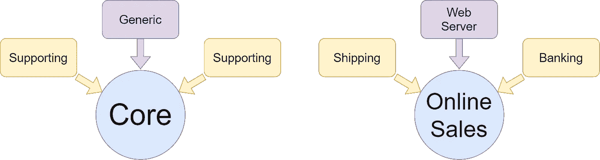
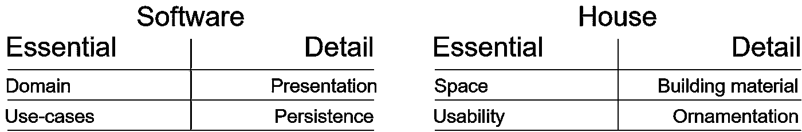
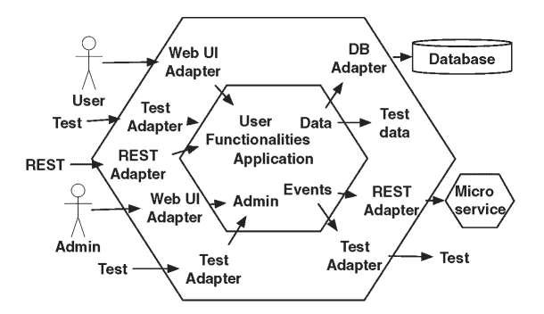
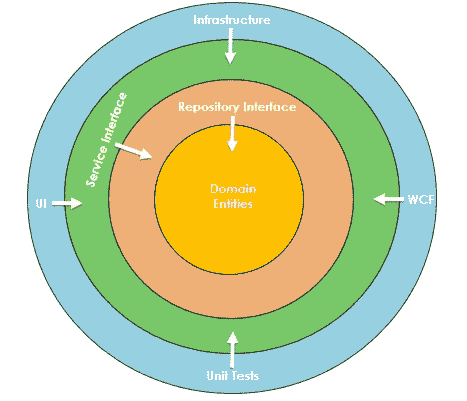

# 每个软件架构师都应该知道的 3 个以领域为中心的架构

> 原文：<https://levelup.gitconnected.com/3-domain-centric-architectures-every-software-developer-should-know-a15727ada79f>

## 软件架构和重构

## 建筑师首先关心的是确保房子是可用的；并不是保证房子是砖造的。—鲍勃叔叔

# 领域

“领域”这个术语在软件圣经中出现已经很长时间了，在 Eric Evans 所著的《领域驱动设计》一书中有大量的讨论。领域是您试图通过编写一个软件来解决的真实世界的上下文。简单地说，领域是软件存在和存在的原因。

Evans 将该域分为三个子域。

## 核心域

核心领域代表了竞争优势和软件存在的理由。它是软件的核心，包含最基本的业务规则、用例以及领域模型。它通常是代码库中最小的部分。也就是说，是软件最关键的 20%部分。

## 支持域

支撑域是软件的支撑子系统**T3。没有它们，核心仍然可以存在，但它不会对用户变得孤立。一个系统中可以有多个支持域。例如，支持域是针对核心域的，这与亚马逊的发票是一回事。**

## 通用域

通用领域是软件中最少定制的部分，也是最不重要的部分。它不是特定于您的领域，而是广泛存在于其他系统中。我目前正在开发一个员工的时间表信息系统，这个软件的通用领域是为每个员工提供一个外部时间跟踪器。

左:公共领域，右:具体的电子商店示例

## 摘要

从商业的角度来看，决定你的核心领域是什么并把你的开发资源集中在这里是很重要的。

# 以领域为中心的架构

现在，当我们知道域是什么时，您可以从逻辑上推导出以域为中心的架构将域放在中心。每个软件架构师都有责任正确识别什么是基本用例，什么只是实现细节。

让我们假设你要买这所房子。对你的选择来说什么是最重要的，什么是第二位的？

在我看来，空间和可用性是买新房的最根本原因。装饰和建筑材料可能会紧随其后，并改变我的决定，但当我在网上查看房地产报价时，我首先会考虑空间和可用性，以满足我的需求。

# 六角形建筑

阿利斯泰尔·考克伯恩在 2005 年发明了六边形建筑。也称为端口和适配器架构。很少有作者将六边形架构标记为微服务架构的起源。

它是一个插件系统，由多个松散耦合的组件组成，您可以将这些组件连接到核心。这种分割的优点是易于更换每个部件。

图片来源和出处:[https://ebrary.net/85161/computer_science/hexagons_layers](https://ebrary.net/85161/computer_science/hexagons_layers)

组件通过公开的公共接口(端口)相互通信。这种接口通常用于通知或数据库查询和存储。

适配器是组件和外界之间的粘合剂。一个端口可以连接更多的适配器。例如，Azure 部署可以通过 CLI、web 门户或 Windows PowerShell 进行管理。

# 洋葱建筑

由杰弗里·巴勒莫于 2008 年创立。洋葱架构的观点是提供更好的可测试性、可维护性和可靠性。它是基于控制原理的[反转的架构。它偏向于面向对象的编程。](https://en.wikipedia.org/wiki/Inversion_of_control)

图片来源和出处[代码大师](https://codeguru.com)

该架构由面向核心域的多个同心层组成，将所有耦合移向中心。

## 畴层

在这一层，你会发现所有的业务和行为对象。它还包含域接口。域层不能有任何依赖关系。相反，其他层应该依赖于域层。

## 储存库层

这是从持久性中保存和检索数据的抽象。该层还将数据从持久性映射到业务实体。如果你不熟悉存储库模式，这里是我的朋友[Sena klar slan](https://medium.com/@sena.kilicarslan)**的中间帖子。**

 [## ASP.NET 核心中的存储库模式实现

### 在这篇文章中，我将展示如何在 ASP.NET 核心中用异步方法实现通用存储库模式…

medium.com](https://medium.com/net-core/repository-pattern-implementation-in-asp-net-core-21e01c6664d7) 

## 服务层

由通用操作的接口组成。它提供并封装了 UI 层和存储库层之间的通信。此外，它可以保存实体的业务逻辑。

## 用户界面层

这是最外层。在这里，您可以找到依赖注入原则的实现。它可以是 web 应用程序、单元测试项目或 web API。

## 赞成的意见

*   灵活、可持续和可移植的架构。
*   不需要创建一个共同的共享项目。
*   可以快速测试。
*   向中心耦合。

## 骗局

*   对于初学者来说，这不是一个简单的体系结构。
*   接口和抽象被大量使用，在代码间移动可能会令人困惑。
*   架构师大多搞砸了，在各层之间划分职责。

# 干净的建筑

罗伯特·c·马丁，也被称为鲍勃大叔，在 2012 年发明了清洁建筑。该架构基于[关注点分离](https://en.wikipedia.org/wiki/Separation_of_concerns)原则。它通过将软件分层来实现分离。该架构易于测试，独立于 UI、数据库或任何外部代理。

图片来源及鸣谢:[https://blog . clean coder . com/uncle-bob/2012/08/13/the-clean-architecture . html](https://blog.cleancoder.com/uncle-bob/2012/08/13/the-clean-architecture.html)

该架构由不同软件领域的同心圆组成。圈子越外，软件水平越高。外圈是机制，内圈是政策。

源代码依赖只能指向内部。在外圈声明的任何东西，包括类、函数和变量，都不能在内圈提及。

## 实体

实体层封装了业务规则。它可以是一个有方法的对象，也可以是一组数据结构和函数。它封装了最通用的高级规则，也称为域。

## 用例

这些是特定于应用程序的业务规则。在这里，您实现了系统的所有用例。规则不影响实体。该层不受数据库或 UI 等外部因素的影响。

## 接口适配器

这一层负责将来自用例和实体的数据转换成外部机构的格式。典型的用法是 GUI 的 MVC 架构。这里是数据从实体转换到数据库表的地方，反之亦然。该层的主要目标是将数据的内部形式转换为外部形式。

## 框架和驱动因素

最外层。它由每个外部机构的粘合代码组成，比如数据库或 web 框架。

# 摘要

列出的每种体系结构的工作原理都是一样的。它们都将应用程序层包装在中心的域作为用例，外围圆圈中的持久性、表示和基础设施表示指向中心的实现细节。

## 赞成的意见

*   重点关注领域。
*   耦合度较低。
*   允许使用[域驱动设计](https://en.wikipedia.org/wiki/Domain-driven_design)。

## 骗局

*   改变是困难的。
*   需要更多的思考。
*   初始成本较高。

# 来源

*   阿利斯泰尔·考克伯恩关于六角形建筑的原创博文。
*   Jeffrey Palermo 关于洋葱建筑的博客文章。
*   CodeGuru 对洋葱架构的理解。
*   [鲍勃大叔 2012 年关于清洁建筑的博文。](https://blog.cleancoder.com/uncle-bob/2012/08/13/the-clean-architecture.html)
*   [plur sight 课程清洁架构模式、实践和原则](https://app.pluralsight.com/library/courses/clean-architecture-patterns-practices-principles/table-of-contents)
*   [维基百科上的六角形建筑。](https://en.wikipedia.org/wiki/Hexagonal_architecture_(software))
*   [Stackoverflow 回答了这个问题——什么是域。](https://softwareengineering.stackexchange.com/questions/359592/what-is-a-domain)
*   [CodeGuru 关于洋葱架构的文章。](https://www.codeguru.com/csharp/csharp/cs_misc/designtechniques/understanding-onion-architecture.htm)

# 进一步阅读

 [## 5 分钟内从整体服务到微服务

### 微服务架构风格是将单个应用程序开发成一套小型服务的方法——

levelup.gitconnected.com](/from-monolith-to-microservices-in-5-minutes-83069677d021)  [## 每个软件架构师都应该知道的软件体系结构的层次

### “所有的架构都有相同的目标——关注点的分离。都是通过分软件来实现的…

danielrusnok.medium.com](https://danielrusnok.medium.com/layers-in-software-architecture-that-every-sofware-architect-should-know-76b2452b9d9a)  [## 每个软件架构师都应该知道的 3 个 CQRS 架构

### 关注点分离是一种有效整理一个人思想的技术。你应该集中注意力…

danielrusnok.medium.com](https://danielrusnok.medium.com/3-cqrs-architectures-that-every-software-architect-should-know-a7f69aae8b6c)  [## 文件夹和尖叫建筑的功能组织

### 架构应该表达系统的意图——鲍勃叔叔

danielrusnok.medium.com](https://danielrusnok.medium.com/let-me-hear-you-screaming-architecture-3adcc02f2ca3)  [## 丹尼尔·鲁斯诺克的时事通讯

### 每个月我都会给你发一封邮件，列出我的最新文章。当然，这将是友好的联系…

www.danielrusnok.com](https://www.danielrusnok.com/daniel-rusnoks-newsletter) 