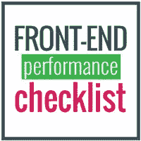

# Web 开发人员的 3 个基本前端清单

> 原文：<https://levelup.gitconnected.com/3-essential-front-end-checklists-for-web-developers-d873b226b1f0>

## 使用这些涵盖工程、设计和性能的开源清单，确保您的 web 应用程序的气密性和高质量

你可能听说过“**前端清单**”——我于 2017 年 10 月在 GitHub 上发起的一个项目。它最初只是一个帮助我在毛里求斯[的团队的简单项目，但在国际支持下转变为一个巨大的项目，收到了 28，000 多颗 GitHub 星，并被翻译成 10 多种不同的语言。](https://en.wikipedia.org/wiki/Mauritius)

从那以后，我一直在更深入地研究可以帮助我和社区进一步改进我们工作的附加清单。这里列出了当前可用的所有清单，以帮助确保您的 web 应用程序的最高质量。这些必不可少的清单将使你充满信心地启动你的网站，并确保你不会错过任何东西。

# 前端清单

🚀发射日期:2017 年 10 月
👩‍💻👨‍💻投稿人:75
⭐️明星:+28 400
🖥 Github 网址:[https://github.com/thedaviddias/Front-End-Checklist](https://github.com/thedaviddias/Front-End-Checklist)🔗网址:[https://frontend check list . io](https://frontendchecklist.io)💯产品搜寻:[https://www.producthunt.com/posts/front-end-checklist](https://www.producthunt.com/posts/front-end-checklist)

**前端清单**是一个网站应该包含的所有元素的详尽列表。您可以在启动您的网站或向产品添加新的 HTML 页面之前，将此用作资源。第 2 版目前正在开发中，它将为每个规则提供更多的解释和附加链接。

该清单最初是一个小项目，旨在帮助我在毛里求斯的团队，它已经成为世界各地许多前端开发人员使用的工具。

# 前端设计清单

🚀上市日期:2018 年 4 月
👩‍💻👨‍💻投稿人:5
⭐️明星:+2600
🖥 Github 网址:[https://github.com/thedaviddias/Front-End-Design-Checklist](https://github.com/thedaviddias/Front-End-Design-Checklist)t22】🔗网址:[https://frontenddesignchecklist.io/](https://frontenddesignchecklist.io/)(即将转到 frontendchecklist.io)
💯产品搜索:[https://www . product Hunt . com/posts/front-end-design-check list](https://www.producthunt.com/posts/front-end-design-checklist)

**前端设计清单**是一份详尽的指南清单，可以帮助开发者分析和理解网页设计，以确保他们前端开发的质量。它不仅仅是开发人员的工具，它对网页设计人员也很有用。

如果你曾经和网页设计师一起工作过，你会知道有时候开发人员会忘记一些关键的技术元素。不要依赖“运气”或“希望”，建立一个清单，无条件地促进你的工作流程。

# 前端性能清单

🚀发射日期:2018 年 7 月
👩‍💻👨‍💻投稿人:+5
⭐️明星:+1500(📈快速增加)
🖥 Github 网址:[https://github . com/the daviddias/front-end-performance-check list](https://github.com/thedaviddias/Front-End-Performance-Checklist)
🔗网址:(即将登陆 frontendchecklist.io)
💯产品搜索:[https://www . product Hunt . com/posts/front-end-performance-check list](https://www.producthunt.com/posts/front-end-performance-checklist)

**前端性能清单**是专注于前端开发性能的详尽资源列表。每个规则都有一个“为什么”和“如何”的部分，用几句话来帮助你理解是什么让规则变得重要，以及你如何解决你的问题。

我一直对前端性能感兴趣。我开始研究这个清单，以帮助我的团队在[infinitive Engineering](https://medium.com/u/48dd28bfc3c?source=post_page-----d873b226b1f0--------------------------------)解决问题并提高我们应用程序的质量。我也决定开源这个项目，希望它能帮助更多的人。

# 接下来会发生什么？

这三个清单仅仅是开始。我已经在研究其他有用且有趣的清单，以帮助社区拥有一个简单但可靠的工作流程。我还会更新原来的网站([https://frontend check list . io](https://frontendchecklist.io))来包含所有的清单。

如果没有所有的贡献者和这些项目得到的支持，这一切都是不可能的。不要犹豫，也成为冒险的一部分，并帮助改善内容！

# 感谢您的阅读！

如果您喜欢这些开源项目，并发现它们很有用，您可以做以下事情来表示您的支持:

*   **打拍手👏在这篇文章上扣几下(不要害怕，你不会弄坏任何东西)！**

鼓掌👏按钮！

*   **现在就在 Github 上给一颗星** ⭐️！(这让我有动力继续启动其他开源项目)
*   在工作中使用这些清单，并通过在 https://twitter.com/thedaviddias[发推文给我**你的反馈**](https://twitter.com/thedaviddias)