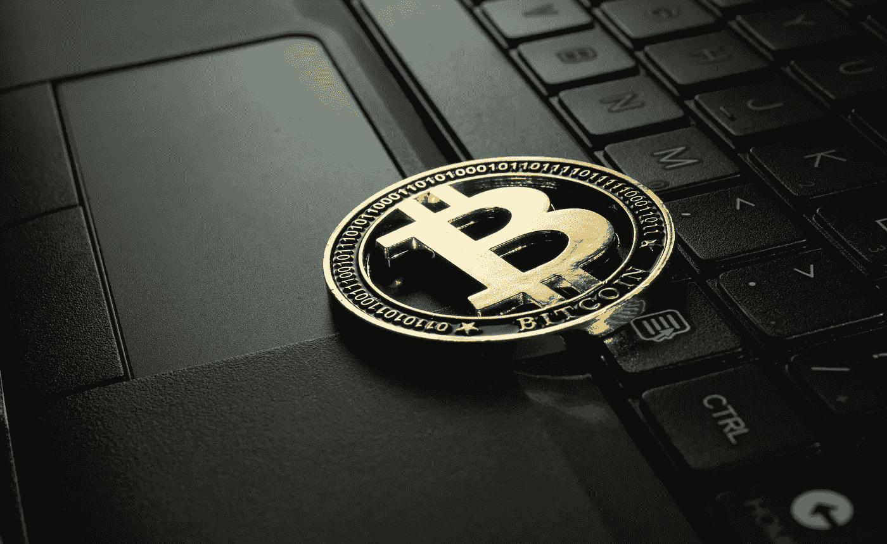
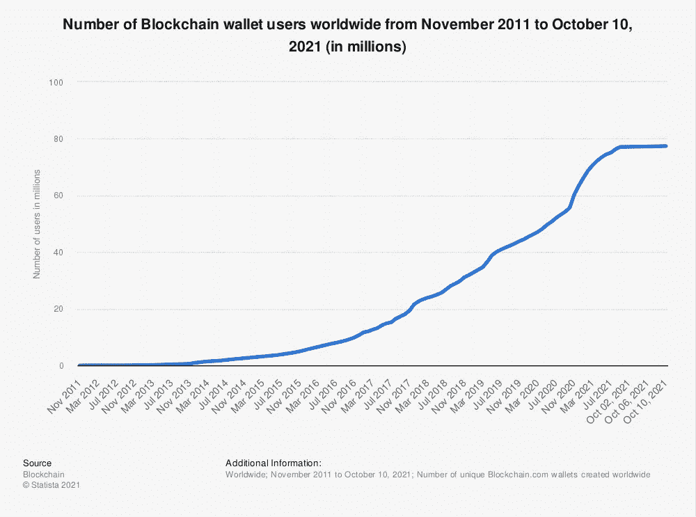

# 在牛市中保持密码安全的 3 个基本方法

> 原文：<https://levelup.gitconnected.com/3-essential-ways-to-keeping-your-crypto-safe-throughout-the-bull-market-9e938313df50>

经过几个月的沉寂之后，[比特币牛市](/back-to-the-bull-market-how-high-can-bitcoin-go-in-2021-after-smashing-all-time-high-c701c55d8da2)似乎终于恢复了，这种世界上最著名的加密货币在 10 月下旬再次打破历史高点。随着市场经历更加剧烈的价格波动，BTC 价格上涨似乎已经让投资者为 2021 年的疯狂结局做好了准备。然而，随着资产升值，网络罪犯会产生更多不必要的兴趣。

据[市场内幕](https://markets.businessinsider.com/news/currencies/cryptocurrency-hacks-fraud-cases-record-bitcoin-ethereum-wallets-breaches-defi-2021-8)报道，2021 年已经发生了 32 起黑客和欺诈事件，总价值达 29.9 亿美元——这使得犯罪数量有望打破 2020 年报告的 38 起案件的记录。此外，这比 2019 年大幅增长了 40.7%。

*(图片:***)**

*从上面的图表中我们可以看出，随着比特币在 2020 年底和 2021 年初被广泛报道的价格上涨，区块链钱包的用户数量已经加速增长到近 8000 万。*

*然而，投资者对购买和持有加密货币的兴趣不断增加，这意味着黑客通过非法手段获取加密的兴趣也在增加。*

*考虑到这一点，加密货币投资者在访问他们的资产并与其建立交易时必须保持警惕。幸运的是，您可以采取许多措施来尽可能地控制您的加密资产。让我们更深入地看看一些容易操作的方法，你可以用它们来确保你的[比特币留在你身边](/road-to-recovery-could-bitcoin-still-top-100-000-in-2021-7a84c4b10f8b):*

# *挖掘冷钱包的力量*

*如果你真的想保证你的[加密货币的安全](/keeping-your-crypto-safe-4-essential-ways-to-secure-your-cryptocurrency-wallets-e1f10f5b4ea1)并且有大量的财富投入到加密资产中，那么利用冷藏选项是保护你投资的最安全的方式。*

*简单地说，冷钱包是离线存储空间，使黑客无法窃取您的资产。*

*这些钱包将用户的地址和私人密钥存储在不与互联网连接的某个地方，并且通常具有硬件附带的软件，这样用户仍然可以看到他们的投资组合，而不会将他们的私人密钥置于风险之中。*

*硬件钱包通常以安全存储私钥的 USB 驱动器的形式出现。与在线“热门”钱包相比，这给了它一个很大的优势，因为它不会受到联网设备可能接触到的病毒或易受攻击软件的影响。*

*冷钱包的开源性质也意味着它的安全级别可以由同行决定，而不是由一家主要寻求利用销售的公司决定。*

*冷钱包是存储 BTC 和各种其他加密资产的最安全的方式。然而，重要的是要注意，它们可能需要一点知识来设置，对于初学者来说可能有点复杂。*

# *进行交易时使用 VPN*

*从[隐私的角度来看](https://www.mostsecurevpn.com/how-to-assess-the-security-of-a-vpn/)，利用 VPN 可以显著提高你的加密安全性。尽管[比特币](/driving-the-resurgence-bitcoins-rally-revives-the-cryptocurrency-market-ad8987469822)不是匿名的，但这种货币可以是假名，尽管 KYC/反洗钱验证可以让你的金融活动很容易在公共账本上被跟踪，但 VPN 可以保护你的身份安全。*

*强大的、以隐私为导向的 VPN 帮助你保护你的身份，防止任何人跟踪你，无论是黑客、政府机构还是其他可疑的第三方。从根本上说，任何人都不可能偷你的钱，如果他们不知道钱是属于你的话——因此，VPN 是保护你财务安全的绝佳工具。*

*然而，也值得注意的是，大多数加密货币协议都是在端到端加密的基础上设计的，具有很高的安全性。这意味着任何人都很难拦截你发送的数据，除非你已经暴露在安全漏洞之下。当您使用加密资产时，通过接入 VPN 服务来提供额外的安全层，您可以使您的交易几乎无懈可击。*

# *小心网络钓鱼攻击*

*加密货币[投资领域最常见的漏洞之一是网络钓鱼攻击。](/easily-10x-your-money-with-this-cryptocurrency-a585c954d5c2)*

*Lookout 安全解决方案高级经理 Hank Schless T1 表示，随着 crypto 变得越来越受欢迎，更多黑客将会发现通过移动钓鱼活动瞄准投资者的动机，这些活动旨在模仿摄取应用程序，以此作为窃取登录信息的手段。*

*这些社交工程攻击可以通过智能手机从任何地方发起，无论是短信、社交媒体、第三方网页还是电子邮件。*

*“除了网络钓鱼，还有恶意的移动应用程序，它们具有记录你的击键或观察你屏幕上的活动的隐藏能力，”Schless 补充道。“考虑到我们信任这些设备的数据量，它们是最需要保护的。”*

*随着加密货币牛市在 2021 年第四季度获得新生，我们不可避免地会看到许多新投资者进入市场购买他们的第一批资产。这种新的关注将带来新的安全威胁。我们必须保持警惕，确保我们的投资不会落入坏人之手。*