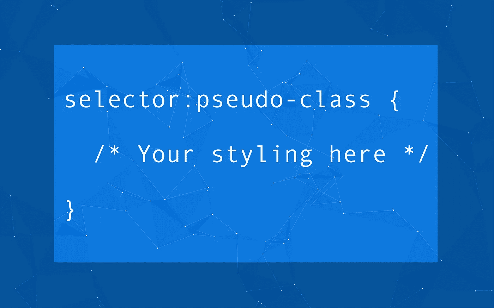

# CSS 初学者的伪类的 3 个例子

> 原文：<https://levelup.gitconnected.com/3-examples-of-pseudo-classes-for-css-beginners-23b9459cbb1e>



这篇文章是面向 CSS 初学者的。这篇短文的目的是通过 3 个例子来介绍 CSS 伪类选择器，这些例子展示了几种不同的选择器是如何实现的。

有许多伪类选择器，查看这里列出它们的文档[。这篇文章将涵盖一些我认为对初学者有用且易于实现的内容，同时也有助于让你的应用程序拥有更好的 UX/用户界面。](https://developer.mozilla.org/en-US/docs/Web/CSS/Pseudo-classes)

以下是我将涉及的三个主题:

1.  `:hover`
2.  `:active`
3.  `:first-child`、`:last-child`、`:nth-child()`

伪类在我们的外部 CSS 文件中是这样使用的:

```
selector:pseudo-class {
  ...
}
```

# `:hover`

当用户将鼠标悬停在某个特定元素上时，如果您希望有所改变，可以使用这个伪类。这让用户在点击之前知道他们的鼠标实际上在正确的位置。

我们可以应用任何我们想要的样式变化，包括动画。然而，在这个演示中，我将创建一个定制按钮来改变`background-color`，文本`color`，并使`width`稍微变大；我将使用一个`<div>`来避免按钮的默认行为。这将增加一个效果，看起来比平淡无奇的默认`<button>`更有创意。

玩一下 CodePen，看看有什么不同！

那就是当用户悬停在一个元素上时如何创建一个简单的效果，然而，当我们点击自定义的“按钮”时，没有任何变化或发生，没有反馈告诉用户按钮被点击了；这就是`:active`在进一步定制这个按钮时派上用场的地方。

# `:active`

当一个元素正在被使用时，使用这个伪类。对于我们的自定义按钮，这是它被点击的时刻。

我将改变上面的按钮，以在激活时给出响应。该响应将使`background-color`变得更暗，而`width`变得更小，以创建一个简单的“按压”效果。

看看这个:

# `:first-child` `:nth-child`和`:last-child`

我决定将这些放在一起，因为它们的工作方式非常相似。我相信您可以假设，`:first-child`允许我们更改所选类型的第一个子元素，而`:last-child`允许我们更改该类型的最后一个元素。

:n-child()允许我们以几种不同的方式选择特定的编号元素。如果我们在括号之间放一个数字，我们选择的是一个元素。

```
p:nth-child(4) {
  ...
}
```

这将允许对分组中的第 4 个`<p>`元素进行修改。我们也可以使用一个带“n”的数字来表示我们想要影响一个分组中的每“n”个元素。

```
li:nth-child(3n) {
 ...
}
```

这将允许分组中每第三个`<li>`进行更改。最后，我们可以在括号中放一些关键字，`odd`或`even`；其作用与它们听起来的一样，影响组中所有奇数或偶数编号的元素。

这是一个演示十大排行榜的`:first-child`和`:nth-child()`的代码笔。我使用这些伪类来强调偶数位置，方法是改变它们的`background-color`，并使第一个 place 元素更大，文本为金色。

# 结论

这些只是 CSS 中一些有用的伪类！我发现有无数种方法可以使用它们，这是给你的应用程序添加一点活力的简单方法。我希望这至少对一个 CSS 初学者有益！感谢您的阅读，一如既往地祝您黑客生涯愉快！