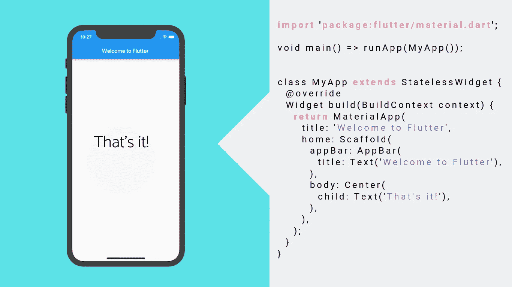
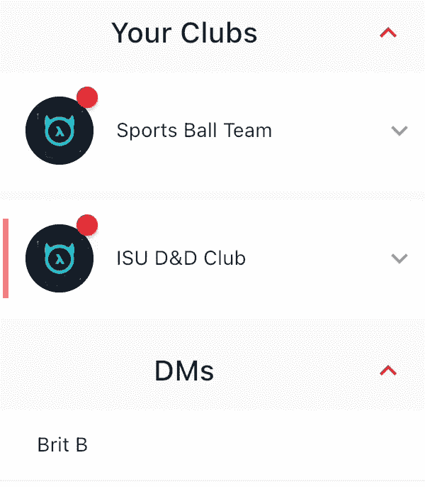
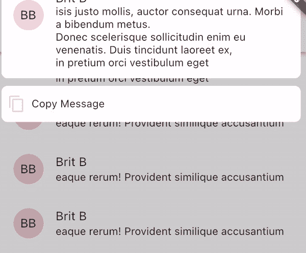

# 3 个我希望在启动我的应用程序之前就知道的小部件

> 原文：<https://levelup.gitconnected.com/3-flutter-widgets-that-i-wish-i-knew-existed-before-starting-my-app-1d27535f6a57>

都是小部件。所有的

Flutter 也有同样的问题(你会称之为问题吗？)作为 Python: *一切*都在标准库中。我花了很多个晚上编写一个聪明的小部件，却没有意识到这个小部件已经存在——它只是一个导入“package:flutter/material . dart”；走开。

其他时候，一个问题似乎不可能解决——我甚至不知道去谷歌搜索什么，因为我不确定解决方案会是什么。后来，我发现了一个可以帮我节省几个小时的小工具。

这里有三个你应该放在你的工具箱里的小部件:小心，因为第三个是个小玩意。

## 1.膨胀瓷砖

来自俱乐部应用程序的屏幕截图

众所周知，UI/UX 喜欢把东西藏在菜单后面；保持 UX 干净，然后将所有开关藏在汉堡菜单、下拉菜单和抽屉后面。

然而，这种方法的缺点是用户不知道下拉菜单的存在:眼不见，心不烦。

`ExpansionTile`提供了一个聪明的 API 和一个隐藏内部的简单方法:

我们可以创建一个`title`文本:显示在按钮上的文本。`children`是扩展中显示的内容，它使用了不止一个小部件，因此您不需要在那里添加一列并处理无界约束。

其他一些有用的选项包括`leading`，它在磁贴前面的开头显示一个图标。

如果你需要一个聪明的方法来隐藏一点用户界面，不要犹豫去使用`ExpansionTile`。虽然它在材料包中，但定制掉所有的 Google-y 元素并不困难(如果你决定材料不适合你或你的应用)。

## 2.关于对话

作为一名独立开发人员并不容易:你必须身兼数职，这让你感到沉重。

开发者不能忘记的帽子之一是*法律帽子*。

你花了三个月的时间在你的应用上——你知道它会带你走向你一直在寻找的财务自由。你的应用会让人们*开心，*你最终会成为一个问题的解决方案。

**只有一个问题:**你现在因为违反隐私法和不遵守最佳消费者惯例而被起诉。

Flutter 有一个很棒的小部件叫做`AboutDialog`，它允许一个简单的方法来包含所有需要的效果。

我可以一直写这个小部件的魔力，但是我认为 flutter 团队自己会比我做得更好，所以这里是本周`AboutDialog`的小部件:

## 3.CompositedTransformTarget/CompositedTransformFollower

Flutter 中的大多数小部件都很容易学习和使用。*最多。*

`CompositedTransformTarget`可能是我在应用程序中使用过的最具挑战性的小工具。它不是简单的“包含，就完成了”风格的小部件。

当我在学习深入理论领域的东西时，我喜欢拿出我的白板，尝试例子，做笔记，并把它作为第二大脑。我不得不为这个小部件这么做，但结果是*非凡的。*

简而言之:`CompositedTransformTarget / CompositedTransformFollower`允许你在不破坏窗口小部件树的情况下将一个窗口小部件“钉”到另一个窗口小部件上。也许您曾经遇到过这样的情况，您不情愿地四处移动小部件，因为您不知道如何让一个小部件覆盖树中不同部分的另一个。

太抽象？想想你会怎么做这样的事情:

俱乐部应用程序的另一个屏幕截图

许多程序员会去找`Stack`——但是再看看 gif。堆栈扩展到最大大小，但没有超过它。“复制消息”文本与消息放在不同的位置，而`stack`不会让这种情况发生。更重要的是，把一条稍微低于`AppBar`的信息放在最上面，如果没有一些魔法，这几乎是不可能的。

我不会说这对 Flutter 开发人员来说是一个*必须知道的*，但是它确实有助于了解它的存在，并且如果时机成熟，能够接触到它并知道 CompositedTransformTarget 做什么。

至于是怎么运作的？我不确定我是否认为自己有足够的知识来写它，所以这里是我用来从 Flutter 本身的开发者那里学习它的资源:

 [## 如何将一个覆盖小部件浮动在一个(可能经过转换的)UI 小部件上

### 假设您的应用程序 UI 中有一个小部件，您想在该小部件上覆盖一个浮动小部件。也许那个…

medium.com](https://medium.com/flutter/how-to-float-an-overlay-widget-over-a-possibly-transformed-ui-widget-1d15ca7667b6) 

这就是本文的全部内容！Flutter 有数百个有价值的小部件——最具挑战性的部分是把它们都记在脑子里，这样当你遇到问题时，你就知道该去找什么了。

祝您在开发之旅中好运…如果您想成为 10x Flutter 开发人员，这里还有一些文章可以扩展您的知识:

[https://level up . git connected . com/flutter-bloc-V8-0-is-here-and-will-change-the-way-you-handle-state-forever-72 DDB 4d a9 E1 d](/flutter-state-management-in-2021-when-to-use-what-98722093b8bc)

[https://level up . git connected . com/the-7-flutter-packages-I-cant-live-without-9c 18 AC 8540 BD](/the-7-flutter-packages-i-cant-live-without-9c18ac8540bd)

[https://level up . git connected . com/flutter-state-management-in-2021-when-to-use-what-what-98722093 b8bc](/flutter-state-management-in-2021-when-to-use-what-98722093b8bc)