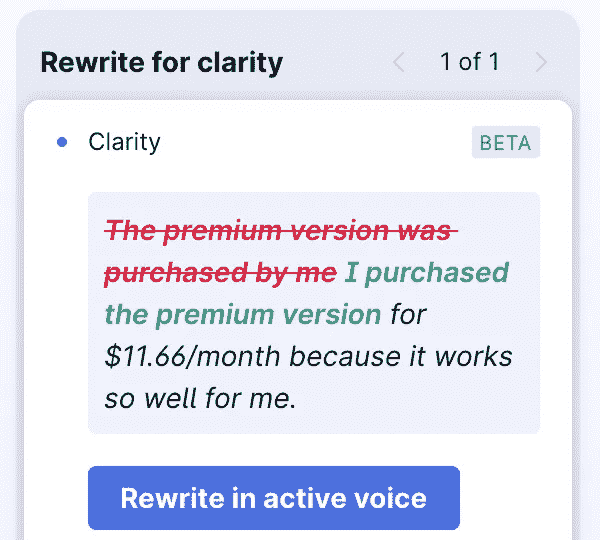
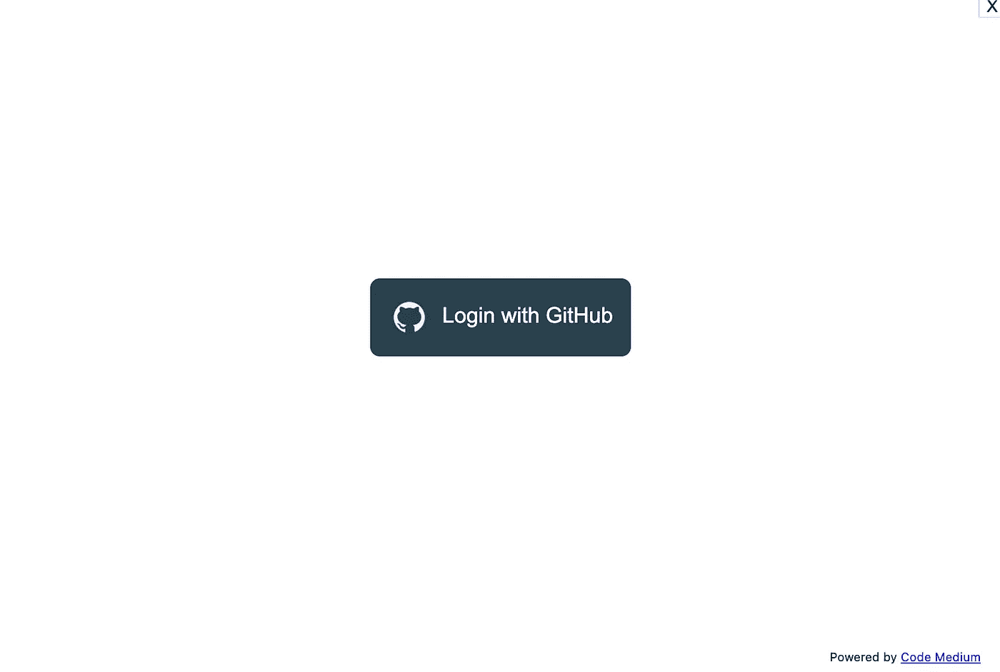
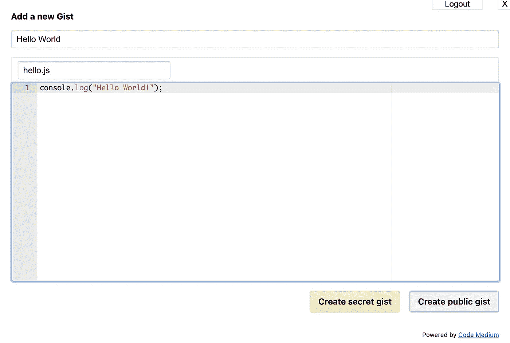

# 3 个在媒体上编写更吸引人的编程教程的技巧

> 原文：<https://levelup.gitconnected.com/3-hacks-to-write-more-engaging-programming-tutorials-on-medium-a5240720f264>

## 用这些简单的技巧击败竞争对手


杰佛森·桑多斯在 [Unsplash](https://unsplash.com?utm_source=medium&utm_medium=referral) 上拍摄的照片

# 1.良好的语法

让我们开门见山吧。你的语法糟透了。没关系，因为我的也是。我读了很多充斥着语法和拼写错误的编程教程。我明白英语无论如何都不是一门直观的语言，但这就是我向你推荐这款应用的原因。



作者截图

我以每月 11.66 美元的价格购买了高级版，因为它对我来说非常好用。最棒的是，它正好位于媒体编辑器中，在我写作时纠正我的拼写和语法，甚至告诉我写作的语气。Grammarly 非常先进，它让我的写作听起来棒极了，这让我惊叹不已。

使用下面我的会员链接开始吧！

[](https://grammarly.go2cloud.org/aff_c?offer_id=209&aff_id=68470) [## 语法上

### 无论你的文章是被成千上万的人在线阅读还是仅仅被亲密的家人和朋友阅读，检查你的…

grammarly.go2cloud.org](https://grammarly.go2cloud.org/aff_c?offer_id=209&aff_id=68470) 

# 2.GitHub Gists

很多编程博客都有类似这样的代码。

```
console.log("Hello World!");
```

看看那看起来有多可怕。现在想象一下，需要分析和理解的实际代码文件越来越长。现在绝大多数程序员使用支持语法突出显示的 IDE 或文本编辑器，所以我们不要强迫读者回到石器时代，那时人们在终端中编写代码。

Code Medium 是一个 Chrome 扩展，允许你直接从媒体编辑器中编写 GitHub Gists。它添加了您在下面看到的绿色按钮。


作者截图

点击按钮后，会提示您登录 GitHub。



作者截图

登录后，您可以创建一个公共 Gist。



作者截图

然后嘣。我不必离开媒体编辑器，您可以查看这个漂亮的、语法突出的代码。

# 3.史诗分割线

程序员倾向于阅读我们泡泡里的文章，这才有意义，因为 Medium 会推荐符合你兴趣的文章。正因为如此，我想分享一个我从《生活方式和健康媒介》中学到的技巧，它只是简单地替换了媒介的标准分割线…

…带有图像。看那看起来多好！


如果你喜欢这篇文章，请在 Medium 上跟随我([查理·莱文](https://medium.com/u/6da6b651e31a?source=post_page-----a5240720f264--------------------------------))。我至少每周写一篇编程和技术相关的文章。

如果你在下面的评论中使用了我的技术**，请告诉我！💬**


查看我最受欢迎的文章！

[](https://js.plainenglish.io/the-ultimate-guide-to-creating-auto-saving-forms-in-angular-29806875364) [## 在 Angular 中创建自动保存表单的终极指南

### 由 RxJS 和角形材料提供动力

js .平原英语. io](https://js.plainenglish.io/the-ultimate-guide-to-creating-auto-saving-forms-in-angular-29806875364) [](https://medium.com/macoclock/my-top-3-macos-menu-bar-apps-94105a7dbdc3) [## 我最喜欢的 3 款 macOS 菜单栏应用

### 简约，不用手，在我的 MacBook Air 上享受(M1，2020 年)

medium.com](https://medium.com/macoclock/my-top-3-macos-menu-bar-apps-94105a7dbdc3) [](https://medium.com/macoclock/how-to-make-your-macos-terminal-look-as-awesome-as-mine-in-2021-9e7351d39bc7) [## 2021 年如何让你的 MacOS 终端看起来和我的一样牛逼

### 非常固执己见的向导

medium.com](https://medium.com/macoclock/how-to-make-your-macos-terminal-look-as-awesome-as-mine-in-2021-9e7351d39bc7)