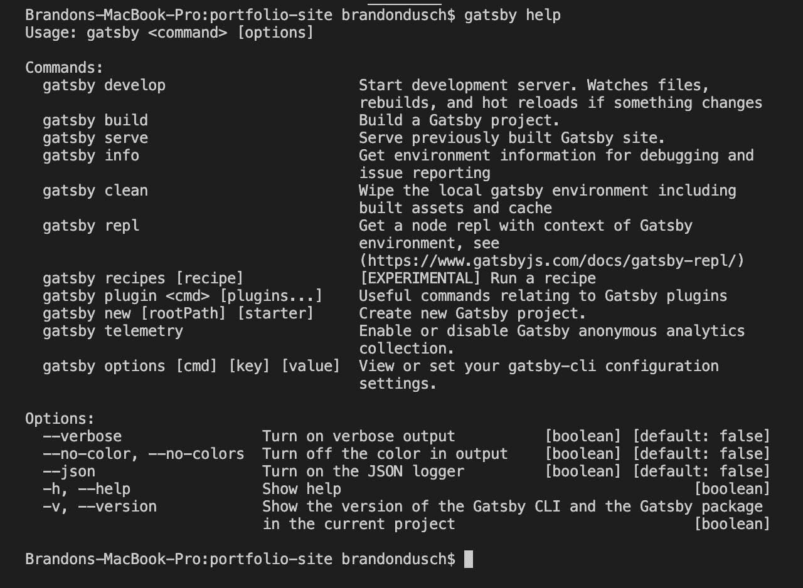
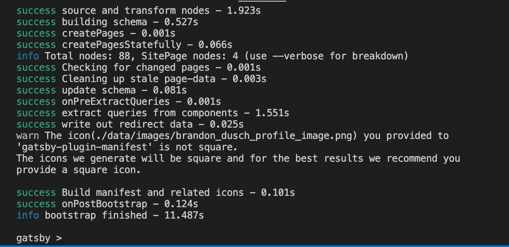

# 3 个有用的 Gatsby CLI 命令

> 原文：<https://levelup.gitconnected.com/3-helpful-gatsby-cli-commands-1b559cf16f24>


# 盖茨比 CLI

使 Gatsby 成为强大的前端框架的部分原因是它通过 [Gatsby CLI 工具](https://www.gatsbyjs.com/docs/reference/gatsby-cli/)内置的命令列表。像`gatsby new`和`gatsby build`这样的命令分别允许开发和部署的平滑体验。我们将超越这些常见的命令，探索一些鲜为人知的命令。

*注意:在继续操作之前，确保安装了* `*gatsby cli*` *。用* `*npm list -g | grep gatsby-cli*` *检查。如果没有安装，用* `*npm install -g gatsby-cli*` *安装。本文使用 Gatsby 3 . 8 . 1 版和 Gatsby CLI 3 . 7 . 1 版*

# 1)用“`help"`发现其他命令

与大多数 CLI 工具和包管理器一样，Gatsby CLI 附带了一个`help`命令来显示每个可用的命令。



如上所示，有些命令除了有较长的版本之外，还有较短的版本。这包括`help`:

大多数命令的名称在左边，简短描述在右边。`help`命令对于快速参考很少使用的命令很有用。

# 2)查看"`info"`关于项目和本地 OS

与`help`类似，`gatsby info`命令旨在显示有用的信息。重要的区别在于`gatsby info`严格来说是用来显示信息的。


以下是运行时`gatsby info`将显示的内容:

*   `OS` -本地机器的操作系统
*   `CPU` -机器的加工信息
*   `Shell` -正在使用的 shell 的类型和版本(通常是 [bash](https://www.gnu.org/software/bash/) 或 [zsh](https://www.zsh.org/) )
*   `Binaries` -节点、npm 和 yarn 等命令工具的位置和版本
*   `Languages` -本地安装的编程语言(Python 等)的位置和版本。)
*   `Browsers` -已安装网络浏览器的名称和版本(Chrome、Safari 等。)
*   `npmPackages` -与 Gatsby 相关的包的名称和版本
*   `npmGlobalPackages` -全球安装包的名称和版本(Gatsby 相关)

对于更好地理解 Gatsby 项目所处的本地系统环境来说，`info`命令可以证明是有用的。

# 3)用“repl”探索项目的环境

这最后一个命令很有趣。REPL(read-eval-print-loop)是一种允许在代码的指定点执行某些操作的环境。盖茨比 REPL 提供了一个交互式外壳，让我们在盖茨比环境中处理特殊变量。

从 Gatsby 项目的根目录开始，在终端上运行`gatsby repl`命令。将出现一个外壳，看起来应该是这样的:



随着一个新的交互式 shell ( `gatsby >`)的打开，我们可以与 Gatsby 项目中的各种数据进行交互。以下是对盖茨比 REPL 中一些更有趣的变量的描述:

## 页

`pages`返回包含分类为“页面”的组件信息的对象数组。使用[默认的起始页面](https://www.gatsbyjs.com/starters/gatsbyjs/gatsby-starter-default)，如果我们运行`gatsby repl`并键入以下操作:

```
gatsby > for(p of pages) { console.log(p[1].internalComponentName + ' = ' + p[1].componentPath)} Component/dev-404-page/ = /Users/brandondusch/Desktop/projects/lets-try-gatsby-repl/.cache/dev-404-page.js 
Component/404/ = /Users/brandondusch/Desktop/projects/lets-try-gatsby-repl/src/pages/404.js 
Component/404.html = /Users/brandondusch/Desktop/projects/lets-try-gatsby-repl/src/pages/404.js 
ComponentIndex = /Users/brandondusch/Desktop/projects/lets-try-gatsby-repl/src/pages/index.js 
Component/page-2/ = /Users/brandondusch/Desktop/projects/lets-try-gatsby-repl/src/pages/page-2.js 
Component/using-typescript/ = /Users/brandondusch/Desktop/projects/lets-try-gatsby-repl/src/pages/using-typescript.tsx
```

在上面的例子中，我们用一个`for`循环遍历了`pages`，并打印出了关于页面的`internalComponentName`和它们的`componentPath`(绝对路径)的信息。

## 站点配置

`siteConfig`返回一个对象，表示在`gatsby-config.json`文件中找到的数据。这包括`plugins`和`siteMetaData`。这是查看 Gatsby 站点配置的另一种方式。

```
gatsby > siteConfig 
{ 
  plugins: [ 
    { 
      resolve: 'gatsby-plugin-react-helmet', 
      options: {}, 
      parentDir: '/Users/brandondusch/Desktop/projects/lets-try-gatsby-repl' }, 
...
```

## 静态查询

在 Gatsby 中，在 GraphQL 的帮助下，我们可以从项目环境中的几乎任何位置查询数据。因此，盖茨比 REPL 提供了一个`staticQuery`变量来表示那些现有的查询。例如，当使用默认设置创建新的 Gatsby 时，有两个预定义的静态查询。一个位于`seo.js`组件中；另一个位于`layout.js`组件中。这可以在使用`staticQueries`时确认:

```
gatsby > staticQueries 
Map(2) { 
  'sq--src-components-layout-js' => { }, 
  'sq--src-components-seo-js' => { } 
}
```

下面是另一个例子，它利用 REPL 运算来很好地总结哪些组件有静态查询、它们的位置以及实际查询的数据:

```
gatsby > for(q of staticQueries.values()){ 
... console .log("Id: " + q.id) 
... console .log("Location: " + q.componentPath) 
... console .log("Query: " + q.query) 
... } Id: sq--src-components-layout-js 
Location: /Users/brandondusch/Desktop/projects/lets-try-gatsby-repl/src/components/layout.js 
Query: query SiteTitleQuery { 
  site { 
    siteMetadata { 
      title 
    } 
  } 
} Id: sq--src-components-seo-js 
Location: /Users/brandondusch/Desktop/projects/lets-try-gatsby-repl/src/components/seo.js 
Query: query usersbrandonduschDesktopprojectsletsTryGatsbyReplsrccomponentsseoJs63159454 { 
  site { 
    siteMetadata { 
      title 
      description 
      author 
    } 
  } 
}
```

# 总结

Gatsby CLI 不仅仅能够运行服务器和启动新项目。在本文中，我们了解了以下内容:

1.  使用`gatsby help`显示 Gatsby CLI 中可用命令的列表
2.  用`gatsby info`查找关于本地机器的信息
3.  用`gatsby repl`对选择的 Gatsby 环境变量执行 REPL 运算

要了解关于 Gatsby CLI 以及使用 Gatsby REPL 的更多信息，请参考“参考资料”一节中的链接。

在那之前，编码快乐！

# 参考

[命令(盖茨比 CLI) —盖茨比文档](https://www.gatsbyjs.com/docs/reference/gatsby-cli/)

[盖茨比 REPL —盖茨比文件](https://www.gatsbyjs.com/docs/gatsby-repl/)

*最初发表于*[*https://blog.mydevdiary.net*](https://blog.mydevdiary.net/3-helpful-gatsby-cli-commands-ckqrf3xxj03aqi2s14rwpho0r)*。*