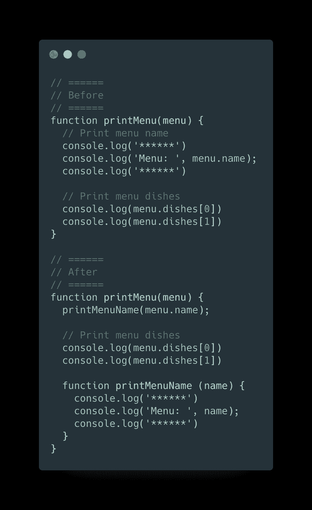
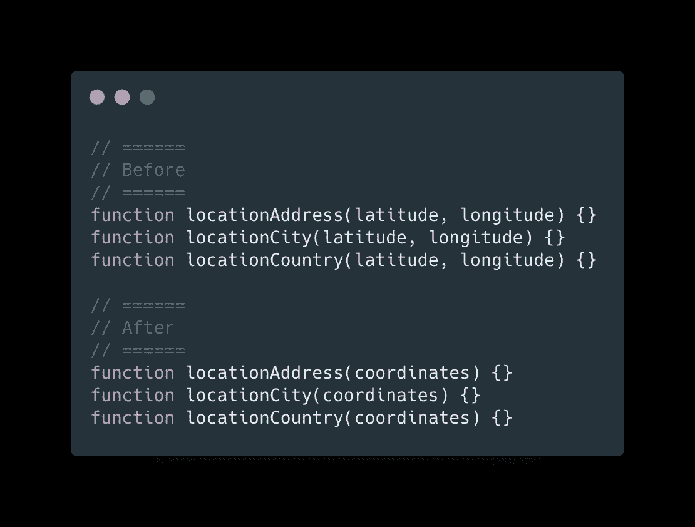
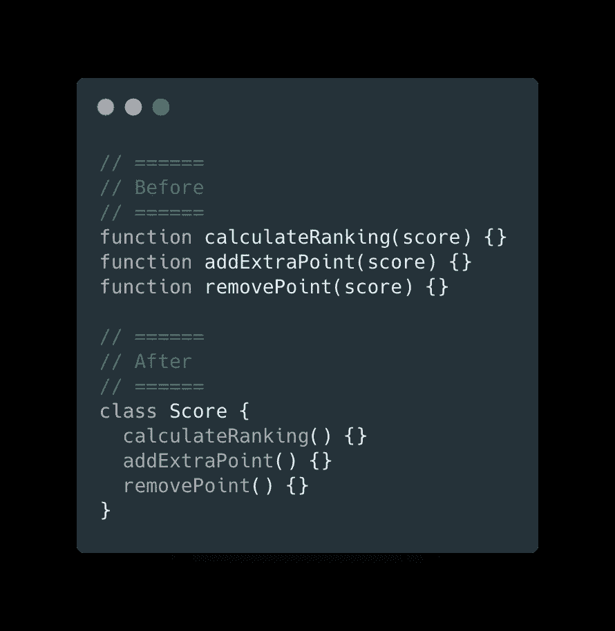

# 干净代码的 3 种 JavaScript 重构技术

> 原文：<https://levelup.gitconnected.com/3-javascript-refactoring-techniques-for-clean-code-c356be1abbcb>

## 一些简单的技巧来重构你的代码，使其更加清晰

斯科特·韦伯在 [Unsplash](https://unsplash.com?utm_source=medium&utm_medium=referral) 上拍摄的照片

我相信每个开发人员都应该为自己的代码感到自豪。我认为我们社区的人们在技术发展方面所做的事情令人印象深刻。但更重要的是保持谦逊，记住总有改进的空间。我在 [**Codeworks**](http://codeworks.me/?cw_source=Marco%20Ghiani&cw_medium=Blog%20%7C%20Medium%20%20%7C%20Organic%20%7C%20Post&cw_campaign=3%20JavaScript%20Refactoring%20Techniques%20for%20Clean%20Code) 学习期间意识到了这一点，这是一个 JavaScript 编码训练营，在那里我有机会见到令人难以置信的开发人员。其中一个推荐了一本书，***Martin Fowler 的《重构*** 》，一个重构技术的集合，用来提高你代码的设计和可读性。它完全改变了我对代码的看法，帮助我为人类而不是机器翻译代码。

这就是为什么我想分享三种你可以在代码中应用的最有用的重构技术。

> “任何傻瓜都能写出计算机能理解的代码。优秀的程序员会写出人类能理解的代码。”马丁·福勒。

# 提取功能

## 理由

代码经常变得难以理解，尤其是当我们使用不太明确的语法时。一旦我们意识到代码不完全*易读*，在函数中提取一些代码有助于解释 ***那部分代码做什么。当向同一个功能添加许多职责时，我们已经失去了对那部分代码的控制。***

## 利益

*   更短的函数。
*   更明确的名称来描述代码的目的。
*   少一些无用的评论。

## 履行

1.  创建一个新函数，并以其功能*命名为*。
2.  将从源代码中提取的代码剪切/粘贴到新函数中。
3.  将源代码中新函数范围内的可能变量作为参数传递。

# 引入参数对象

## 理由

当在一个程序中处理数据时，它们中的一些经常在许多函数中一起使用，用于不同的目的。将它们组合成一个结构(如对象)使得数据项之间的关系显而易见。但是这种重构的真正好处是它给函数带来的灵活性。

## 利益

*   将论点压缩成一个结构。
*   无序且易于扩展的参数列表。

## 履行

1.  创建一个表示行为的命名良好的结构。
2.  用新的结构替换函数声明中的参数列表。

# 将函数组合成一个类

## 理由

当在一个公共实体上使用一组操作时，使用一个类可以更清楚地表明这些方法将共享什么公共环境。它肯定会产生更可读的代码，并通过它们的行为将功能封装在一起。

## 利益

*   将处理同一数据集的函数组合在一起。
*   通过使操作主题更加明确来增加代码的可读性。
*   提供一个引用，例如传递给系统其他部分的对象。

## 履行

1.  将共享数据封装在类中，将其作为参数传递给类构造函数。
2.  将所有关联的函数移到类中。
3.  对数据进行操作的逻辑的每个位逻辑可以被提取到一个新的函数中，并移动到该类中。

关于这个话题的评论、分享和讨论总是很受欢迎。我很乐意回答你的任何问题！

> **随时联系我** [**Linkedin**](https://www.linkedin.com/in/marcoantonioghiani/)

 [## 我是如何通过改变习惯快速学习的。

### 9 个有效的习惯可以让你学得更快，提高工作效率。一年多前，在我 25 岁的时候，我离开了我的…

marcoghiani.com](https://marcoghiani.com/blog/how-i-became-a-fast-learner-changing-my-habits)  [## 如何有效地使用 React useReducer

### 使用 useReducer 钩子时你可能错过了什么。当 React 团队推出 16.8 版本并带来…

marcoghiani.com](https://marcoghiani.com/blog/how-to-use-react-reducer-effectively)  [## 从事技术工作的每个人都应该读的 4 本书，为什么

### 在过去的一年里，那些帮助我成为职业程序员的读物，让我重新发现了乐趣…

marcoghiani.com](https://marcoghiani.com/blog/4-books-everyone-in-tech-should-read-and-why)