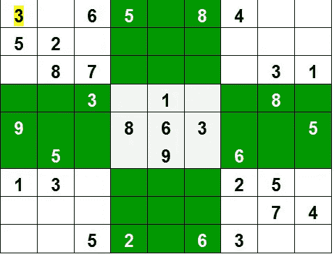
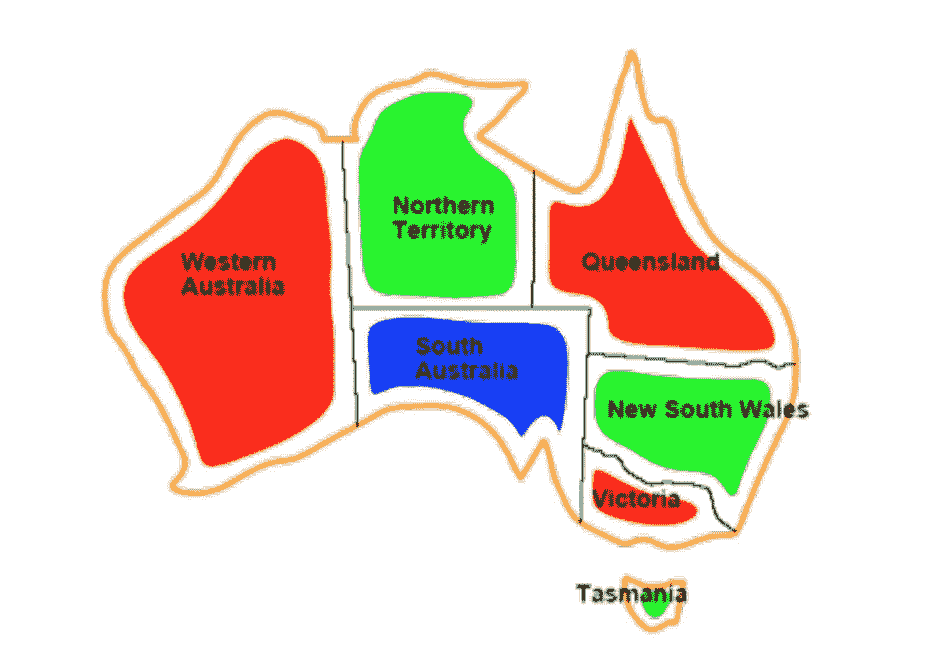
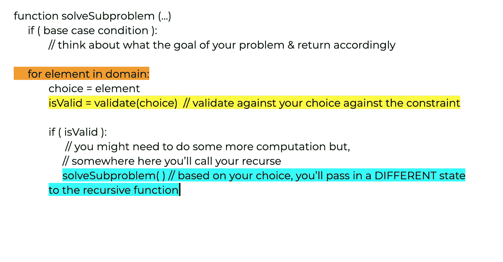

# 解决回溯问题的 3 个关键点

> 原文：<https://levelup.gitconnected.com/3-key-points-to-solving-backtracking-problems-c9159696ad0e>

## 分解和构造回溯问题指南

递归和回溯是有区别的。递归是一种在函数内部调用函数直到到达基本情况的技术。回溯是一种算法技术，它使用递归来探索不同的可能性，以达到某种最终目标。在本文中，我将分解三个关键点来帮助解决回溯算法。这些提示不会帮助你识别什么时候一个问题使用回溯，但是希望它能给你提供关于如何分解回溯问题的洞察力。

解释回溯最常用的例子是数独。

图片来自 geeksforgeeks.org/backtracking-algorithms/

数独也称为**约束满足问题。**顾名思义，这是一个作用于一个领域的一组约束的问题。在数独游戏中，域是从 1 到 9 的一组数字，约束是游戏规则。数独可以划分成子问题，所以我们不用担心整个棋盘，我们可以担心特定的行、列或网格。回溯依赖于子问题的解决，这反过来解决了更大的问题。

以下是分解回溯问题的三个关键点。

## 选择和决策空间

选择是你做出的改变问题状态的决定。您可以根据您的领域或决策空间进行选择。在数独游戏中，选项是 1-9 之间的一个数字。数字 1-9 是您的领域/决策空间中的元素。你在数独中选择的数字会极大地改变你的棋盘状态。

要建立一个域，确定问题中的选项集。选项可以是棋子、卡片、购物项目、颜色，可能性的列表是无穷无尽的。很有可能，你的选择是你最想反复考虑的事情。这些选项是你的领域。

## 限制

约束验证选择。每当我们的问题状态发生变化时，它们都是必须遵循的规则。约束可以分解成子约束。例如，在数独游戏中，**所有 3x3 的网格、行和列**应该包含所有数字 1-9，不能重复。数独的子约束可以是在相同的前提下寻址**某行、列或 3×3 网格**。我们可以将问题集中在特定的行、列或网格上，而不是整个棋盘上，并将约束应用到那个子问题上。

图片来自 colostate.edu 讲座([https://www . cs . colo state . edu/~ asa/courses/cs 440/fall 09/pdfs/10 _ CSP . pdf](https://www.cs.colostate.edu/~asa/courses/cs440/fall09/pdfs/10_csp.pdf))

问题定义了约束集；它们通常在问题描述中。你的工作是确定如何利用这些约束，并将它们应用到一个更小的问题中。例如，在地图着色问题中，玩家必须使用一组定义的颜色*(例如，红色、绿色和蓝色)*给地图着色，使得相邻区域不共享相同的颜色。域是可供选择的颜色集合，约束是:*没有相邻区域共享相同的颜色*。不要关注整个图形，而是关注单个区域，约束变成:*单个区域不得与其相邻区域共享相同的颜色。*

## 目标

根据问题的不同，划分目标可能有点困难。数独的目标是填满棋盘；然而，子问题的目标可能是填充一行、一列或一个网格。你需要建立一个目标来确定子问题何时成功，何时失败，或者何时你不能再制造子问题。

还记得我之前说过回溯使用递归吗？现在我们可以创建一个递归函数来构建我们的子问题。递归函数将解决一个子问题，而最初调用递归函数的服务将解决整个问题，一次解决一个子问题。

一个递归函数需要一个基础案例，当你不能进一步陷入子问题时，这个案例就会执行。在数组上递归时，当超过数组的长度时，基本情况被激活。当递归遍历一棵树时，当你点击了一个叶子节点*时，基本情况被激活(没有更多的节点可以浏览)。*

如果你不能马上想到一个基础案例，不要担心，当你充实子问题时，你会想出它的。

上面的伪代码应该给你一个大概的概念，告诉你如何构建一个子问题。*你有没有注意到递归函数使用了所有的关键点？记住这个伪代码！*回溯问题最难的部分是根据所做的选择确定问题的状态如何变化，以及如果递归调用失败或成功时该做什么，这也影响基本情况。请记住，如果递归调用失败，那么这是错误的选择，但是如果递归调用成功，那么子目标就完成了。

我希望这能让你更好地理解如何处理回溯问题。在设计解决方案时，没有什么神奇的公式可以套用。然而，如果你记住这三点，并把问题分解成子问题，你就能很好地找到解决方案。

*快乐编码！*