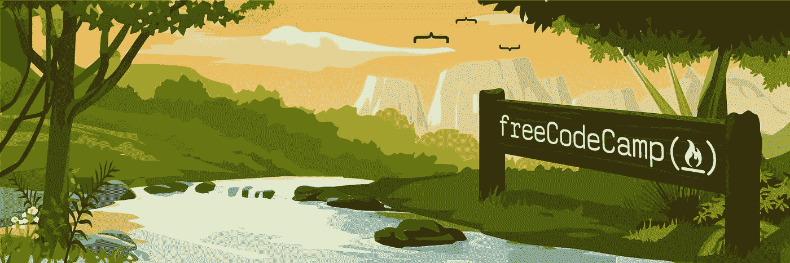
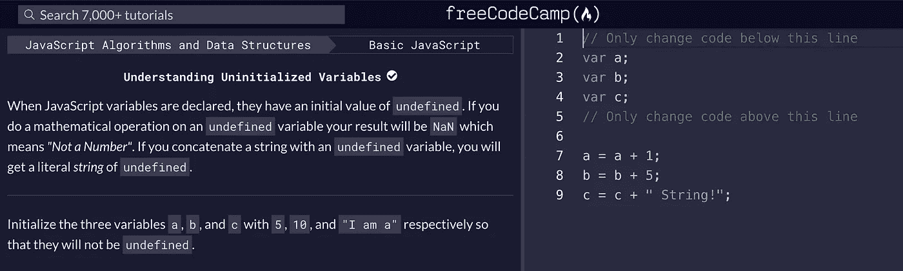
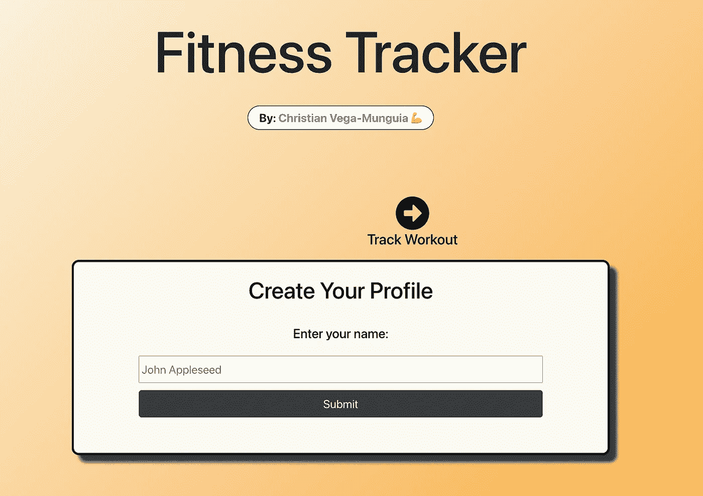

# 有效使用 FreeCodeCamp 的 3 个关键技术

> 原文：<https://levelup.gitconnected.com/3-key-techniques-to-using-freecodecamp-effectively-b6000cd00c3a>

## 以正确的方式开始您的编码之旅

这里欢迎所有的人类、计算机和人工智能！

在开始我的科技之旅后的几个月里，我从一个在线课程跳到另一个，有点迷失了方向。

[FreeCodeCamp](http://freecodecamp.org) 的 web 开发课程通过给我结构、动力和方向的清晰性解决了这个问题。

差别是巨大的——就像从油腻的、吃到饱的**信息自助餐**到均衡的、有营养的**知识王国** e

但是这个程序并不完美，在开始之前你应该知道一些注意事项。以下是我在完成四个主要证书后学到的一些实用技巧:

# 专注于项目

FreeCodeCamp 工作的一个重要原因是你实际上是在编写代码的每一步。

JavaScript 课程中的一个“挑战”示例。

然而，这些挑战往往有一步一步的指导，解决方案已经部分写在屏幕上了。

这是熟悉一切的好方法，但是从零开始一个项目是更具挑战性的经历。

当您开始使用 React 和微服务时，您很可能会意识到这一点，因为您需要做一些 FreeCodeCamp 没有提到的“准备”工作(例如，启用 CORS、决定 yarn vs npm、将 API 密钥/密码设置为环境变量等)。

不管这是不是有意为之，自己采取这些步骤实际上会给你极大的信心，因为你会慢慢学会:

*   搜索你的问题或疑问
*   建造一个*实际*的东西*，*即*实际*的作品
*   开始理解更广泛的计算和技术生态系统

基于这些原因，我建议你尽可能多花时间在项目上，而不是挑战上。

作为一个非常重要的旁白，不要被“300 小时”证书的描述吓倒。它们会大大减少你的时间——最多 30 到 50 个小时。

# 有一个强烈的为什么

你不需要知道你这一生要做什么(没人需要知道)😉)，但是你应该知道**你为什么要学编码**。

也许你有一个创业的想法，你想独立执行，或者想得到一份技术性更强的工作。也许你只是想为你的大学俱乐部建一个很酷的网站。

很酷的网站例子。

无论你的理由是什么，确保它比“*拥有*只是一项好技能”更具体，因为当事情开始变得令人困惑时，这不太可能给你足够的动力去坚持下去。

最好的策略之一就是对你想做的很酷的东西有一个愿景。

我建议你写下几个让你兴奋的项目想法，这样一旦你从这门课程“毕业”后，你就可以真正地建立它们。

不要害怕有雄心壮志。Alexa 应用程序、加密货币(如[以太坊](https://ethereum.org/en/developers/docs/) /Solidity)、带有 [3D 图形](https://threejs.org/)的网站都是公平的游戏。

您会惊讶于 JavaScript 社区是如此的活跃——有大量的库使得像这样的项目变得非常容易，因为世界上令人敬畏的开源开发者已经完成了繁重的工作。

# 不要一点一点地跟着它走

尽管按照计划进行会让你学到很多东西，但最好的方法是**跟着你的好奇心走**。

例如，我选择为我的大多数微服务项目构建前端(不需要通过测试)，因为我真的很喜欢使用 React。

它“减缓”了我完成证书的速度，但加快了我学习反应的速度，这是更重要的。

从学习角度来说，运动跟踪器可以说是最有价值的项目。

同样，没有什么可以阻止你添加你认为对某些项目有意思的特性。

总的来说，我建议你尝试获得工具方面的经验，你最终会需要这些工具来完成我在上一节提到的那些很酷的长期项目。

一些常见的例子包括用 [react-router](https://reactrouter.com/) 处理导航，使用 CSS UI 库，如 [Tailwind CSS](https://tailwindcss.com/) ，或者只是让自己熟悉 JavaScript 的特性，如 [this](https://www.freecodecamp.org/news/a-guide-to-this-in-javascript-e3b9daef4df1/) 和 [closures](https://medium.com/javascript-scene/master-the-javascript-interview-what-is-a-closure-b2f0d2152b36) 。

此外，你可能想跳过课程的某些部分。只有项目才算作证书，所以理论上你可以跳过所有的挑战，仍然成功地完成课程(尽管我不推荐)。

我鼓励你运用你自己的判断，但是这里有一个我跳过的列表和原因:

*   对于大多数小项目来说， **Redux:** React 的上下文和状态[足够好了](https://changelog.com/posts/when-and-when-not-to-reach-for-redux)。
*   JQuery: 被 React 和 ES6 淘汰了，尽管许多遗留代码库仍然有大量的 JQuery—[更多信息请点击](https://www.reddit.com/r/learnjavascript/comments/9spdgg/why_is_jquery_becoming_obsolete/)。
*   **数据可视化(证书):** Python 有更好的数据库，我没有特别的用例。
*   质量保证(证书):有点小问题，项目似乎不够有挑战性。不过，学习如何编写测试(Chai)和使用 web 套接字的挑战是值得的。

还要注意，React 课程是在[钩子](https://reactjs.org/docs/hooks-intro.html)出现之前制作的，所以你应该在完成后阅读文档。好消息是写得非常好。

# 额外收获:不要想太多

在许多编程语言和框架中，可以有不同的方式来完成同一件事情。

作为一个初学者，你可能无法在合理的时间内找出给定用例的最佳解决方案——良好的判断只能通过经验获得。

只需专注于构建一些有效的、没有大量安全漏洞或用过于草率的代码编写的东西。

其余的来自实践，所以试着不要太纠结于任何一个特定的问题，但是**总是反思你本可以做得更好的地方**，这样你的技能实际上会有上升的趋势。

# 概括一下

*   关注**项目**，因为它们会教会你比教程更多的东西。
*   一旦你学会了如何编码，就要对你将要开发的**酷应用**有一个令人信服的愿景。
*   对你感兴趣的话题加倍下注，记住跳过某些内容也没关系。
*   保持简单，然后**练习，练习，练习**。

编码有时会非常令人沮丧，但它毕竟是 21 世纪最受欢迎的技能之一。我个人可以说，这是我一生中学到的最令人振奋的技能之一。

不要让复杂性吓跑了你——一旦你开始掌握一些东西，它实际上真的很有趣。

祝你好运，祝你黑客生涯愉快！