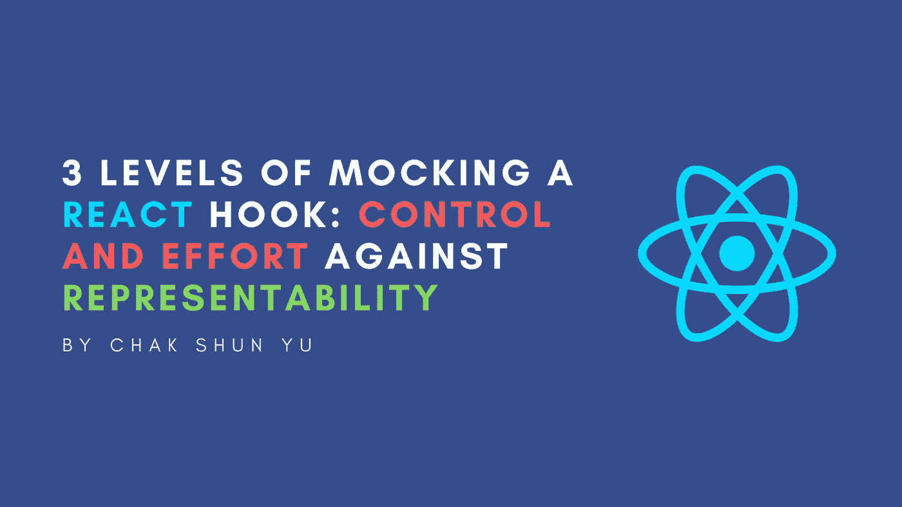

# 模仿反应钩子的三个层次:对可表现性的控制和努力

> 原文：<https://levelup.gitconnected.com/3-levels-of-mocking-a-react-hook-control-and-effort-against-representability-2c6be067dba7>



钩子是任何 React 项目最重要的方面之一。不管是大是小，不管是不是自定义，每一个钩子都负责前端应用的一个逻辑和交互性。正因为如此，在前端测试中正确处理它们变得更加重要。但是模仿 React 钩子有不同的方法，它们都有不同的优缺点。

这些年来，我无数次遇到这个问题。随之而来的很多问题是:我应该如何处理前端测试中的 React 钩子？我该不该嘲笑它？有可能嘲笑它吗？我该怎么嘲讽？嘲讽钩子需要多大的努力？我应该模仿整个钩子还是只模仿钩子的某些部分？它如何影响我的测试的代表性？

有趣的是，尽管这组问题每次都是一样的，每个场景都与前一个相似，但这组问题的答案总是略有不同。这意味着每次解决方案也会略有不同。根据我的经验，在所有这些例子中，构成这些细微差别的考虑因素也总是关于相同的两个因素。

在一个轴上，有与模仿 React 钩子相关的控制。这描述了开发人员对钩子过度模仿的控制程度。开发人员对模拟钩子的控制越多，他们就越能影响它在测试中的行为和结果。显然，从开发的角度来看，拥有尽可能多的控制权是更好的选择，因为这提供了最多的可能性。但是控制的数量与开发人员处理钩子所需的工作量是密切相关的。在测试中对钩子有更多的控制意味着开发人员需要考虑更多的选项，对用例有更好的理解，并且做更多的事情来正确地处理它。

在另一个轴上，有结果测试的可表示性。这描述了我们的测试对真实终端用户体验的反映有多真实。根据测试环境中如何模拟 React 钩子，不同的方法会以不同的方式影响我们测试的可表示性。我们测试的可表示性越高，就越意味着测试是最终用户体验的真实反映，我们就越能相信测试结果会告诉我们某个特性是否被破坏，因此测试提供的价值就越大。

根据我的经验，这些轴总是相对的。这意味着一个为开发人员提供大量控制和努力来模仿钩子的解决方案会导致测试具有相对较低的可表示性。反之亦然，要确保一个测试对实际用户体验有很高的代表性，就需要一种让我几乎无法控制和努力的方法。


理想情况下，我们会最大化这两个轴，每次考虑都会归结为平衡这两个因素。在嘲笑钩子的控制和努力与结果测试的可表示性之间，我们愿意为另一个方面牺牲什么，牺牲多少？

在这篇文章中，我将介绍这个范围的不同方面，并描述随之而来的不同考虑因素。目的是让你清楚地了解这种平衡行为以及随之而来的考虑因素。利用这一点，您可以在下一次考虑模仿 React 钩子和提高测试质量的最佳方法时应用这些考虑因素。

所有这些也是框架不可知的。因此，无论您是在使用 Jest、Enzyme、Mocha、Jasmine、React 测试库、另一个测试库，还是前面的任何组合，您都将能够应用您将从本文中学到的知识来创建更高质量的 React 测试中模拟钩子的解决方案。

# 模仿整个钩子

在测试中处理 React 钩子最激烈的方法是完全模拟它们。从开发的角度来看，这是最简单的方法，需要最少的考虑和努力，并提供最多的控制。从技术上来说，有多种方法可以实现这一点，但最直接的方法是:

```
// ComponentWithCustomHook.test.jsx
jest.mock("./hooks", () => ({
	useCustomHook: () => { customString: "some-string", customCallback: jest.fn() },
}))
```

我们正在做的是模仿整个`hooks`模块并用我们在测试环境中的实现覆盖它。在本例中，我们用一个匿名函数替换了`useCustomHook`导出，该函数返回一些虚拟值。无论何时在我们的测试中调用定制钩子，它总是会返回我们提供的虚拟值。

基于您的库和需求，有几种方法可以偏离这个实现，比如保存模拟以供验证，模拟第三方库，等等。但是它们背后的概念是相同的，即我们想要模拟整个钩子，并在测试中完全控制它的行为。

从开发人员的角度来看，这种方法提供了最多的控制。你所要担心的是在你的测试中钩子应该返回给你的组件什么。您不必担心定制钩子在内部是如何工作的——无论内部状态有多复杂，是否执行了任何网络请求，它在内部有什么依赖性，或者在钩子内部做了什么，您都不必以任何方式关心这些，因为它们会被嘲笑掉。您可以通过调整 mock 来配置钩子如何影响不同的测试场景。如果您想要验证快乐路径，那么您可以让 mock 返回您在这些场景中从原始钩子所期望的内容。这同样适用于验证不愉快的路径。控制权完全属于你。

这种方法最大的牺牲是结果测试的可表示性。从用户的角度来看，这是用户如何与你的应用程序交互的最不典型的表现。当您获得简单性、时间和对模拟行为的控制时，您正在积极地减少您的测试所经历的实际代码量。相反，对钩子的输入、逻辑和预期输出做了强有力的假设。反过来，测试的可信度取决于这些假设的有效性。

但是不管这些假设有多强，嘲笑一个钩子仍然意味着你正在摆脱你前端的一个重要部分。因此，当选择这种方法时，考虑您是否真的需要这么多的控制以及节省的时间和精力是非常重要的。因此，你牺牲了很多测试的可表示性。在挂钩不会显著影响用户体验的某些情况下，这可能是一个合理的决定。但在很多其他情况下，这很少适用。

# 只模仿钩子的内部

在前端测试中处理 React 钩子的另一个选择是不模仿钩子本身，而是只模仿钩子的某些内部结构。主要的候选对象是与外部资源的交互，这些资源决定了钩子的内部行为，比如 API 调用。您还可以考虑昂贵或复杂的计算，或者使用第三方库的代码。

模仿 React 钩子的内部将为你提供对那些代码部分的结果的更细粒度的控制，但是仍然，让你的 React 钩子部分保持原样。控制和努力方面，这就像一个中间地带，因为与嘲笑整个钩子相比，这种方法在这两个方面都牺牲了一些

你现在只控制它的一部分，而不是控制整个钩子。明智的做法是，您现在必须深入钩子的内部，弄清楚它是如何工作的，然后才能适当地模仿它们。在某些情况下，这可能需要相当多的额外时间和精力。最常见的情况是，你处理的钩子不是你写的，而是其他人写的，比如第三方库或其他团队。

当你在控制和努力的轴上失去一些点的时候，你在可表现性的轴上又获得了一些。与嘲笑整个钩子相比，你现在只是在代码的某些部分切断了 React 钩子与现实的联系。这意味着钩子中的其他代码保持不变。通常，它们负责根据内部结果处理钩子和组件的行为。因为你不再嘲笑那些了，你的测试变成了用户在使用过程中如何感知它的更真实的表现。

这种方法是两轴之间光谱上最大的灰色区域。你将会遇到的许多场景都属于这一领域。这一领域也是两个轴之间最需要权衡的地方，也是大多数次要解决方案产生的地方。这是一个不断优化的过程，在为了控制和努力可以牺牲多少可表示性之间，反之亦然，多少控制是值得努力和必要的，以证明可表示性的损失。

# 不要碰钩子

与嘲笑整个钩子相比，另一方面，也可以选择完全不嘲笑钩子。从可表示性的角度来看，让钩子完全不动是处理它的最佳方式。这与最终用户在使用您的应用程序时的体验非常相似，这是测试环境的最佳情况。应用这种方法将最大化你的测试的代表性。

然而，这些好处不是免费的。虽然这种方法极大地提高了可表示性，但是您将不得不牺牲测试中对钩子的大量控制。事实上，所有这一切都是因为你根本没有碰到钩子，而是依赖于生产行为。但这基本上是我们想要的，对吧，一个与我们的生产环境完全匹配的测试环境，这样剩下的结果就能准确地匹配最终用户的功能是否被破坏？

不完全是。

在某些情况下，这种方法对于处理 React 钩子是不可行或者不可能的。对外部 API 执行网络请求是属于这一类的常见情况。即使不考虑像 API 请求限制这样的现实因素，允许您的代码在测试中执行网络请求也会引入不确定的行为。这反过来又会导致相同的测试在不同的测试运行之间产生不同的结果，这是基于您无法控制的外部因素，也称为不可靠的测试。这完全不是你想从测试中得到的。

在理想的情况下，我们的测试环境应该是我们生产环境的精确反映。然后，我们的测试也将是我们的应用程序如何为我们的最终用户工作的准确反映，假设测试被正确地实现。这种方法试图创造这样一种情况，但不幸的是，在实践中，这并不现实。取决于许多不同的因素，如果不做超出本文范围的额外工作，我们的测试环境就不能准确反映我们的生产环境。

在极少数情况下，可以完全不动钩子而不影响测试的效果和可表示性，由于可表示性的重要性，建议这样做。但是在大多数情况下，重要的是要考虑牺牲这么多的控制是否值得获得可表示性以及随之而来的潜在努力。相反，牺牲少量且合理的可表示性会导致大量的控制和节省的工作，这在某些场景中是一个更现实的决定。

# 最后的想法

本文研究了三种不同的方法来模仿 React 钩子，沿着它们所考虑的两个轴的范围。第一个是我们作为开发人员必须投入的控制和努力，而在相反的方向上，是我们的测试相对于最终用户场景的可表示性。所有描述的方法都以不同的比例在这两个轴之间保持平衡。嘲笑整个 React 钩子和让钩子保持不动，分别是控制、努力和可表现性的两个极端。对于这两种情况，都有它们的用例，但不太常见。

在这个范围的中间，有一种方法是只嘲笑钩子的内部和某些部分。这是一个巨大的灰色区域，可以根据不同的场景做出许多小的考虑，这就是为什么类似的情况可以导致不同的解决方案。基于细节，模仿一个 React 钩子有很多不同的方法。最后，要记住的最重要的事情是，这是控制和努力与表现之间的平衡:你愿意放弃多少，你愿意合理地牺牲多少？