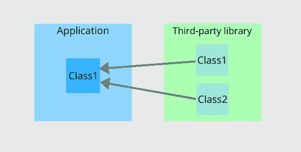
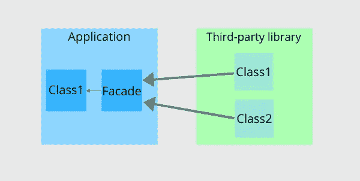
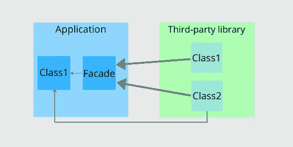
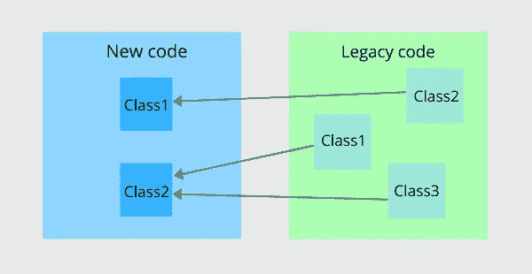
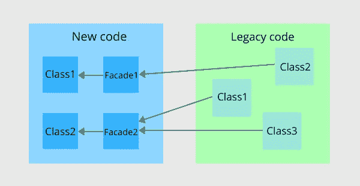
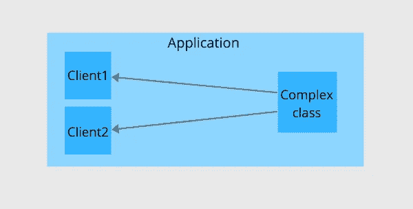
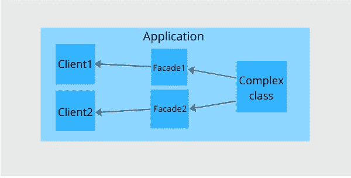

# 企业应用程序中外观设计模式的三个用例

> 原文：<https://levelup.gitconnected.com/3-main-use-cases-of-the-facade-design-pattern-in-enterprise-applications-aa9b290adac6>

## 优雅地处理代码复杂性

照片由 [matthaeus](https://unsplash.com/@matthaeus123?utm_source=medium&utm_medium=referral) 在 [Unsplash](https://unsplash.com?utm_source=medium&utm_medium=referral) 上拍摄

facade 设计模式通过单个接口公开一个或多个组件(类、模块、微服务)。

门面设计模式最常用于企业应用程序，因为它确实有助于处理其复杂性，并且该模式易于实现。我在企业应用程序中见过 facade 模式的各种用例，并描述了三种最常见的用例。

# 1.从库中分离应用程序代码

第三方库是提供一些可重用功能的一组类。在将库包含在项目中之后，开发人员可以将这些类直接注入到应用程序代码中。

然而，直接引用库并不总是一个好的解决方案，因为应用程序代码与库紧密耦合，甚至与库的特定版本紧密耦合。一个应用程序越频繁地使用一个库，就越难用同一个库的另一个或更新的版本来替换它。这是因为开发人员需要在应用程序的许多地方小心地用新库替换旧库的用法。

为了将应用程序代码与第三方库分离，开发人员可以在它们之间放置一个外观:

这个特定用例的外观实现将非常简单。facade 对象只是库的包装器。包装类只是将应用程序的调用重定向到库代码。

当需要用新的库替换特定的库时，开发人员应该只专注于重写 facade 对象内部的代码。不需要像以前一样重构应用程序的许多部分。

注意，即使有了 facade，也有一种方法可以直接从应用程序代码中使用这个库:

当开发人员开始使用“Facade over Library”模式时，限制应用程序代码直接使用库总是好的。幸运的是，这很容易实现:

*   在您的应用程序中创建一个单独的项目，并将外观放入其中。
*   将带有立面的项目中的引用添加到第三方库中。
*   将应用程序中的引用添加到只有立面的项目中。

facade 的强大之处在于，开发人员可以在项目中为每个库或同一库的每个版本保留一个 facade。如果需要经常在项目中的库之间切换，开发人员应该在 IoC 容器中注册新的 facade 实现。

# 2.在新应用中重用遗留代码

遗留应用程序应该用新的特性来扩展，以反映业务需求。这些新特性可以直接在遗留代码中实现。然而，只有这些遗留代码的作者能够给出现实的估计，并且不会在每次修改后引入许多错误。

如果团队是新的，他们可以从头开始重写遗留应用程序，然后开始实现新功能。然而，这对客户来说是相当昂贵的，他们可能不准备等几个月或几年来重写。

一个更合理的方法是在单独的模块中开始实现新特性，然后像这样重用遗留代码:

虽然这是一种可行的方法，但是系统的新部分将与遗留代码紧密耦合。

为了避免与遗留代码的紧密耦合，开发人员可以通过一组外观来公开遗留应用程序的功能。新系统不应该有任何对遗留代码的引用。

通常，外观封装了遗留应用程序组件之间的复杂交互，并简化了它们的接口。这意味着新代码不知道遗留代码的复杂性，因此更容易维护。

请注意，立面可以是一个单独项目的一部分。新代码只能引用一个具有外观的项目，因此没有人会意外地直接使用遗留代码。

# 3.修复接口分离原则冲突

一些类或库可以封装复杂的功能，包括许多需要不同客户端(其他类)使用的方法和属性。然而，不同的客户有不同的目标。第一个客户端可能只需要 5%的功能，第二个客户端需要大约 50%。

很明显，“复杂类”违反了接口分离原则，因此**复杂类很难被正确使用，并且很容易被客户误用**。

开发人员可能试图将一个复杂的类分成几个更小的类，但是当复杂的类是开发人员无权访问的单独库的一部分时，这是不可能的。

即使开发人员可以访问库代码，该库也可能已经被许多客户端主动使用(这意味着重构库代码将需要重构所有客户端)。

即使复杂类是当前项目的一部分，它也可能是应用程序的遗留部分，因此重构会导致回归问题。

开发人员可以通过为每个客户端编写单独的外观来解决这个问题。第一个外观将只展示 5%的功能，而第二个将展示 50%的功能。

新客户可以简单地多次重用现有的外观，因此每个客户不必一遍又一遍地困惑如何正确使用复杂的类。

# 结论

外观只是应用程序中一个额外的抽象层。抽象允许开发人员实现松散耦合，提高代码重用，简化复杂的接口，并对客户隐藏实现细节。另一方面，抽象增加了应用程序的复杂性，复杂的抽象甚至会降低性能。因此，像往常一样，尽管 facade 设计模式具有明显的优势并且易于实现，但开发人员应该在使用它之前分析利弊。

# 更多设计模式

 [## 在 C#中实现单例设计反模式的 5 种方法

### 各有利弊

levelup.gitconnected.com](/5-ways-to-implement-the-singleton-design-anti-pattern-in-c-68bb664c31f2)  [## 实现好恶的状态设计模式

### 从需求引出开始

levelup.gitconnected.com](/the-state-design-pattern-to-implement-likes-and-dislikes-958389b379ff)