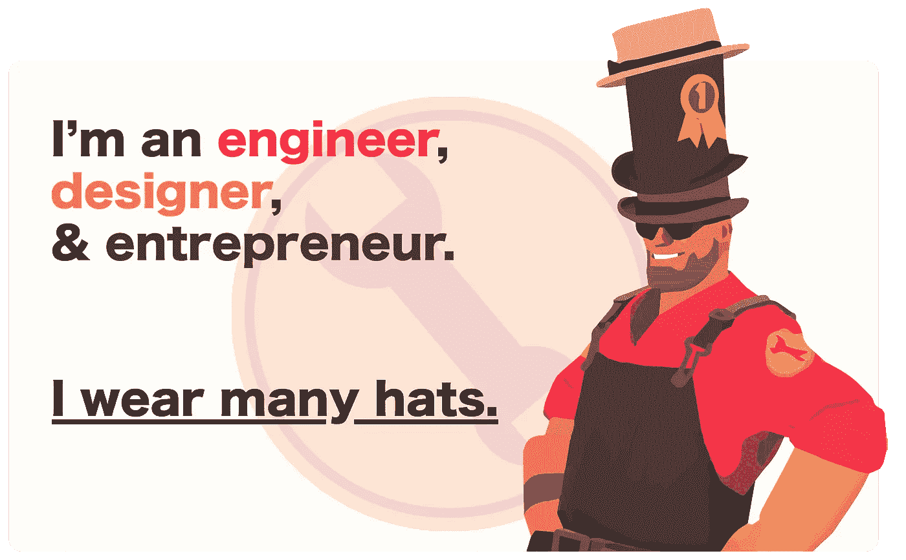
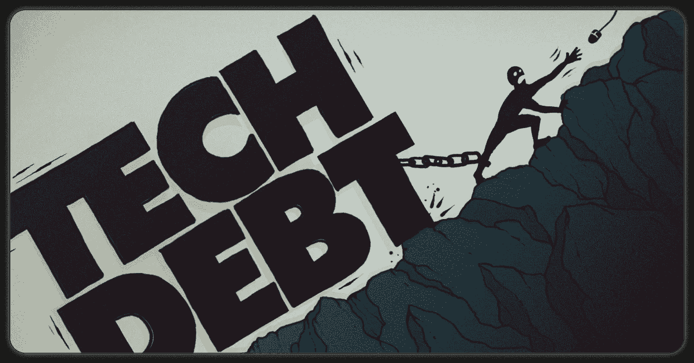
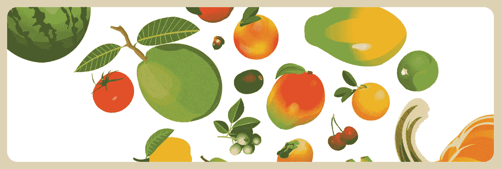
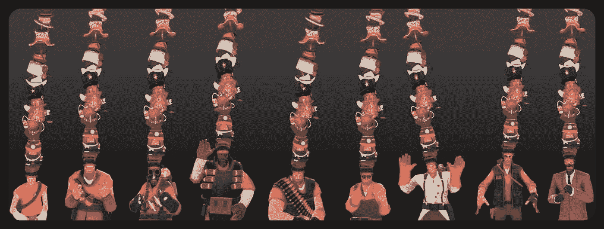
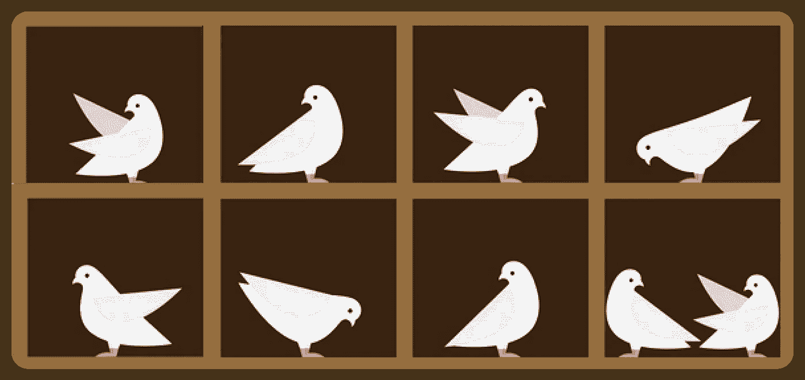
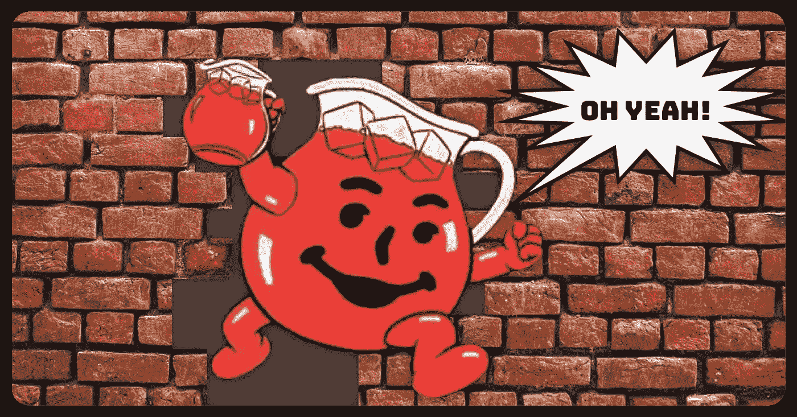

# 科技行业的 5 个常用习语，第 2 卷

> 原文：<https://levelup.gitconnected.com/3-more-commonly-used-idioms-in-the-tech-industry-1dabad291b2a>

## 技术债务、唾手可得的水果、分类、身兼数职、喝苦艾酒……我的同事们到底在说什么？

你知道“喝饮料”这个表达来自琼斯镇大屠杀吗？呀！

上个月，我写了一篇名为[科技行业常用的 5 个成语](/demystifying-5-commonly-used-idioms-in-the-tech-industry-827e8a6d653a)的文章。我从新手和老手那里收到了很多很好的反馈，甚至要求澄清我用来解释其他习语的一些表达方式。

因此，让我们深入探讨一下科技中另外 5 个习语的起源和常见用法。尽情享受吧！

# 技术债务📉

如果你对游戏中的科技债务感兴趣的话，来自 Riot Games 的[科技债务分类。](https://technology.riotgames.com/news/taxonomy-tech-debt)

*技术债务*或*技术债务*，是由于推迟以质量为中心的技术工作而倾向于简单的短期解决方案而产生的债务。从长远来看，这种类型的拖延经常导致低效的产品开发和更容易滋生 bug 的产品。

## 背景

在 20 世纪 80 年代，米德尔塞克斯大学的一位名叫 Meir Lehman 的教授注意到，程序的积极工作将不可避免地变得如此复杂，以至于必须积极维护它们以降低复杂性:

> 随着一个进化程序的不断变化，它的复杂性，反映了不断恶化的结构，增加了，除非做工作来维护或减少它。

后来，在 1992 年，[沃德·坎宁安](https://en.wikipedia.org/wiki/Ward_Cunningham)(以维基的发明者而闻名)借鉴梅尔·雷曼的观察，开始把写更多代码时增加的熵称为“债务”:

> 运输第一次代码就像负债。少量的债务加速了开发，只要通过重写及时偿还……当债务没有偿还时，危险就出现了。花在不太正确的代码上的每一分钟都算作债务的利息。在未整合的实现(面向对象或其他)的债务负担下，整个工程组织可能会停滞不前。

哇，想不到沃德当时是如此的准确！

技术债务的概念在许多方面与货币债务非常相似。在这两种情况下，现在正在做的事情会将更多的工作推迟到以后。这可能是危险的，因为你可能没有钱或时间来解决它，所以这是短期到中期的想法，而不是长期的想法。

但是，在某些方面，它并不总是坏的，例如，进行概念验证会产生一些技术债务(例如，您可能不编写测试或为概念验证走一些捷径)，但在获得资金或决定走哪条路时非常有价值。

## 使用

工程师们可能会在解释权衡或决定是否建造某样东西时使用这个术语。“我们不能这样做，因为这会积累太多的技术债务”或者“我们现在真的不应该在特性上工作。相反，我们应该解决一些 T2 的科技债务。

如果你正在管理一个团队或者是一个产品/项目经理，当你的工程师表达对*科技债务*的担忧时，听听他们的意见！

# 低垂的果实🍎

摘容易摘到的果子的意思是处理需要很少时间或努力就能完成的小任务。这些也被称为“速赢”。

## 背景

这个术语来源于这样一个想法，即最容易从树上摘下的水果是离地面最近的。通常，人们会选择在爬梯子前先摘最容易摘的水果。

据我所知，这个习语背后没有任何具体的故事，但它可能起源于 17 世纪。在现代，已知的最早用法是 P.J .卡瓦诺在 1968 年出版的《卫报》上的一篇文章，他写道:

> “他的作品如此吸引我，以至于我几乎不好意思称赞它……他温和、坚忍、简单，他的罕见图像被恰当、轻松地选取，就像**低垂的果实**一样，尽管他看起来移动得很慢，但他确实移动得很远很快。”

这个词在 90 年代的商业人士中流行开来，与“无需动脑的决定”和“快速取胜”等习语互换使用。它的意思是一个公司的收益，可以很容易地实现，很少的努力。如果你时间有限，或者想快速提升士气，这是一个很有价值的策略。

 [## 是时候重新思考……‘低垂的果实’了吗？

### 想了解更多“低挂果实”的词源和哲理？看看这篇由大卫·考克斯写的简洁的文章吧！

medium.com](https://medium.com/geekculture/is-it-time-to-rethink-low-hanging-fruit-4742bb429ff) 

## 使用

这是一个在商业的所有分支中使用的术语，但是在技术中经常出现在产品和项目管理的对话中。在优先级会议上，你可能会听到类似“在研究如何增加用户参与度时，我们发现了一些*容易摘到的果实*”或者“在完成我们最后一个大项目后，让我们处理一些*容易摘到的果实*”的陈述。

# 戴许多帽子的人🎩

想到很多帽子的佩戴者，我总是会想到[团队要塞 2](https://www.teamfortress.com/) 。

*身兼多职*的意思是拥有或扮演多种角色。做一个身兼多职的*意味着从多个角度处理问题。*

## 背景

据说,[这个表达可以追溯到 19 世纪中期](https://www.reporterherald.com/2015/06/18/a-man-of-many-hats-sometimes-gets-ahead/),指的是一个人穿着不同的制服从事不同的工作。有些人认为这个词是从 1885 年的喜剧歌剧《天皇》中引申出来的，该剧描述了一个名叫呸呸的贵族，他在镇上为每一份工作表演并领取薪水。在歌剧中，他在角色之间转换，据说在一些表演中，他会忘记换帽子。

“身兼多职”这个词最近才在 1972 年重新出现，当时一个人在回答一个采访问题时说:

> **“我戴两顶帽子**。你问我这个问题是作为调酒师工会的主席还是作为美国广播公司的主席？"

自那以后，它的使用越来越受欢迎，尤其是当多面手的概念在科技和商业领域越来越受欢迎的时候。

## 使用

通常的用法是告诉某人你是，或者某人是，能做很多事情。“我认为她非常适合我们的第一份工作，因为她能够身兼多职，这正是我们目前需要的”。

然而，这个习语和想法有很大的灵活性在里面。

例如，当被问及你对一个产品创意的看法时，你可以说“如果我戴上我的商业帽子，我认为这是一个非常令人兴奋的项目，有很大的收入潜力。但是，如果我戴上工程师的帽子，考虑所有的工作，我不认为我们能按时完成这个项目。”

# 🕊鸽子洞

9 只鸽子和 8 个鸽子洞；实践中的归档原则。(来源:Shutterstock 上的[皮米尼洛](https://www.shutterstock.com/g/Pimpinello)

将某人或某事归为一类，通常是以一种不公平或过于刻板的方式。

## 背景

鸽子洞[可以追溯到 16 世纪 70 年代](https://www.etymonline.com/word/pigeon-hole)，最初是作为信差和肉鸽的生活区，通常每个洞中有一只鸽子。从 18 世纪到今天，术语“鸽笼”开始被用来指一般的小房间，像邮件信箱或旅馆钥匙矩阵。

我们今天更常听到的“归档”是与刻板印象联系在一起的[。如果你发现某人属于某个特定的政党，你可能会*在你的脑海中把他们归类*并且不经询问就假设他们的信仰。](https://en.wikipedia.org/wiki/Pigeonholing)

这个术语的用法可能来自于[鸽子笼原理](https://en.wikipedia.org/wiki/Pigeonhole_principle#Etymology)，一个数学原理。这一离散数学原理表明，如果您有 *n* 个项目和 *m* 个鸽子洞，其中 *n > m* 个，那么它必须遵循至少一个 *m* 个洞将有 1 个以上的项目。也就是说，如果你有 9 只鸽子和 8 个鸽子洞，你必须有一个洞包含两只鸽子。

根据这一原理，*归类*描述了一个人倾向于将头脑中的信息组织成严格的桶，或*鸽笼，*描述了狭义和过于简单的类别。我们的大脑可能会很自然地尝试把新的人或想法归类到这些预定义的类别中，而不是沿着一个连续体进行解释。

## 使用

T21 通常带有负面含义，所以你可能会听到它或者以抱怨的形式说出来。我可能希望有人说“我的头衔可能是工程师，但我也可以设计和参与产品讨论！我讨厌被束之高阁！”或者“这个人在很多领域都很有潜力；我们应该确保不会把他们归入某个特定的角色。”

 [## 解决职业生涯停滞不前的方法

### 看完定义，你害怕被束之高阁吗？这是蒂姆·丹宁写的一篇关于如何避免的很棒的文章！

medium.com](https://medium.com/swlh/the-solution-to-being-pigeonholed-in-your-career-f43b82924d3a) 

# 喝了库尔-Aid🥤T

这位酷爱饮料的人并不知道这种表达有多黑暗。

喝可乐是指对一项事业或一个团体完全而深刻的信仰，通常到了不可理喻的程度。它几乎总是带有负面的含义，暗示着非理性的痴迷或洗脑。

## 背景

到目前为止，这是我所介绍过的习语中最令人不安的背景故事。

习语“喝可乐”源于琼斯镇大屠杀。1978 年 11 月 18 日，宗教领袖吉姆·琼斯呼吁[人民圣殿教](https://jonestown.sdsu.edu/)的成员进行“革命自杀”,以回应美国国会议员利奥·瑞安被谋杀一事。900 多名寺庙成员参加了这一活动，并饮用了由吉姆·琼斯的助手配制的含有致命氰化物的粉状饮料。许多死去的人因为他们坚定的信仰而自愿喝下它，但有些人要么是被迫的，要么是在不知情的情况下喝下的。

这种粉状饮料最初被认为是库尔 Aid，因此,*喝库尔 Aid* 这个短语指的是把你的生活投入到一个目的中。后来人们发现，这种粉状饮料实际上是[调味剂](https://en.wikipedia.org/wiki/Flavor_Aid)，但这一表述仍然保留了下来。

类似于人们可能会说“只是因为每个人都走下悬崖，你没有必要”来表明一个人独立思考的水平，它也可以说“只是因为每个人都喝了 Kool-Aid*，你没有必要？”*

## 使用

在科技领域，喝 Kool-Aid 经常被用来指某人严重地，几乎是不理智地，购买一家公司的，或一个领导者的使命或产品。例如，埃隆·马斯克的超级粉丝可以说是[在喝这位科技亿万富翁的 Kool-Aid](https://www.forbes.com/sites/michaellewitt/2017/10/13/tesla-shareholders-are-you-drunk-on-elon-musks-kool-aid/?sh=14183d32e2f3) 。如果他宣布他认为 Dogecoin 是一项不错的投资，那些喝埃隆·马斯克库尔 Aid 的人会立即购买 Dogecoin。如果他说将投资转向以太坊，他的追随者就会这么做。如果他告诉他们喝含有氰化物的 Kool-Aid…你就明白了。同样地，一个非常有使命驱动力的公司的员工也可能落入这个陷阱，因为他们太相信使命了。你有没有见过一家公司对待员工很差，但员工却好像一如既往的忠诚？如果是这样的话，他们很可能正在喝他们公司的酷艾。

我希望这有所帮助。作为一个在科技家庭长大并在科技行业工作了大约十年的人，使用这些习语是我的第二天性。我很开心地四处挖掘，找到了它们更深层次的含义和词源，与大家分享。

如果有其他喜欢的，欢迎评论分享！如果我继续得到好的反馈，我会继续做。

 [## 科技行业常用的 5 个成语

### 喜欢这篇文章吗？查看原文:自行车脱落，橡胶鸭，狗食，公共汽车因素，牦牛刮毛

levelup.gitconnected.com](/demystifying-5-commonly-used-idioms-in-the-tech-industry-827e8a6d653a)  [## 喜欢这篇文章？考虑给我买杯茶吧！

### 我过去常常把我的文章放在中等收费的墙后面，但当谈到教育时，我完全关注可访问性，所以现在它们都是免费的。如果你觉得你从这篇文章中得到了一些东西，并且有一些闲钱，请考虑给我买杯茶来表示你的支持！🫖

www.buymeacoffee.com](https://www.buymeacoffee.com/karomancer)