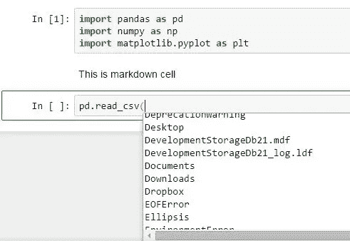
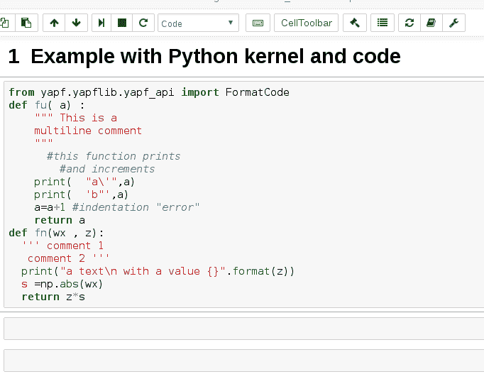
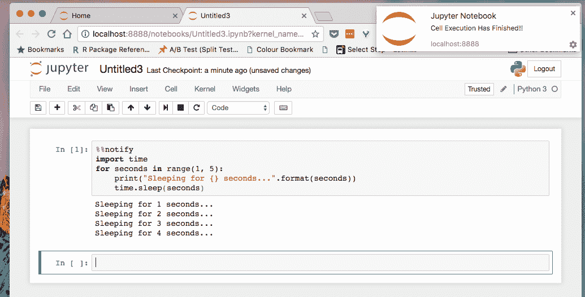

# 数据科学家必备的 3 款 Jupyter 笔记本扩展

> 原文：<https://levelup.gitconnected.com/3-must-have-jupyter-notebook-extensions-for-data-scientists-48ece834e709>

欢迎阅读我们关于 3 Jupyter 笔记本扩展的文章，它将帮助您增强笔记本电脑的性能！

如果你是一名数据科学家、机器学习工程师或任何其他类型的数据专业人士，你可能已经花了很多时间使用 Jupyter 笔记本。虽然 Jupyter 笔记本已经是一个强大的工具，但还有许多扩展可以进一步增强您的体验。

卢克·切瑟在 [Unsplash](https://unsplash.com?utm_source=medium&utm_medium=referral) 上的照片

**在本文中，我们将向您介绍三款最有用的 Jupyter 笔记本扩展**，您可以用它们来提高工作效率和质量。无论您是想改善笔记本的外观、添加新功能，还是简化工作流程，这些扩展都能满足您的需求。因此，事不宜迟，让我们深入了解一下这些扩展如何帮助您增强 Jupyter 笔记本电脑的性能！

## **腹地(自动代码完成)**

如果您是使用 Jupyter 笔记本的数据科学家或开发人员，您可能已经体验过在编写代码时没有代码完成的挫败感。代码完成是一项有用的功能，它会在您键入代码时为代码建议可能的完成方式，从而使编写代码变得更容易、更快。不幸的是，Jupyter 笔记本没有内置的代码完成功能，这使得编写代码既耗时又繁琐。

Hinter 演示图像

**heartback 是一个 Jupyter 笔记本扩展，为各种编程语言提供代码完成和文档查找，包括 Python、R 和 Julia** 。

代码完成是一项有用的功能，它会在您键入代码时为代码建议可能的完成方式，从而使编写代码变得更容易、更快。文档查找允许您只需将鼠标悬停在函数、方法和其他代码元素上，就可以快速访问它们的文档。

这里是腹地文档的链接，供您参考。
[https://jupyter-contrib-nb extensions . readthedocs . io/en/latest/nb extensions/hearterland/readme . html](https://jupyter-contrib-nbextensions.readthedocs.io/en/latest/nbextensions/hinterland/README.html)

# Autopep8:(清理您的代码)

Autopep8 是一个 Jupyter 笔记本扩展，只需轻轻一点，就能帮助你**让你的代码符合 PEP 8**。 **PEP 8 是 Python 的风格指南，它为以一致和可读的方式格式化和组织你的代码提供了指导方针**。坚持 PEP 8 可以提高你的代码的可读性和可维护性，让别人更容易理解。

然而，手动遵循 PEP 8 可能非常耗时且容易出错，尤其是如果您有一个大型代码库的话。这就是 Autopep8 的用武之地。Autopep8 会自动格式化您的代码以符合 pep8，从而节省您的时间和精力。你所要做的就是安装扩展，然后点击 Jupyter 笔记本上的“Autopep8”按钮，自动重新格式化你的代码。

Autopep8 演示

# 通知(当内核空闲时发送通知。)

Notify 是一个 Jupyter 笔记本扩展，当内核空闲时，它会向你发送一个 web 通知。内核是 Jupyter notebook 环境的一部分，它执行您的代码，因此当它空闲时得到通知对于运行需要很长时间才能完成的任务非常有用。

通知演示

例如，如果您正在运行一个需要几个小时来训练的机器学习模型，您可能希望在模型运行时离开您的计算机并做一些其他事情。使用 Notify，当内核空闲时，您可以在桌面上收到通知，这样您就可以知道模型何时完成了训练。

 [## 使用 Python 和 AI 卡通化你自己

### 我花了 10 个小时研究卡通漫画库，这里是我的见解和学习在一个超级简单的格式…

levelup.gitconnected.com](/cartoonize-yourself-using-python-and-ai-24fdd4913206) 

总之，这三款 Jupyter 笔记本扩展可以帮助您提高工作效率和工作质量。因此，如果你是一名数据科学家，想要充分利用你的 Jupyter 笔记本，一定要试试这些扩展！

> 你对人工智能和机器学习有热情吗？你想了解该领域的最新进展和见解吗？
> 
> 然后**订阅媒体是必须的**。只需每天 **16 美分****每月**5 美元，你就能从该领域的专家那里获得丰富的知识和见解。** ，**另外，你的订阅有助于支持像我这样的独立作家和研究人员。随着人工智能世界的快速变化，保持消息灵通至关重要。****
> 
> **不要错过——今天就加入 Medium，成为人工智能革命的一部分。这是你做过的最好的决定。
> **今日订阅中** **利用本** [**链接**](https://medium.com/@arjungullbadhar/membership) **。****