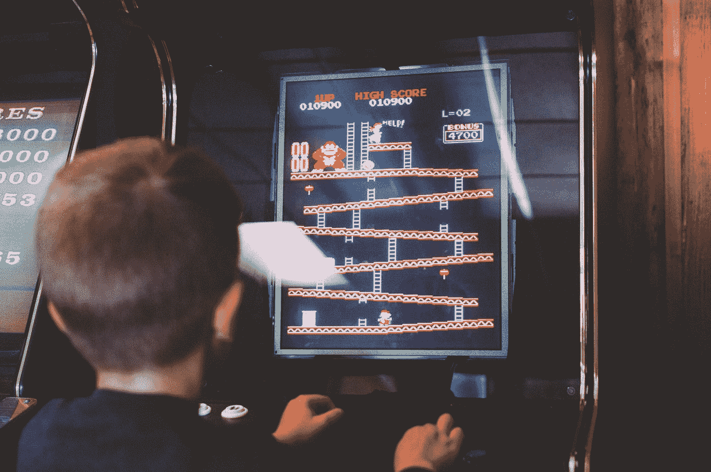

# 站在程序员和 21 世纪经济之间的 3 个神话

> 原文：<https://levelup.gitconnected.com/3-myths-standing-between-programmers-the-21st-century-economy-bd2f927debfd>

[互动体育](https://unsplash.com/@interactivesports?utm_source=medium&utm_medium=referral)在 [Unsplash](https://unsplash.com?utm_source=medium&utm_medium=referral) 上拍照

当谈到世界上 10 个最容易自杀的工作时，[编程排在第八位，与艺术家和设计师](https://www.cbsnews.com/news/these-jobs-have-the-highest-rate-of-suicide/)并列第二。

我不太担心，除了前 7 个位置被蓝领工人占据，老派的工厂主吸工人的血汗。

是什么让程序员落得如此下场？

难道我们不是生活在一个拥有无限可能性的世界里，只有程序员才有权力对世界其他地方发号施令吗？

> 程序员应该执行，而不是表达

大多数程序员都知道他们已经陷入的陷阱，但很难给它们命名。他们甚至不去尝试，因为他们被告知他们被期望*执行*，而不是*表达*。

这里描述了有助于强化这种信念的神话。

# #1:极客通过软件改变世界:

由 [Kelly Sikkema](https://unsplash.com/@kellysikkema?utm_source=medium&utm_medium=referral) 在 [Unsplash](https://unsplash.com?utm_source=medium&utm_medium=referral) 上拍摄的照片

埃隆·马斯克在他 12 岁的时候制作并出售了他的第一个电子游戏。今天，他正在建造宇宙飞船，是世界上最富有的人。

正是这些孤立的事件助长了这个流言。它主要被私人软件学校所利用，后来又被软件招聘者所强化。

它得到了广泛的认可，因为世界上最成功的软件企业家(截至今天)都是 70 年代和 80 年代很少接触数字机器的极客。

今天，随着最贫穷的孩子拥有智能手机，玩机器不再是一种奢侈，也不是对技术的内在热情的标志。极客不再是天才的保证。

不过还是那句话，上一代的极客真的给大家改了吗？

我们今天编程的大多数计算技术都是在 60 年代发明的，包括互联网。唯一的区别是，它们仅限于军事和大学使用，并且完全由政府资助。在 90 年代，我们所知道的互联网开始为平民所用。

Y2k 让每个人都相信软件末日是可能的，只有程序员才能拯救世界。

在整个 90 年代和 2000 年代，程序员获得了英雄般的地位，而互联网的奠基石描绘了他们的轨迹:亚马逊、谷歌、GitHub、Reddit 和 StackOverflow。(我故意把脸书和 Twitter 排除在外，原因是:与它们的社会影响相比，它们对科技的影响微乎其微)。

万亿字节的知识开始通过海底数据电缆从发达国家孤独的大学走廊流向发展中国家的网吧。

在世界的每个角落，聪明的人开始梦想通过编写软件来改变世界。

但他们都不是天才。也不是那些创造了今天软件巨人的人。

所有这些创造者和企业家拥有的是:通过编程语言将现实世界的问题转化为计算问题的能力，与 60 年代的工具汇编相比，这种编程语言被极大地简化了。

是的，他们拥有商业头脑，但这从来不是杰出科学家、工程师或极客的专有资产。

这些是通过软件改变世界的真实步骤:

*   理解人工流程(亚马逊创建了消费者信任的电子商务。苹果创造了用户友好的 macs 鼠标。微软以可承受的价格创造了最合适的用户界面。)
*   将它们转换成编程语言/工具来创建数字工作流(javascript、PHP 和博客世界的兴起，ERP 推动了企业发展)
*   将这些工作流程转化为软件行业流程，使技术巨头能够大规模利用人力资源(开源运动，包括 Git + Linux、虚拟化以及云计算)

如果你仔细观察每一项的含义，所有这些都与*的计算机专业知识或数学优势无关——这些术语我们与**的极客感**联系在一起。任何以同理心理解现实世界的人都更善于设想这样的系统。*

完成它需要工程专业知识，是的。但是，让这些工程师高效且有效地完成这项任务，又一次，只有具有人文视野和价值观的领导者才能完成。

他们不是拥有 CEO、创始人或团队领导等光鲜头衔的领导者。他们是任何看到软件价值的人，这些价值可以转化为对开发人员和非开发人员都有用的产品:无论是操作系统、应用程序、API 还是利用所有这些东西的开源工具。

如果极客们仍然相信是极客们改变了世界，那么功劳归于那些让他们相信他们(极客们)做到了的领导者。

**外卖提示:**从愚人天堂出来。建立在中坚分子已经建立的基础上，没有权利感。作为今天的开发者，如果你有一丁点改变世界的野心，你必须通过向前推进改变来回报。

# #2:当你(为我们)制作软件时，你对人们的生活产生了影响:

这是过去 20 年里无数软件创业公司传播的一个神话。

> 大多数技术支持问题都归结于一个程序员，他懒得去按布尔开关。

这在软件开发的早期并不是一个神话——它很接近事实。当时，围绕软件的流程和法律还处于初级阶段。

甚至在新闻网站上，弹出广告也大受欢迎。程序员不必为了隐私声明而搞乱他们最喜欢的 UX。

程序员可以通过故意运输垃圾来逃脱，并对每个 bug 通知耸耸肩。

大多数技术支持问题都归结于一个程序员，他懒得去按布尔开关。

不再是了。首先，因为程序员现在供应充足。不要误解我的意思，但是至少从十年前开始，越来越多的人开始编程。给*船* *什么*的权力要平均分配得多，所以单个程序员影响很小。

其次，今天的程序员是相当好的实现者，也许比他们的祖先更好，这主要是由于互联网和蓬勃发展的教程经济。

但他们大多不知道装运的是什么。他们只关心完成要求他们做的事情，而不关心事情应该如何发展。一些程序员试图改变这一点，但他们大多因为陷入冲刺和会议的无限循环而失败。

> 聪明人不会给出正确的答案，他会提出正确的问题。
> 
> **克洛德·列维·斯特劳斯**

照片由[普里西拉·杜·普里兹](https://unsplash.com/@priscilladupreez?utm_source=medium&utm_medium=referral)在 [Unsplash](https://unsplash.com?utm_source=medium&utm_medium=referral) 上拍摄

在瀑布开发模型的时代，尤其是在大型公司软件公司，业务分析师主宰着会议。他们决定运送什么。但这仅限于那些不写代码的人拿高薪的公司。

今天，这是敏捷产品所有者的工作。今天情况更糟，因为整个敏捷都是基于[懒惰的程序员模式](/the-16-hour-developer-workout-6a9e10afa8c2)。敏捷被包装成精益创业的灵丹妙药，这使得它在中小型软件公司中也很受欢迎。尽管产品所有者不是贡献者，但是敏捷是一种必然的邪恶。大公司支付给敏捷教练疯狂的金额(每年 10 万美元)，这些钱可以平均分配给一个小的开发团队。

产品所有者几乎控制着软件制作的每一个细节。他们决定开发什么，运输什么，以及(在大多数组织中)谁得到荣誉。

如果出了问题，他们也有发言权，谁得到 **301 指责重定向**。

**外卖小贴士:**如果你想改变世界，不要指望在为别人工作的时候就能实现。等待属于你的时刻，当它到来时，创造一个影响。

# # 3:famg+是世界上最好的工作:

如果你随便问一个人(非程序员)世界上最好的公司，很可能你会得到一个错误的答案。(目前是[希尔顿](https://fortune.com/best-companies/2020/search/))。

但是如果你问一个程序员，(s)他肯定会回答正确。它将主要是 FAAMG+之一(扩展包括网飞、优步、Salesforce 或其他一些十亿美元估值的巨石)。他们对金钱世界了解得太多了！

没错，额外津贴是不可抗拒的。社会现状波澜壮阔。

> 难怪今天的程序员从内心深处讨厌 OOP 他们讨厌重用！

照片由 [Sam Moqadam](https://unsplash.com/@itssammoqadam?utm_source=medium&utm_medium=referral) 在 [Unsplash](https://unsplash.com?utm_source=medium&utm_medium=referral) 拍摄

但是程序员为了进入这些梦寐以求的大门要经历哪些磨难呢？最平凡的填鸭式算法解题练习一千次！

他们在面试中问的问题是已经解决的问题，在**技术面试准备视频**和**破解代码面试**中已经解决了一百万次。

一个程序员被要求*不要* *求解*，而是*执行* *并重现*解。

重新发明轮子万岁。难怪今天的程序员从内心深处讨厌 OOP 他们讨厌重用！

紧张的面试准备夜，如果被用来发明解决现存现实世界问题的新方法，可能会诞生一百万家初创公司，有朝一日这些公司可能会被 FAAMG 收购，甚至会飞速发展。

没错，这条路比编程一个了不起的 MVP 要长得多，但是一切都从一个想法开始。

**WhatsApp 创始人布莱恩·阿克顿**，[曾被脸书](https://fortune.com/2014/06/05/whatsapps-acton-facebook/)拒绝，脸书为收购 WhatsApp 支付了至少 1000 倍他 10 年工资的报酬。他最终促成了强大的脸书竞争对手 **Signal** 的史诗般崛起。

这就是野心+辛劳的正确组合对你的编程生涯的影响。

家酿啤酒的创始人马克斯·豪厄尔(Max Howell)在谷歌也有类似的经历:

来源:推特

有无数聪明的程序员无法通过 famg+的大门，但最终为世界创造了更好、更强大的软件，并在这个过程中为自己创造了更有成就感的职业。

进 famg+肯定是好的，但不是世界末日。famg+总有一天会被他们的对手取代。当你更加努力地将自己与雇主联系在一起时，你的自尊感就会随之产生。

你不会想把你的自尊放在脆弱的东西上。

# 结论:

> 程序员是即将被取代的机器的齿轮

互联网和人工智能的快速崛起在程序员中创造了一种奇怪的 FOMO:他们为自己握着一辆革命性汽车的方向盘感到欢欣鼓舞，方向盘上有全新的&不断变化的闪亮数字面板。

但是他们的全部精力都放在了握方向盘上，而不是开车。在这样做的时候，他们也没有意识到真正的控制权属于高度先进的车辆，而不是他们自己。

上面描述的所有神话都造成了这种错觉。

但是在这些神话的底部是事实:程序员仍然是即将被取代的机器的齿轮。他们仍然是有形的、有时间限制的、通常过时的实体的追随者和实现者:框架、编程语言、公司、他们的招聘过程等等。

> 21 世纪属于创造者。计算机程序不再是内容。

一天下来，赚你的日常面包也没什么不好。相信世界在变化也没有错。

但是说是因为*程序员掌舵*是大错特错的——至少在现有的情况下。

21 世纪属于创造者。

计算机程序不再是内容。它们是以最好和最差的方式展示内容的工具。很快，程序员也会落入同一类别。

除非他们变得真实。