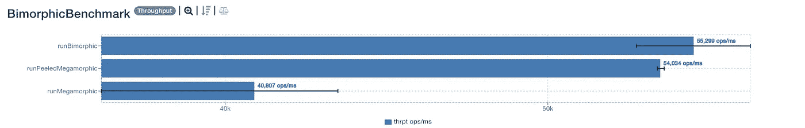
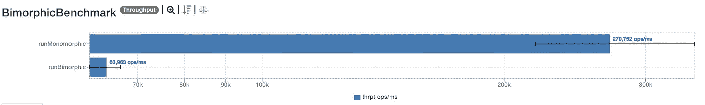
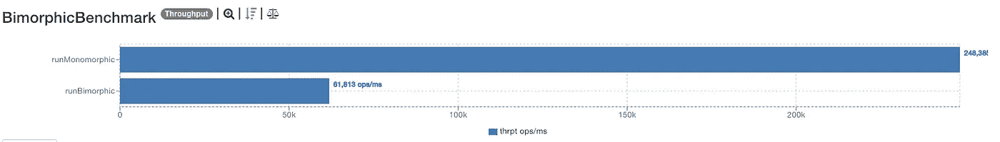
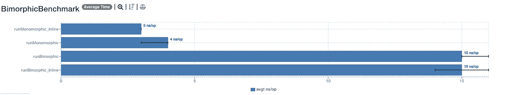
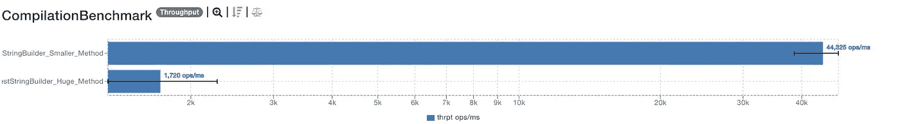
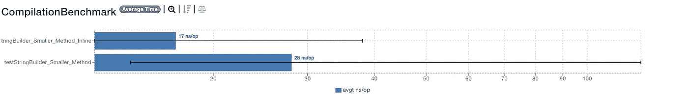

# 提高 Java 应用速度的 3 个实用技巧

> 原文：<https://levelup.gitconnected.com/3-practical-tips-to-make-your-java-app-faster-d4aeaa846863>

## 如何避免 Java 代码优化中的常见陷阱


照片由[像素](https://www.pexels.com/photo/asphalt-blur-car-city-290470/?utm_content=attributionCopyText&utm_medium=referral&utm_source=pexels)的[皮克斯拜](https://www.pexels.com/@pixabay?utm_content=attributionCopyText&utm_medium=referral&utm_source=pexels)拍摄

大多数开发人员都有关于 Java 性能的问题。大多数开发人员不知道正确的答案。

优化问题发生在代码审查、面谈和代码变慢的时候。

*你想知道更多关于 JIT 编译器优化的信息吗？那个大方法是如何增加成本的？如何提高你的项目绩效？*

如果我们有三个通过，我们就开始吧。

```
· [Inlining in Java](#3591)
· [How composition beats inheritance](#2fd0)
· [Which methods can’t be inlined?](#3245)
· [How do big methods perform?](#95ee)
· [Takeaway](#e4ce)
· [Resources](#5899)
```

# Java 中的内联

内联方法是 JIT 编译器使用的一种优化技术。研究[显示](https://www.usenix.org/legacy/events/vee05/full_papers/p121-stepanian.pdf)加速高达 93 倍。很多方法都是内联的，很少有不内联的。*为什么？因为方法的大小。这就是小方法的好处之一。*

*有哪些方法容易内联？*静态的、私有的、最终的方法很容易内联。如果是单态的，虚拟调用可以被内联。*什么是单态调用？方法的单一调用点。当你得到一个方法覆盖，巨型调用，你需要做查找。*意味着您需要在 vtable 中搜索方法引用。

*什么方法可以被内联？公共方法。*有一些标准方法必须满足。方法大小是一个标准。在 Linux 64 位上，大小小于 325 字节的方法可以被内联。小型方法得到内联，而大型方法没有。

*JIT 编译器如何优化单态调用？命中内联缓存以避免 vtable 查找。*实际上，如果没有方法覆盖，就只有单态调用。*这些方法可以内联，避免调用 vtable。* *对 vtable 的调用不会发生，因为没有额外的覆盖。那么超形调用呢？*巨方法主要是一个方法的多个实现，例如覆盖方法。它们需要调用 vtable，并且不能内联。

*内联能为你做什么？为什么单态调用比多态调用好？让我们看看。*

我们可以使用[这个基准](https://gist.github.com/zivce/73fe2cd7b5d2f4eec2d1996d0565a990)来测试方法大小优化。为了测试方法调用的内联缓存，我们可以在这里使用[的基准测试](https://gist.github.com/zivce/bbe743087f1da53e01912d15c15c2a46)。

# 作曲如何击败遗传

双态调用在内联缓存中获得命中。我们可以看到双压电晶片将手术次数提高了 35%。

*去皮巨形是什么意思？我们剥离方法调用。*做简单的`instanceof`可以提高内联缓存的命中率。优化带来了大约 30%的吞吐量提升。

*是什么让巨形调用表现不佳？内联缓存中的未命中。去 vtable。*遍历 vtable 会降低执行速度。

多态性的主要问题是:

像 Java 这样的编程语言为多态性提供了便利，作为构建模块化和可重用软件的方法之一。这种语言选择自然是有代价的，因为没有对虚拟调用的硬件支持，因此运行时必须模拟这种行为。—阿列克谢·shipilёv



JDK 13 —双压电晶片优化

*我们错过了什么？单态调用与双态调用。*单态性能比双态性能好 4 倍。



JDK 13 — JMH 结果—单态与双态

如果我们关闭内联方法会发生什么？添加`@CompilerControl(*DONT_INLINE*)`禁用内联。**两种非在线方法的通量均下降。**



JDK 13 — JMH 结果—单态与双态—内联关闭

*时间改进呢？内联如何影响平均时间？关闭内联如何影响平均时间？* ***内联方法平均执行得更好。***



JDK 13 — JMH 结果—单态与双态—平均时间

*您能从基准测试中学到什么？内联方法执行得更好。多态方法比单态方法表现差。我们可以学习作文为什么会打败遗传。**继承给 vtable 带来了更多的方法，造成了性能瓶颈。争取使用更小的方法，这样可以内联，并且性能更好。***

# 哪些方法不能内联？

*如何搜索非优化方法？*使用`[jarScan](https://github.com/AdoptOpenJDK/jitwatch/blob/master/jarScan.sh)`，限制为 325 字节。该限制因平台而异。这个极限是大方法的一个指标。这里有一个大方法的例子。

JITWatch 的 jarScan

*是什么导致了这些方法的出现？*以我为例，是 Spring 的 Builder。大方法可以自动生成。*检查这些方法，如果可能的话进行改进。*

# 大方法表现如何？

让我们从头开始尝试我们的[基准](https://medium.com/r?url=https%3A%2F%2Fgist.github.com%2Fzivce%2F73fe2cd7b5d2f4eec2d1996d0565a990)。 ***较小的方法执行效果好 26 倍。***



JDK 13 — JMH 结果—大方法优于小方法—吞吐量

如果我们不内联更小的方法会怎么样？内联方法如何影响平均时间？ ***内联方法的性能比对应的方法高 2 倍。***



*我们能从这些基准测试中学到什么？尽一切可能让你的方法内联。创建更小的方法，减少项目中现有的大方法。吞吐量的表现取决于规模。小的内联方法平均快 2 倍。*

# 外卖食品

更喜欢组合而不是继承。你有一个额外的理由这样做，那就是性能。我们的结论是单一调用点方法表现更好。使用继承会扩大 vtable，这使得缓存方法变得困难。

尽一切可能内联方法。创建小方法，减少项目的大方法，减少执行的时间。

# 资源

Java 性能针对 Java 8、11 及更高版本的调优和编程的深入建议— Scott Oaks

优化 Java 提高 JVM 应用程序性能的实用技术

[](https://dzone.com/articles/too-fast-too-megamorphic-what) [## 太快，太大:什么影响了 Java 中方法调用的性能？- DZone 性能

### 先说一个小故事。几周前，我提议对 java 核心库邮件列表进行修改，以覆盖…

dzone.com](https://dzone.com/articles/too-fast-too-megamorphic-what)  [## (Java)方法调度的魔力

### 像 Java 这样的编程语言提供了子类型/多态性的工具，作为构建…

shipilev.net](https://shipilev.net/blog/2015/black-magic-method-dispatch/#_preface)