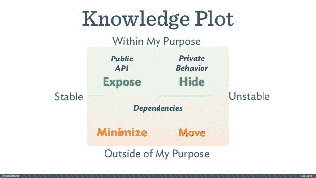

# 现在你可以用 3 个原则来制作稳定的软件

> 原文：<https://levelup.gitconnected.com/3-principles-you-can-use-now-to-make-stable-software-3b84bad7a4e>

## 我对稳定软件生产的探索。以下是我学到的。

照片由[内森·考利](https://www.pexels.com/@mastercowley?utm_content=attributionCopyText&utm_medium=referral&utm_source=pexels)从[派克斯](https://www.pexels.com/photo/photo-of-stacked-rocks-near-shore-1192672/?utm_content=attributionCopyText&utm_medium=referral&utm_source=pexels)拍摄

我写了一篇关于弹性软件的[文章](/3-object-oriented-tips-sandi-metz-uses-for-better-software-design-1c5393c7698d)。稳定的软件对每个开发者来说都是至关重要的。这就是为什么稳定的软件需要更多的关注。

您收到了来自企业的新请求。您几乎没有将它放入现有的代码库。过了一会儿，稍有不同的情况出现了。

它会一次又一次地发生。添加新功能变得日益困难。

> 每个人都面临这个问题。

让我们来研究一下可能的解决方案。创建稳定灵活的软件。经得起所有可能变化的软件。

# 创建序列图

对象协作。对象应该被隔离。从某种意义上说是孤立的，一个不依赖于另一个。如果一个对象改变了，从属对象不应该改变。

使用[序列图](https://www.websequencediagrams.com/)捕捉对象的交互。现在您将看到对象是如何协作的。发送什么消息，以及每个对象知道什么。

查找没有从属或依赖关系的对象。行尾代码，有很多程序逻辑。桑迪·梅兹称这些为“欧米伽混乱”的物体。

你应该把“欧米茄乱七八糟”分成方法。尽可能地理清逻辑。您可能会回到代码，并添加更多的特性。

在我看来，这些物体带来了很多麻烦。你触摸它们，你就破坏了特征。有一个合适的测试套件。那你就变了。

即使你完成了提取和解耦，你也不会满意。你需要构图。将尽可能多的逻辑提取到新对象中。

程序表

# 使用对象知识

摘自桑迪·梅茨的演讲《来吧，制造混乱》

知识图谱显示对象的智能。情节由*【公共 API】**【私有 API】**【依赖】*组成。一个人应该*公开* API，*隐藏*私有行为。稳定的依赖关系应该*最小化*，不稳定的依赖关系应该*移动*。

首先检查运动部件。不适合的逻辑在这里，计算产品中的价格不适合。将逻辑移到一个单独的对象中，并在需要的地方注入。

即使你把物体放在这个情节里，你也只是想想而已。如果代码更改没有明显的好处，就不要这样做。等等。等待新的要求。

你现在能做什么？你可以改善现有的混乱，尽量减少它。如果稳定的话。

检查测试，如果需要，添加更多测试。检查圈复杂度，寻找遗漏的执行路径。为缺失的执行路径添加测试。

> 组件依赖应该朝着稳定的方向发展

检查稳定的组件。看看哪些组件是新的和易变的。x 轴代表组件的稳定性。

稳定的组件正在工作，经受住了时间的考验，并包含核心逻辑。易变组件是新的，易于变化，并且位于 x 轴的不稳定部分。

稳定应该最小化或暴露。应该移动或隐藏 Volatile。不要让稳定依赖于不稳定。应该是反过来。变化的组件应该依赖于稳定的组件。

# 使用组合

遗产上的复合。将逻辑移入对象并注入。错误的抽象会成为负担。大多数开发人员扩展了一个超类，而没有仔细观察。

隔离对象中的逻辑。稳定的对象是指没有依赖和依赖的对象。向那个对象移动，尽可能地去耦合。

当你完成隔离后，问问题。这属于这里吗？这个逻辑在做什么？放在知识情节上。

将责任转移到角色。创建新角色，并依赖它们的接口。使用接口隐藏内部行为。

基于对象的抽象进行协作，而不是基于内部行为。遵循依赖倒置原则。

> 依靠抽象，而不是具体

# 结论

布局对象消息。这将有助于您了解对象之间发送的消息。之后，你会看到你的软件的角色。提取到方法中并继续前进。

把你的对象放在知识图上。然后你就可以看到需要做什么了。你也会看到什么是稳定的，什么是不稳定的。依赖稳定成分，远离不稳定成分。

隔离逻辑。移动对象中的逻辑。注入并与他们互动。避免继承，偏爱构图。

# 资源

 [## 稳定依赖原则(SDP)| Khalil stem ler

### 每个系统都有稳定的部分和不稳定的部分。稳定的组件是不被期望…

khalilstemmler.com](https://khalilstemmler.com/wiki/stable-dependency-principle/)  [## 依赖于稳定的方向:我如何知道什么更稳定？

### 根据稳定依赖原则，依赖应该在稳定的方向，但是:如果你…

softwareengineering.stackexchange.com](https://softwareengineering.stackexchange.com/questions/290594/depend-in-the-direction-of-stability-how-do-i-know-what-is-more-stable)  [## 稳定依赖原则| DevLead.io

### 以这样一种方式设计你的软件，任何给定的组件都依赖于其他组件…

devlead.io](https://devlead.io/DevTips/StableDependenciesPrinciple) 

[桑迪·梅斯谈欧米茄的混乱](https://www.youtube.com/watch?v=xi3DClfGuqQ)

# 继续阅读相关文章

 [## 高级开发人员使用弹性软件的 3 个原则

### Sandi Metz 关于面向对象设计的三大开发经验

levelup.gitconnected.com](/3-object-oriented-tips-sandi-metz-uses-for-better-software-design-1c5393c7698d)