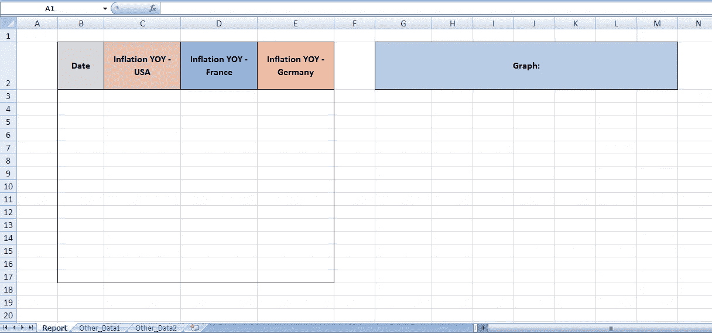
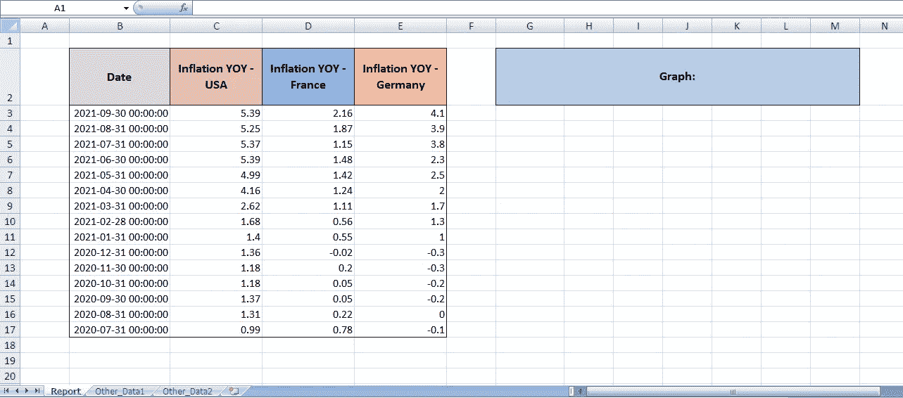
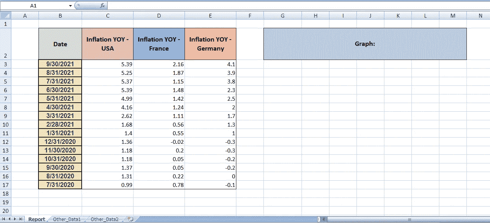
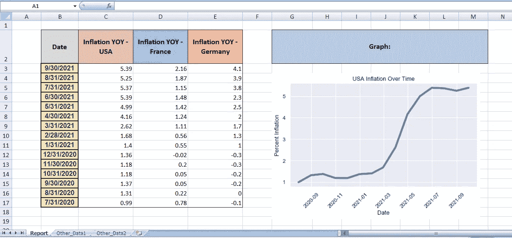

# 每个数据分析师都应该知道的 3 个 Python 到 Excel 的操作

> 原文：<https://levelup.gitconnected.com/3-python-to-excel-actions-every-data-analyst-should-know-8e03de18729a>


肖恩·罗伯森在 [Unsplash](https://unsplash.com/) 上拍摄的图片

虽然 Python 是一个令人惊叹的工具，但是绝大多数工作场所(尤其是金融行业)仍然使用 Excel 来显示和报告他们的数据。在本文中，我们将介绍如何优雅地将熊猫数据帧和图形与现有的*Excel 文件集成。*

1.  在不干扰其他内容的情况下写入 Excel
2.  样式(格式字体、边框、对齐等等！)
3.  将 Python 图表作为图像插入

## 1)在不干扰其他内容的情况下写入 Excel

在处理熊猫时，这是我们习惯看到的数据帧导出:

```
df.to_excel(filepath)
```

但是，这种写入 Excel 的方法**不适合**添加到现有报告中。它实际上创建了一个新的工作簿，这意味着所有原始的工作表和数据都将丢失。注意这一点！

那么我们能做些什么呢？

假设这是我们当前的 Excel 工作簿。它有一些已经在报告选项卡中设置的标题，以及其他数据表。我们将使用 Openpyxl 来覆盖报表选项卡中的特定单元格区域，而不会删除任何其他内容。



当前 Excel 文件，然后再写入它。作者图片

Openpyxl 是最动态和最流行的 Python 库之一，用于编写和读取 Excel 文件。在这些例子中，我将使用 3.0.9 版本的 Openpyxl。它是 Excel 2010 的理想选择，但是正如你所看到的，它在我的 Excel 2007 上也运行得很好。

在使用 Openpyxl 时，我们可以将工作表读入 pandas Excel writer 的内存中。这将允许您使用任何预先存在的工作表并保存所有原始内容。

为此，请考虑将数据帧导出修改为以下代码:

本例中的数据框架包含几个国家的近期通货膨胀数据。请注意，我们已经成功地插入了数据，同时保留了工作簿中的所有其他信息和工作表。



插入数据帧后的快照。作者图片

## 2)样式(格式字体、边框、对齐等等！)

没有任何调整，DataFrames 总是以同样枯燥的格式写入 Excel:Calibri，字体大小 11。如果您每天或每周运行一次报告，那么自己手动重新格式化会很乏味。

让我们通过让 Openpyxl 样式进行定制来增加趣味。这是可以在保存 writer 对象之前运行 df.to_excel(…)和*的*之后添加的代码。

概括地说，我调整了字体设置、背景颜色、边框和单元格对齐，并将单元格类型从自定义日期时间更改为简单的 MM-DD-YY 格式。

更多是可能的！您可以在文档中找到其他样式功能:[https://openpyxl.readthedocs.io/en/stable/styles.html](https://openpyxl.readthedocs.io/en/stable/styles.html)

我决定只对日期列应用格式。下面是 Excel 中的变化。



实现 Openpyxl 样式后的结果。作者图片

## 3)将 Python 图形作为图像插入

通常，我们可以使用 Python 丰富的图表库创建更高级的图形。假设我们有一个使用 seaborn 库创建的线图，并希望将其插入到我们的 Excel 表中。

下面是如何使用 Openpyxl 实现的。首先，将您的图表保存到您的本地文件中，保存为 PNG 或 JPG 文件。然后包含以下代码:



在工作表中添加图表后。作者图片

图表图形在锁定到单元格 G4 后已成功粘贴到工作表中。

瞧 Excel 报表现在看起来很吸引人，而且很大程度上是自动化的。

## 示例笔记本

我希望这有所帮助。点击查看完整的 Juypter 笔记本[。](https://github.com/misha345a/MEDIUM_DataFrames_to_Excel/blob/main/Pandas_to_Excel.ipynb)

感谢您的阅读！